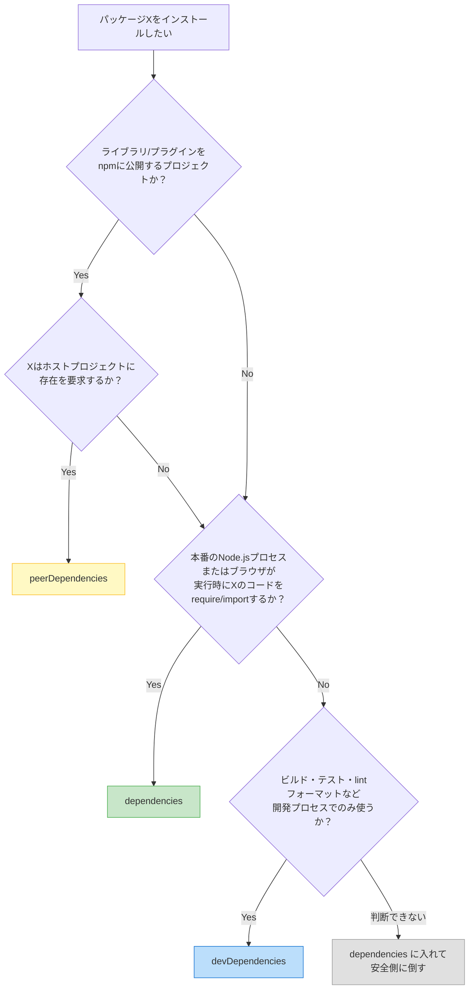

## `--save-dev` どっちに入れる？という永遠の疑問

新しいパッケージをインストールするとき、あなたは毎回この判断を迫られる。

```bash
npm install typescript          # dependencies に入る
npm install typescript --save-dev  # devDependencies に入る
```

「ビルドに使うものは `devDependencies` でしょ？」と思うかもしれない。確かにTypeScriptはビルドツールだから `devDependencies` で正解だ。しかし、同じ「ビルドに使う」Next.jsやNuxt.jsは `dependencies` に入れるのが正解になる。SSR（サーバーサイドレンダリング）時にランタイムでも動作するからだ。

「ビルド時に使う = dev」という単純なルールでは間違える。

この記事では、**どのパッケージをどちらに入れるべきか迷わなくなる判断基準**を、mermaidフローチャートと30個の具体例で解説する。さらに、現場でよく見かける間違いパターン5つ、CI/Dockerでの本番デプロイ時の `--omit=dev` の使い方、ライブラリ作者が知るべきpeerDependenciesの設計指針までカバーする。

## 基本の定義：3つの依存フィールド

package.jsonには依存パッケージを記録するフィールドが主に3つある。まず全体像を押さえよう。

```json
{
  "dependencies": {
    "express": "^4.21.0"
  },
  "devDependencies": {
    "typescript": "^5.6.0"
  },
  "peerDependencies": {
    "react": "^18.0.0 || ^19.0.0"
  }
}
```

### dependencies：本番ランタイムで必要なパッケージ

アプリケーションが**本番環境で動作するときに必要**なパッケージを入れるフィールドだ。`npm install` では常にインストールされ、`npm install --omit=dev` でもインストールされる。

expressやreactのように、本番のNode.jsプロセスまたはブラウザが実行時に `require()` や `import` で直接呼び出すコードがここに入る。dependenciesのパッケージが1つでも欠けると、アプリケーションは起動しないか、実行中にクラッシュする。

```javascript
// 本番環境で実行されるコード -- expressがないと起動しない
const express = require('express');
const app = express();
app.listen(3000);
```

### devDependencies：開発・テスト・ビルドでのみ必要なパッケージ

**開発プロセスでのみ使い、本番環境では不要**なパッケージを入れるフィールドだ。`npm install` ではインストールされるが、`npm install --omit=dev` では**除外**される。

TypeScript、ESLint、Jest、webpackなど、ソースコードの変換・検証・バンドル・テストに使うツールがここに入る。これらのツールが出力した成果物（.jsファイルやバンドル）が本番で動くのであって、ツール自体は本番では使われない。

```bash
# ビルド時にのみ必要 -- 本番ではtsc自体は呼ばれない
npx tsc                    # TypeScript → JavaScript に変換
npx webpack --mode production  # ソースをバンドル

# 本番環境で実行されるのは変換後のファイルだけ
node dist/index.js
```

### peerDependencies：利用者側のプロジェクトに委ねるパッケージ

**「このパッケージを使うなら、ホストプロジェクトにも入れてください」**と宣言するフィールドだ。主にライブラリやプラグインの作者が使う。

たとえばReactコンポーネントライブラリは `react` をpeerDependenciesに入れる。自分自身では `react` をバンドルせず、利用者のプロジェクトにインストールされているreactを共有して使う。こうすることで、アプリ全体でReactのインスタンスが1つだけになり、Hooksなどの内部状態が正しく共有される。

npm v7以降（2020年10月リリース）では、peerDependenciesがデフォルトで**自動インストール**されるようになった。バージョン要求が衝突すると `ERESOLVE` エラーで停止する。

### 3つのフィールドの挙動比較

| フィールド | `npm install` | `npm install --omit=dev` | 主な対象 |
|---|---|---|---|
| `dependencies` | インストールされる | インストールされる | 本番で実行されるコード |
| `devDependencies` | インストールされる | **除外される** | 開発ツール・テスト・ビルド |
| `peerDependencies` | 自動インストール（v7+） | 自動インストール（v7+） | ホストに要求する前提パッケージ |

この表の核心は、**`--omit=dev` でdevDependenciesだけが除外される**という点だ。本番デプロイ時にこのフラグを使うことで、不要なパッケージを除外してイメージを軽量化できる（後述のセクションで詳解する）。

## 判断フローチャート

パッケージをどのフィールドに入れるか迷ったとき、以下のフローに従えば機械的に判断できる。



### 核心は1つの問い

> **「本番のNode.jsプロセス（またはブラウザ）が実行時にそのパッケージのコードを `require()` / `import` するか？」**

- **Yes** → `dependencies`
- **No** → `devDependencies`

この問いは「ビルドに使うか」ではなく「本番のランタイムで使うか」を聞いている点が重要だ。

- **TypeScript**: ビルドに使うが、本番ランタイムでは `tsc` を呼ばない → **devDependencies**
- **Next.js**: ビルドにも使うが、SSR時に本番でもランタイム実行される → **dependencies**

### ライブラリ公開時のルール変更

アプリケーション開発の場合、上記の問い1つで判断できる。ただし**npmにライブラリを公開する場合はルールが追加される**。ホストプロジェクトに存在を要求するパッケージ（Reactコンポーネントライブラリにとってのreactなど）は `peerDependencies` に入れる。詳しくは「ライブラリ作者向け」セクションで解説する。

### 迷ったら安全側に倒す

「判断できない」ときは `dependencies` に入れる。dependenciesに入れて困ることは「本番イメージが少し大きくなる」程度だが、devDependenciesに入れて本番で欠落すると**アプリが動かなくなる**。ダメージの非対称性を常に意識しよう。

## 具体的な分類例：30パッケージを一覧で仕分け

実際のプロジェクトでよく使われるパッケージを一覧で仕分けした。迷ったときの参照表として使ってほしい。

### dependencies に入れるパッケージ

| パッケージ | 理由 |
|---|---|
| `express` | サーバー実行時に `require('express')` で直接呼び出される |
| `fastify` | 同上。Webサーバーフレームワーク |
| `react` | ブラウザで実行時にコンポーネントのレンダリングに使われる |
| `react-dom` | ブラウザDOMへのレンダリングに実行時使用 |
| `next` | SSR時にサーバー側でもランタイム実行される |
| `nuxt` | 同上。SSR/SSG時に本番ランタイムで必要 |
| `axios` | API通信処理で実行時に呼び出される |
| `lodash` | ユーティリティ関数が実行時にコードから呼ばれる |
| `dotenv` | 環境変数の読み込みで実行時に使われる |
| `@prisma/client` | データベースクエリの実行に本番で必要 |
| `cors` | サーバーミドルウェアとして実行時に使われる |
| `jsonwebtoken` | 認証トークンの発行・検証に実行時使用 |
| `zod` | バリデーションロジックが実行時に動作する |
| `date-fns` | 日付処理ロジックが実行時に呼ばれる |

共通点は「本番のNode.jsプロセスまたはブラウザが、これらのパッケージのコードを実行時に直接呼び出す」ということだ。

### devDependencies に入れるパッケージ

| パッケージ | 理由 |
|---|---|
| `typescript` | ビルド時にJSへ変換。本番は生成された `.js` が動く |
| `@types/node` | 型定義。TSコンパイル時のみ参照され、JSに含まれない |
| `@types/express` | 同上 |
| `eslint` | 静的解析ツール。開発時のコード品質チェックのみ |
| `prettier` | フォーマッター。開発時のコード整形のみ |
| `jest` | テストフレームワーク。テスト実行時のみ |
| `vitest` | 同上 |
| `@testing-library/react` | テスト用ユーティリティ |
| `webpack` | バンドラー。ビルド時にバンドル生成。本番はバンドル済みJSが動く |
| `vite` | ビルドツール/開発サーバー。ビルド時のみ使用 |
| `prisma` | CLI。マイグレーションやコード生成をビルド時に実行するだけ |
| `husky` | Gitフック管理。開発時のワークフローのみ |
| `lint-staged` | コミット前のlint実行。開発時のみ |
| `nodemon` | 開発時のホットリロード。本番では不要 |
| `ts-node` / `tsx` | 開発時のTS直接実行。本番ではコンパイル済みJSを使う |
| `tailwindcss` | ビルド時にCSSを生成。本番は生成済みCSSが使われる |

共通点は「ビルド・テスト・lint等の開発プロセスで使われるが、本番のランタイムでは呼び出されない」ということだ。ビルド後に生成された成果物（.js、.css、バンドル）が本番で使われるのであって、これらのツール自体は使われない。

### peerDependencies に入れるパッケージ（ライブラリ公開時）

| パッケージ種類 | peerDependenciesの対象 | 理由 |
|---|---|---|
| Reactコンポーネントライブラリ | `react`, `react-dom` | ホストのReactインスタンスを共有する必要がある |
| ESLintプラグイン | `eslint` | ホストのESLintから呼び出される前提 |
| Babelプラグイン | `@babel/core` | ホストのBabelから呼び出される前提 |
| Prettierプラグイン | `prettier` | ホストのPrettierから呼び出される前提 |
| webpackローダー | `webpack` | ホストのwebpackから呼び出される前提 |

peerDependenciesは**アプリケーション開発者が直接設定することはほとんどない**。ライブラリやプラグインを公開する側が使うフィールドだ。

## よくある間違い5選

現場で実際によく見かけるpackage.jsonの間違いパターンを紹介する。自分のプロジェクトに該当していないか確認してほしい。

### 間違い1：TypeScriptを `dependencies` に入れる

```json
// NG
{
  "dependencies": {
    "typescript": "^5.6.0"
  }
}
```

TypeScriptコンパイラ（`tsc`）はソースコードをJavaScriptに変換するツールだ。本番環境で動くのは**変換後の `.js` ファイル**であり、`typescript` パッケージ自体は `require` も `import` もされない。

```bash
# ビルド時: TypeScript → JavaScript（tscが必要）
npx tsc

# 本番実行時: typescriptパッケージは不要
node dist/index.js
```

```json
// OK
{
  "devDependencies": {
    "typescript": "^5.6.0"
  }
}
```

「`ts-node` で本番を実行しているんだけど...」という場合は、その運用自体を見直すことを推奨する。事前にビルドしたJavaScriptを実行する方がパフォーマンス（起動速度2〜5倍）とセキュリティの両面で優れている。

### 間違い2：`@types/*` を `dependencies` に入れる

```json
// NG
{
  "dependencies": {
    "@types/node": "^22.0.0",
    "@types/express": "^5.0.0"
  }
}
```

`@types/*` パッケージはTypeScriptの型定義ファイル（`.d.ts`）を提供するだけのパッケージだ。TypeScriptコンパイラがコンパイル時に型チェックのために参照するが、ビルド後のJavaScriptファイルには**一切含まれない**。型情報はコンパイル時に消えるからだ。

```json
// OK
{
  "devDependencies": {
    "@types/node": "^22.0.0",
    "@types/express": "^5.0.0"
  }
}
```

### 間違い3：ビルドツール（vite等）を `dependencies` に入れる

```json
// NG
{
  "dependencies": {
    "vite": "^6.0.0"
  }
}
```

viteやwebpackはソースコードをバンドル・変換するツールだ。ビルド後に生成されるバンドルファイルにはvite自体のコードは含まれない。ブラウザが読み込むのはバンドル済みのJavaScriptとCSSだけだ。

```json
// OK
{
  "devDependencies": {
    "vite": "^6.0.0"
  }
}
```

**ただしNext.jsやNuxt.jsは例外だ。** これらはビルドツールとしても動作するが、SSR（サーバーサイドレンダリング）時にNode.jsのランタイムでも使われる。`next start` コマンドはnextパッケージのコードを本番で実行する。そのため `dependencies` に入れる。

```json
// Next.js / Nuxt.js はランタイムでも動くので dependencies
{
  "dependencies": {
    "next": "^15.0.0",
    "nuxt": "^3.14.0"
  }
}
```

この例は「ビルドに使う = devDependencies」という単純なルールが通用しないケースの代表だ。判断基準はあくまで「本番のランタイムで使うか」であることを忘れないでほしい。

### 間違い4：テストフレームワークを `dependencies` に入れる

```json
// NG
{
  "dependencies": {
    "jest": "^29.7.0",
    "@testing-library/react": "^16.0.0"
  }
}
```

テストは開発プロセスの一部であり、本番環境でテストコードが実行されることはない。本番のDockerイメージにjestとその依存（babel関連パッケージ等）が含まれると、イメージサイズが無駄に数十〜数百MB膨れる。

```json
// OK
{
  "devDependencies": {
    "jest": "^29.7.0",
    "@testing-library/react": "^16.0.0"
  }
}
```

### 間違い5：本番で必要なパッケージを `devDependencies` に入れる（逆パターン）

```json
// NG: expressが本番で見つからずクラッシュ
{
  "devDependencies": {
    "express": "^4.21.0"
  }
}
```

間違い1〜4より**はるかに深刻**なのがこのパターンだ。ローカル開発では `npm install` がdevDependenciesも含めて全依存をインストールするため問題に気付かない。テストも全部通る。しかし本番デプロイで `npm install --omit=dev` を実行した瞬間、expressがインストールされず以下のエラーでクラッシュする。

```
Error: Cannot find module 'express'
    at Module._resolveFilename (node:internal/modules/cjs/loader:1145:15)
    at Module._load (node:internal/modules/cjs/loader:986:27)
```

この問題の厄介なところは、**開発環境では一切症状が出ない**点だ。CI/CDパイプラインの本番デプロイステップで初めて発覚する。金曜夜のデプロイでこれに遭遇するとなかなか辛い。

**迷ったら `dependencies` に入れて安全側に倒す**。これが鉄則だ。

## `npm install --omit=dev`：本番デプロイ時の必須オプション

ここまで何度も登場した `--omit=dev` フラグについて、詳しく解説する。

### 基本の使い方

開発時は `npm install` ですべての依存をインストールする。本番環境では devDependencies を除外して軽量化する。

```bash
# 開発環境: すべてインストール
npm install

# 本番環境: devDependencies を除外
npm install --omit=dev
```

:::message alert
npm v6以前では `npm install --production` が使われていましたが、npm v7以降では `--omit=dev` が推奨です。`--production` も動作しますが、今後のプロジェクトでは `--omit=dev` を使ってください。
:::

### サイズ削減効果を体感する

devDependenciesを除外するとどれくらいサイズが変わるか、実際に測ってみよう。

```bash
# 全依存をインストール
npm install
du -sh node_modules
# → 例: 480MB

# devDependencies を除外して再インストール
rm -rf node_modules
npm install --omit=dev
du -sh node_modules
# → 例: 95MB（80%削減）
```

TypeScript、ESLint、jest、webpackなどの開発ツールは、それぞれが多くの間接依存を持っている。たとえばjest単体でも50以上の間接依存がある。これらを全て除外すると、node_modulesのサイズが半分以下になることも珍しくない。

### CI/CDパイプラインでの2段階インストール

CI/CDでは「ビルド時に全依存が必要」「デプロイ時は本番依存のみ」という2段階が必要になる。

```bash
# ステップ1: ビルド（TypeScript等のビルドツールが必要）
npm ci
npm run build

# ステップ2: 本番用にnode_modulesを再構築
rm -rf node_modules
npm ci --omit=dev
```

`npm ci` は `package-lock.json` を厳密に再現するコマンドで、CI/CD環境に適している。`npm install` と異なり、既存の `node_modules` を完全に削除してからクリーンインストールするため、環境差分が入り込まない。

### Dockerマルチステージビルド

実務で最も効果的なのは、Dockerのマルチステージビルドとの組み合わせだ。

```dockerfile
# ========== ステージ1: ビルド ==========
FROM node:22-slim AS builder
WORKDIR /app
COPY package.json package-lock.json ./
RUN npm ci
COPY . .
RUN npm run build

# ========== ステージ2: 本番 ==========
FROM node:22-slim AS runner
WORKDIR /app
COPY package.json package-lock.json ./
RUN npm ci --omit=dev
COPY --from=builder /app/dist ./dist
USER node
CMD ["node", "dist/index.js"]
```

この構成のポイントは3つだ。

1. **ステージ1（builder）**: `npm ci` で全依存をインストールし、TypeScriptのビルドを実行する
2. **ステージ2（runner）**: `npm ci --omit=dev` で本番依存のみインストールする
3. **ビルド成果物のコピー**: ステージ1で生成された `dist/` だけをステージ2にコピーする

ステージ1のnode_modules（TypeScript、ESLint等を含む巨大なディレクトリ）は最終イメージに含まれない。本番イメージには `dependencies` のパッケージだけが入るため、イメージサイズが大幅に削減される。

:::message
この記事ではパッケージの分類基準を解説していますが、「なぜdependenciesとdevDependenciesで挙動が変わるのか」は依存解決アルゴリズムの理解が必要です。npm/pnpm/yarnがdependenciesツリーをどう構築するかは、書籍 [パッケージマネージャ from scratch](https://zenn.dev/yuichi_ai/books/package-manager-from-scratch) の第1章と第7章で図解付きで解説しています。
:::

## ライブラリ作者向け：dependenciesは利用者に強制される

ここからは、**npmにパッケージを公開する側**の視点で解説する。アプリケーション開発者も、使っているライブラリの設計を理解するために知っておくと役立つ内容だ。

### dependenciesに入れたものは利用者にも強制インストールされる

あなたが公開するライブラリの `dependencies` に入れたパッケージは、利用者が `npm install your-lib` したときに**自動的に一緒にインストールされる**。これはnpmの依存解決の基本的な挙動だ。

```json
// あなたのライブラリ my-ui-lib の package.json
{
  "dependencies": {
    "lodash": "^4.17.21",
    "moment": "^2.30.1",
    "axios": "^1.7.0"
  }
}
```

この場合、利用者は `my-ui-lib` をインストールするだけで `lodash`、`moment`、`axios` とその全間接依存もインストールされる。利用者が既に `date-fns`（momentの代替）や `ky`（axiosの代替）を使っていても、momentとaxiosが強制的にnode_modulesに追加される。

**ライブラリのdependenciesは最小限にすべきだ。** 理由は3つある。

1. **インストールサイズの肥大化** -- 利用者のnode_modulesが不必要に大きくなる。momentは単体で4.2MBあり、tree-shakingも効かない
2. **バージョン衝突リスク** -- 利用者のプロジェクトにある同名パッケージのバージョンと衝突すると、異なるバージョンがnode_modulesの深い階層にネストされる
3. **サプライチェーンリスク** -- 依存が増えるほど、悪意あるコードが混入する経路が増える。ライブラリの利用者がリスクを背負うことになる

### peerDependenciesの正しい使い方

ライブラリが「ホストプロジェクトに特定のパッケージが存在すること」を前提にする場合は `peerDependencies` を使う。

```json
// Reactコンポーネントライブラリの場合
{
  "peerDependencies": {
    "react": "^18.0.0 || ^19.0.0",
    "react-dom": "^18.0.0 || ^19.0.0"
  }
}
```

```json
// ESLintプラグインの場合
{
  "peerDependencies": {
    "eslint": "^8.0.0 || ^9.0.0"
  }
}
```

peerDependenciesに入れたパッケージは自分自身ではバンドルせず、ホストプロジェクトのインスタンスを共有する。これにより以下のメリットが得られる。

- **インスタンスの一意性**: Reactのように「アプリ全体で1つのインスタンスであるべきパッケージ」の重複を防げる
- **バージョン選択の自由**: 利用者がバージョンを選べる（ライブラリ側が固定しない）
- **サイズ削減**: 同じパッケージの複数コピーがnode_modulesに入ることを避けられる

### アプリケーション開発 vs ライブラリ公開の判断基準の違い

| 観点 | アプリケーション開発 | ライブラリ公開 |
|---|---|---|
| 判断の核心 | 「本番ランタイムで必要か？」 | 「利用者に強制してよいか？」 |
| dependencies | 本番で実行に必要なパッケージ | 自分のコードが内部で使う最小限のパッケージ |
| devDependencies | 開発・ビルド・テスト用ツール | 同左（加えてdocs生成ツール等） |
| peerDependencies | ほぼ使わない | ホストに要求するパッケージ |

## bundledDependencies と optionalDependencies

package.jsonにはあと2つ、使用頻度の低いフィールドがある。日常的に設定する機会はほとんどないが、存在は知っておくべきだ。

### bundledDependencies

```json
{
  "bundledDependencies": ["my-internal-lib", "custom-parser"]
}
```

`npm pack` でtarballを作成するとき、指定したパッケージを**tarball内に同梱**するフィールドだ。通常、依存パッケージはインストール時にnpmレジストリからダウンロードされるが、bundledDependenciesに指定したパッケージはレジストリにアクセスしなくてもインストールできる。

**使いどころ：**
- npmレジストリが利用できないオフライン環境やエアギャップ環境での配布
- プライベートレジストリにある社内限定パッケージをtarballに含めて外部に渡す場合
- 特定バージョンのパッケージを確実に同梱したい場合（レジストリからの取得結果に左右されない）

なお、フィールド名は `bundledDependencies` と `bundleDependencies` の両方が使える（どちらも同じ意味）。

### optionalDependencies

```json
{
  "optionalDependencies": {
    "fsevents": "^2.3.3"
  }
}
```

インストールに**失敗しても `npm install` 全体がエラーにならない**パッケージを記述するフィールドだ。OS固有のネイティブモジュールで使われることが多い。

`fsevents` はmacOS専用のファイルシステム監視モジュールで、LinuxやWindowsではネイティブバイナリのビルドに失敗する。optionalDependenciesに入れておけば、非macOS環境でもインストール全体が成功する。

```javascript
// コード側でも存在チェックが必要
let fsevents;
try {
  fsevents = require('fsevents');
} catch {
  // macOS以外ではフォールバック処理を行う
}
```

**注意点が1つある。** optionalDependenciesに書いたパッケージ名がdependenciesにも書かれていた場合、optionalDependenciesの記述が**dependenciesの記述を上書き**する。つまりそのパッケージはoptional扱いになり、インストールに失敗してもエラーにならなくなる。同名のパッケージを両方に書かないこと。

## npm audit と devDependencies

`npm audit` を使ったセキュリティチェックでも、dependencies と devDependencies の区別は重要な意味を持つ。

### `--omit=dev` で本番影響のある脆弱性だけに絞る

`npm audit` はデフォルトで全依存（devDependencies含む）の脆弱性を報告する。しかし、devDependenciesの脆弱性は本番環境のランタイムには影響しない。本番影響のある脆弱性だけに絞り込むには `--omit=dev` を使う。

```bash
# 全依存の脆弱性を表示（devDependencies含む）
npm audit

# 本番依存のみの脆弱性を表示
npm audit --omit=dev
```

### なぜこの使い分けが重要なのか

典型的なプロジェクトでは、devDependencies（TypeScript、ESLint、jest、webpack等）が依存ツリー全体の60〜80%を占める。これらは間接依存も非常に多い。devDependenciesの脆弱性まで含めると `npm audit` の出力が膨大になり、**本当に対処すべき本番環境の脆弱性が埋もれてしまう**。

```bash
# よくある状況
$ npm audit
found 47 vulnerabilities (12 moderate, 30 high, 5 critical)

# 本番依存だけに絞ると...
$ npm audit --omit=dev
found 2 vulnerabilities (1 moderate, 1 high)
```

47件の脆弱性を全て調査するのと、2件に集中するのとでは対応コストがまるで違う。まず `npm audit --omit=dev` で本番影響を最優先で確認し、その後で開発環境の脆弱性にも対応する、という優先順位付けが現実的だ。

devDependenciesの脆弱性は「対処不要」ではない。開発者のローカルマシンでの任意コード実行につながる可能性はある。しかし、本番サービスのユーザーに直接影響する脆弱性とは対処の優先度が異なる。

### CI/CDでの活用

```bash
# CI/CDパイプラインで本番影響の脆弱性のみチェック
npm audit --omit=dev --audit-level=high
```

`--audit-level=high` を組み合わせると、high以上の脆弱性がある場合のみ非ゼロの終了コードを返す。CIのゲートチェックとして設定しておけば、本番に深刻な脆弱性を持つパッケージがデプロイされるのを防げる。

## Prismaの特殊なケース：CLIとランタイムの分離

依存の仕分けで特に迷いやすいのがPrismaだ。Prismaは**2つの別パッケージに分かれて**おり、それぞれ異なるフィールドに入れる必要がある。

```bash
npm install prisma --save-dev       # CLI: マイグレーション・コード生成用
npm install @prisma/client --save   # クライアント: 本番で実行時に使う
```

```json
{
  "dependencies": {
    "@prisma/client": "^6.0.0"
  },
  "devDependencies": {
    "prisma": "^6.0.0"
  }
}
```

- **`prisma`（devDependencies）** -- CLIツール。`prisma migrate` や `prisma generate` をビルド時・開発時に実行するだけ。本番のNode.jsプロセスからは呼び出されない
- **`@prisma/client`（dependencies）** -- アプリケーションコードから `import { PrismaClient } from '@prisma/client'` で呼び出し、データベースクエリを実行する。本番で必須

この「CLIとランタイムで別パッケージに分離」するパターンは他のORMやDBツールにもある。

| CLI（devDependencies） | ランタイム（dependencies） |
|---|---|
| `prisma` | `@prisma/client` |
| `drizzle-kit` | `drizzle-orm` |
| `typeorm` CLI | `typeorm` ランタイム |

パッケージ名だけ見ると判断が難しいが、「そのパッケージの中で本番ランタイムが `require` / `import` する部分はどれか」を確認すれば正しく仕分けられる。

## まとめ

依存パッケージの仕分けで覚えるべきことは、1つの問いに集約される。

> **「本番のNode.jsプロセス（またはブラウザ）が実行時にそのコードを `require()` / `import` するか？」**

| 回答 | 分類先 |
|---|---|
| Yes、本番で実行される | `dependencies` |
| No、開発・ビルド・テストのみ | `devDependencies` |
| ホストに委ねる（ライブラリ公開時） | `peerDependencies` |
| 判断できない | `dependencies`（安全側に倒す） |

**間違えたときのダメージの非対称性**を常に意識しよう。dependenciesに入れすぎても本番イメージが少し大きくなるだけだが、devDependenciesに入れ間違えると本番でアプリがクラッシュする。

そして `npm install --omit=dev` と `npm audit --omit=dev` の2つのコマンドを覚えておけば、本番デプロイの軽量化とセキュリティチェックの優先順位付けが同時にできる。

---

この記事ではパッケージの分類基準を解説したが、「なぜそう分類すべきなのか」を原理から理解すると、新しいツールやフレームワークに出会ったときも自信を持って判断できるようになる。

npmのホイスティングがdependenciesツリーをどうフラット化するか。pnpmのシンボリックリンク構造がdevDependenciesをどう隔離するか。ライブラリ作者がpeerDependenciesを使うべき本当の理由。これらは依存解決アルゴリズムの仕組みを知って初めて腹落ちする。

拙著 **[パッケージマネージャ from scratch](https://zenn.dev/yuichi_ai/books/package-manager-from-scratch)** では、npm/pnpm/yarnの依存解決を設計思想から図解付きで解説している。第1章〜第3章は無料公開中なので、まずはそこから読んでみてほしい。

---
