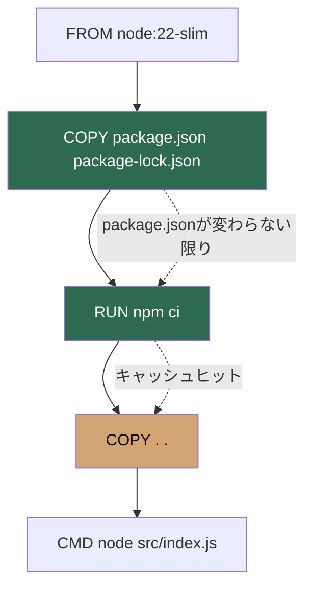
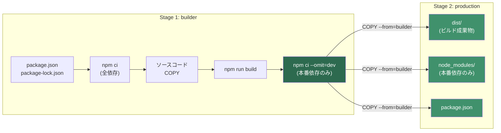

## はじめに ── Dockerイメージが大きい原因の大半はnode_modules

Node.jsアプリケーションをDockerでビルドしたとき、こんな経験はないだろうか。

- ソースコードを1行変えただけなのに、`npm install`が毎回走る
- イメージサイズが1GBを超えている
- CIのビルド時間が5分以上かかる

原因の大半は**node_modules**だ。フロントエンドプロジェクトなら数百MB、大規模なモノレポなら1GBを超えることも珍しくない。Dockerfileの書き方ひとつで、ビルド時間は数分から数十秒に、イメージサイズは1GBから100MB台に縮小できる。

この記事では、DockerでNode.jsアプリケーションをビルドする際の**具体的な最適化手順**を、コピペで動くDockerfileとともに解説する。対象はnpmとpnpmの両方をカバーし、レイヤーキャッシュ、マルチステージビルド、セキュリティ、CI/CDでのキャッシュ戦略まで一通り扱う。

## よくあるアンチパターン

まず、プロジェクト初期によく書かれる「動くけど最適化されていない」Dockerfileを見てみよう。

### アンチパターン1：COPY . . → npm install

```dockerfile
# アンチパターン：キャッシュが毎回無効化される
FROM node:22-slim
WORKDIR /app
COPY . .
RUN npm install
CMD ["node", "src/index.js"]
```

このDockerfileの問題点は、**ソースコードを1行でも変更すると`COPY . .`のレイヤーが変わり、その後の`npm install`が毎回実行される**ことだ。`package.json`が変わっていなくても、Dockerのレイヤーキャッシュは上位レイヤーが変更されると下位レイヤーもすべて再実行する。

依存パッケージが100個あるプロジェクトなら、コード修正のたびに数分のインストール待ちが発生する。

### アンチパターン2：ローカルのnode_modulesごとCOPY

```dockerfile
# アンチパターン：ローカルのnode_modulesがイメージに入る
FROM node:22-slim
WORKDIR /app
COPY . .
CMD ["node", "src/index.js"]
```

`npm install`をローカルで実行済みの状態で`COPY . .`すると、**ローカルのnode_modulesがそのままイメージに入る**。問題は3つある。

1. **ネイティブモジュールの互換性** ── macOSでビルドされた`.node`ファイルはLinuxコンテナで動かない
2. **devDependenciesが含まれる** ── テストツールやリンターが本番イメージに入る
3. **イメージサイズの肥大化** ── devDependencies込みのnode_modulesは本番用の2〜5倍になることがある

### アンチパターン3：npm installをnpm ciの代わりに使う

```dockerfile
RUN npm install
```

`npm install`は`package.json`の記述に基づいて依存解決を行い、`package-lock.json`を**更新する可能性がある**。つまり、ローカルとCI/Dockerでインストールされるバージョンが異なるリスクがある。本番ビルドでは必ず`npm ci`を使うべきだ。

`npm ci`は以下の点で`npm install`と異なる。

| 特性 | `npm install` | `npm ci` |
|---|---|---|
| lockfileの扱い | 更新する可能性あり | 厳密に従う（不一致ならエラー） |
| node_modules | 差分更新 | 削除して完全再インストール |
| 速度 | 差分がある場合は速い | 常にクリーンインストール |
| 再現性 | 低い | 高い |

Dockerビルドでは`npm ci`の「再現性の高さ」が重要になる。同じlockfileなら同じnode_modulesが生成されることが保証される。

## レイヤーキャッシュを活かすDockerfile

Dockerのビルドキャッシュを最大限に活用するための基本パターンを示す。

```dockerfile
FROM node:22-slim
WORKDIR /app

# 1. 依存定義ファイルだけ先にコピー
COPY package.json package-lock.json ./

# 2. 依存インストール（このレイヤーはpackage*.jsonが変わらない限りキャッシュされる）
RUN npm ci

# 3. ソースコードをコピー
COPY . .

# 4. アプリケーション起動
CMD ["node", "src/index.js"]
```

ポイントは**依存定義ファイルのコピーとソースコードのコピーを分離する**ことだ。



この構成にすると、`package.json`と`package-lock.json`が変更されていない限り、`npm ci`のレイヤーはキャッシュが使われる。ソースコードを変更しても依存のインストールはスキップされるため、ビルド時間が大幅に短縮される。

### TypeScriptプロジェクトの場合

TypeScriptプロジェクトではビルドステップが加わる。

```dockerfile
FROM node:22-slim
WORKDIR /app

COPY package.json package-lock.json ./
RUN npm ci

COPY tsconfig.json ./
COPY src/ ./src/

RUN npm run build

CMD ["node", "dist/index.js"]
```

`tsconfig.json`もソースコードの変更頻度が低いため、先にコピーする戦略もあるが、効果は限定的だ。基本は`package*.json`の分離が最も効果が大きい。

## マルチステージビルド

レイヤーキャッシュの最適化だけでは解決できない問題がある。**イメージサイズ**だ。

ビルドに必要なツール（TypeScript、webpack、esbuildなど）と、本番実行に必要なものは異なる。マルチステージビルドを使えば、ビルド用の環境と本番用の環境を分離できる。

```dockerfile
# ============================================
# Stage 1: ビルドステージ
# ============================================
FROM node:22-slim AS builder
WORKDIR /app

# 依存インストール（devDependencies含む）
COPY package.json package-lock.json ./
RUN npm ci

# ソースコードをコピーしてビルド
COPY tsconfig.json ./
COPY src/ ./src/
RUN npm run build

# 本番依存のみ再インストール
RUN npm ci --omit=dev

# ============================================
# Stage 2: 本番ステージ
# ============================================
FROM node:22-slim AS production
WORKDIR /app

# builderステージから必要なファイルだけコピー
COPY --from=builder /app/dist ./dist
COPY --from=builder /app/node_modules ./node_modules
COPY --from=builder /app/package.json ./

# nonrootユーザーで実行
USER node

EXPOSE 3000
CMD ["node", "dist/index.js"]
```

この構成のポイントは3つある。

**1. builderステージでdevDependenciesを使ってビルドする**

TypeScriptコンパイラやbundlerはdevDependenciesに入っている。builderステージでは`npm ci`で全依存をインストールし、ビルドを実行する。

**2. `npm ci --omit=dev`で本番依存だけに絞る**

ビルド完了後、`npm ci --omit=dev`を実行してnode_modulesを本番依存のみに再構成する。これにより、テストツール・リンター・型定義・bundlerなどがnode_modulesから除外される。

**3. productionステージにはビルド成果物と本番node_modulesだけコピーする**

`COPY --from=builder`でbuilderステージから必要なファイルだけを取り出す。builderステージのソースコード、devDependencies、ビルドツールは本番イメージに含まれない。

マルチステージビルドの流れを図示する。



### サイズ比較

典型的なExpressアプリ（TypeScript + Jest + ESLint）での比較例を示す。

| 構成 | イメージサイズ |
|---|---|
| `COPY . .` + `npm install`（devDependencies込み） | 約800MB〜1.2GB |
| シングルステージ + `npm ci --omit=dev` | 約300〜500MB |
| マルチステージ + `node:22-slim` | 約150〜250MB |
| マルチステージ + `node:22-alpine` | 約80〜150MB |

:::message
Dockerのマルチステージビルドでは`--omit=dev`で開発依存を除外しますが、「何がdevDependenciesに入るべきか」の判断基準がプロジェクト全体のイメージサイズに影響します。依存分類の原則と、パッケージマネージャがnode_modulesをどう構築するかは、書籍 [パッケージマネージャ from scratch](https://zenn.dev/yuichi_ai/books/package-manager-from-scratch) の第3章で図解付きで解説しています。
:::

## pnpmのDockerfile

pnpmはnpmと異なるインストール戦略を持つため、Dockerfile の書き方も変わる。Node.js 16.13以降に組み込まれた**corepack**を使えば、pnpmのインストール自体もDockerfile内で完結する。

### 基本パターン

```dockerfile
FROM node:22-slim AS builder
WORKDIR /app

# corepackでpnpmを有効化（バージョンを固定して再現性を確保）
# 注意: Node.js 25以降ではcorepackがバンドルされなくなるため、
# npm install -g pnpm@10.5.0 やスタンドアロンインストールへの移行が必要
RUN corepack enable && corepack prepare pnpm@10.5.0

# 依存定義ファイルをコピー
COPY package.json pnpm-lock.yaml ./

# 依存インストール
RUN pnpm install --frozen-lockfile

# ソースコードをコピーしてビルド
COPY tsconfig.json ./
COPY src/ ./src/
RUN pnpm run build

# 本番依存のみ再インストール
RUN pnpm install --frozen-lockfile --prod

# ---- 本番ステージ ----
FROM node:22-slim AS production
WORKDIR /app

COPY --from=builder /app/dist ./dist
COPY --from=builder /app/node_modules ./node_modules
COPY --from=builder /app/package.json ./

USER node
EXPOSE 3000
CMD ["node", "dist/index.js"]
```

`--frozen-lockfile`は`npm ci`に相当するオプションで、`pnpm-lock.yaml`の内容に厳密に従い、lockfileを変更しない。

### fetch + deployパターン（上級）

pnpmには`pnpm fetch`と`pnpm deploy`という、Docker最適化に特化したコマンドがある。

- **`pnpm fetch`** ── `pnpm-lock.yaml`だけを見てパッケージをストアにダウンロードする。`package.json`が不要なため、`pnpm-lock.yaml`が変わらない限りキャッシュが効く
- **`pnpm deploy`** ── 特定のプロジェクトの本番依存だけを指定ディレクトリに展開する。モノレポで特に有効

```dockerfile
FROM node:22-slim AS fetcher
WORKDIR /app

RUN corepack enable && corepack prepare pnpm@10.5.0

# pnpm-lock.yamlだけでパッケージをフェッチ（キャッシュ最大化）
COPY pnpm-lock.yaml ./
RUN pnpm fetch

# package.jsonをコピーしてインストール（ストアからリンクするだけなので高速）
COPY package.json ./
RUN pnpm install --frozen-lockfile --offline

# ---- ビルドステージ ----
FROM fetcher AS builder
COPY tsconfig.json ./
COPY src/ ./src/
RUN pnpm run build

# 本番用に別ディレクトリへdeploy
RUN pnpm deploy --filter=. --prod /app/deployed

# ---- 本番ステージ ----
FROM node:22-slim AS production
WORKDIR /app

COPY --from=builder /app/deployed ./

USER node
EXPOSE 3000
CMD ["node", "dist/index.js"]
```

このパターンのメリットは以下の通り。

1. **`pnpm fetch`はpnpm-lock.yamlだけに依存する** ── `package.json`の`scripts`フィールドを変更してもキャッシュが無効化されない
2. **`--offline`でネットワークアクセスなしにインストールできる** ── fetchステージでダウンロード済みのパッケージをストアからリンクするだけ
3. **`pnpm deploy`で本番依存だけを分離できる** ── `--prod`で本番依存のみ、`--filter`で対象プロジェクトを指定

モノレポの場合、`pnpm deploy --filter=@myorg/api --prod /app/deployed`のようにワークスペース内の特定パッケージだけを本番デプロイ用に抽出できる。

## .dockerignore

`.dockerignore`はDockerビルドのコンテキストから除外するファイルを指定する。設定しないと、`COPY . .`でnode_modulesや.gitなどの不要ファイルがビルドコンテキストに含まれ、ビルドが遅くなる。

```dockerignore
# 依存ディレクトリ（Dockerコンテナ内で再インストールする）
node_modules

# バージョン管理
.git
.gitignore

# 環境変数・シークレット
.env
.env.*

# ドキュメント
*.md
LICENSE

# テスト
__tests__
*.test.ts
*.test.js
*.spec.ts
*.spec.js
coverage

# エディタ・OS
.vscode
.idea
.DS_Store
Thumbs.db

# Docker自身
Dockerfile
docker-compose*.yml
.dockerignore

# CI設定
.github
.gitlab-ci.yml

# ビルド成果物（Dockerコンテナ内で再ビルドする）
dist
build
```

### なぜnode_modulesを.dockerignoreに入れるのか

「Dockerコンテナ内で`npm ci`するなら、ローカルのnode_modulesは不要では？」という疑問は正しい。しかし`.dockerignore`に入れないと、以下の問題が起きる。

1. **ビルドコンテキストの転送時間** ── `docker build`はまずビルドコンテキスト（カレントディレクトリ全体）をDocker daemonに転送する。node_modulesが500MBなら、毎回500MBの転送が発生する
2. **COPY . .での混入** ── `.dockerignore`がないと、`COPY . .`でローカルのnode_modulesがコンテナにコピーされ、その直後の`npm ci`で上書きされる。無駄な処理が走る

## セキュリティ

Dockerイメージのセキュリティは、アプリケーションセキュリティの最後の砦だ。本番で動くコンテナには必要最小限のものだけを入れるべきだ。

### nonrootユーザーで実行する

Node.js公式イメージには`node`ユーザー（UID 1000）が事前定義されている。`USER node`ディレクティブを追加するだけで、rootでの実行を避けられる。

```dockerfile
FROM node:22-slim AS production
WORKDIR /app

COPY --from=builder --chown=node:node /app/dist ./dist
COPY --from=builder --chown=node:node /app/node_modules ./node_modules
COPY --from=builder --chown=node:node /app/package.json ./

# nodeユーザーで実行
USER node

EXPOSE 3000
CMD ["node", "dist/index.js"]
```

`--chown=node:node`を`COPY`に付けることで、コピーされたファイルの所有者がnodeユーザーになる。これにより、ファイルの読み取りと実行はできるが、書き換えは制限される。

### postinstallスクリプトを無効化する

npm/pnpmのパッケージには`postinstall`スクリプトを含むものがある。これはインストール時に任意のコマンドを実行できる仕組みで、ネイティブモジュールのコンパイルなどに使われる。しかし、悪意あるパッケージがこの仕組みを悪用するケースもある。

ネイティブモジュールを使っていないプロジェクトなら、`--ignore-scripts`でpostinstallを無効化できる。

```dockerfile
# npmの場合
RUN npm ci --ignore-scripts

# pnpmの場合
RUN pnpm install --frozen-lockfile --ignore-scripts
```

ただし、`bcrypt`や`sharp`などネイティブモジュールを使っている場合は`--ignore-scripts`が使えないことがある。その場合は、該当パッケージだけ個別にスクリプト実行を許可する`.npmrc`設定を検討する。

```ini
# .npmrc
ignore-scripts=true

# 特定パッケージのみスクリプト実行を許可
; sharp はネイティブビルドが必要
lifecycle-script-allow=sharp
```

### イメージスキャン

ビルドしたイメージに既知の脆弱性がないか定期的にスキャンする。

```bash
# Docker Scoutでスキャン（Docker Desktop同梱）
docker scout cves myapp:latest

# Trivyでスキャン（CI向け、OSS）
trivy image myapp:latest

# Snykでスキャン
snyk container test myapp:latest
```

CI/CDパイプラインに組み込んで、重大な脆弱性がある場合はビルドを失敗させる運用が望ましい。

```yaml
# GitHub Actionsでの例
- name: Scan image with Trivy
  uses: aquasecurity/trivy-action@master
  with:
    image-ref: myapp:latest
    severity: CRITICAL,HIGH
    exit-code: 1  # 重大な脆弱性があればCIを失敗させる
```

## イメージサイズ削減

### ベースイメージの選択

Node.js公式イメージには複数のバリアントがある。

| バリアント | ベースOS | サイズ目安 | 特徴 |
|---|---|---|---|
| `node:22` | Debian Bookworm | 約1GB | 開発用ツール一式が入っている |
| `node:22-slim` | Debian Bookworm (最小) | 約200MB | 必要最小限のパッケージのみ |
| `node:22-alpine` | Alpine Linux | 約130MB | musl libc、最小構成 |
| `gcr.io/distroless/nodejs22-debian12` | Debian (distroless) | 約120MB | シェルすらない |

**推奨は`node:22-slim`**。理由は以下の通り。

- Debian互換のglibcを使うため、ネイティブモジュールの互換性問題が少ない
- alpineのmusl libcでは動かないパッケージがある（`sharp`、`bcrypt`の古いバージョンなど）
- slimでも十分に小さい（node:22の約1/5）
- デバッグ時にシェルが使える（distrolessではexecできない）

Alpine Linuxはイメージサイズが最小だが、musl libc由来の互換性問題が発生することがある。特にネイティブアドオンを含むパッケージ（`sharp`、`canvas`、旧バージョンの`bcrypt`など）はglibcを前提としている場合があり、alpineでは追加の設定が必要になる。

distrolessは最もセキュアだが、コンテナに入ってデバッグすることができない。本番環境で十分な監視体制が整っている場合に検討する選択肢だ。

### devDependenciesの除外を確認する

マルチステージビルドで`--omit=dev`を使っていても、実際にdevDependenciesが除外されているか確認する習慣をつけよう。

```bash
# コンテナ内のnode_modulesのサイズを確認
docker run --rm myapp:latest du -sh node_modules
# 例: 45M	node_modules  ← devDependencies除外後

# devDependenciesに入っているパッケージが含まれていないか確認
docker run --rm myapp:latest ls node_modules | grep -E "jest|eslint|typescript|prettier"
# 何も表示されなければOK
```

### .yarnrcや.npmrcのクリーンアップ

ビルド時にしか使わない`.npmrc`の設定（プライベートレジストリのトークンなど）が本番イメージに含まれていないか注意する。

```dockerfile
# builderステージで.npmrcを使い、本番ステージにはコピーしない
FROM node:22-slim AS builder
WORKDIR /app
COPY .npmrc package.json package-lock.json ./
RUN npm ci
RUN rm -f .npmrc  # トークンを含む場合は明示的に削除

# 本番ステージには.npmrcをコピーしない
FROM node:22-slim AS production
WORKDIR /app
COPY --from=builder /app/dist ./dist
COPY --from=builder /app/node_modules ./node_modules
COPY --from=builder /app/package.json ./
```

マルチステージビルドなら、builderステージに`.npmrc`が残っていても本番イメージには含まれない。ただし、`docker history`でレイヤーの中身が見えるリスクがあるため、BuildKitの`--mount=type=secret`を使うのがベストプラクティスだ。

```dockerfile
# BuildKitのsecretマウントでトークンを渡す（レイヤーに残らない）
RUN --mount=type=secret,id=npmrc,target=/app/.npmrc npm ci
```

ビルド時は以下のように実行する。

```bash
DOCKER_BUILDKIT=1 docker build --secret id=npmrc,src=.npmrc -t myapp .
```

## CI/CDでのDocker build最適化

CI環境（GitHub Actions、GitLab CI、CircleCIなど）では、ローカル開発環境とは異なるキャッシュ戦略が必要になる。CIのジョブは毎回クリーンな環境で実行されるため、ローカルのようにDockerレイヤーキャッシュが自動的に効くわけではない。

### BuildKitのキャッシュマウント

BuildKitの`--mount=type=cache`を使うと、`npm ci`のダウンロードキャッシュをビルド間で共有できる。

```dockerfile
FROM node:22-slim AS builder
WORKDIR /app

COPY package.json package-lock.json ./

# npmのキャッシュディレクトリをマウントして再利用
RUN --mount=type=cache,target=/root/.npm \
    npm ci

COPY . .
RUN npm run build
RUN npm ci --omit=dev
```

pnpmの場合はストアのキャッシュをマウントする。

```dockerfile
FROM node:22-slim AS builder
WORKDIR /app

RUN corepack enable && corepack prepare pnpm@10.5.0

COPY package.json pnpm-lock.yaml ./

# pnpmストアをキャッシュマウント
RUN --mount=type=cache,target=/root/.local/share/pnpm/store \
    pnpm install --frozen-lockfile

COPY . .
RUN pnpm run build
RUN pnpm install --frozen-lockfile --prod
```

`--mount=type=cache`はDockerレイヤーキャッシュとは別の仕組みで、指定したディレクトリの内容をビルド間で永続化する。レイヤーキャッシュが無効化されても（`package.json`が変わった場合など）、ダウンロード済みのパッケージはキャッシュから取得できるため、ネットワークダウンロードを大幅に削減できる。

### GitHub Actionsでのキャッシュ設定

GitHub Actionsでは、BuildKitのキャッシュをGitHub Cacheに保存して、ジョブ間で共有できる。

```yaml
name: Build and Push
on:
  push:
    branches: [main]

jobs:
  build:
    runs-on: ubuntu-latest
    steps:
      - uses: actions/checkout@v4

      - name: Set up Docker Buildx
        uses: docker/setup-buildx-action@v3

      - name: Build and push
        uses: docker/build-push-action@v6
        with:
          context: .
          push: true
          tags: myapp:latest
          cache-from: type=gha
          cache-to: type=gha,mode=max
```

`cache-from: type=gha`と`cache-to: type=gha,mode=max`を指定すると、ビルドレイヤーのキャッシュがGitHub Actionsのキャッシュストレージ（10GB上限）に保存される。`mode=max`は中間レイヤーも含めてキャッシュするオプションで、マルチステージビルドのbuilderステージのキャッシュも保持される。

### docker buildx bakeでの複数イメージビルド

モノレポで複数のサービスをビルドする場合、`docker-bake.hcl`で一括管理できる。

```hcl
# docker-bake.hcl
group "default" {
  targets = ["api", "worker"]
}

target "api" {
  context    = "."
  dockerfile = "packages/api/Dockerfile"
  tags       = ["myapp-api:latest"]
  cache-from = ["type=gha,scope=api"]
  cache-to   = ["type=gha,scope=api,mode=max"]
}

target "worker" {
  context    = "."
  dockerfile = "packages/worker/Dockerfile"
  tags       = ["myapp-worker:latest"]
  cache-from = ["type=gha,scope=worker"]
  cache-to   = ["type=gha,scope=worker,mode=max"]
}
```

```bash
docker buildx bake --push
```

## 最適化チェックリスト

最後に、DockerfileのNode.js最適化ポイントをチェックリストにまとめる。

### ビルド速度

- [ ] `package.json`と`lockfile`を先にCOPYし、ソースコードのCOPYと分離しているか
- [ ] `npm install`ではなく`npm ci`（または`pnpm install --frozen-lockfile`）を使っているか
- [ ] `.dockerignore`にnode_modules、.git、テストファイルを含めているか
- [ ] BuildKitの`--mount=type=cache`でパッケージキャッシュを永続化しているか

### イメージサイズ

- [ ] マルチステージビルドを使い、builderステージとproductionステージを分離しているか
- [ ] `--omit=dev`で本番依存のみにしているか
- [ ] ベースイメージは`node:22-slim`以下のサイズを使っているか
- [ ] 不要なファイル（ソースコード、テスト、ドキュメント）が本番イメージに含まれていないか

### セキュリティ

- [ ] `USER node`でnonrootユーザーとして実行しているか
- [ ] `.npmrc`のトークンが本番イメージに残っていないか（BuildKit secretの使用を検討）
- [ ] イメージスキャン（Trivy、Docker Scout）をCIに組み込んでいるか
- [ ] ネイティブモジュール不要なら`--ignore-scripts`を検討したか

### CI/CD

- [ ] GitHub Actions等でBuildKitキャッシュ（`type=gha`）を設定しているか
- [ ] キャッシュの`mode=max`で中間レイヤーも保存しているか

## まとめ

DockerでのNode.jsアプリケーション最適化は、以下の3つの軸で考える。

1. **ビルド速度** ── レイヤーキャッシュの活用（`package*.json`の分離、BuildKit `--mount=type=cache`）
2. **イメージサイズ** ── マルチステージビルド + `--omit=dev` + 適切なベースイメージ
3. **セキュリティ** ── nonrootユーザー、secret管理、イメージスキャン

これらを組み合わせれば、1GBを超えていたイメージが100〜200MBに、数分かかっていたビルドが数十秒になる。

この記事で紹介したDockerfileのパターンは、`npm ci`や`--omit=dev`といったパッケージマネージャの仕組みを前提としている。「なぜ`npm ci`は`npm install`より再現性が高いのか」「`--omit=dev`はnode_modulesをどう再構成するのか」「pnpmのContent-Addressable Storeはなぜキャッシュ効率が高いのか」といった**パッケージマネージャの内部動作**を理解すると、Dockerfileの設計判断がより確信を持ってできるようになる。

パッケージマネージャの依存解決・node_modules構築・lockfileの仕組みをゼロから学ぶには、書籍 **[パッケージマネージャ from scratch](https://zenn.dev/yuichi_ai/books/package-manager-from-scratch)** がおすすめだ。1〜3章は無料で読めるので、まずは気軽に試してほしい。

---

:::message
この記事の執筆にはAIツール（Claude）を使用しています。技術的な正確性は公式ドキュメントおよび実機検証に基づいて確認していますが、誤りを見つけた場合はコメントでお知らせください。
:::
