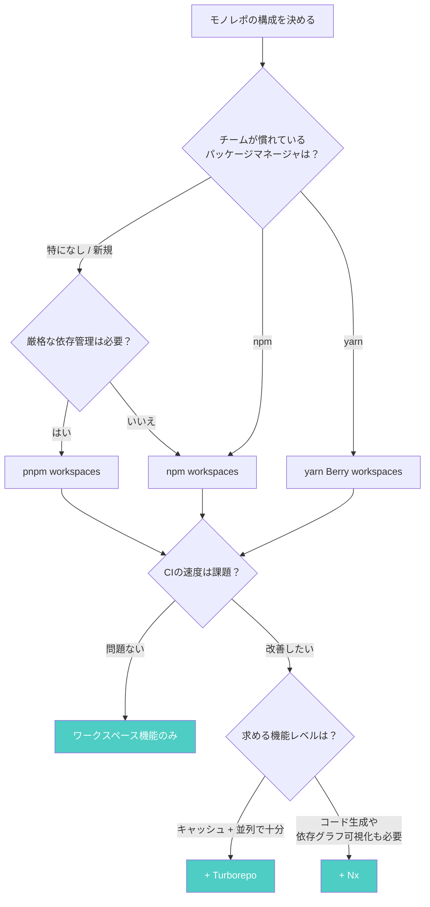

## フロントエンドもバックエンドも、1つのリポジトリで

共通ライブラリを更新するたびに、依存する全リポジトリでバージョンを上げてPRを出す。CIの設定ファイルがリポジトリの数だけ存在する。「型定義はどっちのリポに？」という質問がSlackで飛び交う。

この運用コストを解決する手法が**モノレポ**だ。複数のパッケージを1つのGitリポジトリに格納し、パッケージマネージャのワークスペース機能で一元管理する。本記事では2026年現在の選択肢を整理し、プロジェクトに合ったツール構成を選べるようにする。

## モノレポとは（30秒で理解）

```
my-monorepo/
├── apps/
│   ├── web/       # フロントエンド
│   └── api/       # バックエンド
├── packages/
│   ├── ui/        # 共有UIコンポーネント
│   └── utils/     # ユーティリティ
├── package.json
└── pnpm-workspace.yaml
```

Google、Meta、Vercelなどの企業、OSSではNext.js、Babel、Viteがモノレポを採用している。利点は3つだ。

1. **コード共有が即座** -- 共通ライブラリの変更がnpm publishなしで反映される
2. **依存の整合性** -- Reactのバージョンを全パッケージで統一しやすい
3. **CIの一元化** -- 影響範囲を自動検知し、必要なパッケージだけビルドできる

## パッケージマネージャ別ワークスペース機能比較

2026年現在、JavaScript/TypeScriptのモノレポで使えるパッケージマネージャは主に3つだ。

| 機能 | npm workspaces | pnpm workspaces | yarn Berry |
|------|:---:|:---:|:---:|
| 現行バージョン | v11系 | v10系 | v4系 |
| 追加インストール | 不要 | 必要 | 必要 |
| 設定ファイル | `package.json` | `pnpm-workspace.yaml` | `package.json` + `.yarnrc.yml` |
| `workspace:*`プロトコル | 対応 | 対応 | 対応 |
| 幽霊依存の防止 | 不可 | 厳格に防止 | PnPモードで防止 |
| ディスク効率 | 低い（コピー） | 高い（CAS + ハードリンク） | 高い（zip） |
| パッケージ絞り込み実行 | `-w`フラグ | `--filter`（高機能） | `foreach --include` |
| バージョン一元管理 | なし | `catalogs`機能 | `constraints`機能 |
| 既存ツール互換性 | 最も高い | 高い | PnPモードで低下あり |

**npm workspaces**は追加インストール不要で学習コストが最も低い。ただし幽霊依存（宣言していないパッケージが使えてしまう問題）を防げない。**pnpm workspaces**はContent-Addressable Storeとシンボリックリンクにより、幽霊依存を構造的に防止しつつディスク使用量を削減する。**yarn Berry**はPnPによるインストールレスのモジュール解決とZero-Installs対応が強みだが、PnPモードは一部ツールとの互換性問題がある。

:::message
pnpmとyarn Berryがそれぞれどのような内部構造で依存を管理しているのか、詳しくは[「なぜnode_modulesは壊れるのか？」](https://zenn.dev/yuichi_ai/books/package-manager-from-scratch)の第5章・第6章で図解している。
:::

## 各ツールのセットアップ手順

各パッケージマネージャでモノレポを立ち上げる最小構成を示す。すべてコピペで実行できる。

### npm workspaces

```json
// ルートの package.json
{
  "name": "my-monorepo",
  "private": true,
  "workspaces": ["packages/*", "apps/*"]
}
```

```bash
# 全ワークスペースの依存をインストール
npm install

# 特定ワークスペースでコマンド実行
npm run build -w packages/ui

# 全ワークスペースでテスト実行
npm run test --workspaces

# 特定ワークスペースにパッケージ追加
npm install lodash -w packages/utils
```

ワークスペース間の依存は通常通り`package.json`に記述する。`npm install`を実行すると、対象パッケージへのシンボリックリンクが`node_modules`内に作成される。

### pnpm workspaces

```yaml
# pnpm-workspace.yaml（ルートに配置）
packages:
  - "packages/*"
  - "apps/*"
```

```bash
# 全ワークスペースの依存をインストール
pnpm install

# 特定パッケージのみビルド
pnpm --filter @myorg/ui build

# パッケージとその依存を全てビルド
pnpm --filter @myorg/web... build

# 変更があったパッケージのみテスト（git diffベース）
pnpm --filter "...[origin/main]" test
```

ワークスペース間の依存は`workspace:*`プロトコルで明示的に宣言する。

```json
// apps/web の package.json
{
  "dependencies": {
    "@myorg/ui": "workspace:*",
    "@myorg/utils": "workspace:^"
  }
}
```

`workspace:*`は`npm publish`時に実際のバージョン番号に自動変換されるため、開発中はローカル参照、公開時は通常の依存として動作する。

#### catalogs でバージョンを一元管理

モノレポで頻出する「パッケージごとにReactのバージョンがバラバラ」問題は、catalogs機能（v9.5+）で解決できる。

```yaml
# pnpm-workspace.yaml
packages:
  - "packages/*"
catalog:
  react: ^19.0.0
  react-dom: ^19.0.0
  typescript: ^5.7.0
```

```json
// 各パッケージの package.json で catalog: プロトコルを使う
{ "dependencies": { "react": "catalog:", "react-dom": "catalog:" } }
```

`pnpm-workspace.yaml`の1箇所を変えるだけで全パッケージに反映される。

### yarn Berry（v4+）

```yaml
# .yarnrc.yml
nodeLinker: node-modules
```

```json
// ルートの package.json
{
  "name": "my-monorepo",
  "private": true,
  "packageManager": "yarn@4.12.0",
  "workspaces": ["packages/*", "apps/*"]
}
```

```bash
yarn set version stable   # バージョン固定
yarn install              # 依存インストール
yarn workspace @myorg/ui build         # 特定ワークスペース実行
yarn workspaces foreach -A run test    # 全ワークスペース実行
```

`nodeLinker: node-modules`を指定すると従来通りの`node_modules`が生成される。PnPモード（デフォルト）は高速だが互換性リスクがあるため、初導入時は`node-modules`モードが安全だ。

## モノレポ専用ツールとの組み合わせ

パッケージマネージャは「依存のインストール」と「パッケージ間のリンク」を担当する。パッケージが増えてくると、**ビルドキャッシュ**と**タスクの並列実行**を専用ツールに任せる必要が出てくる。

### Turborepo（v2.8系）

Vercelが開発するRust製ビルドシステム。設定が少なく、すぐに効果を実感できる。

```json
// turbo.json
{
  "$schema": "https://turbo.build/schema.json",
  "tasks": {
    "build": {
      "dependsOn": ["^build"],
      "outputs": ["dist/**"]
    },
    "test": { "dependsOn": ["build"] },
    "lint": {}
  }
}
```

```bash
npx turbo build
# @myorg/utils:build: cache hit, replaying logs  ← 即完了
# @myorg/ui:build: cache hit, replaying logs
# @myorg/web:build: cache miss, executing        ← 変更分だけ実行
```

npm、pnpm、yarnのいずれとも組み合わせられる。

### Nx（v22系）

Nx社が開発する包括的なビルドプラットフォーム。コード生成、依存グラフの可視化（`npx nx graph`）、プラグインによる拡張に強い。大規模エンタープライズ向け。

### Lerna（v9系）

モノレポ管理ツールの先駆者。v9でレガシーコマンド（`lerna add`、`lerna bootstrap`）が削除され、現在は**バージョニングとパブリッシュに特化**して使うのが正しい位置づけだ。

### いつどれを使うか

| ユースケース | 推奨ツール |
|---|---|
| パッケージ5個以下、シンプルにしたい | ワークスペース機能のみ |
| CIが遅い、ビルドキャッシュがほしい | + Turborepo |
| 大規模（20+パッケージ）、コード生成も必要 | + Nx |
| OSSライブラリの公開・バージョニング | + Lerna |

## 選定フローチャート

パッケージマネージャとビルドシステムの組み合わせを、フローチャートで整理する。



**迷ったときの結論**: 2026年時点で新規にモノレポを始めるなら、**pnpm workspaces + Turborepo**がバランスの良い出発点だ。厳格な依存管理、高速なインストール、ビルドキャッシュが揃い、設定量も少ない。

ただし、チームがすでにnpmやyarnに慣れているなら、それを使い続ける選択も正しい。ツールの技術的優位性よりも、チーム全員が迷わず使える環境のほうが、長期的に生産性へ寄与する。

## よくあるトラブルと解決法

### 「packages間で型が共有できない」

**原因**: TypeScriptのプロジェクト参照が未設定。`tsconfig.json`に`"composite": true`と`"references"`を追加し、`tsc --build`でビルドする。

```json
// apps/web の tsconfig.json
{
  "compilerOptions": { "composite": true, "declaration": true },
  "references": [{ "path": "../../packages/ui" }]
}
```

### 「CIが遅い」

**解決策**: Turborepoを導入する。`npx turbo build test lint`で、変更のないパッケージはキャッシュヒットで即完了する。チーム間でキャッシュを共有するには`npx turbo login && npx turbo link`。

### 「依存関係がカオスになった」

**解決策**: pnpmに移行し、`.npmrc`で`strict-peer-dependencies=true`を設定する。pnpmは宣言していないパッケージの`require`を構造的にブロックする。catalogsでバージョンを一元管理すれば、全パッケージでバージョンが揃う。

## まとめ

本記事ではモノレポにおけるパッケージマネージャの「どれを選ぶか」と「どう設定するか」を整理した。

しかし、実運用で問題に直面したとき――ホイスティングの挙動が予想と違う、pnpmのシンボリックリンク構造でハマった、lockfileのコンフリクトが解消できない――こうした場面では、ワークスペースが**内部でどのように依存を解決しているのか**を知っていることが決定的な差になる。

各パッケージマネージャがなぜこのような設計になっているのか、依存解決アルゴリズムの原理から理解したい方は、[「なぜnode_modulesは壊れるのか？ ── npm/yarn/pnpmの依存解決を仕組みから完全理解する」](https://zenn.dev/yuichi_ai/books/package-manager-from-scratch)を参照してほしい。ホイスティングの功罪、Content-Addressable Storeの設計、PnPのモジュール解決の仕組みを、図解とコード例で解説している。

---

*この記事はAIの支援を受けて執筆されています。*
