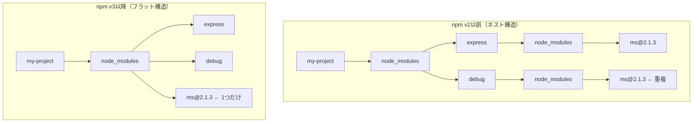
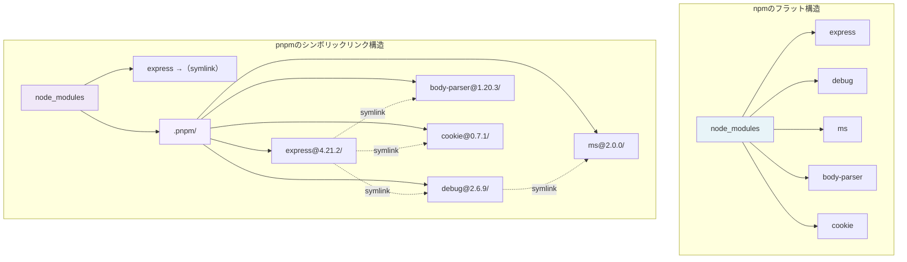

## はじめに ── node_modulesの中身、見たことありますか？

`node_modules`ディレクトリ。名前は毎日目にするのに、中身を開いたことがある人は意外と少ない。

「触るな危険」「.gitignoreに入れておけばOK」──そんなブラックボックス扱いが当たり前になっている。しかし実際には、`node_modules`の構造を理解しているだけで、以下のようなトラブルの大半は自力で解決できる。

- `npm install`した後にモジュールが見つからないエラー
- 同じパッケージの異なるバージョンが混在して動作がおかしい
- ディスク容量が異様に膨れ上がる
- CIだけビルドが壊れる

この記事では、`node_modules`ディレクトリの構造を**実際にコマンドを叩きながら読み解く方法**を解説する。npm v3以前と以降で構造がどう変わったのか、pnpmではどう違うのか、そしてフラット化が引き起こすPhantom Dependencyの問題まで、図解付きで整理する。

:::message
この記事は「node_modulesの構造をどう読むか」「確認コマンドをどう使うか」という**HOW/WHAT**にフォーカスしている。「なぜnpmはこの構造を選んだのか」「依存解決アルゴリズムの内部で何が起きているのか」といった**WHY**は、筆者の書籍 [パッケージマネージャ from scratch](https://zenn.dev/yuichi_ai/books/package-manager-from-scratch) で設計思想のレベルから解説している。
:::

## npm v3以前 ── ネスト地獄の時代

まず歴史を知ることで、現在の構造がなぜ存在するかの背景を掴もう。

npm v2以前（Node.js 4.x頃まで）のnode_modulesは、依存関係をそのまま**ツリー状にネスト**していた。

たとえば、`express`と`debug`の両方が`ms`に依存しているプロジェクトを考える。

```
my-project/
├── node_modules/
│   ├── express/
│   │   └── node_modules/
│   │       └── ms/          ← express用のms
│   └── debug/
│       └── node_modules/
│           └── ms/          ← debug用のms（同じバージョンでも重複）
└── package.json
```

この構造は直感的で分かりやすい。しかし致命的な問題があった。

**1. ディスク容量の爆発**

同じパッケージの同じバージョンが、依存ツリーの各所に何十個も重複してインストールされる。中〜大規模プロジェクトでは`node_modules`が数百MBから1GBを超えることも珍しくなかった。

**2. パスの長さ制限（Windows問題）**

ネストが深くなると、ファイルパスが`node_modules/A/node_modules/B/node_modules/C/...`のように際限なく伸びる。Windows環境では260文字のパス長制限（MAX_PATH）に引っかかり、ファイルを削除することすらできなくなるケースがあった。

**3. インストール速度の低下**

同じファイルを何度もダウンロードし、何度も展開するため、`npm install`の実行時間が長くなる。

## npmのフラット化（hoisting） ── v3以降の革命

npm v3（2015年リリース、Node.js 5.x同梱）で、依存解決の方式が大きく変わった。それが**hoisting（巻き上げ）**と呼ばれるフラット化だ。

### フラット化の基本ルール

npm v3以降では、以下のルールで`node_modules`にパッケージを配置する。

1. **可能な限り、すべてのパッケージを`node_modules`の直下（トップレベル）に配置する**
2. **同じパッケージの同じバージョンは1つだけ配置する**
3. **バージョン競合が発生した場合のみ、ネストして配置する**

先ほどの例が、v3以降ではこうなる。

```
my-project/
├── node_modules/
│   ├── express/              ← トップレベルに配置
│   ├── debug/                ← トップレベルに配置
│   └── ms/                   ← 共通のmsは1つだけ（重複なし）
└── package.json
```

`express`と`debug`の両方が同じバージョンの`ms`を使うなら、トップレベルに1つだけ配置すれば済む。ディスク使用量が劇的に削減される。

### バージョン競合時のネスト

フラット化にも限界がある。同じパッケージの**異なるバージョン**が必要な場合だ。

たとえば、`package-a`が`lodash@4.17.21`を、`package-b`が`lodash@3.10.1`を要求する場合を考える。

```
my-project/
├── node_modules/
│   ├── package-a/
│   ├── package-b/
│   │   └── node_modules/
│   │       └── lodash/       ← v3.10.1（package-b専用にネスト）
│   └── lodash/               ← v4.17.21（トップレベル）
└── package.json
```

トップレベルに配置できるのは1つのバージョンだけだ。先にインストールされた（または最も多くのパッケージが要求する）バージョンがトップレベルに配置され、競合する他のバージョンは要求元パッケージの`node_modules`内にネストされる。

以下のmermaid図で、v2以前とv3以降の構造の違いを整理する。



フラット化により、ディスク容量の問題もWindowsのパス長問題も大幅に改善された。しかし、このフラット化は別の問題を引き起こすことになる。それについてはPhantom Dependencyのセクションで詳しく説明する。

## 実際のnode_modulesを読む

理論を理解したら、実際に手を動かして確認しよう。既存のNode.jsプロジェクト、または新しいディレクトリで試してほしい。

### ステップ1: node_modulesの中身を一覧する

まず、トップレベルにどんなパッケージがあるか確認する。

```bash
# node_modules直下のディレクトリ一覧
ls node_modules/
```

出力例（express をインストールした場合）:

```
accepts          cookie-signature  etag             merge-descriptors  qs
array-flatten    debug             express          methods            range-parser
body-parser      depd              finalhandler     mime               raw-body
bytes            destroy           forwarded        ms                 safe-buffer
content-disposition  ee-first      fresh            negotiator         safer-buffer
content-type     encodeurl         http-errors      on-finished        send
cookie           escape-html       inherits         parseurl           serve-static
...
```

ここで重要な観察ポイントがある。**`package.json`に`express`しか書いていないのに、大量のパッケージがトップレベルに並んでいる**。これがフラット化（hoisting）の結果だ。expressの依存、さらにその依存の依存まで、すべてがトップレベルに引き上げられている。

### ステップ2: パッケージの実体を確認する

各パッケージの中身を確認してみよう。

```bash
# 特定パッケージのバージョンを確認
cat node_modules/ms/package.json | grep '"version"'
```

```
  "version": "2.1.3",
```

```bash
# パッケージの依存関係を確認
cat node_modules/express/package.json | grep -A 5 '"dependencies"'
```

### ステップ3: .package-lock.json を読む

npm v7以降では、`node_modules/.package-lock.json`というファイルが生成される。これはnode_modulesの現在の状態を記録したメタデータだ。

```bash
# .package-lock.jsonの存在確認
ls -la node_modules/.package-lock.json

# 中身の一部を確認（jqがある場合）
cat node_modules/.package-lock.json | npx -y json | head -50
```

このファイルには、node_modules内の全パッケージのバージョン、整合性ハッシュ（integrity）、依存関係が記録されている。`npm install`はこのファイルを使って、node_modulesの現在の状態と`package-lock.json`の差分を高速に検出する。

### ステップ4: npm ls で依存ツリーを可視化する

`node_modules`の中を直接覗くよりも、`npm ls`コマンドを使うほうが依存関係の全体像を把握しやすい。

```bash
# 直接の依存関係だけ表示（デフォルト）
npm ls
```

出力例:

```
my-project@1.0.0 /path/to/my-project
├── express@4.21.2
└── lodash@4.17.21
```

`package.json`に記載した直接の依存だけが表示される。

```bash
# すべての依存（依存の依存も含む）をツリー表示
npm ls --all
```

出力例（一部抜粋）:

```
my-project@1.0.0 /path/to/my-project
├─┬ express@4.21.2
│ ├─┬ accepts@1.3.8
│ │ ├── mime-types@2.1.35
│ │ └── negotiator@0.6.3
│ ├── array-flatten@1.1.1
│ ├─┬ body-parser@1.20.3
│ │ ├── bytes@3.1.2
│ │ ├── content-type@1.0.5
│ │ ├─┬ debug@2.6.9
│ │ │ └── ms@2.0.0
│ │ ├── depd@2.0.0
│ │ ├── destroy@1.2.0
│ │ ├── http-errors@2.0.0
│ │ ├─┬ iconv-lite@0.4.24
│ │ │ └── safer-buffer@2.1.2
│ │ ├── on-finished@2.4.1
│ │ ├── qs@6.13.0
│ │ ├── raw-body@2.5.2
│ │ ├── type-is@1.6.18
│ │ └── unpipe@1.0.0
│ ├── content-disposition@0.5.4
│ ├── content-type@1.0.5
│ ├── cookie@0.7.1
│ ├── cookie-signature@1.0.6
│ ├─┬ debug@2.6.9
│ │ └── ms@2.0.0
│ ...
└── lodash@4.17.21
```

このツリー表示から、どのパッケージがどの依存を要求しているかが一目で分かる。

```bash
# 特定のパッケージがどこで使われているか確認
npm ls ms
```

出力例:

```
my-project@1.0.0 /path/to/my-project
└─┬ express@4.21.2
  ├─┬ body-parser@1.20.3
  │ └─┬ debug@2.6.9
  │   └── ms@2.0.0
  ├─┬ debug@2.6.9
  │ └── ms@2.0.0
  ├─┬ send@0.19.0
  │ ├── ms@2.1.3
  │ └─┬ debug@2.6.9
  │   └── ms@2.0.0
  └─┬ serve-static@1.16.2
    └─┬ send@0.19.0
      ├── ms@2.1.3
      └─┬ debug@2.6.9
        └── ms@2.0.0
```

`ms`パッケージが複数の場所で使われており、しかもバージョンが`2.0.0`と`2.1.3`の2種類あることが分かる。このようにバージョンが異なる場合に、前述のネスト配置が発生する。

### ステップ5: パッケージ数を数える

プロジェクトの依存がどれくらいの規模になっているか確認する。

```bash
# node_modules直下のパッケージ数（スコープパッケージ含む）
ls -d node_modules/*/ node_modules/@*/*/ 2>/dev/null | wc -l

# npm ls で全依存の数を確認
npm ls --all --parseable | wc -l
```

`express`1つインストールしただけでも、間接依存を含めると60個以上のパッケージがインストールされることが多い。この数を知っておくと、「こんなに入るものなのか」と驚く代わりに「フラット化の結果だな」と冷静に理解できる。

## 依存の重複とdedup

フラット化でも重複は完全にはなくならない。バージョン競合によるネスト配置が発生すると、同じパッケージの異なるバージョンが複数存在することになる。

### npm ls --duplicates で重複を確認する

```bash
# 重複しているパッケージを一覧表示
npm ls --duplicates
```

出力例:

```
my-project@1.0.0 /path/to/my-project
├─┬ express@4.21.2
│ └─┬ body-parser@1.20.3
│   └── qs@6.13.0 deduped
└─┬ some-package@2.0.0
  └── qs@6.12.0
```

`deduped`と表示されているパッケージは、すでにトップレベルのものを共有している（重複が解消済み）。一方、バージョンが異なるものは個別にインストールされている。

### npm dedupe で重複を最適化する

`npm dedupe`コマンドは、node_modulesのツリー構造を再計算し、可能な限り重複を排除する。

```bash
# 重複を最適化
npm dedupe

# 実際に変更せず、何が起きるか確認だけする
npm dedupe --dry-run
```

`npm dedupe`はsemverの範囲指定を活用して、互換性のあるバージョンに統合できる場合に重複を解消する。たとえば`package-a`が`qs@^6.12.0`を要求し、`package-b`が`qs@^6.13.0`を要求している場合、`qs@6.13.0`で両方を満たせるため、1つに統合される。

```bash
# dedupe前後でパッケージ数の変化を確認
echo "Before:" && npm ls --all --parseable | wc -l
npm dedupe
echo "After:" && npm ls --all --parseable | wc -l
```

npm v7以降では、`npm install`時に自動的にdedupeが実行されるため、手動で`npm dedupe`を実行する必要がある場面は少なくなった。ただし、`package-lock.json`を長期間メンテナンスしているプロジェクトでは、ロックファイルの状態によっては手動dedupeが有効な場合がある。

## pnpmのnode_modules構造

pnpmは、npmのフラット化とはまったく異なるアプローチで依存関係を管理する。その仕組みを理解すると、なぜpnpmが速く、ディスク効率が良く、Phantom Dependencyを防げるのかが分かる。

### pnpmの3層構造

pnpmの`node_modules`は、以下の3層構造で成り立っている。

```
my-project/
├── node_modules/
│   ├── .pnpm/                           ← 実体が格納される場所
│   │   ├── express@4.21.2/
│   │   │   └── node_modules/
│   │   │       ├── express/             ← 実ファイル
│   │   │       ├── accepts -> ../../accepts@1.3.8/node_modules/accepts
│   │   │       ├── body-parser -> ../../body-parser@1.20.3/node_modules/body-parser
│   │   │       └── ...                  ← expressの依存へのシンボリックリンク
│   │   ├── debug@2.6.9/
│   │   │   └── node_modules/
│   │   │       ├── debug/               ← 実ファイル
│   │   │       └── ms -> ../../ms@2.0.0/node_modules/ms
│   │   └── ms@2.0.0/
│   │       └── node_modules/
│   │           └── ms/                  ← 実ファイル
│   ├── express -> .pnpm/express@4.21.2/node_modules/express  ← シンボリックリンク
│   └── .modules.yaml
├── package.json
└── pnpm-lock.yaml
```

この構造のポイントを整理する。

**第1層: トップレベル（`node_modules/`直下）**

`package.json`に直接記載したパッケージのシンボリックリンクだけが配置される。上の例では`express`のみ。expressの間接依存（`debug`、`ms`など）はトップレベルに**存在しない**。

**第2層: `.pnpm/`ディレクトリ（Virtual Store）**

すべてのパッケージの実体は`.pnpm/`の中に`{パッケージ名}@{バージョン}/node_modules/{パッケージ名}`という構造で格納される。各パッケージの依存は、同じ`.pnpm/`内の他パッケージへのシンボリックリンクで表現される。

**第3層: Content-Addressable Store（グローバル）**

`.pnpm/`内のファイルも実はハードリンクで、実体は`~/.local/share/pnpm/store/v3/`（または設定で指定した場所）にある**Content-Addressable Store**に格納されている。ファイルはそのコンテンツのハッシュで管理され、マシン上のすべてのプロジェクトで共有される。

```bash
# Content-Addressable Storeの場所を確認
pnpm store path

# ストアの使用状況を確認
pnpm store status
```

### npm vs pnpmの構造比較

以下の図で、同じ依存関係がnpmとpnpmでどう配置されるかを比較する。



**npm**: すべてがトップレベルに並ぶ。`require('debug')`や`require('ms')`が、`package.json`に書いていなくても動いてしまう。

**pnpm**: トップレベルには`express`のシンボリックリンクしかない。`require('debug')`を実行しても、Node.jsのモジュール解決パスにdebugが存在しないため、エラーになる。これが**strictなnode_modules**と呼ばれるpnpmのデフォルト動作だ。

### pnpmの利点をまとめる

| 観点 | npm（フラット化） | pnpm（シンボリックリンク） |
|---|---|---|
| ディスク使用量 | パッケージごとにコピー | ハードリンクで共有 |
| インストール速度 | 毎回展開 | ストアに存在すればリンクのみ |
| Phantom Dependency | 発生する | 発生しない（strict） |
| node_modulesの構造 | フラット | 3層構造 |
| バージョン競合の処理 | ネスト | .pnpm内で並列配置 |


## Phantom Dependency ── フラット化の副作用

npmのフラット化は、ディスク容量とパス長の問題を解決した。しかし、新たな問題を引き起こした。それが**Phantom Dependency（幽霊依存）**だ。

### 何が起きるのか

以下のような`package.json`を考える。

```json
{
  "name": "my-app",
  "dependencies": {
    "express": "^4.21.0"
  }
}
```

`express`だけをインストールした。しかし、以下のコードが**動いてしまう**。

```javascript
// app.js
const express = require('express');   // OK: package.jsonに書いてある
const debug = require('debug');       // 動く! でもpackage.jsonに書いていない
const ms = require('ms');             // これも動く! でもpackage.jsonに書いていない
const qs = require('qs');             // これも動く!
```

`debug`、`ms`、`qs`は`package.json`に記載していない。にもかかわらず`require`できる。これがPhantom Dependencyだ。

### なぜ動くのか

Node.jsのモジュール解決アルゴリズムは、`require('debug')`が呼ばれると以下の順序でファイルを探す。

1. `./node_modules/debug`
2. `../node_modules/debug`
3. `../../node_modules/debug`
4. ...（ルートまで遡る）

npmのフラット化により、`debug`がプロジェクトの`node_modules/`直下に配置されている。Node.jsはそれを見つけて読み込む。npmにとって`debug`はexpressの内部依存だが、Node.jsのモジュール解決はそんな区別をしない。ファイルがそこにあれば読み込む。

### なぜ危険なのか

Phantom Dependencyに頼ったコードは、以下の状況で突然壊れる。

**1. expressがdebugの使用をやめた場合**

expressのメジャーアップデートで`debug`への依存が削除されると、`node_modules`から`debug`が消え、あなたのコードは`Cannot find module 'debug'`で壊れる。

**2. 別のバージョンがhoistされた場合**

他の依存パッケージが異なるバージョンの`debug`を要求し、そちらがトップレベルにhoistされた場合、あなたのコードが期待するAPIが存在しないかもしれない。

**3. 異なる環境で再現しない場合**

lockfileの差異やnpmのバージョンの違いにより、開発マシンとCI環境でhoistされるパッケージが異なることがある。「ローカルでは動くのにCIで落ちる」典型パターンだ。

### 検出方法

```bash
# depcheckで未宣言の依存を検出
npx depcheck
```

出力例:

```
Missing dependencies
* debug: ./src/logger.js
* ms: ./src/utils/time.js
Unused dependencies
* lodash
```

`Missing dependencies`に表示されたパッケージが、コード内で使用しているがpackage.jsonに宣言していない依存、つまりPhantom Dependencyだ。

対処は明快で、**使っているなら明示的に`package.json`に追加する**。

```bash
npm install debug ms
```

あるいは、pnpmに移行すればPhantom Dependency自体が構造的に発生しなくなる。

## トラブルシューティング

node_modulesの構造を理解した上で、よくあるトラブルへの対処法を整理する。

### 1. 「とにかくおかしい」ときの基本手順

node_modulesの状態が壊れた（または壊れた疑いがある）場合の、最も確実な復旧手順。

```bash
# ステップ1: node_modulesを完全削除
rm -rf node_modules

# ステップ2: npmキャッシュをクリア（キャッシュ破損の疑いがある場合）
npm cache clean --force

# ステップ3: lockfileに従って再インストール
npm ci
```

`npm ci`と`npm install`の違いに注意する。

- **`npm install`**: `package.json`を読み、lockfileと差分があれば更新する
- **`npm ci`**: `package-lock.json`を厳密に再現する。`package.json`との不整合があればエラーにする

CI環境やトラブル時は`npm ci`を使うのが原則だ。lockfileの状態を正確に再現するため、「なぜか動かない」問題の切り分けに役立つ。

### 2. 特定パッケージのバージョンを確認する

「このパッケージのどのバージョンが入っているのか」を正確に知りたい場合。

```bash
# 特定パッケージのインストール済みバージョンを確認
npm ls express

# 特定パッケージの全出現箇所（ネストされたものも含む）を確認
npm ls debug --all
```

```bash
# node_modules内のファイルを直接確認
cat node_modules/express/package.json | grep '"version"'
```

### 3. 「モジュールが見つからない」エラー

```
Error: Cannot find module 'some-package'
```

このエラーが出たら、以下を順に確認する。

```bash
# 1. パッケージがnode_modulesに存在するか確認
ls node_modules/some-package

# 2. package.jsonに宣言されているか確認
npm ls some-package

# 3. 存在しない場合、インストール
npm install some-package

# 4. バージョン不整合の場合、lockfileから再インストール
npm ci
```

### 4. ディスク容量が大きすぎる場合

```bash
# node_modulesのサイズを確認
du -sh node_modules

# 大きいパッケージを特定
du -sh node_modules/*/ | sort -hr | head -20
```

サイズが気になる場合の選択肢は以下の通り。

- `npm dedupe`で重複を減らす
- 不要な依存を`package.json`から削除する
- pnpmに移行してContent-Addressable Storeの恩恵を受ける

### 5. lockfileとnode_modulesの不整合

```bash
# lockfileとnode_modulesの整合性を検証
npm ls

# ERR! があれば不整合が存在する
# 修復する場合
npm ci
```

`npm ls`でエラーが表示される場合、lockfileとnode_modulesの状態に不整合がある。`npm ci`でlockfileの状態を正確に復元するか、`npm install`でlockfileを現在の`package.json`に合わせて更新する。

## まとめ

この記事で解説した内容を振り返る。

**node_modulesの構造**
- npm v2以前: ネスト構造（重複あり、パスが長い）
- npm v3以降: フラット化（hoisting）でトップレベルに配置、バージョン競合時のみネスト

**構造を確認するコマンド**
- `ls node_modules/` でトップレベルのパッケージを一覧
- `npm ls` で直接依存のツリーを表示
- `npm ls --all` で全依存のツリーを表示
- `npm ls <パッケージ名>` で特定パッケージの出現箇所を確認
- `npm ls --duplicates` で重複パッケージを確認

**pnpmの違い**
- シンボリックリンク + ハードリンクの3層構造
- トップレベルには直接依存のシンボリックリンクのみ
- Content-Addressable Storeでマシン全体のディスクを節約

**Phantom Dependency**
- フラット化の副作用で、未宣言パッケージがrequireできてしまう
- `npx depcheck`で検出し、明示的にインストールするか、pnpmで構造的に防ぐ

node_modulesの構造を「読める」ようになると、依存関係のトラブルに対して「とりあえず`rm -rf node_modules`」以外の選択肢を持てるようになる。エラーメッセージとnode_modulesの中身を照らし合わせて、原因を特定し、的確に対処できる。

ただし、この記事で扱ったのは「構造をどう読むか」「コマンドでどう確認するか」というHOW/WHATの部分だ。**なぜnpmはフラット化を選んだのか、pnpmのContent-Addressable Storeは内部でどう動いているのか、依存解決アルゴリズムの設計原理**──こうしたWHYの部分を理解すると、新しいツールや新しい問題に出会ったときにも応用が利く。

これらの設計思想は、書籍 **[パッケージマネージャ from scratch](https://zenn.dev/yuichi_ai/books/package-manager-from-scratch)** で体系的に解説している。1〜3章は無料で読めるので、この記事で構造に興味を持った方はぜひ覗いてみてほしい。

---
