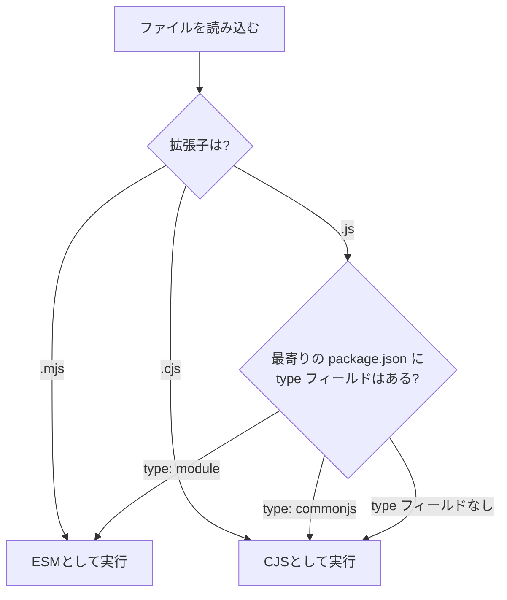

## はじめに

ある日、あなたは `chalk` をアップデートした。v4からv5へ。コードは何も変えていない。しかし実行した瞬間、こんなエラーが出る。

```
Error [ERR_REQUIRE_ESM]: require() of ES Module /path/to/node_modules/chalk/source/index.js not supported.
Instead change the require of index.js in /path/to/your/app.js to a dynamic import() which is available in all CommonJS modules.
```

「`require` がサポートされていない？ 昨日まで動いていたのに？」

これは `chalk` v5がCommonJS（CJS）を廃止し、ES Modules（ESM）専用パッケージになったことが原因だ。同じ現象は `node-fetch` v3、`got` v12、`execa` v6など、主要なnpmパッケージで次々と起きている。

この記事では、CJSとESMの違いを正確に理解し、`ERR_REQUIRE_ESM` に二度と悩まないための知識を整理する。**設定方法（HOW）と使い分け（WHAT）** にフォーカスし、すぐに手を動かせる情報を提供する。

## CommonJS（CJS）の仕組み

CommonJSはNode.jsが誕生した2009年から使われているモジュールシステムだ。ブラウザにモジュールの仕組みがなかった時代に、サーバーサイドJavaScriptのためにNode.jsが独自に実装した。

### 基本構文

```js
// math.js（エクスポート側）
function add(a, b) {
  return a + b;
}
module.exports = { add };

// app.js（インポート側）
const { add } = require('./math');
console.log(add(1, 2)); // 3
```

### CJSの特徴

**1. 同期読み込み**

`require()` はファイルを同期的に読み込む。呼び出した行でファイルI/Oが完了するまでブロックする。サーバーサイドではファイルがローカルディスク上にあるため問題になりにくいが、この設計がブラウザでの利用を困難にした。

**2. 動的読み込みが可能**

`require()` は単なる関数呼び出しなので、条件分岐の中でも使える。

```js
if (process.platform === 'win32') {
  const winUtils = require('./win-utils');
}
```

**3. ファイル拡張子の省略が可能**

```js
require('./math');      // math.js, math/index.js の順に探索
require('express');     // node_modules/express を探索
```

Node.jsは `.js` → `.json` → `.node` の順に拡張子を試す。`./math` と書けば `./math.js` を見つけてくれる。

**4. `module.exports` と `exports` の関係**

```js
// これは動く
module.exports = { add };

// これも動く（module.exports のプロパティに追加）
exports.add = function(a, b) { return a + b; };

// これは動かない（exports の参照先を変えているだけ）
exports = { add };
```

`exports` は `module.exports` への参照に過ぎない。参照先を丸ごと差し替えるとモジュールのエクスポートに反映されない。

## ES Modules（ESM）の仕組み

ES ModulesはECMAScript 2015（ES6）で言語仕様として標準化されたモジュールシステムだ。ブラウザとNode.jsの両方で動作する、JavaScriptの「公式」モジュール形式である。

### 基本構文

```js
// math.mjs（エクスポート側）
export function add(a, b) {
  return a + b;
}

// app.mjs（インポート側）
import { add } from './math.mjs';
console.log(add(1, 2)); // 3
```

### ESMの特徴

**1. 非同期読み込み**

ESMはモジュールの解析・リンク・評価を非同期で行う。これによりブラウザでの `<script type="module">` によるネットワーク経由の読み込みが可能になった。

**2. 静的解析が可能**

`import` / `export` は文（statement）であり、ファイルのトップレベルにしか書けない。

```js
// これはSyntaxError
if (condition) {
  import { add } from './math.mjs';
}

// 動的importは可能（ただしPromiseを返す）
const { add } = await import('./math.mjs');
```

トップレベルに限定されることで、コードを実行しなくても依存関係を静的に把握できる。Tree Shakingが可能になるのはこの性質のおかげだ。

**3. strict mode強制**

ESMファイルは常にstrict modeで実行される。`"use strict"` の記述は不要だ。

```js
// ESMでは自動的にstrict mode
// undefined変数への代入はReferenceError
undeclaredVar = 42; // ReferenceError
```

**4. ファイル拡張子の省略は不可**

```js
// CJS: OK
require('./math');

// ESM: NG（拡張子が必須）
import { add } from './math';     // ERR_MODULE_NOT_FOUND
import { add } from './math.mjs'; // OK
```

**5. `__filename` / `__dirname` は使えない**

ESMでは `__filename` と `__dirname` がグローバルに存在しない。代替手段を使う。

```js
// ESMでの代替
import { fileURLToPath } from 'node:url';
import { dirname } from 'node:path';

const __filename = fileURLToPath(import.meta.url);
const __dirname = dirname(__filename);
```

### CJSとESMの比較表

| 項目 | CommonJS | ES Modules |
|------|----------|------------|
| 構文 | `require()` / `module.exports` | `import` / `export` |
| 読み込み | 同期 | 非同期 |
| 静的解析 | 不可（動的に`require`可能） | 可能（Tree Shaking対応） |
| strict mode | 任意 | 強制 |
| 拡張子省略 | 可能 | 不可 |
| `__filename` | あり | なし（`import.meta.url`で代替） |
| Top-level await | 不可 | 可能 |

## Node.jsのモジュール判定ロジック

Node.jsはファイルをCJSとESMのどちらとして実行するかを、以下のロジックで決定する。

### 判定フローチャート



### 判定ルールの詳細

**ルール1: 拡張子による強制**

| 拡張子 | モジュール種別 | 備考 |
|--------|--------------|------|
| `.mjs` | ESM | `package.json` の設定に関係なく常にESM |
| `.cjs` | CJS | `package.json` の設定に関係なく常にCJS |
| `.js`  | 設定依存 | `package.json` の `type` フィールドで決まる |

**ルール2: `package.json` の `type` フィールド**

```json
{
  "name": "my-app",
  "type": "module"
}
```

- `"type": "module"` → `.js` ファイルをESMとして扱う
- `"type": "commonjs"` → `.js` ファイルをCJSとして扱う（デフォルトと同じ）
- `type` フィールドなし → CJSとして扱う

**ルール3: 最寄りの `package.json` が適用される**

Node.jsはファイルのディレクトリから上位に向かって `package.json` を探索し、最初に見つかったものの `type` フィールドを使う。

```
project/
├── package.json          # type: "module"
├── src/
│   └── app.js            # → ESMとして実行
└── scripts/
    ├── package.json      # type: "commonjs"
    └── build.js          # → CJSとして実行
```

**ルール4: `type: "module"` 設定時に `.cjs` が必要になるケース**

プロジェクト全体を `"type": "module"` にすると、すべての `.js` ファイルがESMとして扱われる。しかし、設定ファイルの中にはCJSが必要なものがある。

```
project/
├── package.json          # type: "module"
├── src/
│   └── index.js          # ESMとして実行
├── jest.config.cjs       # .cjs にしないとrequire/module.exportsが使えない
└── .eslintrc.cjs         # 同上
```

`jest.config.js` や `.eslintrc.js` が `module.exports = { ... }` を使っている場合、`"type": "module"` の環境では `.cjs` にリネームする必要がある。

## ESMからCJSをimportする / CJSからESMをrequireする

CJSとESMの相互運用は、多くの開発者がつまずくポイントだ。

### ESMからCJSをimportする（可能）

ESMからCJSモジュールを `import` することは**可能**だ。

```js
// app.mjs（ESM）
import lodash from 'lodash'; // lodashはCJSパッケージ → OK
```

ただし、CJSの `module.exports` はESMの `default export` にマッピングされる。Named exportはサポートされない場合がある。

```js
// CJS側: module.exports = { shuffle, random }
// ESM側:
import lodash from 'lodash';          // OK: default importで受ける
const { shuffle } = lodash;           // OK: 分割代入で取り出す

import { shuffle } from 'lodash';     // 動く場合と動かない場合がある
```

Node.jsはCJSモジュールの静的解析を試み、Named exportを推測する。しかし、`module.exports` が動的に構築されている場合は推測に失敗する。確実なのは `default import` で受けてから分割代入する方法だ。

### CJSからESMをrequireする（原則不可）

CJSからESMを `require()` することは**原則として不可能**だ。

```js
// app.js（CJS）
const chalk = require('chalk'); // chalk v5はESM → ERR_REQUIRE_ESM
```

これが冒頭の `ERR_REQUIRE_ESM` エラーの正体だ。

ESMは非同期で読み込まれるため、同期関数である `require()` では読み込めない。これは技術的な制約であり、CJS/ESMの設計上の根本的な非対称性だ。

**回避策: dynamic import()を使う**

```js
// app.js（CJS）
async function main() {
  const chalk = await import('chalk');
  console.log(chalk.default.red('Hello'));
}
main();
```

`import()` は動的インポートで、CJSの中でも使える。ただしPromiseを返すため、`await` が必要になる。Top-level awaitはCJSでは使えないので、async関数で包む必要がある。

**回避策: `createRequire` でCJS用のrequireを作る（ESM側からCJSを読む場合）**

```js
// app.mjs（ESM）
import { createRequire } from 'node:module';
const require = createRequire(import.meta.url);

// CJSモジュールをrequire()で読み込める
const config = require('./config.json');
```

`createRequire` はESMの中にCJSの `require` 関数を持ち込むユーティリティだ。JSONファイルの読み込み（ESMでは `import` でJSONを読めない場合がある）に特に有用だ。

:::message
CJSとESMの相互運用は、Node.jsのモジュール解決アルゴリズムの深い理解が必要です。なぜESMからCJSはimportできるのにCJSからESMはrequireできないのか、その設計上の理由は、書籍 [パッケージマネージャ from scratch](https://zenn.dev/yuichi_ai/books/package-manager-from-scratch) の第3章と第7章で図解付きで解説しています。
:::

## デュアルパッケージ（CJS/ESM両対応）

ライブラリ作者にとって、CJSユーザーとESMユーザーの両方をサポートすることは重要だ。`package.json` の `exports` フィールドでこれを実現する。

### `exports` フィールドでの条件分岐

```json
{
  "name": "my-library",
  "type": "module",
  "exports": {
    ".": {
      "import": "./dist/index.mjs",
      "require": "./dist/index.cjs"
    }
  }
}
```

- `import` で読み込まれた場合 → `./dist/index.mjs`（ESM）が使われる
- `require()` で読み込まれた場合 → `./dist/index.cjs`（CJS）が使われる

### デュアルパッケージハザード

デュアルパッケージには「同一パッケージが2回読み込まれる」という問題がある。

```
アプリケーション
├── CJS依存 → require('my-library') → dist/index.cjs を読み込み
└── ESM依存 → import 'my-library' → dist/index.mjs を読み込み
```

CJS版とESM版は別ファイルなので、Node.jsはこれらを**別のモジュール**として扱う。その結果、以下の問題が発生する。

1. **状態の二重化**: パッケージ内のシングルトンやキャッシュが2つ存在する
2. **`instanceof` の失敗**: CJS版で作ったインスタンスがESM版のクラスの `instanceof` チェックに失敗する
3. **メモリの浪費**: 同じコードが2回メモリに載る

### ハザードの回避策

**方法1: CJS版をESM版のラッパーにする**

```js
// dist/index.cjs
module.exports = require('./index-impl.cjs');

// dist/index.mjs
// 実際のロジックは共通のCJSファイルから読み込む
import cjs from './index-impl.cjs';
export const { feature1, feature2 } = cjs;
```

状態を1箇所（CJS側）に集約することで、二重化を防ぐ。

**方法2: ステートレスなパッケージにする**

パッケージにグローバル状態を持たせなければ、2回読み込まれても問題はない。Pure functionだけを提供するユーティリティライブラリなら、ハザードの影響を受けない。

## 2026年の推奨設定

### 新規プロジェクトはESMを推奨

2026年現在、新規プロジェクトでは `"type": "module"` を設定してESMをデフォルトにすることを推奨する。

```json
{
  "name": "my-project",
  "version": "1.0.0",
  "type": "module",
  "engines": {
    "node": ">=22"
  }
}
```

推奨理由は以下の通りだ。

1. **ECMAScript標準**: ESMはJavaScript言語仕様の一部であり、CJSはNode.js独自の仕組みだ
2. **エコシステムの移行**: 主要パッケージ（chalk, node-fetch, got, execa等）がESM専用に移行済み
3. **ツールチェーンの対応**: Vite, Vitest, SvelteKit等の新世代ツールはESMファーストで設計されている
4. **Tree Shaking**: ESMの静的解析によりバンドルサイズを削減できる
5. **Top-level await**: ESMでのみ使える `await` はasync/awaitパターンを簡潔にする

### 移行チェックリスト

```bash
# 1. package.json に type: "module" を追加
# 2. require() → import に書き換え
# 3. module.exports → export に書き換え
# 4. __filename / __dirname を import.meta.url に書き換え
# 5. 拡張子を省略している import に .js を追加
# 6. CJSが必要な設定ファイルを .cjs にリネーム
```

### `tsconfig.json` との連携（概要）

TypeScriptを使っている場合、`tsconfig.json` のモジュール関連設定もESMに合わせる必要がある。詳細は後述の「TypeScriptとモジュール」セクションで解説する。

## `ERR_REQUIRE_ESM` の対処法

### エラーの発生パターン

`ERR_REQUIRE_ESM` が発生する典型的なパターンは以下の通りだ。

**パターン1: pure ESMパッケージのアップデート**

```bash
npm install chalk@latest  # v5 (pure ESM)
```

```js
// app.js（CJSプロジェクト）
const chalk = require('chalk');
// Error [ERR_REQUIRE_ESM]: require() of ES Module
// .../node_modules/chalk/source/index.js not supported.
```

pure ESMに移行した代表的パッケージ:

| パッケージ | CJS最終バージョン | ESM専用バージョン |
|-----------|------------------|-----------------|
| chalk | v4.1.2 | v5.0.0〜 |
| node-fetch | v2.7.0 | v3.0.0〜 |
| got | v11.8.6 | v12.0.0〜 |
| execa | v5.1.1 | v6.0.0〜 |
| p-queue | v6.6.2 | v7.0.0〜 |

**パターン2: ESM専用パッケージの新規導入**

新しいパッケージを導入したら最初からESM専用だった、というケースも増えている。

### 3つの解決方法

**解決方法1: プロジェクトをESMに移行する（推奨）**

最も根本的な解決策。プロジェクト全体をESMに移行する。

```json
// package.json
{
  "type": "module"
}
```

```js
// before（CJS）
const chalk = require('chalk');
const { readFile } = require('fs/promises');

// after（ESM）
import chalk from 'chalk';
import { readFile } from 'node:fs/promises';
```

新規プロジェクトや、依存関係が少ないプロジェクトではこれが最善だ。

**解決方法2: CJSのパッケージバージョンに固定する**

大規模なCJSプロジェクトですぐにESM移行できない場合、CJS対応の最終バージョンを使い続ける。

```json
{
  "dependencies": {
    "chalk": "^4.1.2",
    "node-fetch": "^2.7.0"
  }
}
```

ただし、旧バージョンはセキュリティアップデートを受けられない場合がある。長期的な解決策にはならない。

**解決方法3: dynamic import()で読み込む**

CJSプロジェクトのまま、ESMパッケージだけ `import()` で読み込む。

```js
// app.js（CJSプロジェクトのまま）
async function main() {
  const { default: chalk } = await import('chalk');
  const { default: fetch } = await import('node-fetch');

  console.log(chalk.green('Success'));
  const res = await fetch('https://example.com');
}
main();
```

この方法はプロジェクト全体の書き換えが不要だが、`async` / `await` の伝播が必要になる。

### Node.js 22 LTS: `--experimental-require-module` の安定化

Node.js 22 LTS（2024年10月リリース）で、`--experimental-require-module` の実装がstableになった。ただし、デフォルトでは有効化されておらず、フラグ指定が必要だ。このフラグを有効にすると、CJSからESMを `require()` で読み込めるようになる。

```bash
# Node.js 22以降
node --experimental-require-module app.js
```

```js
// app.js（CJS）
const chalk = require('chalk'); // ESMパッケージでもOK
```

ただし、以下の制約がある。

- Top-level awaitを含むESMモジュールは `require()` できない
- 読み込まれたESMモジュールは同期的に評価される（ESMの非同期性は失われる）
- 2026年3月時点では、フラグなしでのデフォルト有効化はまだ議論中

Node.js 23（非LTS、Current系）以降ではフラグなしで利用可能になっている。本番環境ではLTSの使用が推奨されるため、Node.js 22 LTSではフラグ付き、次のLTS（Node.js 24）以降でフラグなしになる見込みだ。既存のCJSプロジェクトでESMパッケージを使う最も簡単な方法として、今後の標準的な解決策になる。

## TypeScriptとモジュール

TypeScriptを使うプロジェクトでは、`tsconfig.json` のモジュール関連設定がNode.jsのモジュールシステムと整合する必要がある。

### `moduleResolution` の選択

TypeScript 4.7以降、Node.jsのESM対応に合わせた `moduleResolution` オプションが追加された。

| 設定値 | 用途 | 特徴 |
|--------|------|------|
| `"node16"` | Node.js直接実行 | `.js` 拡張子必須、CJS/ESM判定あり |
| `"nodenext"` | Node.js直接実行（最新追従） | `node16` と同様、Node.js最新仕様に追従 |
| `"bundler"` | Vite/webpack等バンドラ使用時 | 拡張子省略可能、ESM構文でCJS出力可能 |

### Node.js直接実行の場合（`node16` / `nodenext`）

```json
{
  "compilerOptions": {
    "module": "node16",
    "moduleResolution": "node16",
    "target": "es2022",
    "outDir": "./dist"
  }
}
```

この設定では、TypeScriptはNode.jsのモジュール判定ロジックをそのまま再現する。

- `package.json` の `"type": "module"` に従い `.ts` ファイルをESMとして扱う
- `import` 文にはファイル拡張子が必要（`.js` で書く。`.ts` ではない）

```ts
// src/math.ts をインポートする場合
import { add } from './math.js'; // .js と書く（出力後のファイル名）
```

### バンドラ使用時（`bundler`）

```json
{
  "compilerOptions": {
    "module": "esnext",
    "moduleResolution": "bundler",
    "target": "es2022"
  }
}
```

Vite、webpack、esbuild等のバンドラを使う場合は `"bundler"` を指定する。バンドラが独自のモジュール解決を行うため、Node.jsの厳密なルールに従う必要がない。拡張子の省略やindex.tsの自動解決が可能だ。

### `.cts` / `.mts` の役割

TypeScriptにも `.cjs` / `.mjs` に対応する拡張子がある。

| TypeScript拡張子 | 出力される拡張子 | モジュール種別 |
|-----------------|----------------|--------------|
| `.ts` | `.js` | `package.json` の `type` に従う |
| `.mts` | `.mjs` | 常にESM |
| `.cts` | `.cjs` | 常にCJS |

```
src/
├── index.ts       # package.jsonのtypeに従う
├── worker.mts     # 常にESMとしてコンパイル → worker.mjs
└── config.cts     # 常にCJSとしてコンパイル → config.cjs
```

プロジェクト全体が `"type": "module"` でも、特定のファイルだけCJSにしたい場合に `.cts` を使う。

### TypeScript + ESMの推奨設定

2026年現在、Node.js直接実行のプロジェクトには以下の設定を推奨する。

```json
// package.json
{
  "type": "module",
  "engines": { "node": ">=22" }
}
```

```json
// tsconfig.json
{
  "compilerOptions": {
    "module": "node16",
    "moduleResolution": "node16",
    "target": "es2022",
    "strict": true,
    "outDir": "./dist",
    "declaration": true
  },
  "include": ["src"]
}
```

## まとめ

| 観点 | CommonJS | ES Modules |
|------|----------|------------|
| 標準 | Node.js独自 | ECMAScript標準 |
| 構文 | `require` / `module.exports` | `import` / `export` |
| 読み込み | 同期 | 非同期 |
| 静的解析 | 不可 | 可能 |
| 拡張子 | `.cjs` で強制 | `.mjs` で強制 |
| 新規プロジェクト | 非推奨 | 推奨 |
| エコシステム | レガシー（安定） | 移行完了が進行中 |

**判断フロー:**

- **新規プロジェクト** → `"type": "module"` でESM
- **既存CJSプロジェクト** → 段階的にESMへ移行。まずは `--experimental-require-module`（Node.js 22）で凌ぐ
- **ライブラリ作者** → `exports` フィールドでデュアルパッケージ対応
- **`ERR_REQUIRE_ESM`** → 3つの解決方法から状況に合ったものを選択

CJSとESMの使い分けは以上だ。

この記事では「どう設定するか（HOW）」「何が違うのか（WHAT）」を解説した。しかし、より深い疑問が残るかもしれない。

- 「Node.jsのモジュール解決アルゴリズムは内部でどう動いているのか」
- 「npm / pnpm / Yarn はモジュールをどのように配置し、解決しているのか」
- 「なぜ `node_modules` はフラット化されたのか、そしてなぜpnpmはそれを元に戻したのか」

これらの「なぜこう設計されているのか（WHY）」を体系的に理解するには、パッケージマネージャの内部構造からモジュール解決までを通して学ぶ必要がある。

拙著 **[パッケージマネージャ from scratch](https://zenn.dev/yuichi_ai/books/package-manager-from-scratch)** では、モジュール解決の仕組み、各パッケージマネージャの設計思想、`node_modules` の構造的問題とその解決策を図解付きで解説している。第1章から第3章は無料公開しているので、まずはそちらからお試しください。

---
