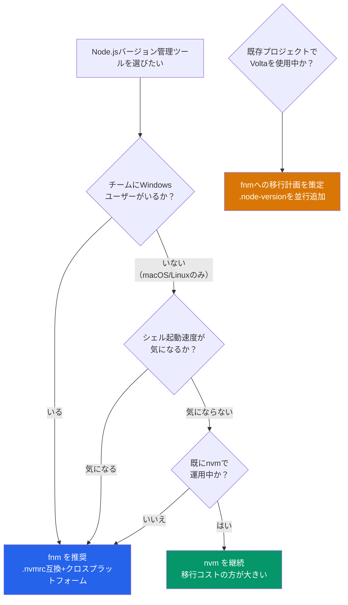

## はじめに：なぜNode.jsバージョン管理ツールが必要か

Node.jsで複数のプロジェクトを開発していると、プロジェクトごとに必要なNode.jsのバージョンが異なる場面に必ず遭遇する。

- プロジェクトAはNode.js 18 LTSで安定運用中
- プロジェクトBはNode.js 22の新機能（`--experimental-strip-types`など）を使っている
- CI/CDではローカルと同じバージョンで動作させ、ビルドの再現性を担保したい

システムにグローバルインストールしたNode.jsを手動で入れ替えるのは現実的ではない。アンインストールと再インストールを繰り返す手間だけでなく、チームメンバー間で「手元のNode.jsバージョンが違っていてビルドが通らない」というトラブルの原因にもなる。

バージョン管理ツールを使えば、コマンド一つでNode.jsのバージョンを切り替えられる。さらに設定ファイルをリポジトリにコミットしておけば、プロジェクトディレクトリに入るだけで正しいバージョンに自動切り替えされる環境も構築できる。

本記事では、2026年現在の主要な3つのバージョン管理ツール **nvm**、**fnm**、**Volta** を徹底比較する。インストール方法から基本操作、速度比較、corepack連携、CI/CD活用、そしてプロジェクトに最適なツールの選び方まで網羅的に解説する。

## 3ツールの概要

### nvm（Node Version Manager）

| 項目 | 内容 |
|------|------|
| リポジトリ | [nvm-sh/nvm](https://github.com/nvm-sh/nvm) |
| 最新バージョン | v0.40.4（2026年1月リリース） |
| 実装言語 | POSIX shell（bashスクリプト） |
| 対応OS | macOS / Linux |

最も歴史が長く、圧倒的に普及しているNode.jsバージョン管理ツール。「Node.js バージョン管理」で検索するとほぼ全ての記事がnvmを紹介しており、情報量は群を抜いている。POSIX shell準拠のスクリプトで実装されているため、追加のバイナリインストールなしで動作する。

ただし、シェルスクリプト実装であるがゆえに**シェル起動時の読み込みが遅い**という明確な弱点がある。また、**Windowsにはネイティブ対応していない**。Windows向けの`nvm-windows`は別の開発者がGoで書いた全く別のプロジェクトであり、コマンド体系や挙動が異なる点に注意が必要だ。

### fnm（Fast Node Manager）

| 項目 | 内容 |
|------|------|
| リポジトリ | [Schniz/fnm](https://github.com/Schniz/fnm) |
| 最新バージョン | v1.39.0 |
| 実装言語 | Rust |
| 対応OS | macOS / Linux / Windows |

名前の通り「Fast」を売りにしたバージョン管理ツール。Rustでコンパイルされたネイティブバイナリとして動作するため、nvmと比較してシェル起動時間が20〜50倍高速になる。Node.js公式ダウンロードページでもデフォルトのインストール方法として紹介されている。

`.nvmrc`ファイルとの互換性がある点もポイントで、nvmからの移行が容易。v1.38.0からは`package.json`の`engines`フィールドを参照する`--resolve-engines`がデフォルト有効化され、プロジェクトの要求するNode.jsバージョンを自動解決できるようになった。v1.39.0ではシェル起動時のパフォーマンスがさらに改善されている。

### Volta

| 項目 | 内容 |
|------|------|
| リポジトリ | [volta-cli/volta](https://github.com/volta-cli/volta) |
| 最新バージョン | v2.0.2 |
| 実装言語 | Rust |
| 対応OS | macOS / Linux / Windows |

`package.json`にNode.js・npm・yarnのバージョンを直接ピン留めできる設計が特徴のツール。設定ファイルを別途用意する必要がなく、チーム全員が同じツールチェーンを使うことを重視したアプローチを取っている。

:::message alert
**2025年11月にメンテナンス終了が発表された。** メンテナーは後継として [mise](https://mise.jdx.dev/) への移行を推奨している（[GitHub Issue #2080](https://github.com/volta-cli/volta/issues/2080)）。既存の機能は当面動作するが、新しいOSリリースやエコシステムの変更に対するバグ修正は行われない。本記事では比較のためにVoltaを含めるが、新規プロジェクトへの採用は慎重に判断してほしい。
:::

## インストール方法

### nvmのインストール（macOS / Linux）

nvmはmacOSとLinuxに対応している。Windowsにはネイティブ非対応（nvm-windowsは別プロジェクト）。

```bash
# curlでインストール
curl -o- https://raw.githubusercontent.com/nvm-sh/nvm/v0.40.4/install.sh | bash

# wgetの場合
wget -qO- https://raw.githubusercontent.com/nvm-sh/nvm/v0.40.4/install.sh | bash
```

インストールスクリプトにより、シェル設定ファイル（`~/.bashrc`や`~/.zshrc`）に以下が自動追加される。

```bash
export NVM_DIR="$HOME/.nvm"
[ -s "$NVM_DIR/nvm.sh" ] && \. "$NVM_DIR/nvm.sh"
[ -s "$NVM_DIR/bash_completion" ] && \. "$NVM_DIR/bash_completion"
```

```bash
# シェルを再起動するか設定を再読み込み
source ~/.zshrc

# インストール確認
nvm --version
# 0.40.4
```

### fnmのインストール（macOS / Linux / Windows）

**macOS（Homebrew）:**

```bash
brew install fnm
```

**macOS / Linux（インストールスクリプト）:**

```bash
curl -fsSL https://fnm.vercel.app/install | bash
```

**Windows（winget）:**

```powershell
winget install Schniz.fnm
```

**Windows（Chocolatey）:**

```powershell
choco install fnm
```

インストール後、シェル設定ファイルに初期化コードを追加する。`--use-on-cd`オプションを付けることで、ディレクトリ移動時に`.nvmrc`や`.node-version`を検出してバージョンを自動切り替えできる。

```bash
# ~/.bashrc または ~/.zshrc に追加
eval "$(fnm env --use-on-cd)"
```

```powershell
# PowerShell（$PROFILE に追加）
fnm env --use-on-cd | Out-String | Invoke-Expression
```

```bash
# インストール確認
fnm --version
# fnm 1.39.0
```

### Voltaのインストール（macOS / Linux / Windows）

:::message
Voltaは2025年11月にメンテナンス終了が発表されている。新規導入は非推奨。既存プロジェクトで使用中の場合の参考として掲載する。
:::

**macOS / Linux:**

```bash
curl https://get.volta.sh | bash
```

**Windows（winget）:**

```powershell
winget install Volta.Volta
```

**Windows（インストーラー）:**

公式サイト（https://volta.sh）からインストーラーをダウンロードして実行する。

```bash
# インストール確認
volta --version
# 2.0.2
```

## 基本的な使い方

### Node.jsバージョンのインストール

```bash
# --- nvm ---
nvm install 22          # Node.js 22系の最新をインストール
nvm install --lts       # 最新LTSをインストール
nvm install 22.14.0     # 特定のパッチバージョンを指定

# --- fnm ---
fnm install 22          # Node.js 22系の最新をインストール
fnm install --lts       # 最新LTSをインストール
fnm install 22.14.0     # 特定のパッチバージョンを指定

# --- Volta ---
volta install node@22        # Node.js 22系の最新をインストール
volta install node@lts       # 最新LTSをインストール
volta install node@22.14.0   # 特定のパッチバージョンを指定
```

### バージョンの切り替え

```bash
# --- nvm ---
nvm use 22      # 現在のシェルセッションでNode.js 22に切り替え
nvm use 20      # Node.js 20に切り替え

# --- fnm ---
fnm use 22      # 現在のシェルセッションでNode.js 22に切り替え
fnm use 20      # Node.js 20に切り替え

# --- Volta ---
volta pin node@22   # package.jsonにピン留め（プロジェクト単位）
```

nvmとfnmはシェルセッション単位で一時的にバージョンを切り替える。Voltaは`package.json`の`volta`フィールドにバージョンを記録し、プロジェクト単位で管理するアプローチを取る。

### デフォルトバージョンの設定

新しいシェルを開いたときに使われるデフォルトバージョンを設定する。

```bash
# --- nvm ---
nvm alias default 22

# --- fnm ---
fnm default 22

# --- Volta ---
volta install node@22   # グローバルデフォルトとして設定される
```

### プロジェクトごとのバージョン固定

各ツールにはプロジェクトディレクトリに入った際に自動的にバージョンを切り替える仕組みがある。

**nvm / fnm共通：`.nvmrc`ファイル**

```bash
# プロジェクトルートに.nvmrcを作成
echo "22.14.0" > .nvmrc

# nvm: .nvmrcのバージョンに切り替え
nvm use
# Found '/path/to/project/.nvmrc' with version <22.14.0>

# fnm: --use-on-cd設定済みなら、cdするだけで自動切り替え
cd ~/my-project
# Using Node v22.14.0
```

**fnm：`.node-version`ファイル（fnm推奨形式）**

```bash
# .node-versionファイルを作成
echo "22.14.0" > .node-version
```

fnmは`.nvmrc`と`.node-version`の**両方**をサポートしている。チーム内にnvmユーザーとfnmユーザーが混在していても、どちらのファイルを置いても動作する。

**Volta：`package.json`の`volta`フィールド**

```bash
volta pin node@22.14.0
```

このコマンドで`package.json`に以下が追加される。

```json
{
  "volta": {
    "node": "22.14.0"
  }
}
```

**自動切り替え設定の比較:**

nvmは自動切り替えに対応するためにシェルの設定ファイルにフックスクリプトを手動追加する必要がある。fnmは`--use-on-cd`オプション付きで初期化するだけで有効になる。Voltaはインストールするだけで自動的にプロジェクトのバージョンに切り替わる。

```bash
# nvm: 自動切り替えにはzshフックを手動追加する必要がある
# ~/.zshrc に以下を追加
autoload -U add-zsh-hook
load-nvmrc() {
  local nvmrc_path="$(nvm_find_nvmrc)"
  if [ -n "$nvmrc_path" ]; then
    local nvmrc_node_version=$(nvm version "$(cat "${nvmrc_path}")")
    if [ "$nvmrc_node_version" = "N/A" ]; then
      nvm install
    elif [ "$nvmrc_node_version" != "$(nvm version)" ]; then
      nvm use
    fi
  elif [ -n "$(PWD=$OLDPWD nvm_find_nvmrc)" ] && [ "$(nvm version)" != "$(nvm version default)" ]; then
    echo "Reverting to nvm default version"
    nvm use default
  fi
}
add-zsh-hook chpwd load-nvmrc
load-nvmrc

# fnm: --use-on-cd で初期化していれば設定済み
eval "$(fnm env --use-on-cd)"

# Volta: 追加設定不要（shimが自動で解決する）
```

## 速度比較：なぜnvmは遅いのか

バージョン管理ツールの速度は日常の開発体験に直結する。シェルの起動時間とバージョン切り替え時間の両方を比較する。

### シェル起動時間

| ツール | 起動時間の目安 | 方式 |
|--------|---------------|------|
| nvm | 200〜500ms | シェルスクリプトを毎回パース・実行 |
| fnm | 3〜10ms | コンパイル済みバイナリの実行のみ |
| Volta | 3〜10ms | shimバイナリの登録のみ |

nvmが遅い原因は明確だ。`nvm.sh`は約5,000行のシェルスクリプトであり、シェルが起動するたびにこのスクリプト全体をパース・実行する必要がある。一方、fnmとVoltaはRustでコンパイルされたネイティブバイナリなので、起動時のオーバーヘッドが桁違いに小さい。

### バージョン切り替え時間

| ツール | 切り替え時間の目安 | 方式 |
|--------|-------------------|------|
| nvm | 200〜800ms | シェル関数として`nvm use`を実行 |
| fnm | 1〜5ms | シンボリックリンクの切り替え |
| Volta | 1〜5ms | shimが実行時にバージョンを解決 |

### 1日あたりの累積影響

1日に50回ターミナルを開き、30回バージョンを切り替える開発者を想定した場合の目安。

| ツール | シェル起動（50回） | 切り替え（30回） | 1日の累計 |
|--------|-------------------|-----------------|-----------|
| nvm | 約15秒 | 約12秒 | **約27秒** |
| fnm | 約0.3秒 | 約0.1秒 | **約0.4秒** |
| Volta | 約0.3秒 | 約0.1秒 | **約0.4秒** |

27秒という数字は一見小さいが、VSCodeの統合ターミナルを複数タブ開く開発スタイルでは「ターミナルを開くたびにワンテンポ待たされる」体感になり、地味にストレスの原因になる。

### nvmが遅くても普及し続けている理由

速度だけならfnmが圧倒的に優れている。しかしnvmが依然として広く使われているのには理由がある。

1. **圧倒的な情報量**: 日本語・英語問わず、検索すればほぼ確実にnvm向けの解説が見つかる
2. **外部バイナリ不要**: シェルスクリプトだけで動作し、Rustのツールチェーンもバイナリのダウンロードも不要
3. **10年超の実績**: エッジケースのバグが長年にわたって潰されており、安定している
4. **チームの慣性**: 既にnvmで運用しているチームが移行コストをかける動機が薄い

速度に不満がなければnvmの継続利用は合理的だ。不満があるならfnmへの移行を検討する価値がある。

:::message
この記事ではバージョン管理ツールの使い方と選び方を解説しています。Node.jsのモジュール解決の仕組みや、パッケージマネージャがバージョン管理とどう連携するかといった設計レベルの話は、書籍 [パッケージマネージャ from scratch](https://zenn.dev/yuichi_ai/books/package-manager-from-scratch) の第10章で詳しく解説しています。
:::

## corepackとの連携

### corepackの役割

corepackはNode.jsに同梱されていた「パッケージマネージャのバージョン管理ツール」だ。`package.json`の`packageManager`フィールドを読み取り、指定されたバージョンのnpm・yarn・pnpmを自動インストール・使用する仕組みを提供する。

つまり、バージョン管理ツール（nvm/fnm/Volta）が**Node.js本体**のバージョンを管理し、corepackが**パッケージマネージャ（npm/yarn/pnpm）**のバージョンを管理する、という**補完関係**にある。

### corepackの有効化手順

:::message alert
**Node.js 25以降ではcorepackがバンドルから削除された。** Node.js 24 LTS以前では引き続きバンドルされている。Node.js 25以降で使う場合は別途インストールが必要。
:::

```bash
# Node.js 24 LTS以前（バンドル版を有効化するだけ）
corepack enable

# Node.js 25以降（まずインストールしてから有効化）
npm install -g corepack
corepack enable
```

### packageManagerフィールドの設定

```json
{
  "name": "my-project",
  "packageManager": "pnpm@9.15.4"
}
```

corepackが有効な環境では、上記の設定があるプロジェクトで`pnpm install`を実行すると、pnpm 9.15.4が自動的にダウンロード・使用される。

### fnm + corepackの組み合わせ（推奨構成）

fnmでNode.jsバージョンを固定し、corepackでパッケージマネージャのバージョンを固定する構成が2026年現在で最もバランスが良い。

```bash
# 1. fnmでNode.jsバージョンを固定
echo "22.14.0" > .node-version

# 2. package.jsonでパッケージマネージャを固定
npm pkg set packageManager="pnpm@9.15.4"

# 3. corepackを有効化
corepack enable

# 4. 以降、pnpmは自動的にバージョン9.15.4が使われる
pnpm install
```

この構成では以下の2つのファイルでツールチェーンが完全に固定される。

- `.node-version` : Node.js本体のバージョン
- `package.json`の`packageManager` : パッケージマネージャのバージョン

### Voltaとcorepackの競合に注意

Voltaは独自にパッケージマネージャのバージョンもピン留めできる。

```json
{
  "volta": {
    "node": "22.14.0",
    "yarn": "1.22.22"
  },
  "packageManager": "yarn@1.22.22"
}
```

`volta`フィールドと`packageManager`フィールドの両方が存在する場合、Voltaのshimが先に解決するため、corepackの設定が無視されることがある。Voltaを使う場合はcorepackを無効化するか、どちらか一方に統一するのが安全だ。

## CI/CDでの活用

ローカル環境でバージョンを揃えても、CI/CDのバージョンが異なっていては再現性が担保できない。GitHub Actionsでの設定方法を、各ツールの方式別に解説する。

### setup-nodeアクション（推奨）

GitHub公式の`actions/setup-node`を使う方法。`.nvmrc`や`.node-version`ファイルからバージョンを読み取れるため、ローカルとCI/CDでバージョン定義を一元化できる。

```yaml
# .github/workflows/ci.yml
name: CI
on: [push, pull_request]

jobs:
  test:
    runs-on: ubuntu-latest
    steps:
      - uses: actions/checkout@v4

      - uses: actions/setup-node@v4
        with:
          node-version-file: '.node-version'  # .nvmrcも指定可能
          cache: 'npm'

      - run: npm ci
      - run: npm test
```

`node-version-file`パラメータは`.node-version`、`.nvmrc`、`.tool-versions`に対応している。この方法なら、バージョンアップ時に変更するファイルが`.node-version`の1箇所だけで済む。

### fnmをCI/CDで直接使う場合

ローカルとCI/CDで完全に同じツールチェーンを使いたい場合の構成。

```yaml
name: CI with fnm
on: [push, pull_request]

jobs:
  test:
    runs-on: ubuntu-latest
    steps:
      - uses: actions/checkout@v4

      - name: Install fnm
        run: curl -fsSL https://fnm.vercel.app/install | bash

      - name: Setup Node.js via fnm
        run: |
          export PATH="$HOME/.local/share/fnm:$PATH"
          eval "$(fnm env)"
          fnm install --lts
          fnm use --lts
          node --version

      - name: Install and test
        run: |
          export PATH="$HOME/.local/share/fnm:$PATH"
          eval "$(fnm env)"
          npm ci
          npm test
```

ただし、多くの場合は`actions/setup-node`で十分だ。ローカルとCI/CDでバージョンファイルを共有すれば、ツール自体が異なっていても同じNode.jsバージョンが使われる。

### Volta ActionをCI/CDで使う場合

Volta公式のGitHub Actionを使えば、`package.json`の`volta`フィールドから自動的にバージョンを読み取れる。

```yaml
name: CI with Volta
on: [push, pull_request]

jobs:
  test:
    runs-on: ubuntu-latest
    steps:
      - uses: actions/checkout@v4

      - uses: volta-cli/action@v4
        # package.jsonのvoltaフィールドから自動読み取り

      - run: node --version
      - run: npm ci
      - run: npm test
```

### pnpmやyarnを使うCI/CD構成

パッケージマネージャのバージョンもCI/CDで固定する場合は、専用のセットアップアクションを組み合わせる。

```yaml
name: CI with pnpm
on: [push, pull_request]

jobs:
  test:
    runs-on: ubuntu-latest
    steps:
      - uses: actions/checkout@v4

      # Node.jsバージョンを.node-versionから取得
      - uses: actions/setup-node@v4
        with:
          node-version-file: '.node-version'

      # pnpmをセットアップ（packageManagerフィールドからバージョン自動検出）
      - uses: pnpm/action-setup@v4

      - run: pnpm install --frozen-lockfile
      - run: pnpm test
```

### CI/CDツール選定の比較

| 観点 | setup-node | fnm直接 | Volta Action |
|------|-----------|---------|--------------|
| セットアップの容易さ | 最も簡単 | やや手間 | 簡単 |
| キャッシュ機能 | 内蔵 | 別途設定が必要 | 別途設定が必要 |
| ローカルとの一貫性 | バージョンファイルで担保 | 完全一致 | 完全一致 |
| メンテナンス状況 | GitHub公式（活発） | 活発 | 活発だが本体が終了 |

**推奨**: 大半のプロジェクトでは`actions/setup-node` + `.node-version`ファイルで十分。ツールの一致よりバージョンの一致が重要だ。

## 選定ガイド：プロジェクトに最適なツールの選び方

### 機能比較の一覧表

| 項目 | nvm | fnm | Volta |
|------|-----|-----|-------|
| シェル起動速度 | 遅い（200〜500ms） | 速い（3〜10ms） | 速い（3〜10ms） |
| Windows対応 | 非対応 | ネイティブ対応 | ネイティブ対応 |
| .nvmrc互換 | 本家 | 対応 | 非対応 |
| .node-version対応 | 非対応（要設定） | 対応 | 非対応 |
| package.jsonピン留め | 非対応 | engines参照（v1.38+） | voltaフィールド |
| パッケージマネージャ管理 | 非対応 | 非対応 | 対応 |
| 自動バージョン切り替え | 要フックスクリプト | --use-on-cdで組み込み | shimで自動 |
| 日本語情報量 | 非常に多い | 増加中 | 中程度 |
| メンテナンス状況 | 活発 | 活発 | **終了** |

### 選定フローチャート

以下のフローチャートで、あなたの状況に適したツールを判断できる。



### プロジェクト規模別の推奨

**個人開発・学習目的:**

速度を重視するならfnm、情報量を重視するならnvm。どちらも`.nvmrc`に対応しているため、後から切り替えても設定ファイルの変更は不要。

**チーム開発（5〜20名）:**

fnmを推奨。`.nvmrc`互換のためnvmユーザーもスムーズに合流でき、Windows/macOS/Linuxのクロスプラットフォーム対応が効く。

**大規模チーム・厳格なバージョン管理が必要:**

fnm + corepackの組み合わせを推奨。Node.jsバージョンは`.node-version`で、パッケージマネージャのバージョンは`packageManager`フィールドで、それぞれ固定する。

**既にVoltaを使っているプロジェクト:**

すぐに移行する必要はないが、メンテナンス終了を踏まえてfnmへの移行計画を立てておくべきだ。以下の手順で段階的に移行できる。

```bash
# 1. fnmをインストール
brew install fnm  # macOSの場合

# 2. シェル設定を変更
# ~/.zshrc に追加
eval "$(fnm env --use-on-cd)"

# 3. package.jsonのvoltaフィールドからバージョンを確認
# "volta": { "node": "22.14.0" }

# 4. .node-versionファイルを作成（Voltaと並行運用可能）
echo "22.14.0" > .node-version

# 5. fnmでNode.jsをインストール
fnm install

# 6. 動作確認
node -v
# v22.14.0

# 7. チーム全員が移行したらpackage.jsonからvoltaフィールドを削除
```

### nvmからfnmへの移行手順

nvmからfnmへの移行は特に簡単だ。`.nvmrc`ファイルはfnmがそのまま読み取るため、プロジェクトの設定ファイルを一切変更する必要がない。

```bash
# 1. fnmをインストール
brew install fnm  # macOS
# curl -fsSL https://fnm.vercel.app/install | bash  # Linux

# 2. ~/.zshrcの編集: nvmの読み込みをコメントアウトしfnmに置き換え
# 以下をコメントアウト:
# export NVM_DIR="$HOME/.nvm"
# [ -s "$NVM_DIR/nvm.sh" ] && \. "$NVM_DIR/nvm.sh"

# 以下を追加:
# eval "$(fnm env --use-on-cd)"

# 3. シェルを再起動
source ~/.zshrc

# 4. 必要なNode.jsバージョンをインストール
fnm install 22
fnm install 20

# 5. デフォルトを設定
fnm default 22

# 6. 既存の.nvmrcはそのまま使える
cat .nvmrc
# 22.14.0
fnm use   # .nvmrcを読んで自動切り替え
```

チームメンバーが個別のペースで段階的にfnmへ移行することも可能だ。nvmユーザーとfnmユーザーが混在していても、`.nvmrc`ファイルが共通で読めるため問題は起きない。

## まとめ

2026年現在、Node.jsバージョン管理ツールの推奨をまとめる。

| 状況 | 推奨ツール | 理由 |
|------|-----------|------|
| 新規プロジェクト | fnm | 高速・クロスプラットフォーム・.nvmrc互換 |
| nvm使用中で不満なし | nvm継続 | 移行コストに見合うメリットが薄い |
| nvm使用中で速度に不満 | fnmへ移行 | .nvmrcそのままで移行可能 |
| Volta使用中 | fnmへの移行計画を策定 | メンテナンス終了のため中期的に移行が必要 |
| Windows混在チーム | fnm | Windowsネイティブ対応 |

**fnmが総合的に最もバランスが良い。** nvmとの互換性、クロスプラットフォーム対応、20〜50倍の速度改善、活発なメンテナンスと、弱点が見当たらない。新規プロジェクトではfnmを第一候補にしてほしい。

ただし、nvmが「悪い選択」というわけではない。圧倒的な情報量は初学者にとって大きなメリットであり、速度が気にならなければ十分に実用的なツールだ。

### バージョン管理の「その先」へ

Node.jsバージョン管理は、パッケージマネージャの動作に直接影響する。Node.jsのバージョンが変わればバンドルされるnpmのバージョンも変わり、`package-lock.json`のlockfileVersionが異なるケースがある。corepackによるパッケージマネージャのバージョン固定は、この問題への対策の一つだ。

しかし、バージョンを固定するだけでは「なぜこの構造になっているのか」は理解できない。各パッケージマネージャがNode.jsバージョンをどう扱うか、corepackの内部動作の仕組み、そして依存解決のメカニズムまで体系的に理解したい方は、書籍 **[パッケージマネージャ from scratch](https://zenn.dev/yuichi_ai/books/package-manager-from-scratch)** を参照してほしい。第1章から第3章は無料で公開しているので、パッケージマネージャの設計原理に興味があればまず無料部分から読んでみてほしい。

---
