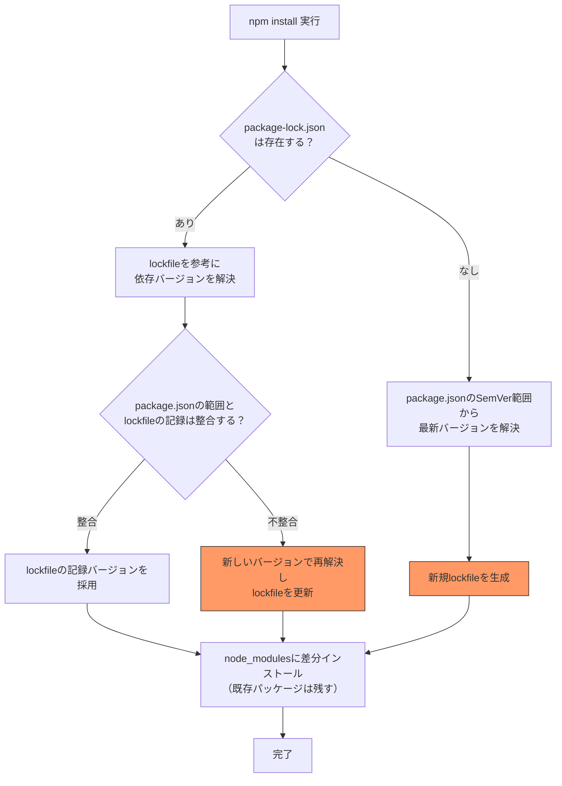
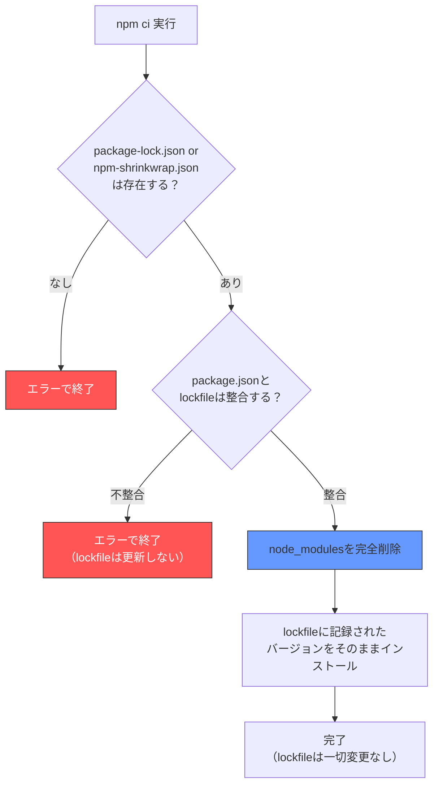
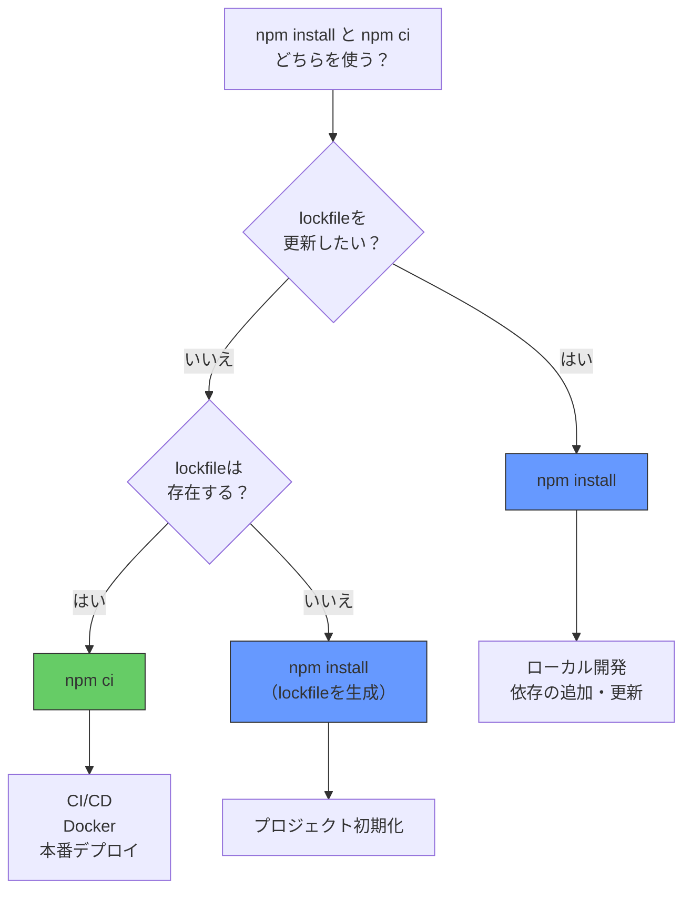

## はじめに ── CIで `npm install` を使っていませんか？

「CIパイプラインで `npm install` を使っています」という話を、コードレビューやチームの引き継ぎで意外なほどよく見かけます。動いているから問題ない、と思うかもしれません。しかし、CIで `npm install` を使うことには**再現性の欠如**という見過ごせないリスクがあります。

`npm ci` は2018年にnpm 5.7で導入されたコマンドですが、6年以上経った今でも「名前は知っているが使い分けを正確に理解していない」という開発者は少なくありません。

この記事では、`npm install` と `npm ci` の内部動作の違いを明確にし、**開発環境・CI/CD・Docker・Renovate PR**それぞれのシナリオで「どちらを使うべきか」を判断できるようにします。

:::message
この記事は「HOW（使い分け）」にフォーカスしています。「lockfileの内部構造はどうなっているのか」「integrity hashはなぜ必要なのか」といった**WHY（設計原理）**は記事末尾のリンク先で体系的に解説しています。
:::

## npm install の動作 ── 依存解決・lockfile更新・差分インストール

`npm install`（引数なし）は、以下の順序で動作します。



ポイントをまとめます。

1. **lockfileは「参考」にする** ── lockfileが存在すれば読み込むが、package.jsonのSemVer範囲と矛盾する場合はlockfileを更新する
2. **lockfileを新規作成・更新する** ── lockfileがなければ作成し、内容が古ければ更新する
3. **node_modulesは差分インストール** ── 既にインストール済みのパッケージは再ダウンロードしない

この「lockfileを更新する」という動作が、CIで問題になります。

## npm ci の動作 ── lockfile厳密一致・全削除・クリーンインストール

`npm ci` は「Clean Install」の略で、以下の順序で動作します。



ポイントをまとめます。

1. **lockfileが必須** ── `package-lock.json` または `npm-shrinkwrap.json` が存在しなければエラーで終了する。両方存在する場合は `npm-shrinkwrap.json` が優先される
2. **package.jsonとの整合性を検証** ── package.jsonに書かれた依存がlockfileに存在しない（またはSemVer範囲外）場合、エラーで終了する。lockfileは更新しない
3. **node_modulesを完全削除** ── npm 7以降、`npm ci` は既存の `node_modules` を丸ごと削除してからインストールする
4. **lockfileの記録を厳密に再現** ── バージョンの再解決を行わず、lockfileに記録されたバージョン・URL・integrity hashをそのまま使う
5. **lockfileを一切変更しない** ── 実行前後でlockfileのdiffは0

## 決定的な違い5つ

`npm install` と `npm ci` の違いを5つの観点で整理します。

### 1. lockfileの更新の有無

| | npm install | npm ci |
|:--|:--|:--|
| lockfileの扱い | 参考にする。必要に応じて**更新する** | 厳密に従う。**一切変更しない** |
| lockfileがない場合 | 新規作成する | **エラーで終了** |

`npm install` は「便利に動く」方向に倒れ、`npm ci` は「厳密に再現する」方向に倒れます。

### 2. node_modulesの削除

| | npm install | npm ci |
|:--|:--|:--|
| 既存のnode_modules | 残す（差分インストール） | **完全に削除してから**インストール |

`npm ci` がnode_modulesを削除するのは、古いバージョンのパッケージが残り続ける問題を防ぐためです。パッケージAのv1.0.0がインストール済みの状態でlockfileからAが削除された場合、`npm install` ではAがnode_modulesに残り続けますが、`npm ci` では確実に消えます。

### 3. インストール速度

| | npm install | npm ci |
|:--|:--|:--|
| 初回（node_modulesなし） | 依存解決 + インストール | インストールのみ（解決不要） |
| 2回目以降（node_modulesあり） | 差分のみで**速い** | node_modules削除 + 全インストールで**遅い** |

よく「npm ciの方が速い」と言われますが、これはCI環境のようにnode_modulesが存在しない場面での話です。ローカル開発でnode_modulesが既にある場合は、差分インストールの `npm install` の方が速くなります。

**npm 11での速度改善**: npm 11（Node.js 24同梱）では依存解決エンジン（Arborist）が最適化され、メタデータ取得の並列化やlockfile存在時のスキップ最適化により、`npm ci` のインストール速度が向上しています。CI環境での恩恵が特に大きいため、Node.jsのバージョンアップも検討に値します。

### 4. package.jsonとの整合性チェック

| | npm install | npm ci |
|:--|:--|:--|
| 不整合時の動作 | lockfileを**自動更新**して解決 | **エラーで終了**（自動修復しない） |

この違いがCIで重要になります。開発者がpackage.jsonに依存を追加した後、`npm install` を実行せずにコミットした場合を考えてください。

- `npm install` のCI: lockfileを自動更新してインストール成功 → **不整合に気づかない**
- `npm ci` のCI: エラーで終了 → **不整合を即座に検知**

### 5. workspaces対応

| | npm install | npm ci |
|:--|:--|:--|
| `--workspace` フラグ | 特定ワークスペースのみインストール可能 | 特定ワークスペースのみインストール可能 |
| 動作の違い | 指定ワークスペースの依存を差分インストール | **node_modules全体を削除**してから指定ワークスペースの依存をインストール |

npm 7以降、`npm ci` も `--workspace` フラグに対応しています。ただし、`npm ci --workspace=packages/app` と指定しても、**node_modulesディレクトリは全体が削除される**点に注意が必要です。モノレポで特定パッケージだけを高速にCIしたい場合、この挙動がボトルネックになることがあります。

## いつどちらを使うか ── シナリオ別の判断基準

### ローカル開発: `npm install`

```bash
# 新しいパッケージを追加
npm install express

# devDependenciesに追加
npm install --save-dev jest

# 引数なしで依存を同期
npm install
```

ローカル開発では依存の追加・更新が日常的に発生するため、lockfileを更新する `npm install` が適切です。

### CI/CDパイプライン: `npm ci`

```bash
# CI環境での依存インストール
npm ci
```

CIでは「lockfileに記録された依存を正確に再現する」ことが目的です。lockfileを更新する `npm install` は、ビルドごとに異なる依存ツリーを生成するリスクがあります。

### Dockerイメージビルド: `npm ci`

```dockerfile
FROM node:22-slim
WORKDIR /app
COPY package.json package-lock.json ./
RUN npm ci --omit=dev
COPY . .
CMD ["node", "src/index.js"]
```

Dockerfileでも `npm ci` を使います。理由はCIと同じで、ビルドの再現性を保証するためです。`--omit=dev` でdevDependenciesを除外すれば、イメージサイズも削減できます。

### Renovate / Dependabot のPR: `npm install`

```yaml
# renovate.json
{
  "postUpdateOptions": ["npmDedupe"]
}
```

RenovateやDependabotがpackage.jsonを更新した後は、lockfileも更新する必要があります。これらのツールは内部で `npm install`（または相当の処理）を実行してlockfileを再生成します。CIパイプライン側では、生成されたlockfileに対して `npm ci` を実行します。

### 判断フローチャート



:::message
npm ciが「lockfileとの厳密一致」を強制する仕組みは、lockfileの内部構造を理解すると腑に落ちます。lockfileの各フィールドが何を意味するか、なぜintegrity hashが必要なのかは、書籍 [パッケージマネージャ from scratch](https://zenn.dev/yuichi_ai/books/package-manager-from-scratch) の第4章で図解付きで解説しています。
:::

## pnpm / yarn の対応コマンド

`npm ci` に相当するコマンドは、pnpmとyarnにも用意されています。

| パッケージマネージャ | 通常インストール | CI用（lockfile厳密再現） |
|:--|:--|:--|
| npm | `npm install` | `npm ci` |
| pnpm | `pnpm install` | `pnpm install --frozen-lockfile` |
| Yarn Classic (v1) | `yarn install` | `yarn install --frozen-lockfile` |
| Yarn Berry (v2+) | `yarn install` | `yarn install --immutable` |

### pnpm install --frozen-lockfile

```bash
pnpm install --frozen-lockfile
```

`pnpm-lock.yaml` を一切変更せずにインストールします。lockfileとpackage.jsonが不整合の場合はエラーで終了します。pnpmはnode_modulesにシンボリックリンク + Content-addressable Storeを使うアーキテクチャのため、`npm ci` のような「全削除→再インストール」は不要で、高速に動作します。

### yarn install --immutable

```bash
yarn install --immutable
```

Yarn Berry（v2以降）では `--frozen-lockfile` に代わり `--immutable` フラグを使います。`yarn.lock` を変更しようとした場合にエラーで終了します。Yarn BerryのPnPモードを使っている場合、node_modulesは生成されないため、さらに高速です。

### CI設定での使い分け

```bash
# npm
npm ci

# pnpm（CI環境でよく使うパターン）
pnpm install --frozen-lockfile

# Yarn Classic
yarn install --frozen-lockfile

# Yarn Berry
yarn install --immutable
```

## GitHub Actions 実例 ── npm ci + キャッシュ

GitHub Actionsで `npm ci` を使う場合、`actions/setup-node` の組み込みキャッシュ機能を活用すると、npmのグローバルキャッシュ（`~/.npm`）を自動でキャッシュ・リストアできます。

### 基本構成

```yaml
name: CI
on:
  push:
    branches: [main]
  pull_request:
    branches: [main]

jobs:
  build:
    runs-on: ubuntu-latest
    steps:
      - uses: actions/checkout@v4

      - uses: actions/setup-node@v4
        with:
          node-version: 22
          cache: 'npm'

      - run: npm ci

      - run: npm test

      - run: npm run build
```

`setup-node` の `cache: 'npm'` を指定するだけで、`~/.npm` ディレクトリのキャッシュが有効になります。これにより、2回目以降の `npm ci` ではレジストリへのネットワークリクエストが削減され、インストール時間が短縮されます。

### actions/cache で手動制御する場合

`setup-node` のキャッシュでは不十分な場合（node_modules自体をキャッシュしたい場合など）は、`actions/cache` を直接使います。

```yaml
- uses: actions/cache@v4
  id: npm-cache
  with:
    path: ~/.npm
    key: ${{ runner.os }}-npm-${{ hashFiles('**/package-lock.json') }}
    restore-keys: |
      ${{ runner.os }}-npm-

- run: npm ci
```

**キャッシュキーのポイント**: `package-lock.json` のハッシュをキーに含めることで、依存が変わったときだけキャッシュが更新されます。lockfileが変わらなければキャッシュがヒットし、npmはローカルキャッシュからパッケージを取得します。

### node_modulesをキャッシュすべきか

「node_modulesをまるごとキャッシュすれば `npm ci` 自体を省略できるのでは？」と考えるかもしれません。しかし、これは推奨されません。

- `npm ci` はnode_modulesを完全削除するため、キャッシュしても毎回消される
- node_modulesにはOSやNode.jsバージョンに依存するネイティブモジュールが含まれる場合がある
- `~/.npm`（グローバルキャッシュ）をキャッシュする方が安全で、`npm ci` の再現性を損なわない

## Docker 実例 ── レイヤキャッシュを活かす構成

Dockerfileでの `npm ci` は、レイヤキャッシュの恩恵を最大化するために記述順序が重要です。

### 推奨パターン

```dockerfile
# ベースイメージ
FROM node:22-slim AS builder

WORKDIR /app

# 1. package.json と lockfile だけを先にコピー
COPY package.json package-lock.json ./

# 2. npm ci で依存をインストール（本番用のみ）
RUN npm ci --omit=dev

# 3. アプリケーションコードをコピー
COPY . .

# 実行
CMD ["node", "src/index.js"]
```

### なぜこの順序なのか

Dockerはレイヤ単位でキャッシュを保持します。`COPY package.json package-lock.json ./` のレイヤは、これら2つのファイルが変更されない限りキャッシュが使われます。つまり、**アプリケーションコードだけを変更した場合、`npm ci` のレイヤはキャッシュヒットしてスキップされます**。

もし `COPY . .` を先に書いてしまうと、ソースコードの変更でもnpm ciが再実行され、ビルド時間が大幅に増加します。

### マルチステージビルドとの組み合わせ

ビルドツール（TypeScriptコンパイラなど）が必要な場合は、マルチステージビルドを使います。

```dockerfile
# ビルドステージ
FROM node:22-slim AS builder
WORKDIR /app
COPY package.json package-lock.json ./
RUN npm ci
COPY . .
RUN npm run build

# 本番ステージ
FROM node:22-slim AS production
WORKDIR /app
COPY package.json package-lock.json ./
RUN npm ci --omit=dev
COPY --from=builder /app/dist ./dist
CMD ["node", "dist/index.js"]
```

ビルドステージではdevDependencies込みで `npm ci` を実行し、本番ステージでは `--omit=dev` で本番依存のみをインストールします。最終イメージにはdevDependenciesが含まれないため、イメージサイズを削減できます。

## よくあるトラブルと対処法

### トラブル1: `npm ci` が「package.json and package-lock.json are out of sync」で失敗する

**原因**: package.jsonに依存を追加・変更した後、`npm install` を実行せずにコミットした。

```
npm ERR! `npm ci` can only install packages when your package.json
npm ERR! and package-lock.json or npm-shrinkwrap.json are in sync.
npm ERR! Please update your lock file with `npm install` before continuing.
```

**対処法**:

```bash
# ローカルで lockfile を更新する
npm install

# 更新された lockfile をコミット
git add package-lock.json
git commit -m "fix: update package-lock.json"
```

**予防策**: pre-commitフックで整合性を検証する。

```bash
# .husky/pre-commit に追加
npm ci --dry-run 2>/dev/null || echo "Warning: lockfile may be out of sync"
```

### トラブル2: lockfileのコンフリクト後に `npm ci` が失敗する

**原因**: Gitマージでlockfileにコンフリクトが発生し、手動で解消した結果、整合性が崩れた。

**対処法**:

```bash
# 片方のlockfileを採用してから再生成
git checkout --theirs package-lock.json
npm install

# テストを実行して問題がないか確認
npm test

# 再生成されたlockfileをコミット
git add package-lock.json
git commit -m "fix: regenerate package-lock.json after merge"
```

### トラブル3: lockfileVersionの不一致

**原因**: チームメンバーが異なるnpmバージョンを使っており、lockfileVersionが混在している。

| npmバージョン | 生成するlockfileVersion |
|:--|:--|
| npm 5-6 | 1 |
| npm 7-8 | 2 |
| npm 9-11 | 3 |

**対処法**: チーム全体のNode.js / npmバージョンを統一する。

```json
// package.json に engines を指定
{
  "engines": {
    "node": ">=22.0.0",
    "npm": ">=10.0.0"
  }
}
```

```ini
# .npmrc でengines制約を強制する
engine-strict=true
```

### トラブル4: `npm ci` がnode_modulesの削除で遅い

**原因**: npm 7系では、node_modulesの削除処理が依存ツリーを走査しながらファイルを個別削除していたため、大量のパッケージがある場合に非常に遅くなることがありました。

**対処法**:
- npm 10以降にアップグレードする（削除処理が改善されている）
- CI環境ではキャッシュにnode_modulesではなく `~/.npm` を使う（前述のGitHub Actions設定を参照）

### トラブル5: Renovate / Dependabot のPRで `npm ci` が失敗する

**原因**: Renovateがpackage.jsonを更新したが、lockfileの再生成に失敗した。

**対処法**: Renovateの設定でlockfile管理を明示する。

```json
// renovate.json
{
  "lockFileMaintenance": {
    "enabled": true,
    "schedule": ["before 5am on Monday"]
  }
}
```

## まとめ ── 判断基準の早見表

| シナリオ | 使うコマンド | 理由 |
|:--|:--|:--|
| ローカル開発（依存の追加・更新） | `npm install` | lockfileの更新が必要 |
| CI/CDパイプライン | `npm ci` | 再現性の保証 |
| Dockerイメージビルド | `npm ci` | 再現性 + レイヤキャッシュ活用 |
| Renovate/DependabotのPR生成 | `npm install` | lockfileの再生成が必要 |
| CIでRenovate PRをテスト | `npm ci` | 生成されたlockfileの検証 |
| プロジェクト初期化 | `npm install` | lockfileの新規作成 |

使い分けの原則はシンプルです。

- **lockfileを変更したい** → `npm install`
- **lockfileを変更したくない** → `npm ci`

この判断基準を覚えておけば、どのシナリオでも迷いません。

---

`npm ci` の「lockfile厳密一致」という動作は、lockfileの内部構造 ── `resolved`、`integrity`、`version` の各フィールドが何を記録しているか ── を理解すると、なぜそう設計されたのかが明確になります。

lockfileの設計原理、3つのパッケージマネージャ（npm / yarn / pnpm）のlockfile構造の違い、そしてintegrity hashによる改ざん検知の仕組みについては、書籍 [パッケージマネージャ from scratch](https://zenn.dev/yuichi_ai/books/package-manager-from-scratch) の第4章「lockfileの全貌」で図解付きで詳しく解説しています。第1章から第3章は無料で読めますので、まずはそちらからどうぞ。