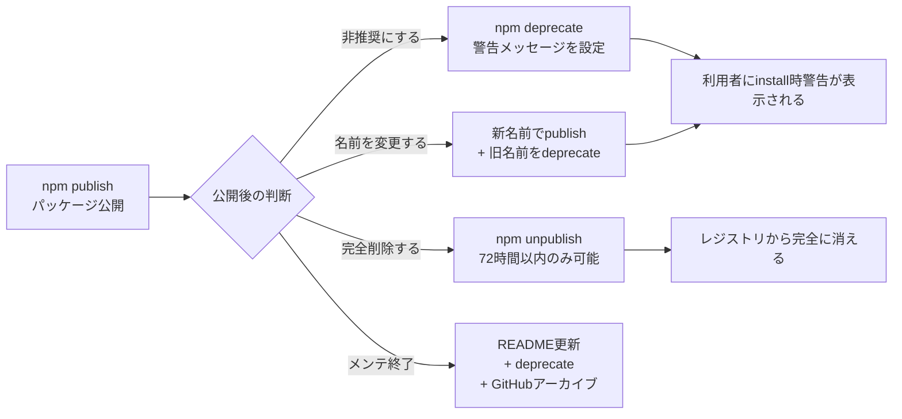
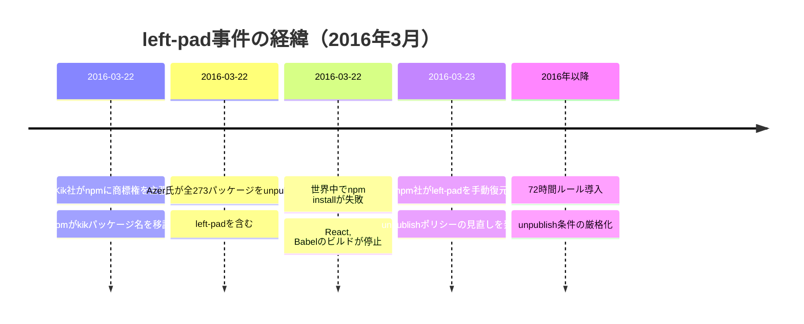
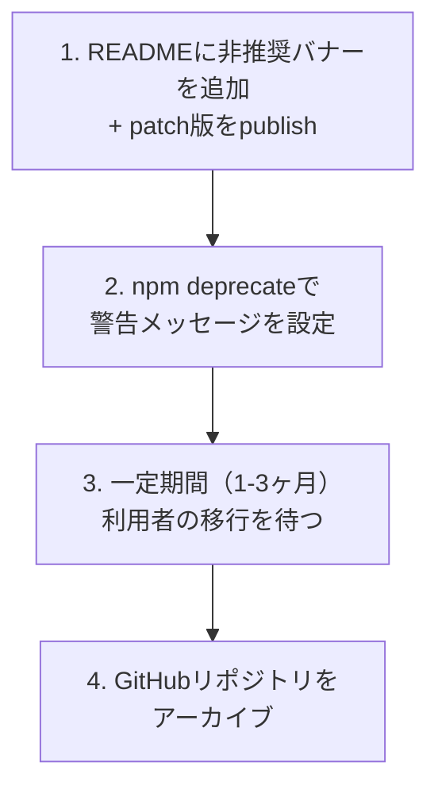
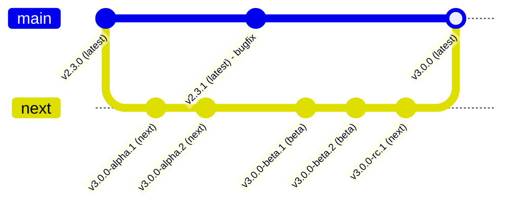
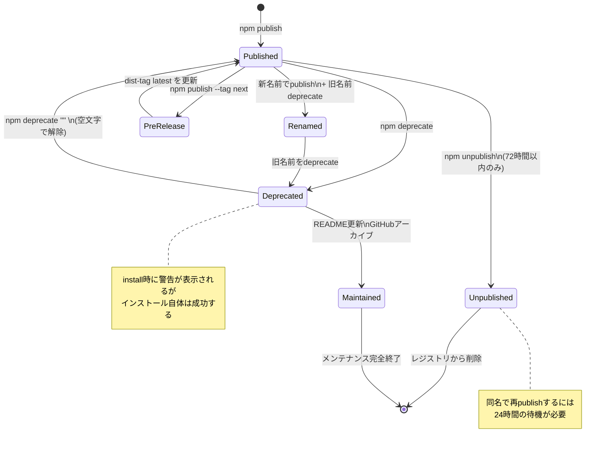
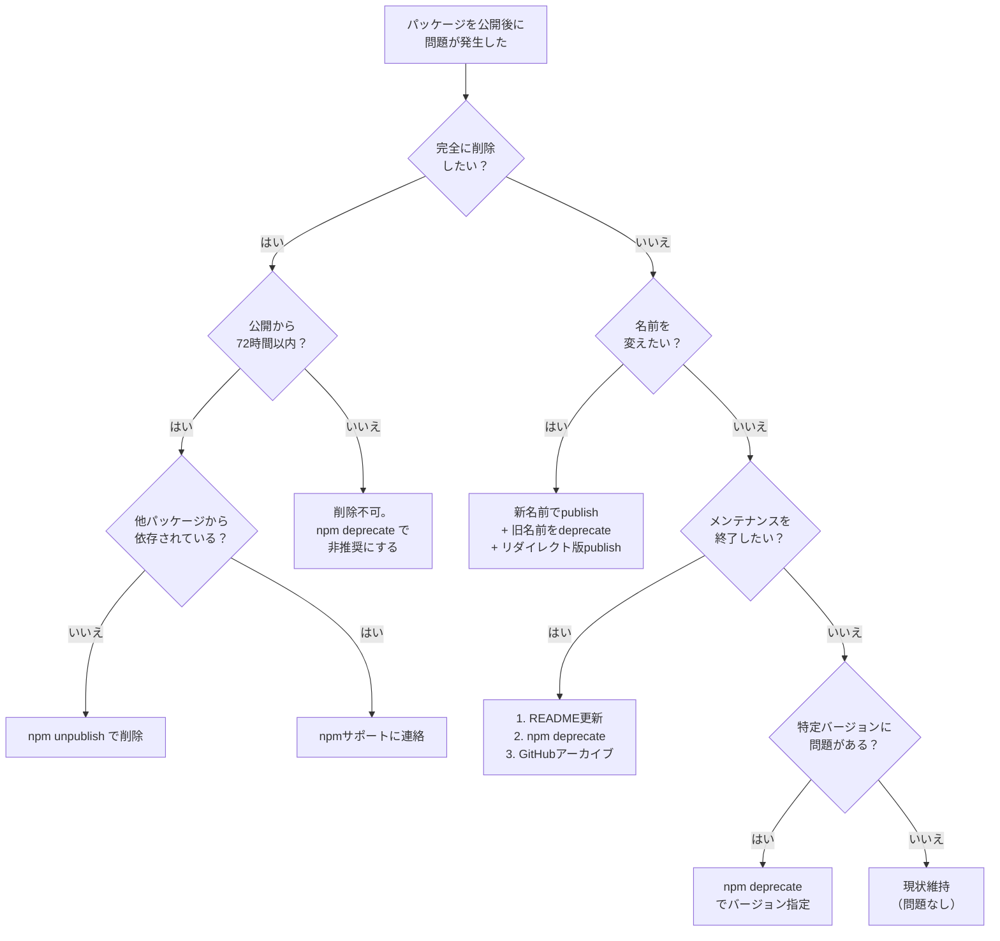

## はじめに

npmにパッケージを公開したあと、こんな場面に遭遇したことはないでしょうか。

- **名前を間違えた**: `@scope/utilty` を公開してしまい、正しくは `@scope/utility` だった
- **非推奨にしたい**: 新しいパッケージに移行してほしいが、利用者が多くて勝手に消せない
- **完全に削除したい**: テストで公開しただけなので、レジストリから取り除きたい
- **メンテナンスを終了する**: もうこのパッケージは更新しないと宣言したい

`npm publish` の手順を解説する記事は多いですが、**公開した後のライフサイクル管理**を体系的に扱った記事は意外と少ないです。しかし、実務ではパッケージの「終わらせ方」こそが重要です。何万人もの利用者に影響を与えるパッケージを、どう安全に廃止・移行するかは、公開以上に慎重さが求められます。

この記事では、`npm deprecate`、`npm unpublish`、`npm dist-tag` の使い方を中心に、パッケージ名の変更、メンテナンス終了の伝え方、アカウントセキュリティまで、公開後のパッケージ管理に必要な知識を一通り解説します。



:::message
この記事は「どうやるか（HOW）」にフォーカスしています。「なぜnpmレジストリはこう設計されているのか」「unpublishの制限がプロトコルレベルでどう実装されているか」といった「なぜ（WHY）」の部分は扱いません。WHYに興味がある方は記事末尾の書籍リンクを参照してください。
:::

## 1. npm deprecate -- パッケージを非推奨にする

### 基本構文

`npm deprecate` は、パッケージの特定バージョンまたは全バージョンに非推奨メッセージを設定するコマンドです。パッケージ自体はレジストリに残りますが、`npm install` 時に警告が表示されるようになります。

```bash
# パッケージの全バージョンを非推奨にする
npm deprecate <パッケージ名> "<メッセージ>"

# 特定バージョンを非推奨にする
npm deprecate <パッケージ名>@<バージョン> "<メッセージ>"

# バージョン範囲を指定する
npm deprecate <パッケージ名>@"<バージョン範囲>" "<メッセージ>"
```

実際の例を見てみましょう。

```bash
# 全バージョンを非推奨にする
npm deprecate my-old-package "このパッケージは非推奨です。@scope/new-package に移行してください。"

# 特定バージョンのみ非推奨にする（セキュリティ問題があるバージョンなど）
npm deprecate my-package@1.2.3 "このバージョンにはセキュリティ上の問題があります。1.2.4以上に更新してください。"

# バージョン範囲を指定する
npm deprecate my-package@"< 2.0.0" "v1系はサポートを終了しました。v2以上に移行してください。"
```

### 非推奨を解除する

空文字列を設定すると、非推奨状態を解除できます。

```bash
# 非推奨を解除する
npm deprecate my-package ""

# 特定バージョンの非推奨を解除する
npm deprecate my-package@1.2.3 ""
```

### 利用者に表示される警告

非推奨パッケージを `npm install` すると、以下のような警告が表示されます。

```bash
$ npm install my-old-package

npm warn deprecated my-old-package@1.0.0: このパッケージは非推奨です。@scope/new-package に移行してください。

added 1 package in 1s
```

重要なのは、**警告が表示されるだけでインストール自体は成功する**という点です。利用者の既存プロジェクトが壊れることはありません。これが `npm deprecate` の最大の利点です。

`npm outdated` でも非推奨パッケージは検出されます。

```bash
$ npm outdated

Package          Current  Wanted  Latest  Location                   Depreciations
my-old-package   1.0.0    1.0.0   1.0.0   node_modules/my-old-package  DEPRECATED
```

npmjs.comのパッケージページにも、非推奨であることがバナーで表示されます。

### deprecateメッセージの書き方

効果的なdeprecateメッセージには、以下の3つの要素を含めるべきです。

1. **何が起きているか**（非推奨、セキュリティ問題など）
2. **代替は何か**（移行先のパッケージ名）
3. **どうすればよいか**（具体的なアクション）

```bash
# 良い例：具体的で行動可能
npm deprecate my-package "非推奨です。代わりに @scope/new-package を使用してください: npm install @scope/new-package"

# 悪い例：情報が足りない
npm deprecate my-package "deprecated"

# 悪い例：代替が不明
npm deprecate my-package "このパッケージはもう使わないでください"
```

### 特定バージョンのdeprecateが有効な場面

全バージョンではなく、特定バージョンだけをdeprecateするケースは意外と多くあります。

**セキュリティ脆弱性が見つかったバージョン**:

```bash
# v1.3.0にXSS脆弱性が見つかった場合
npm deprecate my-package@1.3.0 "XSS脆弱性（CVE-2026-XXXX）が含まれています。1.3.1以上に更新してください。"
```

**破壊的な不具合を含むバージョン**:

```bash
# v2.1.0でデータ破損バグが混入した場合
npm deprecate my-package@">=2.1.0 <2.1.3" "データ破損の可能性があります。2.1.3以上に更新してください。"
```

**メジャーバージョン全体のサポート終了**:

```bash
# v1系のサポートを終了する場合
npm deprecate my-package@"1.x" "v1系はサポートを終了しました。v2への移行ガイド: https://example.com/migration"
```

## 2. npm unpublish -- パッケージを完全に削除する

### 基本構文

`npm unpublish` は、パッケージをnpmレジストリから完全に削除するコマンドです。

```bash
# 特定バージョンを削除する
npm unpublish <パッケージ名>@<バージョン>

# パッケージ全体を削除する（--force 必須）
npm unpublish <パッケージ名> --force
```

### 72時間ルール

npmには**72時間ルール**と呼ばれる重要な制限があります。

> パッケージを公開してから72時間（3日間）を過ぎると、`npm unpublish` で削除できなくなります。

この制限は、npmjs.com の公式ポリシーとして明文化されています。

```bash
# 公開から72時間以内：削除できる
$ npm unpublish my-test-package@1.0.0
- my-test-package@1.0.0

# 公開から72時間を超えた場合：エラーになる
$ npm unpublish my-old-package@1.0.0
npm error code E405
npm error 405 Method Not Allowed - unpublish not allowed
npm error my-old-package@1.0.0 cannot be unpublished because it was published more than 72 hours ago
```

### unpublishの条件

72時間以内であっても、以下の条件を**すべて**満たす必要があります。

| 条件 | 説明 |
|------|------|
| 72時間以内 | publishから72時間（3日間）以内であること |
| 他パッケージの依存なし | そのバージョンがnpmレジストリ上の他パッケージのlatestから直接依存されていないこと |
| 単一メンテナ | organizationが所有するパッケージではなく、かつメンテナが自分一人であること（org所有の場合はorg管理者権限が必要） |
| 週間300DL未満 | 過去1週間のダウンロード数が300未満であること |

これらの条件のいずれかを満たさない場合、72時間以内であっても削除できないことがあります。その場合はnpmサポート（support@npmjs.com）に個別に連絡する必要があります。

### パッケージ全体の削除と特定バージョンの削除

```bash
# 特定バージョンだけを削除する
npm unpublish my-package@1.0.0-beta.1

# パッケージ全体を削除する（すべてのバージョンが削除される）
npm unpublish my-package --force
```

`--force` なしでパッケージ全体を削除しようとすると、確認プロンプトが表示されます。これは意図しない全削除を防ぐための安全装置です。

### unpublish後の制限

パッケージを完全に削除した場合、**同じ名前で24時間以内に再publishすることはできません**。これは、削除と再publishを繰り返してサプライチェーン攻撃に悪用されることを防ぐための措置です。

```bash
# パッケージを削除
npm unpublish my-package --force

# 直後に同じ名前でpublishしようとする
npm publish
# npm error 403 Forbidden
# npm error my-package was unpublished less than 24 hours ago
```

## 3. unpublishの制限とleft-pad事件

### 2016年3月: left-pad事件の経緯

npmの72時間ルールは、2016年3月に起きた **left-pad事件** がきっかけで導入されました。この事件は、npmエコシステムの脆弱性を世界に知らしめた歴史的なインシデントです。

事件の経緯は以下のとおりです。

1. **発端**: Azer Koculu氏は、npmに `kik` というパッケージを公開していた。メッセージングアプリ「Kik」の運営会社が商標権を主張し、npmにパッケージ名の譲渡を求めた
2. **npmの判断**: npmは、商標権を持つKik社の主張を認め、`kik` パッケージの名前をKik社に移譲した
3. **Azer氏の反発**: 自分のパッケージ名が一方的に取り上げられたことに抗議し、Azer氏は自分が公開していた**全パッケージ（273個）をnpmからunpublish**した
4. **left-padの影響**: 削除されたパッケージの中に `left-pad` があった。これは文字列を左からパディングするだけの11行のコードだったが、React、Babel、その他の主要パッケージが直接・間接的に依存していた
5. **大規模障害**: `left-pad` の削除により、世界中で `npm install` が失敗する事態が発生。数千のプロジェクトのCI/CDが停止した
6. **npmの緊急対応**: npm社は `left-pad` を手動でレジストリに復元した。これはnpmの歴史上初めて、削除されたパッケージが管理者によって復元された事例となった



### npmポリシーの変更

この事件を受けて、npmは `npm unpublish` のポリシーを大幅に変更しました。

**事件前のポリシー**:
- パッケージの作者は、いつでも自由にunpublishできた
- ダウンロード数や依存数に関係なく削除可能だった

**事件後のポリシー（現在）**:
- 公開から72時間を超えたパッケージはunpublishできない
- 他パッケージから依存されている場合は72時間以内でも制限がある
- 一定のダウンロード数を超えるパッケージは自動削除不可
- パッケージ名の再利用に24時間の待機期間が設けられた

この事件は、オープンソースエコシステムにおける単一障害点（Single Point of Failure）の危険性と、パッケージマネージャのレジストリ設計がいかに重要かを示す教訓として、いまも語り継がれています。

:::message
unpublishの72時間ルールやdeprecateの仕組みは、npmレジストリのプロトコル仕様に基づいています。レジストリがパッケージメタデータをどう管理しているか、なぜ72時間後はunpublishできないのかは、書籍 [パッケージマネージャ from scratch](https://zenn.dev/yuichi_ai/books/package-manager-from-scratch) の第2章と第9章で解説しています。
:::

## 4. パッケージ名の変更

npmでは、公開済みパッケージの名前を直接変更することはできません。名前を変えたい場合は、**新しい名前でpublish + 旧名前をdeprecate** という手順を取ります。

### 手順: パッケージ名の変更

#### ステップ1: 新しい名前でpublishする

```bash
# package.json の name を変更する
{
  "name": "@scope/new-package-name",
  "version": "1.0.0"
}

# 新しい名前で公開する
npm publish
```

#### ステップ2: 旧名前でリダイレクト版をpublishする（推奨）

旧名前のパッケージに、新名前のパッケージを再エクスポートするだけのバージョンを公開します。これにより、旧名前を使っている利用者のコードが即座に壊れることを防げます。

```javascript
// index.js（旧パッケージのリダイレクト版）
module.exports = require("@scope/new-package-name");
```

```json
{
  "name": "old-package-name",
  "version": "2.0.0",
  "dependencies": {
    "@scope/new-package-name": "^1.0.0"
  }
}
```

```bash
npm publish
```

#### ステップ3: 旧名前をdeprecateする

```bash
npm deprecate old-package-name "このパッケージは @scope/new-package-name に移行しました: npm install @scope/new-package-name"
```

### 実践的なパターン

パッケージ名の変更が必要になる典型的なケースと、それぞれの対処法をまとめます。

**スコープなし → スコープ付きへの移行**:

npmではスコープなしの名前が枯渇しています。既存のスコープなしパッケージを `@scope/` 付きに移行するケースが増えています。

```bash
# 旧: my-utils → 新: @myorg/utils
npm deprecate my-utils "@myorg/utils に移行しました。npm install @myorg/utils で移行できます。"
```

**タイポの修正**:

```bash
# 公開から72時間以内なら、タイポ版を削除して正しい名前で再publish
npm unpublish @scope/utilty@1.0.0
# 24時間待ってから正しい名前でpublish、または別名でpublish

# 72時間を超えている場合は、deprecateでリダイレクト
npm deprecate @scope/utilty "パッケージ名のタイポです。正しくは @scope/utility です: npm install @scope/utility"
```

**組織変更に伴う移行**:

```bash
# 旧org → 新orgへの移行
npm deprecate @old-org/package "@new-org/package に移行しました。詳細: https://example.com/migration-guide"
```

## 5. メンテナンス終了の伝え方

パッケージのメンテナンスを終了する場合、利用者に対して明確かつ適切に伝える必要があります。以下の3つの手段を**すべて**実施するのがベストプラクティスです。

### 5-1. npm deprecateでメッセージを設定する

```bash
npm deprecate my-package "このパッケージはメンテナンスを終了しました。代替として @alternative/package を推奨します。"
```

これにより、`npm install` 時に全利用者に警告が表示されます。

### 5-2. READMEを更新する

READMEの冒頭に非推奨であることを明示します。

```markdown
# my-package

> **⚠ このパッケージはメンテナンスを終了しました**
>
> 代替パッケージ: [@alternative/package](https://www.npmjs.com/package/@alternative/package)
>
> 移行ガイド: [Migration Guide](https://example.com/migration)

---

（以下、従来のREADME内容）
```

READMEの更新は、新しいバージョンとしてpublishする必要があります。

```bash
# README更新をpatch版としてpublish
npm version patch
npm publish
```

### 5-3. GitHubリポジトリをアーカイブする

GitHubリポジトリをアーカイブすると、以下の効果があります。

- リポジトリが読み取り専用になる
- 新しいissue、PR、コメントの作成ができなくなる
- リポジトリページに「This repository has been archived」バナーが表示される
- コードの閲覧とforkは引き続き可能

```bash
# GitHub CLIでアーカイブする
gh repo archive owner/my-package --yes
```

GitHubのWebUIからもアーカイブできます: Settings > Danger Zone > Archive this repository

### メンテナンス終了の実施順序

メンテナンス終了を段階的に進めるのが安全です。



いきなりすべてを実施するのではなく、まずREADMEとdeprecateで告知し、利用者に移行期間を与えてからアーカイブするのが丁寧なやり方です。

## 6. npmアカウントのセキュリティ

パッケージの公開・非推奨設定・削除といった操作は、npmアカウントのセキュリティが前提です。アカウントが乗っ取られると、正規のパッケージに悪意あるコードを混入される危険性があります。

### 2FA（二要素認証）の必須化

npmでは2FA（Two-Factor Authentication）を有効化できます。2025年以降、書き込み権限を持つトークンの生成時には2FAがデフォルトで強制されるようになりました。

```bash
# 2FAの状態を確認する
npm profile get

# npmjs.comのWebUI → Account → Two-Factor Authentication で設定
```

2FAの設定モード:

| モード | 対象操作 |
|--------|---------|
| auth-only | ログイン時のみ2FAを要求 |
| auth-and-writes | ログインに加え、publish / unpublish / deprecate / dist-tag / access変更時にも2FAを要求 |

パッケージを公開している場合は、**auth-and-writes** を強く推奨します。

### Granular Access Token（Classic Token廃止後）

2025年12月9日をもって、npmの**Classic Tokenは完全に廃止・失効**しました。CI/CDやスクリプトからnpmの操作を行う場合は、Granular Access Tokenを使用します。

```bash
# Classic Tokenを使おうとした場合のエラー
npm error code E401
npm error 401 Unauthorized
```

Granular Access Tokenの主な特徴:

| 項目 | 内容 |
|------|------|
| 権限粒度 | パッケージ単位で読み取り/書き込みを設定可能 |
| 有効期限 | 書き込み権限付きは最大90日 |
| IP制限 | 許可するIPアドレス範囲を設定可能 |
| Organization | アクセスするorganizationを限定可能 |

トークンの作成手順:

1. [npmjs.com](https://www.npmjs.com/) にログインする
2. 右上のアバター > **Access Tokens** をクリックする
3. **Generate New Token** > **Granular Access Token** を選択する
4. 必要な権限を設定する（パッケージの選択、読み取り/書き込み、有効期限）
5. **Generate Token** をクリックする
6. 表示されたトークンをコピーする（**画面を閉じると再表示できない**）

```bash
# トークンをCI/CDの環境変数として設定する例
# GitHub Actions
echo "//registry.npmjs.org/:_authToken=${NPM_TOKEN}" > .npmrc
```

### Organizationの管理

organizationでパッケージを管理している場合、メンバーの権限管理が重要です。

```bash
# organizationのメンバーを確認する
npm org ls <org名>

# メンバーの権限を変更する
npm org set <org名> <ユーザー名> developer  # 開発者（publish可能）
npm org set <org名> <ユーザー名> admin       # 管理者（メンバー管理可能）
npm org set <org名> <ユーザー名> owner       # オーナー（org設定変更可能）

# メンバーを削除する
npm org rm <org名> <ユーザー名>
```

チームを使ったパッケージ単位のアクセス制御も可能です。

```bash
# チームを作成する
npm team create <org名>:<チーム名>

# チームにメンバーを追加する
npm team add <org名>:<チーム名> <ユーザー名>

# チームにパッケージのアクセス権を付与する
npm access grant read-write <org名>:<チーム名> @org/package-name
```

## 7. npm dist-tag -- バージョンタグの管理

### dist-tagとは

`npm dist-tag` は、特定のバージョンにわかりやすいタグ（エイリアス）を付けるコマンドです。`npm install <パッケージ名>` をタグなしで実行すると、デフォルトで `latest` タグが指すバージョンがインストールされます。

```bash
# dist-tagの一覧を確認する
npm dist-tag ls <パッケージ名>

# 出力例
# latest: 2.3.1
# next: 3.0.0-beta.2
# legacy: 1.9.8
```

### 主要なタグとその用途

| タグ | 用途 | 例 |
|------|------|-----|
| `latest` | 安定版。`npm install` のデフォルト | `npm install my-package` で入るバージョン |
| `next` | 次期メジャーバージョンのプレリリース | `npm install my-package@next` |
| `beta` | ベータ版 | `npm install my-package@beta` |
| `alpha` | アルファ版 | `npm install my-package@alpha` |
| `legacy` | サポート終了した旧メジャーバージョンの最終版 | `npm install my-package@legacy` |
| `canary` | 最新コミットからの自動ビルド | `npm install my-package@canary` |

### プレリリースの配布

正式リリース前のバージョンを配布する場合、`latest` タグを上書きしないように `--tag` フラグを使います。

```bash
# ベータ版をpublishする（latestは上書きされない）
npm publish --tag beta

# next版をpublishする
npm publish --tag next
```

**重要**: `--tag` を付けずにプレリリースバージョンをpublishすると、`latest` タグがそのプレリリースバージョンを指してしまいます。すると、一般ユーザーが `npm install` しただけで不安定版がインストールされる事態になります。

```bash
# 危険な操作: --tag なしでベータ版をpublish
# package.json: "version": "3.0.0-beta.1"
npm publish  # latestが3.0.0-beta.1を指してしまう！

# 正しい操作
npm publish --tag beta  # latestは2.3.1のまま、betaが3.0.0-beta.1を指す
```

### dist-tagの管理

```bash
# タグを追加する（既存バージョンにタグを付ける）
npm dist-tag add <パッケージ名>@<バージョン> <タグ名>

# 例: 次期メジャーバージョンのベータをnextタグに設定
npm dist-tag add my-package@3.0.0-beta.1 next

# タグを削除する
npm dist-tag rm <パッケージ名> <タグ名>

# 例: nextタグを削除
npm dist-tag rm my-package next
```

### latestタグの修正

`--tag` を付け忘れてプレリリース版を `latest` に公開してしまった場合の修正方法です。

```bash
# 現在の状態を確認する
npm dist-tag ls my-package
# latest: 3.0.0-beta.1  ← ベータ版がlatestになってしまっている

# latestを正しいバージョンに戻す
npm dist-tag add my-package@2.3.1 latest

# ベータ版に正しいタグを付ける
npm dist-tag add my-package@3.0.0-beta.1 beta

# 修正後の状態を確認する
npm dist-tag ls my-package
# latest: 2.3.1
# beta: 3.0.0-beta.1
```

### dist-tagを活用したリリース戦略

大規模パッケージでよく使われるリリース戦略を図示します。



この戦略では:
- `latest`: 安定版。一般ユーザーが `npm install` で取得するバージョン
- `next`: 次期メジャーバージョンの開発版。早期フィードバックを得るために公開
- `beta`: フィーチャーフリーズ後のテスト版

## 8. パッケージライフサイクルの全体像

ここまで解説した内容を、パッケージのライフサイクル全体として整理します。



### 状況別の判断フローチャート

「パッケージをどうしたいか」に応じて、取るべきアクションを判断するフローチャートです。



## 9. 実務でよくある質問（FAQ）

### Q. deprecateしたパッケージはnpmjs.comから見えなくなる？

いいえ。deprecateしたパッケージはnpmjs.comで引き続き表示されます。パッケージページの上部に非推奨バナーが表示されますが、ページ自体は残り、インストールも可能です。

### Q. unpublishしたバージョン番号は再利用できる？

いいえ。一度publishして削除したバージョン番号は、二度と使用できません。たとえば `1.0.0` を削除した場合、再び `1.0.0` としてpublishすることはできません。`1.0.1` など別のバージョン番号を使う必要があります。

### Q. scopedパッケージのunpublishにも72時間ルールは適用される？

はい。`@scope/package-name` 形式のscopedパッケージにも同じ72時間ルールが適用されます。

### Q. organizationが所有するパッケージをdeprecateするには？

organizationのメンバーであり、かつそのパッケージに対する書き込み権限を持っている必要があります。organization管理者であれば全パッケージをdeprecateできます。

### Q. deprecateメッセージに日本語は使える？

はい。deprecateメッセージにはUTF-8文字列を使用できます。ただし、CLIの警告表示はターミナルのエンコーディングに依存するため、ASCII文字で書くほうが安全です。英語と日本語を併記するのも良い方法です。

```bash
npm deprecate my-package "Deprecated. Use @scope/new-package instead. / 非推奨です。@scope/new-package に移行してください。"
```

### Q. CI/CDからdeprecateを実行するには？

Granular Access Tokenに書き込み権限を付与し、CI/CDの環境変数に設定すれば実行できます。

```yaml
# GitHub Actions の例
- name: Deprecate old version
  env:
    NODE_AUTH_TOKEN: ${{ secrets.NPM_TOKEN }}
  run: |
    echo "//registry.npmjs.org/:_authToken=${NODE_AUTH_TOKEN}" > .npmrc
    npm deprecate my-package@"< 2.0.0" "v1系はサポート終了。v2に移行してください。"
```

## まとめ

この記事で解説した内容をまとめます。

| コマンド/操作 | 用途 | 注意点 |
|--------------|------|--------|
| `npm deprecate` | 非推奨メッセージを設定 | インストールは引き続き可能。警告のみ表示 |
| `npm unpublish` | パッケージを完全削除 | 72時間以内のみ。バージョン番号は再利用不可 |
| パッケージ名変更 | 新名前でpublish + 旧名前をdeprecate | リダイレクト版の公開を推奨 |
| メンテナンス終了 | README + deprecate + GitHubアーカイブ | 段階的に実施。移行期間を設ける |
| `npm dist-tag` | バージョンタグの管理 | プレリリースは必ず `--tag` を付ける |
| 2FA | アカウントセキュリティ | auth-and-writes モードを推奨 |
| Granular Access Token | CI/CDでの認証 | Classic Tokenは2025年12月に廃止済み |

パッケージの公開は始まりに過ぎません。利用者が安心して依存できるパッケージを維持するには、非推奨・削除・移行のライフサイクル管理が不可欠です。特にdeprecateメッセージは、利用者への最も直接的なコミュニケーション手段です。「何が起きているか」「代替は何か」「どうすればよいか」を明確に伝えるメッセージを心がけてください。

---

この記事ではnpm deprecate / unpublish / dist-tagの「手順（HOW）」にフォーカスしました。

しかし、手順を知るだけでは解決できない疑問が残るかもしれません。

- 「`npm unpublish` がレジストリに送るHTTPリクエストはどう処理されるのか」
- 「72時間ルールはレジストリのプロトコルレベルでどう実装されているのか」
- 「left-pad事件以降、npmのサプライチェーンセキュリティモデルはどう進化したのか」

これらの「なぜこう設計されているのか（WHY）」を理解するには、レジストリプロトコルとセキュリティモデルの知識が必要です。

拙著 **[パッケージマネージャ from scratch](https://zenn.dev/yuichi_ai/books/package-manager-from-scratch)** では、第2章でnpmレジストリのHTTP APIとパッケージメタデータの構造を、第9章でサプライチェーン攻撃の手法と対策の全体像を図解付きで解説しています。第1章から第3章は無料公開しているので、まずはそちらからお試しください。

:::message
この記事はAIの支援を受けて執筆されています。技術的な正確性については十分に検証していますが、お気づきの点があればコメントでお知らせください。
:::
