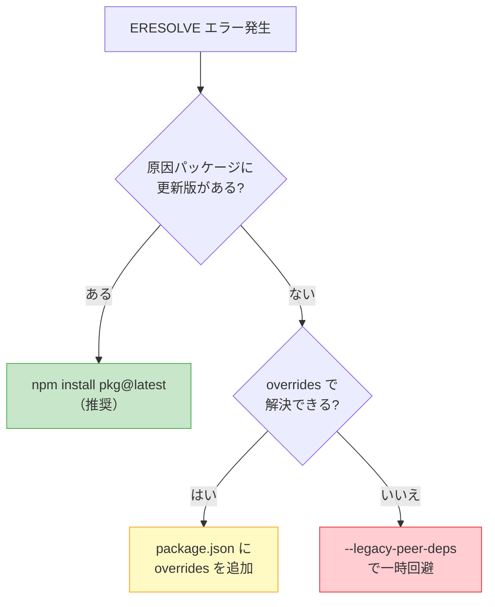
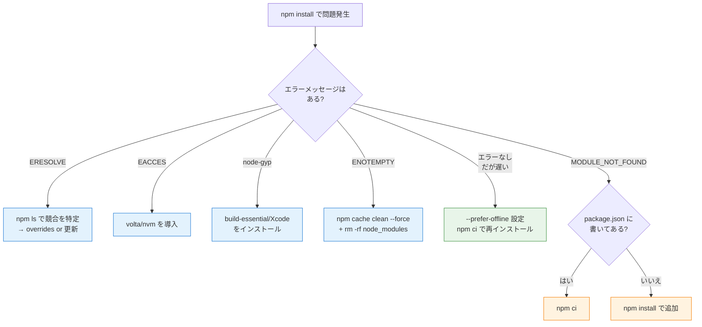

## はじめに

「`npm install` がいつまで経っても終わらない」「`ERESOLVE` で止まる」「CIだけなぜか壊れる」──Node.js開発者なら一度は経験したことがあるはずです。

この記事では `npm install` のトラブルを**症状別・エラー別**に整理し、すぐに使えるコマンド付きで対処法を解説します。

:::message
この記事は「今困っている問題を解決したい」という**HOW**にフォーカスしています。「なぜ `node_modules` はあんな構造なのか」「依存解決の内部で何が起きているのか」といった**WHY**は、筆者の書籍 [パッケージマネージャ from scratch](https://zenn.dev/yuichi_ai/books/package-manager-from-scratch) で体系的に解説しています。
:::

## npm install が遅い原因 Top 5 と対策

### 1. レジストリへのネットワーク遅延

`npm install` は `registry.npmjs.org` に大量のHTTPリクエストを送ります。パッケージ数が多いプロジェクトでは数百件のリクエストが発生するため、ネットワーク遅延の影響を大きく受けます。

```bash
# レジストリへの応答時間を確認
curl -o /dev/null -s -w "レスポンス時間: %{time_total}秒\n" \
  https://registry.npmjs.org/express
```

**対策**: `.npmrc` でリトライ設定を調整する。

```ini
# プロジェクトルートに .npmrc を作成
fetch-retries=5
fetch-retry-mintimeout=20000
fetch-retry-maxtimeout=120000
```

### 2. キャッシュを活用していない

npmはダウンロード済みパッケージをローカルにキャッシュしますが、デフォルトではキャッシュの活用が最大化されていません。

```bash
# キャッシュにあるパッケージはネットワークに問い合わせない
npm install --prefer-offline

# .npmrc に恒久設定する場合
echo "prefer-offline=true" >> .npmrc
```

`--prefer-offline` はキャッシュにあるバージョンがSemVer範囲を満たす場合にネットワークをスキップします。2回目以降のインストールが目に見えて速くなります。

### 3. postinstall スクリプトが重い

`node-gyp` を使うパッケージ（`bcrypt`、`sharp`、`sqlite3` など）はC/C++のコンパイルが走るため、数十秒かかることがあります。

```bash
# 全スクリプトをスキップして診断
npm install --ignore-scripts

# 必要なパッケージのスクリプトだけ手動実行
npx node-gyp rebuild --directory=node_modules/bcrypt
```

:::message alert
`--ignore-scripts` はネイティブモジュールのビルドもスキップします。どのパッケージがスクリプトを必要としているか把握した上で使ってください。
:::

### 4. 依存ツリーが深すぎる

直接依存が数十、間接依存を含めると数千パッケージになるプロジェクトもあります。

```bash
# 直接依存と全依存の数を比較
echo "直接: $(npm ls --depth=0 2>/dev/null | wc -l)"
echo "全体: $(npm ls --all 2>/dev/null | wc -l)"

# 重複パッケージを統合
npm dedupe

# 使われていないパッケージを検出（knip推奨。depcheckは2025年にアーカイブ済み）
npx knip
```

[knip](https://github.com/webpro-nl/knip) は `import` / `require` 文を静的解析して、コードから参照されていないパッケージや未使用のexportを検出します。

### 5. lockfile と node_modules の不整合

ブランチ切り替え後や `package.json` の手動編集後に `node_modules` が古い状態で残ることがあります。

```bash
# lockfile から厳密に再現
rm -rf node_modules
npm ci
```

`npm ci` は `package-lock.json` に記載された通りのバージョンをインストールし、lockfileを更新しません。「壊れたかも」と思ったらまず `npm ci` が定石です。

## よくあるエラーと解決法

### ERESOLVE unable to resolve dependency tree

```
npm ERR! code ERESOLVE
npm ERR! ERESOLVE unable to resolve dependency tree
npm ERR! Found: react@18.3.1
npm ERR! peer react@"^16.0.0" from react-old-plugin@1.0.0
```

**原因**: peer dependencyのバージョンが衝突している。npm v7以降はpeer dependencyを自動インストールするため、衝突がエラーとして表面化するようになりました。

**対処の手順**:

```bash
# Step 1: 競合の原因を特定
npm ls react

# Step 2: 原因パッケージの更新を確認
npm view react-old-plugin versions --json
```



更新版がない場合の `overrides` の書き方:

```json
{
  "overrides": {
    "react-old-plugin": {
      "react": "$react"
    }
  }
}
```

`$react` はプロジェクトルートのreactバージョンを参照するnpm独自の記法です。

**`--legacy-peer-deps` vs `--force`**

| フラグ | 挙動 | リスク |
|--------|------|--------|
| `--legacy-peer-deps` | peer dep自動インストールを無効化 | 実行時エラーの可能性 |
| `--force` | 衝突を無視して強制インストール | 依存ツリーが壊れるリスクが高い |

どちらも**一時凌ぎ**です。`overrides` かパッケージ更新で根本解決してください。

### EACCES permission denied

```
npm ERR! code EACCES
npm ERR! path /usr/local/lib/node_modules
```

**原因**: グローバルインストール先に書き込み権限がない。

**対策**: `sudo npm install -g` ではなく、Node.jsバージョンマネージャを使う。

```bash
# volta（推奨: プロジェクト単位でバージョン自動切替）
curl https://get.volta.sh | bash
volta install node@22

# nvm
curl -o- https://raw.githubusercontent.com/nvm-sh/nvm/v0.40.4/install.sh | bash
nvm install 22
```

導入後は `npm install -g typescript` が `sudo` なしで動きます。

### node-gyp rebuild failed

```
npm ERR! gyp ERR! build error
```

**原因**: ネイティブモジュールのビルドに必要なツールが不足。

```bash
# macOS
xcode-select --install

# Ubuntu/Debian
sudo apt-get install -y build-essential python3
```

**代替策**: pure JavaScript版への切り替えを検討する。例えば `bcrypt` → `bcryptjs` で node-gyp の問題を回避できます。

### npm ERR! code ENOTEMPTY

```
npm ERR! code ENOTEMPTY
npm ERR! syscall rename
```

**原因**: `node_modules` 内のファイルまたはキャッシュが壊れている。

```bash
# Step 1: キャッシュを修復
npm cache verify

# Step 2: 解決しなければクリア（--force 必須）
npm cache clean --force

# Step 3: クリーンインストール
rm -rf node_modules package-lock.json
npm install
```

### MODULE_NOT_FOUND

```
Error: Cannot find module 'some-package'
```

| 原因 | 対処 |
|------|------|
| `package.json` に書かれていない | `npm install some-package` |
| `node_modules` が古い | `npm ci` |
| ブランチ切り替え後 | `npm ci` |

`package.json` に書いていないパッケージが動いていた場合、それは「幽霊依存（Phantom Dependency）」です。他パッケージの間接依存がたまたまトップレベルに配置されていただけで、いつ壊れてもおかしくない状態です。[なぜこの現象が起きるのかは、node_modules のフラット化という設計に原因があります](https://zenn.dev/yuichi_ai/books/package-manager-from-scratch)。

## 2026年のベストプラクティス

### CI/CD でのキャッシュ戦略

CIの `npm install` を高速化する最も効果的な方法は、**npmキャッシュ**をキャッシュすることです。

```yaml
# GitHub Actions
- uses: actions/setup-node@v4
  with:
    node-version: 22
    cache: 'npm'   # ~/.npm キャッシュを自動復元

- run: npm ci      # lockfile に従って厳密にインストール
```

| キャッシュ対象 | メリット | デメリット |
|---|---|---|
| `~/.npm` | lockfile変更時も安全 | インストール時間はかかる |
| `node_modules` | インストール自体をスキップ可能 | 不整合のリスク |

安全性を重視するなら `~/.npm` + `npm ci` の組み合わせが堅実です。

### npm vs pnpm: 速度で困ったら移行を検討

npmの速度に不満がある場合、pnpmへの移行は有力な選択肢です。パッケージの実体をグローバルストアに一元管理し、各プロジェクトからリンクで参照するため、ディスク使用量とインストール速度の両方で優位性があります。

```bash
npm install -g pnpm
pnpm import              # package-lock.json から移行
rm -rf node_modules
pnpm install
```

### volta でプロジェクト別にNode.jsを固定

Node.js 25以降ではCorepackがバンドルされなくなるため、pnpmやyarnを使う場合はCorepackの別途インストールか、各ツールの直接インストールが必要になります。Node.jsバージョン管理にはvoltaが便利で、プロジェクトディレクトリに入ると自動でバージョンが切り替わります。

```bash
volta pin node@22
volta pin npm@11
# package.json に自動記録される
```

## トラブルシューティング早見表



## まとめ

| 問題 | まず試すこと | 根本対策 |
|------|-------------|----------|
| 遅い | `--prefer-offline`、`npm ci` | pnpmへの移行、CIキャッシュ |
| ERESOLVE | `npm ls` で競合特定 | `overrides`、パッケージ更新 |
| EACCES | volta / nvm 導入 | `sudo npm` を使わない運用 |
| node-gyp | ビルドツール導入 | pure JS 代替パッケージ |
| MODULE_NOT_FOUND | `npm ci` | 幽霊依存の解消 |

この記事で紹介した対処法は「壊れたら直す」ためのものです。しかし本当に強いのは「なぜ壊れるのか」を構造的に理解している状態です。`node_modules` の設計、lockfileの役割、peer dependencyの仕組みを知ると、エラーを見ただけで原因の見当がつくようになります。

パッケージマネージャの内部構造を体系的に学びたい方は **[パッケージマネージャ from scratch](https://zenn.dev/yuichi_ai/books/package-manager-from-scratch)** をご覧ください。npm / yarn / pnpm の設計思想から依存解決、セキュリティまで10章構成で解説しています。1〜3章は無料です。

---

*この記事はAIの支援を受けて執筆されています。*
