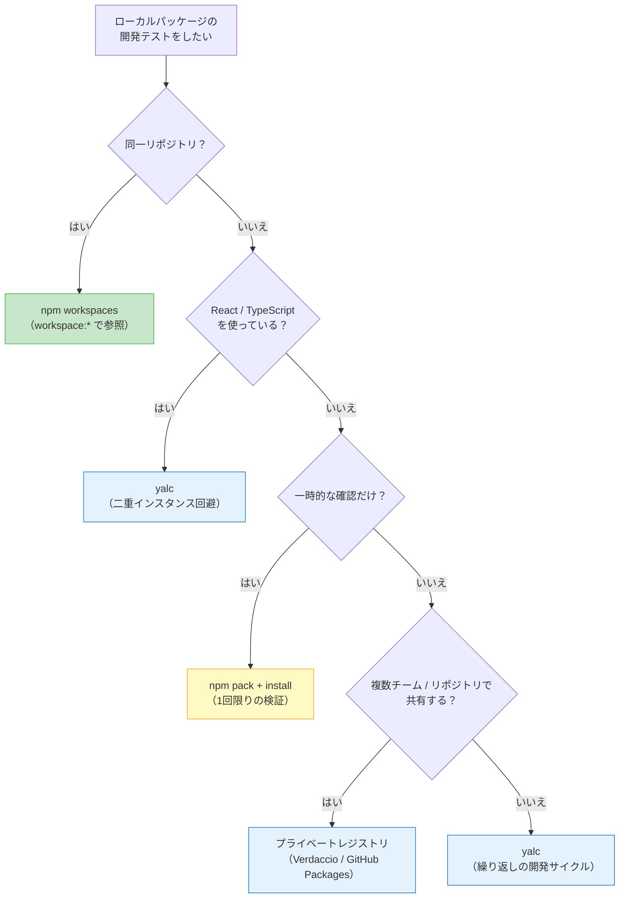

## ローカルパッケージの開発は「リンク」で始まる

自社の共通ライブラリを開発しているとき、変更をテストするためにいちいち `npm publish` して、アプリ側で `npm install` し直す。この往復作業に苦痛を感じたことはないだろうか。

`npm link` はこの問題を解決するための仕組みだ。ローカルのパッケージを別のプロジェクトから直接参照できるようにする。しかし、仕組みを理解せずに使うと「なぜか型が壊れる」「Reactが二重にロードされる」「CIだけ落ちる」といったトラブルに巻き込まれる。

この記事では、`npm link` のシンボリックリンクの仕組みから始めて、よくある落とし穴を具体的なエラーメッセージとともに解説する。後半では `npm pack`、yalc、pnpm link、yarn link、npm workspaces、Verdaccioといった代替手段を比較し、状況に応じた最適な選択肢を提示する。

## npm linkの仕組み：シンボリックリンクの2ステップ

`npm link` は、OSのシンボリックリンク（symlink）を使って、ローカルのパッケージディレクトリをnpmのグローバル領域に登録し、そこから別プロジェクトに接続する2ステップの操作だ。

### ステップ1: グローバルに登録する

まず、開発中のパッケージのディレクトリで `npm link` を実行する。

```bash
# パッケージのディレクトリに移動
cd ~/projects/my-utils

# グローバルの node_modules にシンボリックリンクを作成
npm link
```

この操作で、npmのグローバル `node_modules` ディレクトリ（`npm root -g` で確認できる）に、`my-utils` へのシンボリックリンクが作成される。

```bash
# 確認
ls -la $(npm root -g)/my-utils
# lrwxr-xr-x  ... /usr/local/lib/node_modules/my-utils -> /Users/you/projects/my-utils
```

### ステップ2: プロジェクトからリンクする

次に、このパッケージを使いたいプロジェクトのディレクトリで `npm link <パッケージ名>` を実行する。

```bash
# アプリケーションのディレクトリに移動
cd ~/projects/my-app

# ローカルの my-utils をリンク
npm link my-utils
```

これで `my-app/node_modules/my-utils` にシンボリックリンクが作られ、`~/projects/my-utils` のソースコードを直接参照するようになる。

```bash
ls -la node_modules/my-utils
# lrwxr-xr-x  ... node_modules/my-utils -> /usr/local/lib/node_modules/my-utils -> /Users/you/projects/my-utils
```

### リンクの全体像

シンボリックリンクのチェーンを図示すると以下のようになる。

```
my-app/node_modules/my-utils
    ↓ symlink
$(npm root -g)/my-utils
    ↓ symlink
~/projects/my-utils（実体）
```

`my-utils` のソースを編集すると、`my-app` 側から即座にその変更が反映される。ビルドステップを挟む場合は、`my-utils` 側でビルドを再実行する必要がある。

### リンクの解除

リンクを解除するには `npm unlink` を使う。

```bash
# アプリ側のリンクを解除
cd ~/projects/my-app
npm unlink my-utils

# グローバル登録を解除
cd ~/projects/my-utils
npm unlink -g
```

解除後は `npm install` を再実行して、レジストリからパッケージをインストールし直すことを忘れないでほしい。

## npm linkのよくあるトラブル

`npm link` は手軽だが、シンボリックリンク特有の問題を抱えている。ここでは実際に遭遇しやすいトラブルを、エラーメッセージとともに紹介する。

### トラブル1: Reactの二重インスタンス問題

Reactコンポーネントライブラリを `npm link` でテストすると、次のようなエラーが出ることがある。

```
Error: Invalid hook call. Hooks can only be called inside of the body of a function component.
This might happen because of one of the following reasons:
1. You might have mismatching versions of React and the renderer (such as React DOM)
2. You might be breaking the Rules of Hooks
3. You might have more than one copy of React in the same app
```

原因は「3. You might have more than one copy of React in the same app」だ。

`npm link` はシンボリックリンクを作るが、リンクされたパッケージの `node_modules` はそのまま残る。つまり、`my-utils/node_modules/react` と `my-app/node_modules/react` の2つのReactインスタンスが存在する状態になる。

```
my-app/
├── node_modules/
│   ├── react/              ← React インスタンス A
│   └── my-utils/ -> ~/projects/my-utils/
│       └── node_modules/
│           └── react/      ← React インスタンス B（ここが問題）
```

Reactはシングルトンで動作することを前提としているため、2つのインスタンスが混在するとHooksの状態管理が破綻する。

**解決策: リンク側のReactをアプリ側に向ける**

```bash
# my-utils側で、Reactをmy-appのReactに向ける
cd ~/projects/my-utils
npm link ../my-app/node_modules/react
npm link ../my-app/node_modules/react-dom
```

この操作で `my-utils` のReactがアプリ側のインスタンスを参照するようになり、二重インスタンスが解消される。ただし、リンクのチェーンが複雑になるため、管理が煩雑になる欠点がある。

### トラブル2: TypeScriptの型が壊れる

TypeScriptプロジェクトで `npm link` を使うと、型チェックでエラーが出ることがある。

```
error TS2724: '"my-utils"' has no exported member named 'MyType'.
  Did you mean 'MyType'?
```

あるいは、リンク先パッケージの型が `any` に推論されてしまうケースもある。

```
error TS7016: Could not find a declaration file for module 'my-utils'.
  '/Users/you/projects/my-utils/dist/index.js' implicitly has an 'any' type.
```

原因は複数あるが、代表的なのは以下の2つだ。

1. **シンボリックリンクとTypeScriptの `rootDir` の衝突**: TypeScriptのコンパイラはデフォルトでシンボリックリンクを実体パスに解決する。リンク先がプロジェクトの `rootDir` の外にあると、型情報を正しく解決できない
2. **`node_modules` 内の型定義が二重に読み込まれる**: React同様、TypeScript自体や `@types/*` パッケージが重複する

**解決策: `tsconfig.json` で `preserveSymlinks` を設定する**

```json
{
  "compilerOptions": {
    "preserveSymlinks": true
  }
}
```

この設定により、TypeScriptコンパイラがシンボリックリンクを実体パスに解決せず、リンクパスのまま扱うようになる。webpack を使っている場合は `resolve.symlinks: false` も併せて設定する。

```js
// webpack.config.js
module.exports = {
  resolve: {
    symlinks: false,
  },
};
```

### トラブル3: peer dependencyの重複

リンク先パッケージが `peerDependencies` を宣言している場合、`npm link` では peer dependency の解決が正しく行われないことがある。

```
npm WARN my-utils@1.0.0 requires a peer of webpack@^5.0.0 but none is installed.
```

`npm link` はシンボリックリンクを作成するだけで、依存解決を再計算しない。そのためリンク先パッケージの peer dependency がアプリ側で満たされているかどうかのチェックが甘くなる。

実行時には、リンク先パッケージが自身の `node_modules` から peer dependency を解決しようとして、アプリ側と異なるバージョンが使われる場合がある。

### トラブル4: npm installでリンクが消える

`npm link` で張ったリンクは、`npm install` を実行すると上書きされて消えることがある。

```bash
cd ~/projects/my-app
npm link my-utils    # リンクを張る
npm install express  # 別のパッケージを追加 → my-utils のリンクが消えることがある
```

npm v7以降では `npm install` 時に依存ツリー全体が再計算されるため、リンクが維持されないケースが増えた。パッケージを追加するたびに `npm link` を再実行する必要が生じる。

### トラブル5: CIでの再現不能

`npm link` はローカルのファイルシステムに依存するため、CI環境では再現できない。ローカルでは動くがCIでは落ちる、あるいはその逆のパターンが起きうる。

これらのトラブルの多くは、`npm link` がシンボリックリンクという「ファイルシステムレベルの仕組み」に依存していることに起因する。次のセクションでは、これらの問題を回避できる代替手段を紹介する。

:::message
パッケージの依存解決においてシンボリックリンクがどう扱われるかは、パッケージマネージャの設計に深く関わっています。npmのフラット構造とpnpmのcontent-addressable storeでなぜ挙動が異なるのか、その原理を知りたい方は **[『なぜnode_modulesは壊れるのか？』](https://zenn.dev/yuichi_ai/books/package-manager-from-scratch)** で設計思想の違いから解説しています。
:::

## npm pack + npm install：リンクより安全な方法

`npm link` の多くのトラブルは、シンボリックリンクが「ファイルシステムの参照を変える」だけで、npmの依存解決プロセスを経由しないことに起因する。`npm pack` はこの問題を解決する。

### npm packの仕組み

`npm pack` は、パッケージを `.tgz` ファイル（tarball）に固めるコマンドだ。`npm publish` がレジストリにアップロードするものと同じ形式のファイルをローカルに生成する。

```bash
# パッケージディレクトリで tarball を生成
cd ~/projects/my-utils
npm pack
# my-utils-1.0.0.tgz が生成される
```

このtarballをアプリ側で `npm install` する。

```bash
cd ~/projects/my-app
npm install ~/projects/my-utils/my-utils-1.0.0.tgz
```

### npm packの利点

`npm link` と比較した `npm pack` の利点は明確だ。

| 項目 | npm link | npm pack + install |
|------|----------|-------------------|
| 依存解決 | スキップされる | 通常の `npm install` と同じ |
| peer dependency | 正しく解決されない場合がある | 正しく解決される |
| React二重インスタンス | 発生しやすい | 発生しない |
| CI再現性 | なし | tarballをコミットすれば再現可能 |
| 変更の即時反映 | あり（symlinkのため） | なし（再pack + 再installが必要） |

最後の「変更の即時反映がない」点が `npm pack` の弱点だ。ソースを変更するたびに `npm pack` と `npm install` を再実行する必要がある。

### ワンライナーで効率化

変更→テストのサイクルを効率化するには、以下のようなワンライナーを使う。

```bash
# my-utils でビルド + pack → my-app でインストール
cd ~/projects/my-utils && npm run build && npm pack && \
cd ~/projects/my-app && npm install ~/projects/my-utils/my-utils-1.0.0.tgz
```

毎回バージョン番号を含むファイル名を書くのが手間なら、`--pack-destination` でファイル名を固定する方法もある。

```bash
cd ~/projects/my-utils
npm pack --pack-destination /tmp/
# /tmp/my-utils-1.0.0.tgz
```

ただし、開発中にこのワンライナーを何度も実行するのは現実的ではない。そこで登場するのが yalc だ。

## yalc：npm linkの改良版

[yalc](https://github.com/wclr/yalc) は `npm link` と `npm pack` の良いとこ取りをしたツールだ。ローカルにミニレジストリを立て、パッケージをそこに publish して使う。

### インストールと基本操作

```bash
# グローバルインストール
npm install -g yalc
```

```bash
# パッケージ側: ローカルレジストリに publish
cd ~/projects/my-utils
yalc publish

# アプリ側: ローカルレジストリからインストール
cd ~/projects/my-app
yalc add my-utils
```

`yalc publish` はパッケージをローカルストア（`~/.yalc`）にコピーし、`yalc add` はそこからアプリの `node_modules` にインストールする。シンボリックリンクではなく、ファイルの**コピー**を配置するため、`npm link` で起きる二重インスタンス問題が発生しない。

### 変更の反映

パッケージを変更したら `yalc push` で反映する。

```bash
cd ~/projects/my-utils
# ソースを変更後...
yalc push
```

`yalc push` は `yalc publish` + 全リンク先への更新を一括で行う。`--watch` フラグでファイル変更を監視して自動push することもできる（ただしビルドステップがある場合はビルドツール側のwatchと組み合わせる必要がある）。

### yalcが変更するファイル

`yalc add` を実行すると、以下のファイルが変更される。

```json
// package.json に追加される
{
  "dependencies": {
    "my-utils": "file:.yalc/my-utils"
  }
}
```

`.yalc/` ディレクトリと `yalc.lock` ファイルがプロジェクトルートに生成される。これらは `.gitignore` に追加する。

```bash
# .gitignore に追加
echo '.yalc' >> .gitignore
echo 'yalc.lock' >> .gitignore
```

### リンクの解除

```bash
cd ~/projects/my-app
yalc remove my-utils

# または全て解除
yalc remove --all
```

### npm link vs yalc の比較

| 項目 | npm link | yalc |
|------|----------|------|
| 仕組み | シンボリックリンク | ファイルコピー + ローカルストア |
| React二重インスタンス | 発生しやすい | 発生しない |
| peer dependency | 問題あり | 正しく解決 |
| 変更の即時反映 | あり | `yalc push` が必要 |
| `npm install` との共存 | リンクが消えることがある | `package.json` に記録されるため維持される |
| CI再現性 | なし | なし（ローカル開発専用） |

yalcは `npm link` の実用的な上位互換として、特にReactやTypeScriptを使うプロジェクトで有用だ。

## pnpm linkとyarn link

npm以外のパッケージマネージャにもlinkコマンドがある。それぞれの特徴を見ていこう。

### pnpm link

pnpm の link は npm と基本的な使い方は同じだが、pnpm のストレージアーキテクチャの影響を受ける。

```bash
# 相対パス指定でリンク（2ステップ不要）
cd ~/projects/my-app
pnpm link ~/projects/my-utils
```

pnpm link の特徴は、グローバルを経由せず**直接リンクできる**点だ。`npm link` のような2ステップ（グローバル登録→プロジェクトリンク）ではなく、パスを指定して1コマンドでリンクを張れる。

```bash
# グローバル経由の2ステップ方式もサポート
cd ~/projects/my-utils
pnpm link --global

cd ~/projects/my-app
pnpm link --global my-utils
```

pnpm は厳格な `node_modules` 構造（symlink farm + content-addressable store）を持つため、リンクされたパッケージが他のパッケージの `node_modules` にアクセスできないケースがある。pnpm を使っている場合は、後述の `pnpm-workspace.yaml` によるworkspace管理を優先的に検討してほしい。

リンクの解除は `pnpm unlink` で行う。

```bash
cd ~/projects/my-app
pnpm unlink my-utils
```

### yarn link

Yarn Classic (v1) の `yarn link` は `npm link` とほぼ同じ仕組みだ。

```bash
# パッケージ側
cd ~/projects/my-utils
yarn link

# アプリ側
cd ~/projects/my-app
yarn link my-utils
```

Yarn Berry (v2以降) では `yarn link` の挙動が異なる。Berry はPnP（Plug'n'Play）モードがデフォルトであり、従来の `node_modules` を使わない。そのためリンクの概念自体が変わる。

Berry では `resolutions` フィールドに `portal:` プロトコルを使ってローカルパッケージを参照する。

```json
// package.json
{
  "resolutions": {
    "my-utils": "portal:~/projects/my-utils"
  }
}
```

`portal:` はシンボリックリンクと似ているが、参照先パッケージの依存もホストプロジェクトの依存ツリー内で解決される点が異なる。これにより、React二重インスタンス問題が軽減される。

### 3ツール比較表

| 項目 | npm link | pnpm link | yarn link (Classic) | yarn link (Berry) |
|------|----------|-----------|--------------------|--------------------|
| グローバル経由 | 必要 | 不要（直接リンク可） | 必要 | 非推奨 |
| 1コマンドリンク | 不可 | 可能 | 不可 | `portal:` で設定 |
| 依存の隔離 | なし | pnpmの構造に依存 | なし | PnPで管理 |
| 二重インスタンス | 発生しやすい | 発生しうる | 発生しやすい | `portal:` で軽減 |

## npm workspacesでのローカル参照

同一リポジトリ内に複数のパッケージがある場合は、`npm link` ではなく**workspaces**を使うのが正解だ。workspacesはパッケージマネージャ標準の仕組みであり、`npm link` の問題点のほとんどが解消される。

### 基本セットアップ

```json
// ルートの package.json
{
  "name": "my-monorepo",
  "private": true,
  "workspaces": [
    "packages/*",
    "apps/*"
  ]
}
```

```
my-monorepo/
├── package.json
├── packages/
│   └── my-utils/
│       └── package.json   // name: "my-utils"
└── apps/
    └── my-app/
        └── package.json   // dependencies: { "my-utils": "workspace:*" }
```

### workspace:* プロトコル

`workspace:*` は「このパッケージはnpmレジストリからではなく、同一ワークスペース内のパッケージを参照する」という宣言だ。

```json
// apps/my-app/package.json
{
  "dependencies": {
    "my-utils": "workspace:*"
  }
}
```

`npm install` を実行すると、`node_modules/my-utils` にシンボリックリンクが作成され、`packages/my-utils` を直接参照する。ここまでは `npm link` と同じように見えるが、決定的な違いがある。

**workspacesでは依存解決がパッケージマネージャによって管理される。** `my-utils` の依存はルートの `node_modules` にホイスティングされ、`my-app` と同じインスタンスを共有する。そのためReactの二重インスタンスや peer dependency の問題が発生しない。

### workspace:* の publish 時の挙動

`workspace:*` で宣言された依存は、`npm publish` 時に実際のバージョン番号に自動変換される。

```json
// 開発時の package.json
{ "dependencies": { "my-utils": "workspace:*" } }

// publish 後の package.json（レジストリ上）
{ "dependencies": { "my-utils": "1.2.3" } }
```

`workspace:^` を使うと `^1.2.3` に、`workspace:~` を使うと `~1.2.3` に変換される。npm v7以降、pnpm、Yarn Berry がこのプロトコルをサポートしている。

### workspacesが使えないケース

workspaces は同一リポジトリ内のパッケージ管理に特化している。以下のケースでは `npm link` や yalc のようなツールが必要になる。

- **別リポジトリ**のパッケージをローカルでテストしたい
- 社内の**プライベートパッケージ**を publish する前にアプリ側で動作確認したい
- **一時的に**ローカルの修正パッケージを差し替えたい

## CI/CDでの注意点

ローカルパッケージ開発で使ったリンクやローカル参照がCI/CDに影響しないよう、注意すべきポイントをまとめる。

### npm linkはCIで使わない

`npm link` はローカルのファイルシステムに依存するため、CI環境では再現できない。CI/CDパイプラインでは以下のいずれかを採用する。

**workspacesを使う場合:**

```yaml
# GitHub Actions の例
steps:
  - uses: actions/checkout@v4
  - uses: actions/setup-node@v4
    with:
      node-version: 20
  - run: npm ci
  # workspaces の場合、npm ci で全パッケージの依存が解決される
  - run: npm run build --workspaces
  - run: npm test --workspaces --if-present
```

`npm ci` は `package-lock.json` に記録された正確な依存ツリーを再現する。workspaces の内部パッケージ参照も lockfile に含まれるため、追加操作は不要だ。

**別リポジトリのパッケージを参照する場合:**

```yaml
steps:
  - uses: actions/checkout@v4
  - uses: actions/setup-node@v4
    with:
      node-version: 20
      registry-url: 'https://npm.pkg.github.com'
  - run: npm ci
    env:
      NODE_AUTH_TOKEN: ${{ secrets.NPM_TOKEN }}
```

プライベートレジストリ（GitHub Packages、npmの有料プラン、Verdaccioなど）にパッケージを publish し、CI ではレジストリ経由で取得する。

### yalc / file: プロトコルの残留に注意

`yalc add` や `npm install ../path/to/package` を実行すると、`package.json` に `file:` プロトコルの参照が書き込まれる。

```json
{
  "dependencies": {
    "my-utils": "file:.yalc/my-utils"
  }
}
```

この状態のまま `package.json` をコミットすると、CIで以下のエラーが出る。

```
npm ERR! code ENOENT
npm ERR! syscall stat
npm ERR! path /home/runner/work/my-app/.yalc/my-utils
npm ERR! errno -2
npm ERR! enoent ENOENT: no such file or directory
```

コミット前に必ず `yalc remove --all` を実行し、`package.json` が正常な状態に戻っていることを確認してほしい。CIに pre-install スクリプトで検知ロジックを入れるのも有効だ。

```bash
# CI の初期ステップで file: や .yalc の残留をチェック
if grep -r "file:\.yalc" package.json; then
  echo "ERROR: yalc references found in package.json"
  exit 1
fi
```

### lockfileの一貫性

`npm link` や yalc を使った後は、lockfile（`package-lock.json`）が不整合な状態になることがある。CIに入る前に以下のコマンドで確認する。

```bash
# lockfile と package.json の整合性チェック
npm ci
# package-lock.json が package.json と一致しない場合、エラーで停止する
```

## Verdaccioなどプライベートレジストリの選択肢

複数のチームやリポジトリにまたがるパッケージ共有には、プライベートレジストリが有効だ。「publishはしたいが、npmの公開レジストリには出したくない」というケースに対応する。

### Verdaccio

[Verdaccio](https://verdaccio.org/) はオープンソースの軽量npmレジストリだ。ローカルで立ち上げて、プライベートパッケージの publish / install をテストできる。

```bash
# インストール & 起動
npm install -g verdaccio
verdaccio
# http://localhost:4873 で起動
```

```bash
# Verdaccio にパッケージを publish
npm publish --registry http://localhost:4873

# Verdaccio からインストール
npm install my-utils --registry http://localhost:4873
```

`.npmrc` でプロジェクト単位にレジストリを設定できる。

```ini
# .npmrc
@myorg:registry=http://localhost:4873
```

この設定で `@myorg` スコープのパッケージだけがVerdaccioから取得され、それ以外は通常のnpmレジストリが使われる。

### GitHub Packages

GitHubリポジトリに紐づいたパッケージレジストリ。GitHub Actionsとの連携が容易で、アクセス制御もGitHubの権限管理に統合されている。

```ini
# .npmrc
@myorg:registry=https://npm.pkg.github.com
//npm.pkg.github.com/:_authToken=${NODE_AUTH_TOKEN}
```

### 選択肢の比較

| 項目 | Verdaccio | GitHub Packages | npm有料プラン |
|------|-----------|-----------------|-------------|
| コスト | 無料（セルフホスト） | 無料枠あり（パブリックrepo） | $7/月〜 |
| セットアップ | 自前でサーバー管理 | GitHubリポジトリに統合 | 設定変更のみ |
| アクセス制御 | 設定ファイルで管理 | GitHubの権限管理 | npm Org機能 |
| CI連携 | 手動設定 | GitHub Actions と統合 | 一般的なCIに対応 |
| 用途 | ローカル開発テスト、社内配布 | GitHub中心の開発 | 商用プロジェクト |

`npm link` の代わりにプライベートレジストリを使う利点は、CI/CDとの一貫性だ。開発者のローカルでもCIでも同じコマンド（`npm install`）でパッケージが取得できるため、「ローカルでは動くがCIで落ちる」という問題が発生しない。

## 手法の選定フローチャート

ここまで紹介した手法を、状況に応じて使い分けるためのフローチャートを示す。



**まとめると:**

- **同一リポジトリ** → workspaces一択
- **別リポジトリ + React/TS** → yalc
- **1回限りの確認** → npm pack
- **チーム共有** → プライベートレジストリ
- **npm link** → 仕組みの理解には有用だが、実運用ではyalcやworkspacesを推奨

:::message
パッケージマネージャの**仕組み**をさらに深く理解したい方へ
**[『なぜnode_modulesは壊れるのか？』](https://zenn.dev/yuichi_ai/books/package-manager-from-scratch)**では、依存解決アルゴリズムの原理から3つのパッケージマネージャの設計思想の違いを図解で解説しています。
:::
