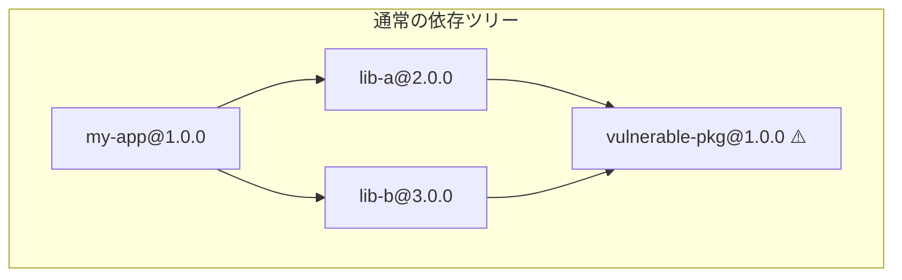
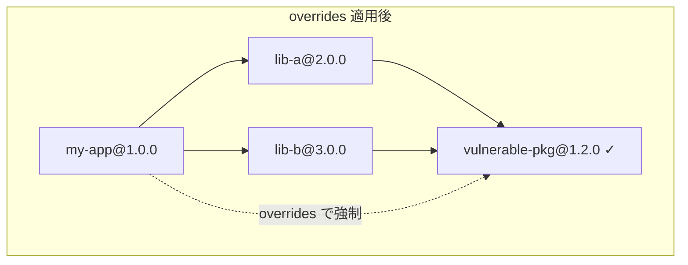
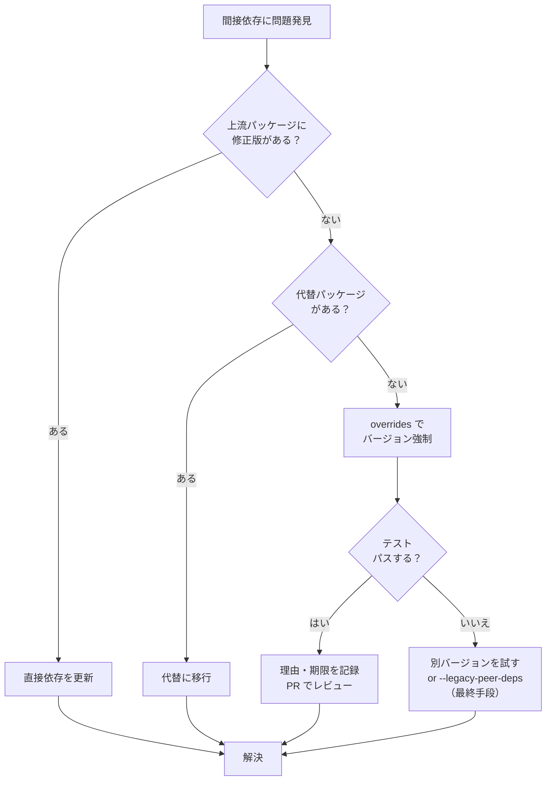

## あなたの依存ツリーに、知らない脆弱性が埋まっている

`npm audit` を実行したら、見覚えのないパッケージ名が表示された。

```bash
$ npm audit

semver  <7.5.2
Severity: moderate
Regular Expression Denial of Service - https://github.com/advisories/GHSA-c2qf-rxjj-qqgw
fix available via `npm audit fix --force`
Will install react-scripts@2.1.3, which is a breaking change
node_modules/react-scripts/node_modules/semver

12 moderate severity vulnerabilities
```

`semver` パッケージに脆弱性がある。しかし `npm ls semver` で確認すると、自分が直接インストールしたものではなく、`react-scripts` が内部で使っている間接依存だった。

```bash
$ npm ls semver
my-app@1.0.0
└─┬ react-scripts@5.0.1
  └─┬ resolve@1.22.1
    └── semver@5.7.1
```

`npm audit fix` は破壊的変更を伴うダウングレードを提案してくる。`react-scripts` にPRを出すには時間がかかるし、そもそもメンテナンスが停滞している。fork を作るのは大げさすぎる。

**こんなとき、`overrides`（npm）/ `resolutions`（Yarn）/ `pnpm.overrides`（pnpm）を使えば、間接依存のバージョンをピンポイントで強制的に上書きできます。**

この記事では、3つのパッケージマネージャそれぞれの構文・設定方法を並列で解説し、セキュリティ修正やpeer dependency解決の実践例を通じて、overridesを安全に運用するためのノウハウをまとめます。

:::message
この記事は「overridesをどう設定するか」という**HOW**にフォーカスしています。依存解決アルゴリズムの内部動作（なぜ間接依存が特定バージョンに固定されるのか、セマンティックバージョニング範囲がどう解決されるのか）は扱いません。
:::

## overrides が必要になる4つのユースケース

overrides/resolutions は「依存ツリーの中に手を突っ込んで、特定パッケージのバージョンを強制的に差し替える」機能です。以下の4つの場面で必要になります。

### 1. セキュリティ脆弱性の強制修正

間接依存に脆弱性が報告されたが、直接依存のメンテナが修正版をリリースしていない場合。`npm audit fix` では解決できない（または破壊的変更を伴う）ケースで使います。

### 2. ERESOLVE エラーの回避

peer dependency の衝突で `npm install` が失敗するとき、`--legacy-peer-deps` や `--force` に頼る代わりに、overrides で正確に制御できます。

### 3. 重複パッケージの排除

同じパッケージの異なるバージョンが `node_modules` 内に複数存在し、バンドルサイズが膨らんでいるとき、overrides で1つのバージョンに統一できます。

### 4. テスト時のパッケージ差し替え

特定のライブラリをモック版やフォーク版に差し替えてテストしたい場合にも使えます。





overrides を設定すると、`lib-a` と `lib-b` が `package.json` で `vulnerable-pkg@^1.0.0` を要求していても、実際にインストールされるのは `1.2.0`（修正済みバージョン）になります。

## npm overrides（npm 8.3+）

npm では `package.json` の `overrides` フィールドで間接依存のバージョンを上書きします。npm 8.3（2022年1月リリース）から利用可能です。

### 基本構文

```json
{
  "name": "my-app",
  "dependencies": {
    "react-scripts": "^5.0.1"
  },
  "overrides": {
    "semver": "7.5.4"
  }
}
```

この設定は、依存ツリー内のすべての `semver` パッケージを `7.5.4` に強制します。

### ネスト指定（特定パッケージ配下のみ上書き）

すべての `semver` を上書きするのではなく、特定の依存パッケージ配下だけを対象にしたい場合は、JSONのネスト構造で表現します。

```json
{
  "overrides": {
    "react-scripts": {
      "semver": "7.5.4"
    }
  }
}
```

この設定は「`react-scripts` が使っている `semver` だけを `7.5.4` にする」という意味です。他のパッケージが使っている `semver` には影響しません。

さらに深いネストも可能です。

```json
{
  "overrides": {
    "react-scripts": {
      "resolve": {
        "semver": "7.5.4"
      }
    }
  }
}
```

### `$パッケージ名` 記法（ルート参照）

ルートの `dependencies` に定義されているパッケージと同じバージョンを使いたい場合、`$` プレフィックスで参照できます。

```json
{
  "dependencies": {
    "react": "^18.3.1",
    "react-dom": "^18.3.1",
    "react-beautiful-dnd": "^13.1.1"
  },
  "overrides": {
    "react-beautiful-dnd": {
      "react": "$react",
      "react-dom": "$react-dom"
    }
  }
}
```

`$react` は「ルートの `dependencies` に定義された `react` のバージョン範囲」を参照します。React のバージョンを変更しても overrides を手動で書き換える必要がありません。

:::message alert
`$パッケージ名` 記法を使うには、そのパッケージがルートの `dependencies`（または `devDependencies`）に含まれている必要があります。含まれていないとエラーになります。
:::

### 条件付き overrides

overrides の値にオブジェクトを使うと、「このバージョン範囲のときだけ上書きする」という条件を指定できます。

```json
{
  "overrides": {
    "semver": {
      "semver@<7.5.2": "7.5.4"
    }
  }
}
```

この設定は「`semver` のうちバージョンが `7.5.2` 未満のものだけを `7.5.4` に上書きする」という意味です。すでに `7.5.2` 以降を使っている依存パッケージには影響しません。

### npm overrides 適用手順

overrides を `package.json` に追加したら、必ずクリーンインストールを実行します。

```bash
# 1. node_modules と package-lock.json を削除
rm -rf node_modules package-lock.json

# 2. クリーンインストール
npm install

# 3. 適用を確認
npm ls semver
```

`package-lock.json` を残したまま `npm install` すると、古い lockfile の情報が優先されて overrides が反映されないことがあります。**必ず両方削除してください。**

## yarn resolutions（Yarn Classic v1 / Yarn Berry v2+）

Yarn では `package.json` の `resolutions` フィールドを使います。Yarn Classic（v1）から利用可能です。

### 基本構文

```json
{
  "name": "my-app",
  "dependencies": {
    "react-scripts": "^5.0.1"
  },
  "resolutions": {
    "semver": "7.5.4"
  }
}
```

### `**` グロブパターン

特定パッケージ配下の依存を指定するには、`**` パターンと `/` 区切りを使います。

```json
{
  "resolutions": {
    "react-scripts/**/semver": "7.5.4"
  }
}
```

`react-scripts/**/semver` は「`react-scripts` の依存ツリー内にあるすべての `semver`」を意味します。`**` は任意の深さにマッチします。

直接の子だけを対象にする場合は `**` を省略します。

```json
{
  "resolutions": {
    "react-scripts/resolve/semver": "7.5.4"
  }
}
```

### Yarn Berry（v2+）での注意点

Yarn Berry でも `resolutions` フィールドの構文は同じです。ただし、Yarn Berry は PnP（Plug'n'Play）モードがデフォルトなので、`node_modules` ではなく `.pnp.cjs` に反映されます。

```bash
# Yarn Classic
rm -rf node_modules yarn.lock
yarn install

# Yarn Berry
yarn install  # .pnp.cjs が更新される
```

### Yarn は `$パッケージ名` 記法に対応していない

npm の `$react` のようなルート参照構文はありません。バージョンを直接記述する必要があります。

```json
{
  "resolutions": {
    "react-beautiful-dnd/react": "^18.3.1",
    "react-beautiful-dnd/react-dom": "^18.3.1"
  }
}
```

## pnpm.overrides

pnpm では `package.json` の `pnpm.overrides` フィールドを使います。

### 基本構文

```json
{
  "name": "my-app",
  "dependencies": {
    "react-scripts": "^5.0.1"
  },
  "pnpm": {
    "overrides": {
      "semver": "7.5.4"
    }
  }
}
```

### 特定パッケージ配下の指定

pnpm は `>` 記号でパッケージの依存パスを指定します。

```json
{
  "pnpm": {
    "overrides": {
      "react-scripts>semver": "7.5.4"
    }
  }
}
```

`react-scripts>semver` は「`react-scripts` の直接依存にある `semver`」を意味します。npm のネスト構造と異なり、フラットな文字列で記述します。

### npm overrides との主な違い

1. **フィールドの場所**: npm は `overrides`（トップレベル）、pnpm は `pnpm.overrides`（`pnpm` オブジェクト内）
2. **パス区切り**: npm はJSON のネスト、pnpm は `>` 記号
3. **ルート参照**: npm は `$パッケージ名` が使える。pnpm にはこの機能がないため、バージョンを直接記述する
4. **lockfile**: npm は `package-lock.json`、pnpm は `pnpm-lock.yaml`

### pnpm overrides 適用手順

```bash
# 1. node_modules と pnpm-lock.yaml を削除
rm -rf node_modules pnpm-lock.yaml

# 2. クリーンインストール
pnpm install

# 3. 適用を確認
pnpm ls semver
```

## 3ツール構文比較表

| 項目 | npm | Yarn | pnpm |
|------|-----|------|------|
| フィールド名 | `overrides` | `resolutions` | `pnpm.overrides` |
| 導入バージョン | v8.3+（2022年1月） | v1+（Classic） | 全バージョン |
| パス区切り | JSONネスト | `/` | `>` |
| グロブパターン | なし | `**`（任意の深さ） | なし |
| ルート参照（`$`記法） | あり | なし | なし |
| 条件付き指定 | あり（`@<範囲`） | なし | なし |
| 反映先 | `package-lock.json` | `yarn.lock` / `.pnp.cjs` | `pnpm-lock.yaml` |

同じ操作を3ツールで書くとこうなります。

```json
// npm: 依存ツリー全体の semver を 7.5.4 に強制
{
  "overrides": {
    "semver": "7.5.4"
  }
}

// Yarn: 同じ操作
{
  "resolutions": {
    "semver": "7.5.4"
  }
}

// pnpm: 同じ操作
{
  "pnpm": {
    "overrides": {
      "semver": "7.5.4"
    }
  }
}
```

```json
// npm: react-scripts 配下の semver だけを上書き
{
  "overrides": {
    "react-scripts": {
      "semver": "7.5.4"
    }
  }
}

// Yarn: 同じ操作
{
  "resolutions": {
    "react-scripts/**/semver": "7.5.4"
  }
}

// pnpm: 同じ操作
{
  "pnpm": {
    "overrides": {
      "react-scripts>semver": "7.5.4"
    }
  }
}
```

:::message
overrides/resolutionsは依存解決アルゴリズムに「例外ルール」を挿入する仕組みです。なぜこの機能が必要になるのか、通常の依存解決がどう動作するかは、書籍 [パッケージマネージャ from scratch](https://zenn.dev/yuichi_ai/books/package-manager-from-scratch) の第7章で図解付きで解説しています。
:::

## 実践例1: セキュリティ脆弱性の一括修正

ここからは実際のワークフローを通じて overrides の使い方を解説します。

### Step 1: npm audit で脆弱性を発見する

```bash
$ npm audit

got  <11.8.5
Severity: moderate
Open redirect in got - https://github.com/advisories/GHSA-pfrx-2q88-qq97
fix available via `npm audit fix --force`
Will install @netlify/build@0.1.0, which is a breaking change
node_modules/@netlify/build/node_modules/got

json5  <2.2.2
Severity: high
Prototype Pollution in JSON5 via Parse Method - https://github.com/advisories/GHSA-9c47-m6qq-7p4h
fix available via `npm audit fix --force`
Will install react-scripts@2.1.3, which is a breaking change
node_modules/react-scripts/node_modules/tsconfig-paths/node_modules/json5

2 vulnerabilities (1 moderate, 1 high)
```

### Step 2: 脆弱性の影響を確認する

`npm audit fix --force` は破壊的変更を伴うダウングレードを提案しています。これは受け入れられません。まず、脆弱性パッケージがどこにあるか確認します。

```bash
$ npm ls got
my-app@1.0.0
└─┬ @netlify/build@29.0.0
  └─┬ @netlify/config@20.0.0
    └── got@10.7.0

$ npm ls json5
my-app@1.0.0
└─┬ react-scripts@5.0.1
  └─┬ tsconfig-paths@3.14.1
    └── json5@1.0.2
```

いずれも間接依存で、直接の依存パッケージ（`@netlify/build`、`react-scripts`）の更新版がまだリリースされていない状況を想定します。

### Step 3: overrides で修正バージョンを強制する

```json
{
  "name": "my-app",
  "dependencies": {
    "react-scripts": "^5.0.1",
    "@netlify/build": "^29.0.0"
  },
  "overrides": {
    "got": "11.8.5",
    "json5": "2.2.3"
  }
}
```

### Step 4: クリーンインストールと確認

```bash
# クリーンインストール
rm -rf node_modules package-lock.json
npm install

# overrides が適用されたか確認
npm ls got
# my-app@1.0.0
# └─┬ @netlify/build@29.0.0
#   └─┬ @netlify/config@20.0.0
#     └── got@11.8.5  ← 修正版に更新された

npm ls json5
# my-app@1.0.0
# └─┬ react-scripts@5.0.1
#   └─┬ tsconfig-paths@3.14.1
#     └── json5@2.2.3  ← 修正版に更新された

# 脆弱性が解消されたか確認
npm audit
# found 0 vulnerabilities
```

### Step 5: テストで互換性を検証する

```bash
# ユニットテスト
npm test

# ビルド確認
npm run build

# 開発サーバーで動作確認
npm start
```

:::message alert
overrides でメジャーバージョンを跨ぐ変更（`got@10` → `got@11`）をした場合、内部APIの互換性が壊れる可能性があります。テストを必ず実行し、実際の動作に問題がないことを確認してください。
:::

### 本番デプロイ前のチェック

```bash
# 本番依存のみで audit を実行
npm audit --omit=dev
```

`--omit=dev` を付けると `devDependencies` を除外して監査できます。本番環境にデプロイされないパッケージの脆弱性は、修正の優先度を下げる判断が可能です。

## 実践例2: React/Next.js の peer dependency 解決

React のメジャーアップデートでは、ERESOLVE エラーが頻繁に発生します。

### エラーの例

```bash
$ npm install
npm ERR! code ERESOLVE
npm ERR! ERESOLVE unable to resolve dependency tree
npm ERR!
npm ERR! While resolving: my-app@1.0.0
npm ERR! Found: react@19.0.0
npm ERR! node_modules/react
npm ERR!   react@"^19.0.0" from the root project
npm ERR!
npm ERR! Could not resolve dependency:
npm ERR! peer react@"^17.0.0 || ^18.0.0" from @headlessui/react@1.7.18
npm ERR! node_modules/@headlessui/react
npm ERR!   @headlessui/react@"^1.7.18" from the root project
```

`@headlessui/react@1.7.18` が peer dependency として `react@"^17.0.0 || ^18.0.0"` を要求していますが、プロジェクトは React 19 を使おうとしています。

### overrides で解決する

```json
{
  "dependencies": {
    "react": "^19.0.0",
    "react-dom": "^19.0.0",
    "@headlessui/react": "^1.7.18"
  },
  "overrides": {
    "@headlessui/react": {
      "react": "$react",
      "react-dom": "$react-dom"
    }
  }
}
```

Yarn の場合:

```json
{
  "resolutions": {
    "@headlessui/react/react": "^19.0.0",
    "@headlessui/react/react-dom": "^19.0.0"
  }
}
```

pnpm の場合:

```json
{
  "pnpm": {
    "overrides": {
      "@headlessui/react>react": "^19.0.0",
      "@headlessui/react>react-dom": "^19.0.0"
    }
  }
}
```

### 複数パッケージの peer dependency を一括で解決する

React のアップデートでは、複数のライブラリが同時に ERESOLVE を起こすことが珍しくありません。

```json
{
  "dependencies": {
    "react": "^19.0.0",
    "react-dom": "^19.0.0",
    "@headlessui/react": "^1.7.18",
    "react-hot-toast": "^2.4.1",
    "react-hook-form": "^7.50.0"
  },
  "overrides": {
    "@headlessui/react": {
      "react": "$react",
      "react-dom": "$react-dom"
    },
    "react-hot-toast": {
      "react": "$react",
      "react-dom": "$react-dom"
    },
    "react-hook-form": {
      "react": "$react"
    }
  }
}
```

```bash
rm -rf node_modules package-lock.json
npm install
npm test
```

:::message alert
peer dependency の overrides は「このライブラリが実際に新しいバージョンのReactで動くかどうか」を npm が保証するものではありません。overrides はインストール時のバージョン制約チェックを迂回するだけです。動作検証は必ず自分のテストで行ってください。
:::

### `--legacy-peer-deps` との違い

ERESOLVE の回避策として `--legacy-peer-deps` がよく紹介されますが、overrides とは動作が異なります。

| 項目 | `overrides` | `--legacy-peer-deps` |
|------|-------------|---------------------|
| 制御の粒度 | パッケージ単位で指定 | すべての peer dependency を無視 |
| lockfile への記録 | 記録される | 記録される |
| CI での再現性 | `.npmrc` 不要 | `.npmrc` に `legacy-peer-deps=true` が必要 |
| 意図の明確さ | 何を上書きしたか明確 | 何を無視しているか不明確 |

**`--legacy-peer-deps` は「すべての peer dependency チェックを無効にする」大雑把な対処です。** overrides で具体的に制御できるなら、overrides を使うべきです。

## 注意点・リスク

overrides は強力な機能ですが、「内部依存を外部から強制的に書き換える」という性質上、リスクが伴います。

### 1. 互換性の破壊

overrides でバージョンを強制すると、ライブラリの作者がテストしていない組み合わせになる可能性があります。

```
lib-a@2.0.0 は内部で widget@^1.0.0 を使っている。
overrides で widget@2.0.0 を強制した。
widget@2.0.0 は API が変更されており、lib-a が実行時にクラッシュした。
```

**対策**: overrides を追加したら、必ずテストを実行する。テストがないプロジェクトでは、少なくともビルドと基本的な動作確認を行う。

### 2. テスト不足の見落とし

overrides でセキュリティ修正を適用しても、パッチバージョン内でのAPIの微細な変更がアプリケーションの挙動を変える場合があります。

**対策**: CI パイプラインで `npm audit` とテストの両方を実行する。overrides の追加時に PR を分けて、レビューと動作検証のトリガーにする。

### 3. overrides の放置（ゾンビ override）

問題が解決した後も overrides を残し続けると、以下の問題が起きます。

- 本来のバージョン解決を不必要に歪め続ける
- 依存パッケージがアップデートされたときに意図しないバージョンの固定が続く
- `package.json` の肥大化と可読性の低下

**対策**: 定期的な棚卸しの仕組みを作る（後述のベストプラクティスを参照）。

### 4. monorepo での罠

npm workspaces を使った monorepo では、`overrides` はルートの `package.json` にのみ記述できます。個別ワークスペースの `package.json` に書いても無視されます。

```
my-monorepo/
├── package.json          ← overrides はここに書く
├── packages/
│   ├── app-a/
│   │   └── package.json  ← ここに書いても無視される
│   └── app-b/
│       └── package.json  ← ここに書いても無視される
```

pnpm workspace でも同様に、ルートの `package.json` に記述します。

## overrides 管理のベストプラクティス

### 1. 理由をコメントで記録する

`package.json` は JSON なのでコメントを書けませんが、いくつかの方法で理由を記録できます。

**方法A: `//` フィールドを使う（npm の慣習）**

```json
{
  "overrides": {
    "//": "GHSA-pfrx-2q88-qq97: got < 11.8.5 に Open Redirect 脆弱性。@netlify/build が未対応のため強制。2026-03 追加。",
    "got": "11.8.5"
  }
}
```

**方法B: 複数の overrides がある場合は個別にコメントする**

```json
{
  "overrides": {
    "// got": "GHSA-pfrx-2q88-qq97 対策。@netlify/build@30 で解消予定。2026-03 追加。",
    "got": "11.8.5",
    "// json5": "GHSA-9c47-m6qq-7p4h 対策。react-scripts が未対応。2026-03 追加。",
    "json5": "2.2.3"
  }
}
```

記録すべき情報は以下の3つです。

1. **なぜ追加したか**（脆弱性ID、エラー内容）
2. **いつ不要になるか**（上流の修正版リリースなど）
3. **いつ追加したか**（棚卸しの判断材料）

### 2. Renovate / Dependabot との連携

自動更新ツールを使っている場合、overrides で固定したパッケージもアップデート対象に含めるよう設定します。

**Renovate の場合:**

```json
// renovate.json
{
  "$schema": "https://docs.renovatebot.com/renovate-schema.json",
  "extends": ["config:base"],
  "packageRules": [
    {
      "matchManagers": ["npm"],
      "matchDepTypes": ["overrides"],
      "enabled": true,
      "groupName": "overrides"
    }
  ]
}
```

Renovate は `overrides` / `resolutions` / `pnpm.overrides` 内のバージョン指定も自動で検出し、更新PRを作成します。

**Dependabot の場合:**

Dependabot は 2026年3月時点で `overrides` / `resolutions` 内のパッケージを自動更新する機能を公式にはサポートしていません。手動での棚卸しが必要です。

### 3. 定期棚卸しの仕組みを作る

overrides がいつまでも残り続ける「ゾンビ override」を防ぐため、定期的に確認する仕組みを作ります。

**方法A: CI で検出する**

```bash
#!/bin/bash
# scripts/check-overrides.sh
# overrides の存在を検出して警告するスクリプト

OVERRIDES=$(node -e "
  const pkg = require('./package.json');
  const overrides = pkg.overrides || {};
  const entries = Object.keys(overrides).filter(k => !k.startsWith('//'));
  if (entries.length > 0) {
    console.log('Active overrides found:');
    entries.forEach(e => console.log('  - ' + e));
    console.log('Run npm ls <package> to check if each override is still needed.');
  }
")

if [ -n "$OVERRIDES" ]; then
  echo "$OVERRIDES"
  echo ""
  echo "⚠ overrides が存在します。不要になったものがないか確認してください。"
fi
```

**方法B: package.json に棚卸し期限を記録する**

```json
{
  "overrides": {
    "// got [review: 2026-06]": "GHSA-pfrx-2q88-qq97。@netlify/build@30 リリース後に削除する。",
    "got": "11.8.5"
  }
}
```

`[review: YYYY-MM]` を付けておけば、期限を過ぎた override を検索で見つけられます。

### 4. overrides 追加時の PR テンプレート

チームで運用する場合、overrides の追加を PR で管理し、以下の情報を必ず記載するようにします。

```markdown
## Override 追加

- パッケージ: `got`
- 強制バージョン: `11.8.5`
- 理由: GHSA-pfrx-2q88-qq97（Open Redirect）
- 影響範囲: `@netlify/build` → `@netlify/config` → `got`
- 解消条件: `@netlify/build` が `got@11.8.5+` を依存に含むバージョンをリリース
- テスト結果: CI green、ローカル動作確認済み
- 棚卸し期限: 2026-06
```

## まとめ

| やりたいこと | npm | Yarn | pnpm |
|---|---|---|---|
| 全体のバージョン強制 | `"overrides": { "pkg": "x.y.z" }` | `"resolutions": { "pkg": "x.y.z" }` | `"pnpm": { "overrides": { "pkg": "x.y.z" } }` |
| 特定依存配下のみ | JSONネスト | `parent/**/pkg` | `parent>pkg` |
| ルート参照 | `$pkg` | 直接記述 | 直接記述 |
| 条件付き | `"pkg@<1.0": "1.2.3"` | 非対応 | 非対応 |

overrides/resolutions は、間接依存の脆弱性修正・peer dependency の衝突解決・パッケージの重複排除で力を発揮します。ただし「依存ツリーの内部を外から書き換える」行為であり、以下の3点を守ってください。

1. **追加したら必ずテストを実行する** -- 互換性の破壊を見逃さない
2. **理由と期限を記録する** -- 将来の自分やチームメンバーのために
3. **定期的に棚卸しする** -- 不要な overrides は速やかに削除する



---

この記事では overrides/resolutions の「設定方法」にフォーカスしました。しかし、なぜ間接依存が特定のバージョンに解決されるのか、npm/yarn/pnpm の依存解決戦略がどう異なるのかを原理から理解すると、overrides が必要な場面と不要な場面を正確に判断できるようになります。依存解決アルゴリズムの内部動作を学びたい方は、拙著 **[パッケージマネージャ from scratch](https://zenn.dev/yuichi_ai/books/package-manager-from-scratch)** をご覧ください。1〜3章は無料で公開しています。