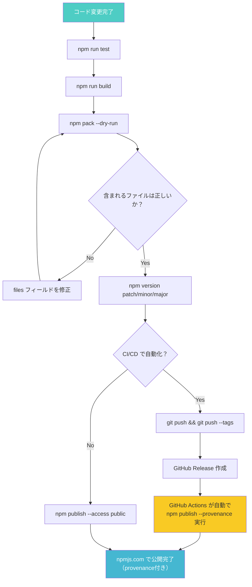

## はじめに

`npm publish` でパッケージを公開する手順自体は、驚くほどシンプルです。`package.json` を書いて、`npm publish` を叩く。これだけで世界中の開発者があなたのコードを `npm install` できるようになります。

しかし、実際に初めて公開しようとすると、意外な落とし穴にはまります。

- **名前が取れない**: スコープなしの名前はほぼ枯渇しており、`403 Forbidden` が返ってくる
- **認証まわりが変わった**: 2025年12月にClassic Tokenが完全失効し、Granular Access Tokenに一本化された
- **CI/CDで自動化したいがトークン管理が面倒**: 書き込み権限付きトークンの有効期限が最大90日に制限された
- **provenanceって何**: `--provenance` フラグを付けるとサプライチェーン攻撃対策になるらしいが、仕組みがわからない

この記事では、2026年3月時点で有効な手順に絞って、npmパッケージの公開方法を最初から最後まで解説します。初めてパッケージを公開する方が迷わず完走でき、CI/CDでの自動化まで一気に進められる構成にしています。

**対象読者**:

- **初心者**: 自作パッケージを初めてnpmに公開したい方
- **中級者**: GitHub Actionsでpublishを自動化し、provenanceを付与したい方

:::message
この記事は「どうやるか（HOW）」にフォーカスしています。「なぜnpmレジストリはこう設計されているのか」「provenanceの署名検証プロトコルはどう機能するのか」といった「なぜ（WHY）」の部分は扱いません。WHYに興味がある方は記事末尾の書籍リンクを参照してください。
:::

## 1. 事前準備: npmアカウントと認証

### npmアカウントの作成

まだアカウントがない場合は、[npmjs.com](https://www.npmjs.com/signup) でアカウントを作成します。メールアドレス、ユーザー名、パスワードを入力するだけです。

### 2FAの有効化（実質必須）

2025年以降、npmは**書き込み権限を持つトークンの生成時に2FAをデフォルトで強制**するようになりました。アカウント作成直後に2FAを設定しておきましょう。

1. npmjs.com にログインする
2. 右上のアバターから **Account** をクリックする
3. **Two-Factor Authentication** セクションで **Enable 2FA** をクリックする
4. 認証アプリ（Google Authenticator、1Password、Authy など）でQRコードを読み取る
5. 生成された6桁のコードを入力して有効化する

2FAを設定していない状態で `npm publish` を実行してもパッケージの公開自体は可能ですが、Granular Access Tokenの作成やTrusted Publishing設定の際には必ず2FAを要求されます。最初に設定しておくのが無難です。

### Granular Access Token（Classic Tokenは廃止済み）

2025年12月9日をもって、npmの**Classic Tokenは完全に廃止・失効**しました。既存のClassic Tokenはすべて無効化されており、新規作成もできません。

CI/CDやスクリプトからnpmにアクセスする場合は、**Granular Access Token** を使用します。

```bash
# Classic Tokenで設定された古い .npmrc は動作しない
# 以下のようなエラーが出る場合、トークンが失効している
npm error code E401
npm error 401 Unauthorized
```

Granular Access Tokenの作成手順は以下のとおりです。

1. [npmjs.com](https://www.npmjs.com/) にログインする
2. 右上のアバターから **Access Tokens** をクリックする
3. **Generate New Token** > **Granular Access Token** を選択する
4. 以下を設定する

| 設定項目 | 推奨値 |
|---------|--------|
| Token name | 用途がわかる名前（例: `github-actions-publish`） |
| Expiration | デフォルト7日、最大90日（書き込み権限付きの場合） |
| Packages | **Only select packages** で対象パッケージを選択 |
| Permissions | **Read and write** |
| Organizations | 必要に応じて選択 |

5. **Generate Token** をクリックする
6. 表示されたトークンをコピーする（**この画面を閉じると二度と表示されない**）

**重要な制約**: 書き込み権限付きトークンの有効期限は**最大90日**です。90日ごとにトークンを再生成してCI/CDのSecretsを更新する運用が必要になります。この面倒を避けるために、後述するOIDC Trusted Publishingの利用を強く推奨します。

### npm login

ターミナルで `npm login` を実行すると、ブラウザが開いて認証フローが始まります。

```bash
npm login
```

npm 11以降では、`npm login` で発行されるのは**2時間有効のセッショントークン**です。以前のように長期間有効なトークンがローカルに保存されることはありません。

```bash
# ログイン状態の確認
npm whoami
# → your-username
```

## 2. package.json の設定

パッケージ公開で最も重要なのは `package.json` の設定です。必須フィールドとベストプラクティスを順に見ていきます。

### 実用的な package.json の全体像

```json
{
  "name": "@your-scope/my-utils",
  "version": "1.0.0",
  "description": "A collection of utility functions for date formatting",
  "main": "./dist/index.cjs",
  "module": "./dist/index.mjs",
  "types": "./dist/index.d.ts",
  "exports": {
    ".": {
      "import": {
        "types": "./dist/index.d.ts",
        "default": "./dist/index.mjs"
      },
      "require": {
        "types": "./dist/index.d.cts",
        "default": "./dist/index.cjs"
      }
    }
  },
  "files": ["dist"],
  "engines": {
    "node": ">=20"
  },
  "license": "MIT",
  "repository": {
    "type": "git",
    "url": "https://github.com/your-name/my-utils.git"
  },
  "publishConfig": {
    "access": "public"
  },
  "keywords": ["utils", "date", "formatter"],
  "scripts": {
    "build": "tsup src/index.ts --format cjs,esm --dts",
    "test": "vitest run",
    "prepublishOnly": "npm run test && npm run build"
  }
}
```

各フィールドを詳しく見ていきます。

### name: スコープ付きを推奨

```json
"name": "@your-scope/my-utils"
```

2026年現在、スコープなしの短い名前（例: `utils`、`helpers`、`logger`）は**ほぼ確実に取得済み**です。スコープなしの名前でpublishしようとすると `403 Forbidden` が返ります。

スコープ付きパッケージ（`@scope/package-name`）を使えば、名前の衝突を避けられます。npmユーザー名がそのままスコープとして使えるため、追加設定は不要です。

```bash
# スコープ付きパッケージはデフォルトでprivate扱い
# publicにするには --access public が必要
npm publish --access public
```

### version: SemVer に従う

```json
"version": "1.0.0"
```

`MAJOR.MINOR.PATCH` の3つの数字で構成されます。

| 変更の種類 | 上がる桁 | 例 |
|:--|:--|:--|
| 後方互換性のない変更（APIの削除・変更） | MAJOR | 1.0.0 → **2**.0.0 |
| 後方互換性のある機能追加 | MINOR | 1.0.0 → 1.**1**.0 |
| バグ修正 | PATCH | 1.0.0 → 1.0.**1** |

最初の公開時は `1.0.0` で問題ありません。「まだ安定していない」と感じる場合は `0.1.0` からスタートする手もありますが、メジャー0系ではキャレット記法（`^0.1.0`）がマイナーバージョンを固定する挙動になる点に注意してください（`^0.1.0` は `>=0.1.0 <0.2.0` と解釈されます）。

### main / module / exports: エントリポイントの定義

Node.js 12以降で導入された `exports` フィールドは、パッケージのエントリポイントを条件ごとに切り替える仕組みです。2026年現在、新規パッケージでは `exports` の設定が事実上の標準です。

```json
"exports": {
  ".": {
    "import": {
      "types": "./dist/index.d.ts",
      "default": "./dist/index.mjs"
    },
    "require": {
      "types": "./dist/index.d.cts",
      "default": "./dist/index.cjs"
    }
  }
}
```

- `"."` はメインエントリポイント（`import "@your-scope/my-utils"` に対応）
- `"import"` は ESM（`import` 文）での解決先
- `"require"` は CJS（`require()` 関数）での解決先
- `"types"` は TypeScript の型定義（**各条件の先頭に置く**のがポイント）

`exports` フィールドが定義されている場合、Node.jsは `main` フィールドを無視します。ただし、古いバンドラー（webpack 4以前など）では `exports` が認識されないため、フォールバックとして `main` と `module` も併記しておくのがベストプラクティスです。

**ESM専用にする場合**は、`"type": "module"` を指定してCJS対応を省略できます。利用者がNode.js 18以降に限定されるなら、この選択肢がビルド設定をシンプルにします。

```json
{
  "type": "module",
  "exports": {
    ".": {
      "types": "./dist/index.d.ts",
      "default": "./dist/index.js"
    }
  }
}
```

### files: 公開ファイルのホワイトリスト

```json
"files": ["dist"]
```

`files` フィールドは、npmパッケージに**含めるファイルのホワイトリスト**です。ここに指定したファイルとディレクトリだけがパッケージに含まれます。`package.json`、`README.md`、`LICENSE` は `files` の指定にかかわらず常に含まれます。

`.npmignore` で除外する方法（ブラックリスト方式）もありますが、`files` フィールド（ホワイトリスト方式）のほうが**意図しないファイルの混入を防ぎやすい**ため推奨です。

```
files フィールド（ホワイトリスト方式） → 推奨
.npmignore（ブラックリスト方式）       → 非推奨
```

`.npmignore` を使うと、新しいファイルを追加するたびに「除外リストに入れ忘れた」というリスクが発生します。`files` なら、明示的に含めたものだけが入るため安全です。特に `.env` やテストデータの漏洩を防ぐ観点からも、ホワイトリスト方式を選んでください。

### engines: 動作環境の明示

```json
"engines": {
  "node": ">=20"
}
```

サポートするNode.jsのバージョンを明示します。2026年3月時点では、Node.js 20がアクティブLTS、Node.js 22が最新LTSです。新規パッケージであれば `>=20` が現実的な設定です。

### repository: ソースコードの場所

```json
"repository": {
  "type": "git",
  "url": "https://github.com/your-name/my-utils.git"
}
```

npmjs.comのパッケージページにリポジトリへのリンクが表示されます。後述するprovenanceの検証にもリポジトリ情報が使われるため、設定しておくことを推奨します。

### publishConfig: 公開設定の固定

```json
"publishConfig": {
  "access": "public"
}
```

`publishConfig.access` を `"public"` に設定しておくと、`npm publish` のたびに `--access public` を指定する必要がなくなります。スコープ付きパッケージをOSSとして公開する場合に便利です。付け忘れによる `402 Payment Required` エラー（有料のプライベートパッケージと見なされる）を防ぐ効果もあります。

### license: ライセンスの明示

```json
"license": "MIT"
```

OSSとして公開するなら、ライセンスの明示は必須です。迷ったら `MIT` が最も広く使われています。ライセンス選択には [choosealicense.com](https://choosealicense.com/) が参考になります。

## 3. 初回 publish の手順

### ビルドから公開まで

```bash
# 1. ビルド（TypeScriptの場合）
npm run build

# 2. 公開されるファイルを事前確認
npm pack --dry-run

# 3. 初回公開（スコープ付きパッケージの場合）
npm publish --access public
```

初回のpublishが成功すると、`https://www.npmjs.com/package/@your-scope/my-utils` でパッケージページが公開されます。反映まで数分かかることがあります。

**重要**: 初回のpublish（パッケージの新規登録）は、後述するOIDC Trusted Publishingでは実行できません。初回だけはローカルまたはGranular Access Tokenを使う必要があります。

### npm pack --dry-run で公開前に確認する

`npm pack --dry-run` は、**実際にtarballを作成せずに**パッケージに含まれるファイルの一覧を表示するコマンドです。publishの前に必ず実行してください。

```bash
npm pack --dry-run
```

```
npm notice Tarball Contents
npm notice 1.2kB  package.json
npm notice 523B   README.md
npm notice 1.1kB  LICENSE
npm notice 4.5kB  dist/index.mjs
npm notice 4.3kB  dist/index.cjs
npm notice 2.1kB  dist/index.d.ts
npm notice === Tarball Details ===
npm notice name:          @your-scope/my-utils
npm notice version:       1.0.0
npm notice filename:      your-scope-my-utils-1.0.0.tgz
npm notice package size:  3.8 kB
npm notice unpacked size: 13.6 kB
npm notice total files:   6
```

確認すべきポイントは3つです。

1. **不要なファイルが入っていないか**: `src/`、`test/`、`.env`、`node_modules/` などが含まれていたら `files` フィールドを修正する
2. **必要なファイルが欠けていないか**: `dist/` 内のビルド成果物が含まれているか確認する
3. **パッケージサイズが妥当か**: 数百KB以上なら、不要なファイルの混入を疑う

より確実に検証したい場合は、tarballを実際に作成してローカルでインストールテストを行います。

```bash
# tarball を作成
npm pack

# 別ディレクトリでインストールテスト
mkdir /tmp/test-install && cd /tmp/test-install
npm init -y
npm install /path/to/your-scope-my-utils-1.0.0.tgz

# ESMの場合の動作確認
node -e "import('@your-scope/my-utils').then(m => console.log(m))"

# CJSの場合の動作確認
node -e "const lib = require('@your-scope/my-utils'); console.log(lib);"
```

### prepublishOnly フック

`package.json` の `scripts` に `prepublishOnly` を定義しておくと、`npm publish` の直前に自動で実行されます。ビルド忘れやテスト漏れを防ぐのに有効です。

```json
{
  "scripts": {
    "build": "tsup src/index.ts --format cjs,esm --dts",
    "test": "vitest run",
    "prepublishOnly": "npm run test && npm run build"
  }
}
```

`prepublishOnly` は `npm publish` の実行時にだけ動きます。`npm install` では実行されないため、利用者側に影響はありません。テストが失敗した場合、publishは自動的に中断されます。

## 4. バージョン管理

### npm version コマンド

コードを修正・追加した後は、バージョンを上げてからpublishします。

```bash
# PATCH: バグ修正（1.0.0 → 1.0.1）
npm version patch

# MINOR: 機能追加（1.0.0 → 1.1.0）
npm version minor

# MAJOR: 破壊的変更（1.0.0 → 2.0.0）
npm version major
```

`npm version` コマンドは以下の3つを自動で行います。

1. `package.json` の `version` フィールドを更新する
2. `package-lock.json` のバージョンも更新する
3. Git環境であれば、変更をコミットしバージョンタグ（`v1.0.1` など）を作成する

```bash
# バージョンを上げてpublish（基本フロー）
npm version patch
npm publish
```

### プレリリースバージョン（alpha / beta / rc）

正式リリース前にテスト版を公開する場合は、プレリリースバージョンを使います。

```bash
# alpha版（1.0.0 → 1.0.1-alpha.0）
npm version prerelease --preid=alpha

# beta版
npm version 1.0.1-beta.0

# RC版（Release Candidate）
npm version 1.0.1-rc.0

# alphaの連番を上げる（1.0.1-alpha.0 → 1.0.1-alpha.1）
npm version prerelease --preid=alpha
```

プレリリースバージョンは `npm install` のデフォルトではインストールされません。利用者は明示的にバージョンを指定する必要があります。

```bash
# プレリリース版を明示的にインストール
npm install @your-scope/my-utils@1.0.1-beta.0
```

### distタグの活用

```bash
# beta タグを付けてpublish（latest を汚さない）
npm publish --tag beta

# latest 以外のタグは npm install のデフォルト対象にならない
npm install @your-scope/my-utils@beta
```

`--tag` を指定しないと `latest` タグが付きます。`latest` は `npm install @your-scope/my-utils` で自動的にインストールされるバージョンです。プレリリース版には必ず `--tag beta` や `--tag next` を付けて、利用者が意図せずプレリリース版をインストールしないようにしてください。

### Gitタグを使わないケース

CI環境でバージョン管理を別ツール（changesets、semantic-releaseなど）に委ねる場合は、Gitタグの自動作成を無効にできます。

```bash
# Gitタグとコミットを作らない
npm version patch --no-git-tag-version
```

## 5. npm publish の全体フロー

ここまでの手順を図にまとめます。



## 6. npm provenance: パッケージの出自を証明する

### provenanceとは何か

`npm publish` に `--provenance` フラグを付けると、パッケージに**SLSA provenance（ビルド元の証明）**が付与されます。具体的には、以下の3つが暗号学的に証明されます。

- **どのGitHubリポジトリ**のコードからビルドされたか
- **どのコミット**（SHA）からビルドされたか
- **どのCI/CDワークフロー**でビルドされたか

npmjs.comのパッケージページに緑色の「Provenance」バッジが表示され、利用者がビルド元を検証できるようになります。

### なぜprovenanceが必要なのか

npm publishは、npmアカウントにログインできれば誰でも実行できます。つまり、メンテナのアカウントが乗っ取られた場合、攻撃者は悪意あるコードを含むバージョンをpublishできてしまいます。

provenanceがあれば、「このバージョンは本当に公式リポジトリのコードから、公式のCIパイプラインでビルドされたのか」を利用者側で検証できます。攻撃者がアカウントを乗っ取ってローカルからpublishした場合、provenanceは付与されないため、異常に気づきやすくなります。

### 使い方

```bash
# CI環境（GitHub ActionsまたはGitLab CI/CD）から
npm publish --provenance --access public
```

provenanceの生成にはCI/CD環境のOIDCトークンが必要です。ローカルの開発マシンからは利用できません。2026年3月時点で対応しているCI/CDは以下の2つです。

- **GitHub Actions**（2025年7月GA）
- **GitLab CI/CD**（2025年後半に対応）

### Sigstoreによる署名検証

provenanceの裏側では、**Sigstore** というオープンソースの署名基盤が使われています。CI/CDが生成したOIDCトークンをSigstoreが検証し、短命の署名証明書を発行します。この署名はtlog（Transparency Log）に記録され、後から改ざんされていないことを第三者が検証できます。

### provenanceの検証方法

公開されたパッケージのprovenanceは、npmjs.comのパッケージページで確認できます。CLIからも検証可能です。

```bash
# インストール済みパッケージの署名を一括検証
npm audit signatures
```

このコマンドは、provenance付きパッケージの署名が有効かどうかを検証します。改ざんされたパッケージがあれば警告が表示されます。

:::message
npm provenanceはOIDC Trusted Publishingとtlog（Transparency Log）という仕組みで成り立っています。なぜこの設計でサプライチェーン攻撃を防げるのか、Sigstoreの署名検証プロトコルの詳細は、書籍 [パッケージマネージャ from scratch](https://zenn.dev/yuichi_ai/books/package-manager-from-scratch) の第9章で図解付きで解説しています。
:::

## 7. CI/CD での自動 publish: GitHub Actions + OIDC Trusted Publishing

### OIDC Trusted Publishing とは

OIDC Trusted Publishingは、GitHub Actionsから**npmトークンなしで**パッケージをpublishできる仕組みです。2025年7月にGA（一般提供）となりました。

従来のCI/CDパイプラインでは、Granular Access TokenをGitHub Secretsに保存して利用していました。OIDC Trusted Publishingでは、GitHub Actionsの実行時にOpenID Connectプロトコルで短命のIDトークンを生成し、npmがそのトークンの署名を検証することでpublishを許可します。

**長期間有効なシークレットが一切存在しない**ため、漏洩リスクがゼロになります。さらに、トークンの有効期限切れ（90日制限）を気にする必要もなくなります。

### npm側の設定

1. npmjs.comにログインする
2. 対象パッケージのページを開く
3. **Settings** タブをクリックする
4. **Publishing access** セクションで **Trusted Publishing with GitHub (OIDC)** を有効にする
5. GitHubリポジトリの情報を入力する

| 設定項目 | 入力例 |
|---------|--------|
| Repository owner | `your-github-username` |
| Repository name | `my-utils` |
| Workflow filename | `publish.yml` |
| Environment (optional) | 空欄でOK（GitHub Environmentsを使う場合はその名前を入力） |

### GitHub Actions ワークフロー

以下のYAMLファイルをリポジトリの `.github/workflows/publish.yml` として保存してください。そのままコピペで使えます。

```yaml
# .github/workflows/publish.yml
name: Publish to npm

on:
  release:
    types: [published]

jobs:
  publish:
    runs-on: ubuntu-latest
    permissions:
      id-token: write    # OIDC Trusted Publishing に必須
      contents: read
    steps:
      - name: Checkout
        uses: actions/checkout@v4

      - name: Setup Node.js
        uses: actions/setup-node@v4
        with:
          node-version: 22
          registry-url: https://registry.npmjs.org

      - name: Install dependencies
        run: npm ci

      - name: Run tests
        run: npm test

      - name: Build
        run: npm run build

      - name: Publish with provenance
        run: npm publish --provenance --access public
```

**ポイント**:

- `permissions.id-token: write` が必須です。これがないとOIDCトークンが生成されず、publishが `ENEEDAUTH` エラーで失敗します
- `registry-url: https://registry.npmjs.org` を `setup-node` で指定することで、npmレジストリへの接続が正しく構成されます
- `--provenance` フラグにより、SLSA provenanceが自動で付与されます
- `NODE_AUTH_TOKEN` や `NPM_TOKEN` の設定は**不要**です。OIDCトークンが自動的に使われます
- `on: release` トリガーにより、GitHub上でReleaseを作成したときにワークフローが起動します

### リリースの流れ

```bash
# 1. バージョンを上げてタグを打つ
npm version patch
git push && git push --tags

# 2. GitHub で Release を作成する（gh CLI を使う場合）
gh release create v1.0.1 --generate-notes

# 3. GitHub Actions が自動で npm publish --provenance を実行する
# 4. npmjs.com に provenance 付きで公開される
```

### 動作要件

| 要件 | 最低バージョン |
|------|------------|
| npm CLI | 11.5.1 以上 |
| Node.js | 22.14.0 以上 |
| GitHub Actions permissions | `id-token: write` |

### 制限事項

- **初回publish（パッケージの新規登録）はOIDCでは実行できません。** 初回だけはローカルまたはGranular Tokenで手動publishする必要があります
- npmjs.com側で事前にTrusted Publisherとして登録されたリポジトリ・ワークフローからのみ動作します。登録していないリポジトリからのpublishは拒否されます
- ワークフローファイル名がnpmjs.comに登録した名前と一致している必要があります

### Granular Access Token を使うワークフロー（OIDC非対応環境向け）

何らかの理由でOIDC Trusted Publishingが使えない場合（初回publishのCI自動化、npmjs.comでの設定ができない場合など）は、Granular Access TokenをGitHub Secretsに保存して使います。

```yaml
# .github/workflows/publish-with-token.yml
name: Publish to npm (Token)

on:
  release:
    types: [published]

jobs:
  publish:
    runs-on: ubuntu-latest
    steps:
      - name: Checkout
        uses: actions/checkout@v4

      - name: Setup Node.js
        uses: actions/setup-node@v4
        with:
          node-version: 22
          registry-url: https://registry.npmjs.org

      - name: Install dependencies
        run: npm ci

      - name: Run tests
        run: npm test

      - name: Build
        run: npm run build

      - name: Publish with provenance
        run: npm publish --provenance --access public
        env:
          NODE_AUTH_TOKEN: ${{ secrets.NPM_TOKEN }}
```

この方式では、90日ごとにGranular Access Tokenを再生成して `NPM_TOKEN` シークレットを更新する運用が必要です。GitHub Actionsの `Settings > Secrets and variables > Actions` から `NPM_TOKEN` を設定してください。

## 8. npm publish のよくあるトラブル

### 403 Forbidden: パッケージ名が重複している

```
npm error code E403
npm error 403 Forbidden - PUT https://registry.npmjs.org/my-utils
```

**原因**: スコープなしの名前が既に取得されています。

**対処法**: スコープ付きの名前（`@your-scope/my-utils`）に変更してください。

```bash
# package.json の name を変更した上で
npm publish --access public
```

### 403 Forbidden: 認証エラー

```
npm error code E403
npm error 403 Forbidden - PUT https://registry.npmjs.org/@your-scope/my-utils
npm error You do not have permission to publish
```

**原因**: ログインしていないか、トークンが失効しています。

**対処法**:

```bash
# ログイン状態を確認
npm whoami

# 失効していたら再ログイン
npm login
```

### 402 Payment Required: access 指定漏れ

```
npm error code E402
npm error 402 Payment Required
```

**原因**: スコープ付きパッケージがprivate扱いになっています（npmの有料プランが必要と判断された）。

**対処法**: `--access public` を付けるか、`publishConfig.access` を `"public"` に設定してください。

```bash
npm publish --access public
```

### ENEEDAUTH: OIDCでpublishが失敗する

```
npm error code ENEEDAUTH
```

**チェック項目**:

1. ワークフローに `permissions.id-token: write` が設定されているか
2. npm CLIが11.5.1以上、Node.jsが22.14.0以上か
3. npmjs.comでTrusted Publisherとして正しいリポジトリ・ワークフロー名が登録されているか
4. **初回publishではないか**（初回はOIDC不可。ローカルで手動publishが必要）

### パッケージが大きすぎる（npmignore漏れ）

```
npm notice package size: 15.2 MB
```

tarballが数MB以上になっている場合、不要なファイル（`node_modules/`、テストファイル、ソースマップなど）が含まれている可能性があります。

```bash
# 含まれるファイルを確認
npm pack --dry-run

# package.json で files フィールドを設定
# "files": ["dist"]
```

### npm version でGitエラーが出る

```
npm error Git working directory not clean.
```

**対処法**: 未コミットの変更をコミットしてから `npm version` を実行してください。

```bash
git add -A && git commit -m "prepare for release"
npm version patch
```

### prepublishOnlyでテストが落ちる

`prepublishOnly` スクリプトが失敗すると、publishは実行されません。これは意図された安全機構です。テストを修正してから再度 `npm publish` を実行してください。

```bash
# テストだけ先に実行して問題を特定する
npm test

# テスト修正後
npm publish
```

### dry-run で最終確認する習慣

トラブルの多くは、publishの前に `npm pack --dry-run` と `npm publish --dry-run` を実行することで事前に検出できます。

```bash
# パッケージ内容の確認
npm pack --dry-run

# publishの模擬実行（実際にはpublishされない）
npm publish --dry-run --access public
```

`npm publish --dry-run` は、認証やパッケージ名の重複を含め、publishプロセスの大部分をシミュレーションします。本番publishの前に必ず一度実行する習慣を付けてください。

## 9. まとめ + 次のステップ

### npm publish チートシート

```bash
# === 初回セットアップ ===
npm login                         # npmにログイン（2FA必須）
npm init --scope=@your-scope      # スコープ付きpackage.jsonを生成

# === 公開前の確認 ===
npm run build                     # ビルド
npm pack --dry-run                # 含まれるファイルの確認
npm publish --dry-run             # publishの模擬実行

# === 初回公開 ===
npm publish --access public       # スコープ付きパッケージの初回公開

# === アップデート公開 ===
npm version patch                 # バージョンアップ（patch/minor/major）
npm publish                       # 公開

# === CI/CD（OIDC Trusted Publishing） ===
# 1. npmjs.comでTrusted Publisher登録
# 2. GitHub Actionsワークフロー（publish.yml）を配置
# 3. npm version patch → git push --tags → GitHub Releaseで自動publish
```

### この記事のポイントまとめ

| 項目 | 推奨 |
|------|------|
| パッケージ名 | スコープ付き（`@scope/name`） |
| 公開ファイル管理 | `files` フィールド（ホワイトリスト方式） |
| 認証トークン | OIDC Trusted Publishing（トークン不要） |
| Granular Token | 有効期限最大90日。OIDC非対応時のフォールバック |
| Classic Token | 2025年12月に廃止済み。使用不可 |
| provenance | `--provenance` フラグでビルド元を暗号学的に証明 |
| 公開前確認 | `npm pack --dry-run` を必ず実行 |
| ビルド忘れ防止 | `prepublishOnly` フックを設定 |

---

この記事ではnpm publishの「手順（HOW）」にフォーカスしました。

しかし、手順を知るだけでは解決できない疑問が残るかもしれません。

- 「`npm publish` が裏側でレジストリに送っているHTTPリクエストの中身は何か」
- 「provenanceのOIDC検証フローはどう機能しているのか」
- 「なぜtarballにはSHA-512のintegrityが付与されるのか」

これらの「なぜこう設計されているのか（WHY）」を理解するには、レジストリプロトコルとセキュリティモデルの知識が必要です。

拙著 **[パッケージマネージャ from scratch](https://zenn.dev/yuichi_ai/books/package-manager-from-scratch)** では、第2章でnpmレジストリのHTTP APIとtarball構造を、第9章でOIDC Trusted Publishing・Sigstore・サプライチェーンセキュリティの全体像を図解付きで解説しています。第1章から第3章は無料公開しているので、まずはそちらからお試しください。
