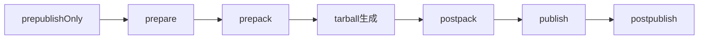

## `npm run build` だけで終わっていませんか？

プロジェクトで `npm run build` や `npm run dev` は日常的に使っている。しかし、scripts フィールドをじっくり読んだことがある開発者は意外と少ない。

npm scripts は「コマンドのエイリアス」に過ぎないと思われがちだが、pre/post フック、ライフサイクルスクリプト、環境変数、並列実行、ワークスペース連携と、想像以上に多機能だ。

この記事では npm scripts の「書き方（HOW）」を網羅的に解説する。対象読者は「npm scripts をなんとなく使っているが、体系的に学んだことがない」初中級の開発者だ。

## 1. 基本の書き方

npm scripts は `package.json` の `scripts` フィールドにキーバリュー形式で定義し、`npm run <name>` で実行する。

```json
{
  "scripts": {
    "build": "tsc --project tsconfig.build.json",
    "lint": "eslint . --ext .ts,.tsx",
    "test": "vitest run"
  }
}
```

一部のスクリプト名は省略形で実行できる。

| スクリプト名 | 省略形 |
|---|---|
| `start` | `npm start` |
| `test` | `npm test` / `npm t` |
| `stop` | `npm stop` |
| `restart` | `npm restart` |

`build` には省略形がない。`npm build` は別の内部コマンドなので `npm run build` と書く必要がある。なお `npm run` を引数なしで実行すると、定義済みスクリプトの一覧が表示される。

## 2. pre/post フック

任意のスクリプト名の前に `pre` / `post` を付けたスクリプトを定義すると、メインスクリプトの前後に自動実行される。

```json
{
  "scripts": {
    "pretest": "npm run lint",
    "test": "vitest run",
    "prebuild": "rm -rf dist",
    "build": "tsc",
    "postbuild": "cp package.json dist/"
  }
}
```

`npm run build` を実行すると `prebuild` → `build` → `postbuild` の順に3つが自動実行される。この仕組みはユーザー定義スクリプトにも適用され、`deploy` を定義すれば `predeploy` / `postdeploy` も認識される。

### npm v7 以降の注意点

npm v7 以降、依存パッケージの `preinstall` / `postinstall` はバックグラウンド実行に変更された。出力確認には `--foreground-scripts` フラグが必要になる。

```bash
npm install --foreground-scripts
```

これはサプライチェーン攻撃対策だ。悪意のあるパッケージが `postinstall` で任意コードを実行する問題への対処として、出力がデフォルトで抑制されるようになった。信頼性の低い依存がある場合は `--ignore-scripts` での無効化も検討に値する。

## 3. 組み込みスクリプト（ライフサイクルスクリプト）

npm には `npm install` や `npm publish` 時に自動実行される特別なスクリプトがある。

| スクリプト名 | 実行タイミング | 主な用途 |
|---|---|---|
| `prepare` | install後、pack/publish前 | husky設定、ビルド |
| `prepublishOnly` | publish直前のみ | 公開前のテスト・ビルド |
| `prepack` | tarball生成前 | ファイル準備 |
| `postpack` | tarball生成後 | クリーンアップ |

`prepare` は最重要ライフサイクルスクリプトで、`npm install`（引数なし）の後、`npm pack` / `npm publish` の前、Git依存インストール後に自動実行される。典型的な用途は husky のセットアップだ。

```json
{ "scripts": { "prepare": "husky" } }
```

`prepublishOnly` はビルド忘れ防止のガードとして有効。

```json
{ "scripts": { "prepublishOnly": "npm run lint && npm test && npm run build" } }
```

### npm publish 時のライフサイクル順序



:::message
npm scriptsのライフサイクル（prepare, prepublishOnly等）は、パッケージの公開・インストールの各段階で自動実行されます。なぜこの順序で実行されるのか、各フックの設計意図は、書籍 [パッケージマネージャ from scratch](https://zenn.dev/yuichi_ai/books/package-manager-from-scratch) の第1章と第2章で解説しています。
:::

## 4. 環境変数

### `npm_package_*` と `npm_config_*`

npm scripts 実行時、package.json のフィールドが `npm_package_` プレフィックス付き環境変数として利用できる。

```json
{
  "name": "my-app", "version": "1.2.3",
  "scripts": { "info": "echo $npm_package_name@$npm_package_version" }
}
```

Node.js からは `process.env.npm_package_name` で参照する。また `npm run build --my_flag=hello` のように渡した値は `npm_config_my_flag` で取得できる。

### `NODE_ENV` と cross-env

`NODE_ENV=production webpack` という構文は macOS/Linux では動くが Windows の `cmd.exe` では動かない。**cross-env** がこの差異を吸収する。

```bash
npm install --save-dev cross-env
```

```json
{
  "scripts": {
    "build:prod": "cross-env NODE_ENV=production webpack",
    "build:dev": "cross-env NODE_ENV=development webpack"
  }
}
```

チームに Windows 開発者が1人でもいるなら cross-env を入れておくのが安全だ。cross-env は2025年11月にリポジトリがアーカイブされメンテナンスモードに入ったが、セキュリティ修正と Node.js 対応は継続されている。v8 は Node.js 20以上が必要で、18以下は v7 を使う。

## 5. 引数の渡し方

`--` セパレータより後ろの引数がスクリプトにパススルーされる。

```bash
npm run test -- --watch          # vitest run --watch
npm run test -- --coverage       # vitest run --coverage
npm test -- src/utils/           # vitest run src/utils/
npm run lint -- --fix            # eslint . --fix
```

`--` がないと npm 自身がフラグを解釈しようとして意図しない動作になる。

## 6. 並列・直列実行

### シェル演算子

```json
{
  "scripts": {
    "ci": "npm run lint && npm run test && npm run build",
    "dev": "npm run watch-ts & npm run watch-css"
  }
}
```

`&&` は直列（前が失敗で停止）、`&` は並列だが **Windows の `cmd.exe` では `&` が動かない**。

### npm-run-all2（推奨）

オリジナルの `npm-run-all` はメンテナ不在のため、2026年現在はメンテナンスフォークの **npm-run-all2** が推奨。API完全互換のドロップインリプレースメントだ。

```bash
npm install --save-dev npm-run-all2
```

```json
{
  "scripts": {
    "lint": "eslint .", "typecheck": "tsc --noEmit",
    "test": "vitest run", "build": "tsc",
    "ci": "run-s lint typecheck test build",
    "watch:ts": "tsc --watch",
    "watch:css": "postcss --watch",
    "dev": "run-p watch:*"
  }
}
```

`run-s` が直列、`run-p` が並列。`run-p watch:*` のように glob パターンで一括起動できるのが大きな利点で、スクリプト追加だけで `dev` に自動反映される。

移行は `npm uninstall npm-run-all && npm i -D npm-run-all2` の1コマンドで完了する。

### concurrently

各プロセスの出力にプレフィックス（名前・色）を付けて視認性を高める並列実行ツール。

```json
{
  "scripts": {
    "dev": "concurrently -n ts,srv -c blue,yellow \"tsc --watch\" \"nodemon\""
  }
}
```

出力の視認性が重要な開発サーバー系には concurrently、glob パターンが必要な場合は npm-run-all2 と使い分ける。

## 7. ワークスペースでのスクリプト実行

モノレポでルートから各パッケージのスクリプトを実行する構文は、パッケージマネージャごとに異なる。

```bash
# npm
npm run build -w packages/ui          # 単一
npm run build --workspaces             # 全て
npm run build -ws --if-present         # スクリプト未定義のパッケージをスキップ

# pnpm
pnpm --filter @myorg/ui run build     # 単一
pnpm -r run build                      # 全て
pnpm --filter @myorg/ui... run build   # 依存含む

# yarn (Berry)
yarn workspace @myorg/ui run build    # 単一
yarn workspaces foreach --parallel --topological run build  # 全て（依存順）
```

## 8. よくあるパターン集

### CI パイプライン

```json
{ "scripts": { "ci": "run-s lint typecheck test build" } }
```

直列実行で、リント失敗時に後続を実行しない。

### pre-commit（husky v9 + lint-staged v15）

```bash
npm install --save-dev husky lint-staged
npx husky init
```

`.husky/pre-commit` に `npx lint-staged` を記述し、package.json に設定を追加する。

```json
{
  "scripts": { "prepare": "husky" },
  "lint-staged": {
    "*.{ts,tsx}": ["eslint --fix", "prettier --write"],
    "*.{json,md,yml}": ["prettier --write"]
  }
}
```

`git commit` 時にステージされたファイルのみリント・フォーマットされ、失敗するとコミットが中止される。

### watch 開発

```json
{
  "scripts": {
    "dev:client": "vite dev",
    "dev:server": "tsx watch src/server/index.ts",
    "dev": "run-p dev:*"
  }
}
```

### リリース前チェック

```json
{
  "scripts": {
    "prerelease": "run-s typecheck build size",
    "release": "npm publish"
  }
}
```

pre フックにより、型チェック・ビルド・サイズチェックを全てパスしないと publish されない。

### 環境別ビルド

```json
{
  "scripts": {
    "build": "cross-env NODE_ENV=production webpack",
    "build:dev": "cross-env NODE_ENV=development webpack"
  }
}
```

### 命名規則のコツ

コロン区切り（`dev:client`、`db:migrate`）にすると、`npm run` の一覧でカテゴリがグルーピングされ、`run-p dev:*` のような glob 一括実行も可能になる。JSON にはコメントが書けないため、スクリプト名自体を説明的にするのが整理のコツだ。

## 9. まとめ

| 機能 | 要点 |
|---|---|
| 基本構文 | `npm run <name>`。`test`/`start` は省略形あり |
| pre/post | `pre<name>`/`post<name>` で前後に自動実行 |
| ライフサイクル | `prepare`、`prepublishOnly` は公開フローで重要 |
| 環境変数 | `npm_package_*` で参照。Windows 対応に cross-env |
| 引数 | `--` でパススルー |
| 並列実行 | npm-run-all2 の `run-p`/`run-s` が実用的 |
| ワークスペース | `-w`/`--workspaces` で一括実行 |
| 命名規則 | コロン区切りで整理、glob で一括実行 |

npm scripts は「シェルコマンドのエイリアス」をはるかに超えた、プロジェクトのタスクランナーとして十分な機能を持っている。Makefile や Gulp を導入する前に、まず npm scripts でできないか検討する価値がある。

---

この記事では npm scripts の「書き方（HOW）」を網羅的に解説した。しかし、手順を知るだけでは解決できない疑問もある。

- 「`prepare` と `prepublishOnly` は歴史的にどう分離されたのか」
- 「`npm install` 時のスクリプト実行順序はなぜこうなっているのか」
- 「パッケージマネージャはライフサイクルスクリプトをどう設計しているのか」

これらの「なぜこう設計されているのか（WHY）」を理解するには、パッケージマネージャの内部構造の知識が必要だ。

拙著 **[パッケージマネージャ from scratch](https://zenn.dev/yuichi_ai/books/package-manager-from-scratch)** では、npm/pnpm/yarn の設計思想と依存解決アルゴリズムを、実装コード付きで解説している。第1章から第3章は無料公開しているので、まずはそちらから読んでみてほしい。

---
