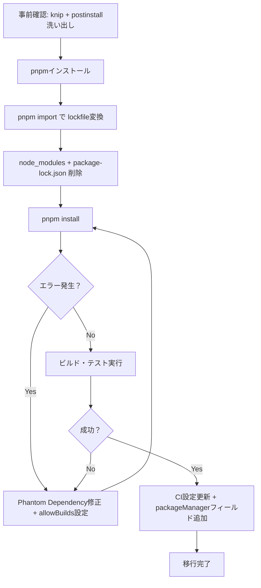

## はじめに ── pnpmへの移行は「思ったほど難しくない」

「pnpmが速くてディスク効率も良いのは知っている。でも、既存プロジェクトを移行するのは大変そうだ」

この不安を抱えている開発者は多い。しかし結論から言えば、**pnpmには`pnpm import`という移行専用コマンドがあり、既存の`package-lock.json`や`yarn.lock`から`pnpm-lock.yaml`を一発で生成できる**。多くのプロジェクトで移行作業自体は30分から1時間で完了する。

pnpmに移行する3つの理由を簡潔にまとめておく。

**1. インストール速度の向上**
キャッシュ済みの再インストールでnpmの2〜3倍、コールドインストールでも1.5倍以上高速。依存解決・ダウンロード・ファイル配置を並列実行するアーキテクチャが効いている。

**2. ディスク使用量の大幅削減**
Content-Addressable Store（CAS）にパッケージの実体を1つだけ保存し、各プロジェクトからハードリンクで参照する。10個のプロジェクトが同じバージョンの`lodash`を使っていても、ディスク上の実体は1コピーのみ。

**3. 厳密な依存管理**
`package.json`に宣言していないパッケージは`require`/`import`できない。npmでは動いていた「宣言していない間接依存を使うコード」がpnpmではエラーになる。これは一見デメリットに見えるが、実際には潜在的なバグを移行時に洗い出してくれるメリットだ。

この記事では、npm/yarnからpnpmへの移行手順をステップバイステップで解説する。移行前の確認から、CI/CD設定の更新、モノレポ対応、よくあるトラブルの対処法までカバーする。

:::message
この記事は「HOW（移行手順）」にフォーカスしている。「なぜpnpmはnpmより速いのか」「Content-Addressable Storeの内部構造はどうなっているのか」といったWHY（設計原理）については、記事末尾で紹介する書籍で詳しく解説している。
:::

## 移行前の確認事項

移行作業に入る前に、2つのチェックを行う。この事前確認を省略すると、移行後のエラー修正に不要な時間がかかる。

### 確認1: Phantom Dependency（幽霊依存）の存在確認

Phantom Dependencyとは、`package.json`に宣言していないのに`require`/`import`で使えてしまっているパッケージのことだ。npmのフラットな`node_modules`構造では間接依存がトップレベルに配置されるため、宣言なしでも偶然アクセスできてしまう。

pnpmに移行するとこの「偶然のアクセス」が遮断されるため、Phantom Dependencyがエラーとして表面化する。事前に洗い出しておけば、移行後のエラー修正が大幅に楽になる。

```bash
# knipで宣言されていない依存を検出する
npx knip
```

出力の中で`Unlisted dependencies`に表示されたパッケージがPhantom Dependencyの候補だ。

```
Unlisted dependencies (3)
debug            src/app.js
cookie           src/middleware.js
qs               src/routes/api.js
```

この時点で明示的にインストールしておくと、移行がスムーズになる。

```bash
npm install debug cookie qs
```

### 確認2: postinstallスクリプト依存の洗い出し

pnpm v10では、依存パッケージの`postinstall`スクリプトが**デフォルトで実行されなくなった**。ネイティブモジュール（`sharp`、`bcrypt`、`esbuild`、`sqlite3`など）を使っている場合は、移行後に明示的な許可設定が必要になる。

事前に確認しておこう。

```bash
# postinstallスクリプトを持つ依存を一覧表示
node -e "
const lock = require('./package-lock.json');
const pkgs = lock.packages || {};
Object.entries(pkgs).forEach(([name, info]) => {
  if (info.hasInstallScript) {
    console.log(name.replace('node_modules/', ''));
  }
});
"
```

yarn.lockを使っている場合は、以下の方法でも確認できる。

```bash
# node_modulesを走査してpostinstallを持つパッケージを確認
find node_modules -maxdepth 2 -name package.json -exec \
  node -e "const p=require('./' + process.argv[1]); \
  if(p.scripts && p.scripts.postinstall) console.log(p.name)" {} \;
```

表示されたパッケージ名は控えておく。後のステップで`allowBuilds`の設定に使う。

## pnpmのインストール

pnpmのインストール方法は2つある。2026年現在、**Corepack経由が推奨**だ。

### 方法A: Corepack経由（推奨）

Corepackは Node.js に同梱されているパッケージマネージャ管理ツールだ。

```bash
# Corepackを有効化
corepack enable

# pnpm v10の最新版をアクティベート
corepack use pnpm@latest-10
```

`corepack use`を実行すると、`package.json`に`packageManager`フィールドが自動追加される。

```json
{
  "packageManager": "pnpm@10.6.0+sha512.xxx..."
}
```

このフィールドにより、チームメンバーやCIが同じバージョンのpnpmを使うことが保証される。

### 方法B: npmでグローバルインストール（非推奨だが可能）

```bash
npm install -g pnpm
```

この方法でもインストールできるが、バージョン固定の仕組みがないため、チーム開発やCI環境ではCorepack経由を推奨する。

### バージョン確認

```bash
pnpm --version
# 10.x.x が表示されればOK
```

## npmからの移行手順

npmからpnpmへの移行手順を7ステップで解説する。全体の流れを先にフローチャートで把握しよう。



### ステップ1: pnpmをインストールする

前のセクションで解説した方法でpnpmをインストールする。

```bash
corepack enable
corepack use pnpm@latest-10
```

### ステップ2: `pnpm import`でlockfileを変換する

**`package-lock.json`を削除する前に**、以下を実行する。

```bash
pnpm import
```

このコマンドは`package-lock.json`を読み取り、`pnpm-lock.yaml`を生成する。既存のlockfileに記録されたバージョン情報がそのまま引き継がれるため、**依存のバージョンが勝手に変わることはない**。

```
Lockfile is up to date, resolution step is skipped
Packages: +650
Progress: resolved 650, reused 0, downloaded 650, added 650, done
```

### ステップ3: node_modulesと旧lockfileを削除する

```bash
rm -rf node_modules package-lock.json
```

`package-lock.json`の削除はこのタイミングで行う。ステップ2の`pnpm import`が完了するまでは残しておくこと。

### ステップ4: `pnpm install`を実行する

```bash
pnpm install
```

ここでpnpmの厳密な`node_modules`構造が構築される。pnpmの`node_modules`はnpmとは異なり、直接依存のみがトップレベルに配置される。間接依存は`.pnpm`ディレクトリ内にフラットに格納され、シンボリックリンクで正しい依存関係が構築される。

### ステップ5: ビルド・テストを実行して動作確認する

```bash
pnpm run build
pnpm run test
pnpm run dev  # 開発サーバーの起動確認
```

ここでエラーが出た場合は、次のセクション「Phantom Dependency修正」で対処する。エラーなく通ればステップ6へ進む。

### ステップ6: CI設定を更新する

CI/CD設定の更新については後のセクションで詳しく解説する。

### ステップ7: package.jsonの`packageManager`フィールドを追加する

Corepackを使ってインストールした場合は既に追加されているが、手動インストールの場合は以下を追加する。

```json
{
  "name": "my-project",
  "packageManager": "pnpm@10.6.0"
}
```

バージョンは**正確なバージョン**を指定する（範囲指定は不可）。現在のバージョンは`pnpm --version`で確認できる。

最後に`.gitignore`を確認する。

```gitignore
# 追加（なければ）
node_modules/

# pnpmではこれらは不要なので削除
# package-lock.json （既に削除済み）
```

## yarnからの移行手順

yarn（Classic / Berry 問わず）からの移行も、`pnpm import`が`yarn.lock`に対応しているため、基本的な流れは同じだ。

```bash
# 1. pnpmをインストール
corepack enable
corepack use pnpm@latest-10

# 2. yarn.lockからpnpm-lock.yamlを生成
pnpm import

# 3. node_modulesとyarn関連ファイルを削除
rm -rf node_modules yarn.lock .yarnrc.yml .yarn/ .pnp.cjs .pnp.loader.mjs

# 4. pnpmでインストール
pnpm install

# 5. 動作確認
pnpm run build && pnpm run test
```

### .yarnrc.ymlから.npmrcへの変換

Yarn Berry（v2以降）を使っていた場合、`.yarnrc.yml`の設定を`.npmrc`に移行する必要がある。主要な設定項目の対応表を示す。

| .yarnrc.yml（Yarn Berry） | .npmrc（pnpm） |
|---|---|
| `npmRegistryServer: "https://registry.example.com/"` | `registry=https://registry.example.com/` |
| `npmAuthToken: "${NPM_TOKEN}"` | `//registry.example.com/:_authToken=${NPM_TOKEN}` |
| `nodeLinker: node-modules` | （デフォルトで`node_modules`構造） |
| `nodeLinker: pnp` | （pnpmでは非対応、`node_modules`に移行） |

```ini
# .npmrc の例（Yarn Berryの設定から移行）
registry=https://registry.example.com/
//registry.example.com/:_authToken=${NPM_TOKEN}
```

### Yarn Berry固有の注意点

- **PnPモード**: Yarn BerryでPnP（Plug'n'Play）を使っていた場合、`.pnp.cjs`と`.pnp.loader.mjs`は不要になる。pnpmは`node_modules`構造を使用するため、PnP固有の設定は削除して問題ない
- **Zero-Installs**: `.yarn/cache`にパッケージをコミットしていた場合は、`.gitignore`から`.yarn/cache`を除外していた行を削除する
- **`yarn.lock`のフォーマット**: Yarn BerryのlockfileはYarn Classic形式と異なるが、`pnpm import`はどちらにも対応している

## Phantom Dependency修正

pnpmへの移行で最も頻繁に遭遇するのが、Phantom Dependencyに起因するエラーだ。代表的なパターンと対処法をまとめる。

### パターン1: `Cannot find module`

最も一般的なエラーだ。

```
Error: Cannot find module 'qs'
Require stack:
- /app/src/routes/api.js
```

**対処法**: エラーに表示されたパッケージを明示的にインストールする。

```bash
pnpm add qs
```

移行前チェックで`knip`の結果を控えていた場合は、まとめて追加できる。

```bash
pnpm add debug cookie qs
```

### パターン2: TypeScriptの型定義が見つからない

```
error TS2307: Cannot find module 'express' or its corresponding type declarations.
```

`@types/*`パッケージが幽霊依存になっているケースだ。別のパッケージの間接依存として`@types/node`が入っていたものが、pnpmでは見えなくなる。

**対処法**: 型定義パッケージを`devDependencies`に追加する。

```bash
pnpm add -D @types/node @types/express
```

### パターン3: ESLint / Prettierプラグインのエラー

```
ESLint couldn't find the plugin "eslint-plugin-import".
```

ESLintの共有設定（`eslint-config-*`）が間接的に持つプラグインが、pnpmの厳密な構造では見えなくなることがある。

**対処法**: プラグインを明示的にインストールする。

```bash
pnpm add -D eslint-plugin-import eslint-plugin-react
```

### パターン4: pnpm.overridesによる一括指定

大量のPhantom Dependencyがある場合や、特定のバージョンに固定したい場合は、`pnpm.overrides`を使って一括指定できる。

```json
{
  "pnpm": {
    "overrides": {
      "debug": "^4.3.4",
      "qs": "^6.11.0"
    }
  }
}
```

ただし、`pnpm.overrides`は一時的な回避策として使い、最終的には各パッケージの`package.json`に正しく宣言することを推奨する。

:::message
Phantom Dependencyはnpmのホイスティング（巻き上げ）という設計上の問題から生じます。なぜnpmはフラット化するのか、pnpmのContent-Addressable Storeがなぜこの問題を解決できるのかは、書籍 [パッケージマネージャ from scratch](https://zenn.dev/yuichi_ai/books/package-manager-from-scratch) の第3章（node_modules構造）と第6章（pnpmアーキテクチャ）で図解付きで解説しています。
:::

## pnpm v10のセキュリティ設定

pnpm v10はセキュリティに関する重要な破壊的変更を含んでいる。npm/yarnから移行する際に特に注意すべき2つの設定を解説する。

### allowBuilds（postinstallデフォルト無効）

pnpm v10では、依存パッケージの`postinstall`スクリプトが**デフォルトで実行されない**。これはサプライチェーン攻撃対策としての設計判断だ。

npmでは`postinstall`が無条件に実行されていたため、悪意あるパッケージが`npm install`だけで任意のコードを実行できるリスクがあった。pnpm v10ではビルドを許可するパッケージを明示的にホワイトリスト指定する「opt-in」モデルに移行している。

`package.json`に以下を追加して、ビルドが必要なパッケージを許可する。pnpm v10.26以降では`allowBuilds`が推奨設定だ。

```json
{
  "pnpm": {
    "allowBuilds": {
      "esbuild": true,
      "sharp": true,
      "bcrypt": true,
      "sqlite3": true
    }
  }
}
```

pnpm v10.25以前を使用している場合は、旧形式の`onlyBuiltDependencies`を使用する。

```json
{
  "pnpm": {
    "onlyBuiltDependencies": ["esbuild", "sharp", "bcrypt", "sqlite3"]
  }
}
```

対話的に許可パッケージを選択する`pnpm approve-builds`コマンドも利用できる。

```bash
pnpm approve-builds
```

移行前チェックで控えておいたパッケージ名を使い、許可設定を行った上で再度インストールを実行する。

```bash
pnpm install
```

### minimumReleaseAge

公開から一定期間が経過していないパッケージのインストールを拒否する機能だ。サプライチェーン攻撃の多くは公開直後に発見・削除されるため、時間的なバッファを設けることでリスクを軽減できる。

```ini
# .npmrc
minimum-release-age=3d
```

必須ではないが、セキュリティを重視するプロジェクトでは設定を推奨する。設定した日数より新しいバージョンの`pnpm add`は拒否される。緊急時は`--ignore-minimum-release-age`フラグで一時的にスキップできる。

## CI/CDの更新

### GitHub Actions

`pnpm/action-setup@v4`を使うのが最もシンプルだ。

```yaml
# .github/workflows/ci.yml
name: CI
on: [push, pull_request]

jobs:
  build:
    runs-on: ubuntu-latest
    steps:
      - uses: actions/checkout@v4

      - uses: pnpm/action-setup@v4
        # package.jsonのpackageManagerフィールドがある場合は
        # versionを省略するとそちらが自動的に使われる

      - uses: actions/setup-node@v4
        with:
          node-version: 22
          cache: 'pnpm'

      - run: pnpm install --frozen-lockfile
      - run: pnpm run build
      - run: pnpm run test
```

ポイントは以下の3つだ。

- **`pnpm/action-setup@v4`**: pnpmのインストールを自動化する。`package.json`の`packageManager`フィールドがあれば`version`指定は不要
- **`actions/setup-node`の`cache: 'pnpm'`**: pnpmのストアをキャッシュして、2回目以降のインストールを高速化する
- **`--frozen-lockfile`**: CIでは`pnpm-lock.yaml`を変更せずにインストールする。npmの`npm ci`に相当するオプション

### Docker

```dockerfile
FROM node:22-slim

# Corepackを有効化してpnpmをアクティベート
RUN corepack enable && corepack prepare pnpm@latest --activate

WORKDIR /app

# 依存ファイルだけ先にコピー（Docker layerキャッシュを活用）
COPY package.json pnpm-lock.yaml ./
RUN pnpm install --frozen-lockfile --prod

COPY . .
RUN pnpm run build

CMD ["node", "dist/index.js"]
```

ポイントは`package.json`と`pnpm-lock.yaml`だけを先にコピーし、依存インストールを独立したレイヤーにすることだ。ソースコードの変更だけでは依存インストールレイヤーのキャッシュが無効化されない。

### Vercel

Vercelはリポジトリに`pnpm-lock.yaml`が含まれていれば、pnpmを自動検出する。追加設定は原則不要だ。

もし検出されない場合は、プロジェクト設定で「Install Command」を以下に変更する。

```
pnpm install --frozen-lockfile
```

### Netlify

Netlifyでは環境変数でpnpmのバージョンを指定する。

```toml
# netlify.toml
[build.environment]
  PNPM_VERSION = "10"

[build]
  command = "pnpm run build"
  publish = "dist"
```

## モノレポでの移行

モノレポでpnpmを使う場合は、`pnpm-workspace.yaml`でワークスペースのパッケージを定義する。

### pnpm-workspace.yamlの設定

```yaml
# pnpm-workspace.yaml（リポジトリルートに配置）
packages:
  - 'packages/*'
  - 'apps/*'
  - 'tools/*'
```

npmの`workspaces`フィールド（`package.json`内）から移行する場合の対応は以下の通りだ。

**npm（package.json）:**
```json
{
  "workspaces": ["packages/*", "apps/*"]
}
```

**pnpm（pnpm-workspace.yaml）:**
```yaml
packages:
  - 'packages/*'
  - 'apps/*'
```

`package.json`の`workspaces`フィールドは残しても問題ないが、pnpmは`pnpm-workspace.yaml`を正として参照する。

### workspace:*プロトコル

モノレポ内のパッケージ間依存には`workspace:*`プロトコルを使う。

```json
{
  "name": "@myorg/app",
  "dependencies": {
    "@myorg/shared-utils": "workspace:*",
    "@myorg/ui-components": "workspace:^1.0.0"
  }
}
```

| 記法 | 意味 |
|---|---|
| `workspace:*` | ワークスペース内の最新バージョンを常に参照する |
| `workspace:^1.0.0` | `^1.0.0`の範囲でワークスペース内のバージョンを参照する |
| `workspace:~1.0.0` | `~1.0.0`の範囲でワークスペース内のバージョンを参照する |

`npm publish`時にはこれらのプロトコルが通常のバージョン指定に自動変換される。

### フィルタリング（--filter）

pnpmの`--filter`はnpmの`--workspace`指定より柔軟で、依存関係チェーンを辿った実行もできる。

```bash
# 特定パッケージのみビルド
pnpm --filter @myorg/app run build

# 特定パッケージ + そのパッケージが依存するすべてのパッケージをビルド
pnpm --filter @myorg/app... run build

# 特定パッケージに依存するすべてのパッケージをテスト
pnpm --filter ...^@myorg/shared-utils run test

# 全パッケージで再帰実行
pnpm -r run build

# 変更があったパッケージのみテスト（CIで有用）
pnpm --filter "...[origin/main]" run test
```

npmのworkspaceコマンドとの対応表を示す。

| npm | pnpm |
|---|---|
| `npm run build --workspace=pkg-a` | `pnpm --filter pkg-a run build` |
| `npm run build --workspaces` | `pnpm -r run build` |
| `npm install lodash -w pkg-a` | `pnpm --filter pkg-a add lodash` |

## よくあるトラブルと対処法

### shamefully-hoist は使うべきか

`shamefully-hoist=true`は、pnpmの厳密な`node_modules`構造を**npm互換のフラット構造に戻す**設定だ。名前の通り「恥ずかしいホイスト」であり、pnpmの最大のメリットである厳密な依存管理を無効化してしまう。

```ini
# .npmrc（非推奨: 最後の手段としてのみ使用）
shamefully-hoist=true
```

この設定は**最後の手段**だ。移行を「とりあえず動かす」ために一時的に設定し、段階的にPhantom Dependencyを解消してから無効化するという使い方であれば許容できる。ただし、本番環境で常用するのは非推奨だ。

### public-hoist-pattern: 特定パッケージだけをホイストする

ESLint、Prettier、Jestなど、pnpmの構造で動作しないツールがある場合は、`public-hoist-pattern`でそのパッケージだけをトップレベルに配置できる。

```ini
# .npmrc
public-hoist-pattern[]=*eslint*
public-hoist-pattern[]=*prettier*
public-hoist-pattern[]=@types/*
```

この設定は「指定したパターンに一致するパッケージだけ」をトップレベルにホイストする。`shamefully-hoist`と異なり、その他のパッケージは厳密な構造が維持される。

### node-linker設定

極稀に、pnpmのシンボリックリンク構造と完全に互換性がないツールがある。その場合は`node-linker`を変更できる。

```ini
# .npmrc
# hoisted: npm互換のフラット構造（pnpmの利点は速度のみ）
node-linker=hoisted
```

ただし、`node-linker=hoisted`にするとPhantom Dependencyが再び発生するため、幽霊依存の防止効果は失われる。速度とディスク効率のメリットのみが残る形になる。

### peer dependencyの警告

```
 WARN  Issues with peer dependencies found
.
└─┬ some-package
  └── ✕ missing peer react@"^18.0.0"
```

pnpmはpeer dependencyの不整合をnpmより厳密にチェックする。`auto-install-peers`を有効にすると、不足しているpeer dependencyを自動インストールできる。

```ini
# .npmrc
auto-install-peers=true
```

ただし、この設定に頼る前に、エラーに表示されたpeer dependencyを`package.json`に明示的に追加することを推奨する。

```bash
pnpm add react@^18.0.0
```

### 移行完了チェックリスト

移行が完了したら、以下のチェックリストで確認する。

- [ ] `pnpm install`がエラーなく完了する
- [ ] `pnpm run build`が成功する
- [ ] `pnpm run test`が全て通る
- [ ] `pnpm run dev`でアプリケーションが正常に起動する
- [ ] CIパイプラインが正常に通る
- [ ] `package-lock.json`（または`yarn.lock`）がリポジトリから削除されている
- [ ] `pnpm-lock.yaml`がリポジトリにコミットされている
- [ ] `package.json`に`packageManager`フィールドが追加されている
- [ ] `.npmrc`に必要な設定（`public-hoist-pattern`、`allowBuilds`等）が追加されている
- [ ] チームメンバーにpnpmへの移行が共有されている

## まとめ

npm/yarnからpnpmへの移行は、`pnpm import`によるlockfile変換をベースに、以下の流れで進める。

1. **移行前チェック**: `knip`でPhantom Dependencyを洗い出し、`postinstall`が必要なパッケージを把握する
2. **pnpmインストール**: `corepack enable` + `corepack use pnpm@latest-10`
3. **lockfile変換**: `pnpm import`で既存lockfileから`pnpm-lock.yaml`を生成する
4. **クリーンインストール**: `node_modules`と旧lockfileを削除し、`pnpm install`を実行する
5. **エラー修正**: Phantom Dependencyの明示的追加、`allowBuilds`の設定を行う
6. **CI更新**: GitHub Actionsなら`pnpm/action-setup@v4`を追加する
7. **チーム共有**: `packageManager`フィールドでバージョンを固定し、移行を完了する

移行によって得られるのは、速度とディスク効率の改善だけではない。pnpmの厳密な依存管理は、「宣言していないパッケージに依存していた」という潜在的なバグを移行時にすべて炙り出す。移行作業そのものが、プロジェクトの依存関係の健全性チェックになる。

しかし、移行後にトラブルが発生したとき、表面的な対処法だけでは根本原因にたどり着けないことがある。「なぜ`shamefully-hoist`を有効にすると動くのか」「なぜpnpmの`node_modules`では特定のパッケージが見えないのか」を理解するには、pnpmの内部アーキテクチャ ── Content-Addressable Store、シンボリックリンクとハードリンクの使い分け、仮想ストア（`.pnpm`ディレクトリ）の構造 ── を知る必要がある。

なぜpnpmはnpmの数倍速いのか。なぜPhantom Dependencyが構造的に起きないのか。こうした「WHY」を設計原理のレベルから理解したい方は、拙著 **[パッケージマネージャ from scratch](https://zenn.dev/yuichi_ai/books/package-manager-from-scratch)** をご覧いただきたい。第1章から第3章までは無料で公開している。

---
