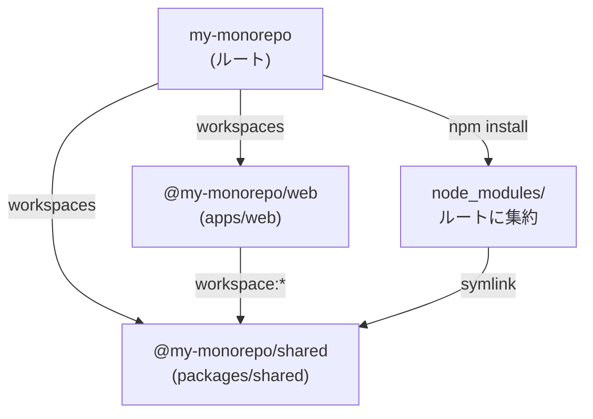

## 「モノレポ = 難しい」は誤解だ

モノレポという言葉を聞くと、Turborepo、Nx、Lerna、pnpmなどのツール名が次々に浮かび、「導入が大変そう」と感じる人は多い。しかし、モノレポの本質は**複数のパッケージを1つのリポジトリで管理すること**であり、それ自体は特別なツールを必要としない。

npm v7以降に標準搭載されている**workspaces**機能を使えば、ルートの`package.json`に1行追加するだけでモノレポを始められる。追加インストールは不要。Node.jsが入っていれば、今すぐ手元で試せる。

本記事では、npm workspacesだけを使ったモノレポのセットアップ手順を最小構成で解説する。Turborepo、Nx、Lernaは一切使わない。純粋なnpm workspacesの世界に集中することで、モノレポの基礎を確実に理解できるようにする。

## workspacesの最小構成

### ディレクトリ構成

npm workspacesのモノレポで最もよく使われるディレクトリ構成を示す。

```
my-monorepo/
├── apps/
│   └── web/
│       ├── package.json
│       └── src/
│           └── index.js
├── packages/
│   └── shared/
│       ├── package.json
│       └── src/
│           └── index.js
├── package.json          ← ルートのpackage.json
└── node_modules/         ← npm install後に生成
```

`apps/`にアプリケーション、`packages/`に共通ライブラリを置く。これは慣習であり強制ではないが、多くのモノレポがこの構成を採用しているため、チームメンバーがすぐに構造を理解できる。

### ルートのpackage.json

モノレポの起点となるのは、ルートの`package.json`だ。ここに`workspaces`フィールドを追加する。

```json
{
  "name": "my-monorepo",
  "private": true,
  "workspaces": [
    "packages/*",
    "apps/*"
  ]
}
```

たった3つのポイントを押さえればよい。

1. **`"private": true`** -- ルートパッケージをnpmに公開しないための宣言。workspacesを使う場合、ルートには必須だ
2. **`"workspaces"`** -- ワークスペースとして管理するディレクトリのglobパターン。`packages/*`は`packages/`直下の全ディレクトリをワークスペースとして認識する
3. **パッケージごとに`package.json`が必要** -- `packages/shared/package.json`や`apps/web/package.json`がなければ、npmはそのディレクトリをワークスペースとして認識しない

## パッケージの作成

実際にプロジェクトを一から構築する。ターミナルにそのまま貼り付けて実行できる。

### ステップ1: プロジェクトの初期化

```bash
mkdir my-monorepo && cd my-monorepo

# ルートのpackage.jsonを作成
cat > package.json << 'EOF'
{
  "name": "my-monorepo",
  "private": true,
  "workspaces": [
    "packages/*",
    "apps/*"
  ]
}
EOF

# ディレクトリ構成を作成
mkdir -p packages/shared/src apps/web/src
```

### ステップ2: 共通ライブラリ（packages/shared）の作成

```bash
cat > packages/shared/package.json << 'EOF'
{
  "name": "@my-monorepo/shared",
  "version": "1.0.0",
  "main": "src/index.js",
  "license": "MIT"
}
EOF
```

ライブラリの中身として、簡単なユーティリティ関数を作る。

```bash
cat > packages/shared/src/index.js << 'EOF'
/**
 * 日付を YYYY-MM-DD 形式にフォーマットする
 * @param {Date} date
 * @returns {string}
 */
function formatDate(date) {
  const y = date.getFullYear();
  const m = String(date.getMonth() + 1).padStart(2, "0");
  const d = String(date.getDate()).padStart(2, "0");
  return `${y}-${m}-${d}`;
}

/**
 * オブジェクトの指定キーだけを抽出する
 * @param {Object} obj
 * @param {string[]} keys
 * @returns {Object}
 */
function pick(obj, keys) {
  return keys.reduce((acc, key) => {
    if (key in obj) acc[key] = obj[key];
    return acc;
  }, {});
}

module.exports = { formatDate, pick };
EOF
```

### ステップ3: アプリケーション（apps/web）の作成

```bash
cat > apps/web/package.json << 'EOF'
{
  "name": "@my-monorepo/web",
  "version": "1.0.0",
  "private": true,
  "scripts": {
    "start": "node src/index.js",
    "test": "node src/index.test.js"
  },
  "dependencies": {
    "@my-monorepo/shared": "workspace:*"
  }
}
EOF
```

`@my-monorepo/shared`を使うアプリケーションコードを作る。

```bash
cat > apps/web/src/index.js << 'EOF'
const { formatDate, pick } = require("@my-monorepo/shared");

const today = formatDate(new Date());
console.log(`Today: ${today}`);

const user = { id: 1, name: "Alice", email: "alice@example.com", age: 30 };
const publicUser = pick(user, ["id", "name"]);
console.log("Public user:", publicUser);
EOF
```

ここまでのディレクトリ構成を確認しよう。

```
my-monorepo/
├── apps/
│   └── web/
│       ├── package.json        ← @my-monorepo/shared に依存
│       └── src/
│           └── index.js        ← shared の関数を使う
├── packages/
│   └── shared/
│       ├── package.json        ← パッケージ名: @my-monorepo/shared
│       └── src/
│           └── index.js        ← formatDate, pick を公開
└── package.json                ← workspaces: ["packages/*", "apps/*"]
```

## 内部パッケージの参照

### workspace:*プロトコル

先ほどの`apps/web/package.json`で使った`"workspace:*"`がポイントだ。

```json
{
  "dependencies": {
    "@my-monorepo/shared": "workspace:*"
  }
}
```

`workspace:*`は「このパッケージはnpmレジストリから取得するのではなく、同じリポジトリ内のワークスペースから参照する」ことを意味するプロトコルだ。`*`はバージョンを問わないワイルドカードだ。npm 7以降のworkspacesで利用可能で、pnpmとyarnでも同じ構文がサポートされている。

なお、npm workspacesでは`workspace:`プロトコルを付けなくても、同名のワークスペースパッケージがあれば自動的にリンクされる。`workspace:*`を明示する方が意図が明確になるため推奨する。

バージョンを固定したい場合は`workspace:^1.0.0`のように指定することもできる。しかし、モノレポ内のパッケージは常に最新版を参照するのが一般的なため、ほとんどの場合`workspace:*`で十分だ。

### npm installで自動リンク

ルートディレクトリで`npm install`を実行する。

```bash
# ルートディレクトリで実行
npm install
```

この1コマンドで、以下が自動的に行われる。

1. `node_modules/@my-monorepo/shared`にシンボリックリンクが作成され、`packages/shared`を指す
2. 各ワークスペースの外部依存（npmレジストリからのパッケージ）がルートの`node_modules`にインストールされる
3. `package-lock.json`がルートに生成される

実際にリンクが張られたことを確認してみよう。

```bash
ls -la node_modules/@my-monorepo/
# shared -> ../../packages/shared
```

これで`apps/web`から`require("@my-monorepo/shared")`が解決できるようになった。

```bash
npm run start --workspace=apps/web
# Today: 2026-03-15
# Public user: { id: 1, name: 'Alice' }
```

### 依存関係の全体像

ワークスペース内の依存関係をmermaidで可視化する。



`npm install`がルートの`node_modules`に全依存を集約し、内部パッケージ間はシンボリックリンクで接続される。npmの公開レジストリとのやりとりは一切発生しない。

## スクリプトの実行

npm workspacesでは、個別のパッケージに移動せずにルートからスクリプトを実行できる。

### 特定のワークスペースで実行

```bash
# apps/web の start スクリプトを実行
npm run start --workspace=apps/web

# 短縮形（-w）
npm run start -w apps/web

# パッケージ名でも指定できる
npm run start -w @my-monorepo/web
```

`--workspace`（短縮形: `-w`）フラグで対象を指定する。値はディレクトリパスでもパッケージ名でもよい。

### 全ワークスペースで一括実行

```bash
# 全ワークスペースで test を実行
npm run test --workspaces

# 短縮形（-ws）
npm run test -ws
```

`--workspaces`（短縮形: `-ws`）を指定すると、`workspaces`に含まれる全パッケージで順にスクリプトが実行される。

### testスクリプトがないパッケージをスキップする

全ワークスペースで実行すると、`test`スクリプトが定義されていないパッケージでエラーになる。これを回避するオプションがある。

```bash
# スクリプトが未定義のワークスペースをスキップ
npm run test -ws --if-present
```

`--if-present`を付ければ、該当スクリプトが存在するワークスペースだけで実行される。全ワークスペースでの一括実行時にはほぼ必須のオプションだ。

### パッケージのインストール

特定のワークスペースに外部パッケージを追加する場合も`-w`フラグを使う。

```bash
# apps/web に express を追加
npm install express -w apps/web

# packages/shared に lodash を追加（開発用）
npm install --save-dev lodash -w packages/shared
```

ルートにdevDependenciesとして追加したい場合は、通常どおり`-w`なしで実行する。

```bash
# ルートに eslint を追加（全パッケージで共有）
npm install --save-dev eslint
```

## 依存関係の管理

### ルートのdevDependencies vs 各パッケージのdependencies

モノレポでは「どの依存をどこに書くか」が重要な設計判断になる。基本的な考え方はこうだ。

| 配置先 | 対象 | 例 |
|--------|------|-----|
| ルートの`devDependencies` | 全パッケージ共通の開発ツール | ESLint, Prettier, TypeScript, Vitest |
| 各パッケージの`dependencies` | そのパッケージが本番で使う外部ライブラリ | express, react, axios |
| 各パッケージの`devDependencies` | そのパッケージ固有の開発ツール | `@types/express`（APIパッケージのみ） |
| 各パッケージの`dependencies` | 内部パッケージの参照 | `"@my-monorepo/shared": "workspace:*"` |

ESLintやPrettierのように全パッケージで同じバージョンを使うべきツールは、ルートの`devDependencies`に1回だけ書く。各パッケージの`package.json`には書かない。

```json
// ルートの package.json
{
  "name": "my-monorepo",
  "private": true,
  "workspaces": ["packages/*", "apps/*"],
  "devDependencies": {
    "eslint": "^9.0.0",
    "prettier": "^3.0.0",
    "typescript": "^5.5.0"
  }
}
```

### ホイスティングの仕組み

npmがワークスペースの依存をインストールするとき、可能な限り**ルートの`node_modules`にパッケージを巻き上げる（ホイスティング）**。

```
my-monorepo/
├── node_modules/
│   ├── express/           ← apps/web の依存だがルートに配置される
│   ├── lodash/            ← packages/shared の devDependencies だがルートに配置
│   └── @my-monorepo/
│       └── shared/        ← packages/shared へのシンボリックリンク
├── apps/
│   └── web/
│       └── (node_modules は基本的に空)
├── packages/
│   └── shared/
│       └── (node_modules は基本的に空)
└── package.json
```

同じパッケージが複数のワークスペースで必要な場合でも、ルートの`node_modules`に1つだけインストールすれば全ワークスペースから参照できる。これがホイスティングの利点だ。

ただし、ワークスペース間でバージョンが異なる場合は例外が発生する。たとえば`apps/web`がlodash@4を、`packages/shared`がlodash@3を必要としている場合、一方はルートに配置され、もう一方はそのワークスペース内の`node_modules`にローカルインストールされる。

:::message
npm workspacesのホイスティングは、通常のnpm installと同じフラット化アルゴリズムの延長線上にあります。ワークスペースでなぜ依存がルートに巻き上がるのか、pnpm workspacesとの構造的な違いは、書籍 [パッケージマネージャ from scratch](https://zenn.dev/yuichi_ai/books/package-manager-from-scratch) の第8章で図解付きで解説しています。
:::

## よくあるパターン

npm workspacesを導入した実プロジェクトでよく使われるパターンを3つ紹介する。

### パターン1: 共通eslint/tsconfig

ESLintとTypeScriptの設定を1箇所で管理し、全パッケージから参照する。

```
my-monorepo/
├── packages/
│   └── config/
│       ├── package.json
│       ├── eslint.config.mjs
│       └── tsconfig.base.json
├── apps/
│   └── web/
│       ├── package.json
│       ├── eslint.config.mjs   ← config を読み込む
│       └── tsconfig.json       ← config を extends
└── package.json
```

**設定パッケージ**の`package.json`:

```json
{
  "name": "@my-monorepo/config",
  "version": "1.0.0",
  "main": "eslint.config.mjs"
}
```

**設定パッケージ**の`tsconfig.base.json`:

```json
{
  "compilerOptions": {
    "target": "ES2022",
    "module": "Node16",
    "moduleResolution": "Node16",
    "strict": true,
    "declaration": true,
    "declarationMap": true,
    "sourceMap": true,
    "esModuleInterop": true,
    "skipLibCheck": true
  }
}
```

**apps/web**の`tsconfig.json`で継承する:

```json
{
  "extends": "@my-monorepo/config/tsconfig.base.json",
  "compilerOptions": {
    "outDir": "dist",
    "rootDir": "src"
  },
  "include": ["src"]
}
```

こうすると、TypeScriptのコンパイラオプションを1箇所で変更するだけで全パッケージに反映される。

### パターン2: 共通コンポーネントライブラリ

フロントエンドプロジェクトでは、UIコンポーネントを共通パッケージとして切り出すパターンが多い。

```
my-monorepo/
├── packages/
│   └── ui/
│       ├── package.json
│       └── src/
│           ├── Button.jsx
│           ├── Modal.jsx
│           └── index.js        ← 全コンポーネントを re-export
├── apps/
│   ├── web/
│   │   └── package.json        ← @my-monorepo/ui に依存
│   └── admin/
│       └── package.json        ← @my-monorepo/ui に依存
└── package.json
```

```json
// packages/ui/package.json
{
  "name": "@my-monorepo/ui",
  "version": "1.0.0",
  "main": "src/index.js",
  "peerDependencies": {
    "react": "^18.0.0 || ^19.0.0"
  }
}
```

```javascript
// packages/ui/src/index.js
export { Button } from "./Button";
export { Modal } from "./Modal";
```

`web`と`admin`の両方から同じUIコンポーネントを使える。ボタンのデザインを変更すれば、両方のアプリに即座に反映される。

### パターン3: APIクライアントの共有

バックエンドとフロントエンドが同じモノレポにある場合、APIの型定義とクライアントを共有パッケージにするパターンが有効だ。

```
my-monorepo/
├── packages/
│   └── api-client/
│       ├── package.json
│       └── src/
│           ├── types.ts         ← APIのリクエスト/レスポンス型
│           └── client.ts        ← fetch ラッパー
├── apps/
│   ├── api/                     ← バックエンド（型を参照）
│   └── web/                     ← フロントエンド（クライアントを使用）
└── package.json
```

```typescript
// packages/api-client/src/types.ts
export interface User {
  id: number;
  name: string;
  email: string;
}

export interface CreateUserRequest {
  name: string;
  email: string;
}

export interface ApiResponse<T> {
  data: T;
  status: number;
}
```

```typescript
// packages/api-client/src/client.ts
import type { User, CreateUserRequest, ApiResponse } from "./types";

const BASE_URL = process.env.API_URL || "http://localhost:3000";

export async function getUser(id: number): Promise<ApiResponse<User>> {
  const res = await fetch(`${BASE_URL}/users/${id}`);
  return res.json();
}

export async function createUser(
  body: CreateUserRequest
): Promise<ApiResponse<User>> {
  const res = await fetch(`${BASE_URL}/users`, {
    method: "POST",
    headers: { "Content-Type": "application/json" },
    body: JSON.stringify(body),
  });
  return res.json();
}
```

APIのレスポンス型がフロントエンドとバックエンドで自動的に一致するため、「APIの返却値の型が古い」という類のバグを構造的に防げる。

## npm vs pnpm vs yarn のワークスペース比較

npm workspacesを理解した上で、他のパッケージマネージャのワークスペース機能と比較しておこう。移行の判断材料になる。

### 基本設定の違い

| 項目 | npm workspaces | pnpm workspaces | yarn Berry |
|------|------|------|------|
| ワークスペース宣言 | `package.json`の`workspaces` | `pnpm-workspace.yaml` | `package.json`の`workspaces` |
| 追加インストール | 不要 | `npm i -g pnpm` | `corepack enable` |
| 内部参照プロトコル | `workspace:*` | `workspace:*` | `workspace:*` |
| lockファイル | `package-lock.json` | `pnpm-lock.yaml` | `yarn.lock` |

### 主要コマンドの対照表

| 操作 | npm | pnpm | yarn Berry |
|------|-----|------|------------|
| 全ワークスペースでinstall | `npm install` | `pnpm install` | `yarn install` |
| 特定WSでスクリプト実行 | `npm run build -w apps/web` | `pnpm --filter apps/web build` | `yarn workspace @my/web build` |
| 全WSでスクリプト実行 | `npm run build -ws` | `pnpm -r build` | `yarn workspaces foreach -A run build` |
| 特定WSに依存追加 | `npm install lodash -w apps/web` | `pnpm --filter apps/web add lodash` | `yarn workspace @my/web add lodash` |
| 未定義スクリプトをスキップ | `--if-present` | `--if-present` | `--include` + フィルタ条件 |

### 構造的な違い

| 特性 | npm | pnpm | yarn Berry |
|------|-----|------|------------|
| node_modules構造 | フラット（ホイスティング） | シンボリックリンク + CAS | PnP（node_modulesなし）/ node_modules |
| 幽霊依存の防止 | 不可 | 厳格に防止 | PnPモードで防止 |
| ディスク効率 | 低い（コピー） | 高い（ハードリンク） | 高い（zip圧縮） |
| パッケージ絞り込み | `-w`（単一指定） | `--filter`（glob, git diff対応） | `foreach --include` |
| バージョン一元管理 | なし | `catalogs`機能 | `constraints`機能 |

**npm workspacesの立ち位置**: 追加ツール不要で最も手軽に始められるが、幽霊依存を防げない。小〜中規模プロジェクト、またはモノレポ入門として最適。プロジェクトが成長してきたら、pnpm workspacesへの移行を検討する流れが自然だ。

## 注意点とトラブルシューティング

### 1. ルートで`npm install`しないと内部リンクが切れる

npm workspacesでは、**必ずルートディレクトリで`npm install`を実行する**必要がある。個別のワークスペースディレクトリに移動して`npm install`を実行すると、そのワークスペースは通常のパッケージとして扱われ、`workspace:*`が解決されない。

```bash
# OK -- ルートで実行
cd my-monorepo
npm install

# NG -- 個別パッケージで実行してはいけない
cd apps/web
npm install  # workspace:* が解決できずエラーになる
```

これは最もよくあるハマりポイントだ。「Cannot find module」エラーが出たら、まずルートで`npm install`を実行し直す。

### 2. publishConfig

内部パッケージをnpmレジストリに公開する場合、`workspace:*`のままではpublishできない。npmは`npm publish`時に`workspace:*`を実際のバージョンに自動変換するが、`publishConfig`で公開時の設定を明示しておくと安全だ。

```json
{
  "name": "@my-monorepo/shared",
  "version": "1.0.0",
  "publishConfig": {
    "access": "public",
    "registry": "https://registry.npmjs.org/"
  }
}
```

なお、`"private": true`が設定されたパッケージは`npm publish`の対象にならないため、アプリケーション（`apps/web`など）には`"private": true`を必ず付ける。

### 3. 循環依存の防止

パッケージAがパッケージBに依存し、パッケージBがパッケージAに依存する**循環依存**は、ビルドの失敗や予期しない動作の原因になる。

```
# 絶対に避けるべき構造
packages/a → packages/b → packages/a  （循環）
```

防止策は明確だ。

- **依存の方向を一方向に保つ**: `packages/`は他の`packages/`に依存してよいが、`apps/`には依存しない。`apps/`は`packages/`に依存する
- **共通部分を別パッケージに切り出す**: AとBが互いに必要な機能がある場合、その部分を`packages/common`に切り出す

```
# 推奨される依存方向
apps/web → packages/shared    OK
apps/api → packages/shared    OK
packages/shared → (外部のみ)  OK

# 禁止
packages/shared → apps/web    NG
packages/a ⇄ packages/b       NG
```

### 4. node_modulesの巻き上げ問題

ホイスティングにより、あるワークスペースの依存が別のワークスペースから「見えてしまう」ことがある。これは幽霊依存と呼ばれる問題で、npm workspacesでは構造的に防止できない。

```javascript
// apps/web の package.json に express は書いていないのに...
// apps/api が express をインストールしている場合

// apps/web/src/index.js
const express = require("express"); // 動いてしまう（幽霊依存）
```

対処法として以下がある。

- **ESLintルール`import/no-extraneous-dependencies`を有効化する**: `package.json`に宣言していないインポートを検出できる
- **CIで`npm ls`を実行して警告を確認する**: 不整合がある場合は`WARN`が出力される
- **pnpmへの移行を検討する**: pnpmはシンボリックリンク構造により幽霊依存を構造的に防止する

### 5. package-lock.jsonのコンフリクト

モノレポではlockfileが巨大になりがちで、Gitのマージコンフリクトが頻繁に発生する。解決方法はシンプルだ。

```bash
# lockfileのコンフリクト解決
git checkout --theirs package-lock.json
npm install
git add package-lock.json
```

lockfileを手動でマージする必要はない。一方のバージョンを採用してから`npm install`を再実行すれば、正しいlockfileが再生成される。

## まとめ

本記事で扱った内容を振り返る。

1. **最小構成** -- ルートの`package.json`に`"workspaces": ["packages/*", "apps/*"]`を追加するだけで始められる
2. **内部参照** -- `workspace:*`プロトコルで内部パッケージを宣言し、`npm install`で自動リンクされる
3. **スクリプト実行** -- `-w`で個別指定、`-ws`で全ワークスペース一括実行、`--if-present`で未定義スキップ
4. **依存管理** -- 共通の開発ツールはルートの`devDependencies`、パッケージ固有の依存は各`package.json`に
5. **よくあるパターン** -- 共通設定、UIコンポーネント、APIクライアントの共有
6. **注意点** -- ルートで`npm install`、循環依存の防止、幽霊依存への対策

npm workspacesは「モノレポの最初の一歩」として十分に実用的だ。追加ツールなしでモノレポの基本概念を体験でき、プロジェクトの成長に合わせてTurborepoやpnpmへ段階的に移行する土台になる。

しかし、実運用で壁に当たったとき――ホイスティングの挙動が予想と違う、依存のバージョンが意図せず巻き上がる、pnpmに移行すべきか判断できない――こうした場面では、パッケージマネージャの**依存解決アルゴリズムが内部でどう動いているか**を理解していることが決定的な差になる。

npm workspacesのフラット化がなぜ幽霊依存を生むのか、pnpmのシンボリックリンク構造はどう違うのか、lockfileは何を保証しているのか。これらの仕組みを原理から体系的に理解したい方は、書籍 [パッケージマネージャ from scratch](https://zenn.dev/yuichi_ai/books/package-manager-from-scratch) を参照してほしい。第1章から第3章は無料で公開している。

---
