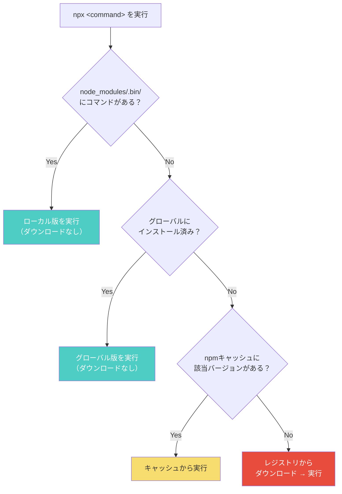
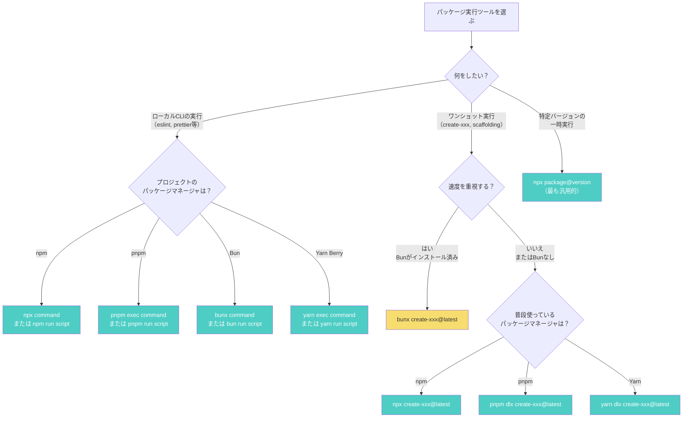

## はじめに ── npxは「なんとなく動く魔法」ではない

```bash
npx create-react-app my-app
```

この1行は、React開発の入り口として誰もが一度は実行したことがあるでしょう。しかし、「npxって何をしているの？」と聞かれて正確に答えられる人は意外と少ないのではないでしょうか。

「パッケージを一時的にダウンロードして実行するやつ」── ざっくりとした理解で日常的に使っている方が多いと思います。実際、それで困ることはほとんどありません。

ただ、npxの仕組みを正確に理解していないと、以下のような場面で戸惑います。

- タイプミスで悪意あるパッケージを実行してしまう（Typosquatting）
- キャッシュの古いバージョンが使われて、最新のCLIが動かない
- `pnpm dlx` や `bunx` との違いが分からず、チームで統一できない

この記事では、npxの内部動作を3つのステップに分解し、実用パターンと落とし穴を整理します。その上で、pnpm dlx・bunx・yarn dlxとの違いを比較し、「いつどれを使うか」の判断基準を示します。

:::message
この記事は「パッケージ実行ツール」の使い方（HOW）にフォーカスしています。パッケージマネージャ全体の比較（npm vs pnpm vs yarn）については、別記事 [pnpm vs npm vs yarn 2026年版 徹底比較](https://zenn.dev/yuichi_ai/articles/pnpm-vs-npm-vs-yarn-2026-comparison) をご覧ください。
:::

## npxの基本動作 ── 3つのステップ

npxは npm v5.2.0（2017年）から同梱されているコマンドです。`npx <コマンド>` を実行すると、内部で以下の3つのステップを**順番に**実行します。

### ステップ1: ローカルの node_modules/.bin を探す

```bash
# プロジェクトディレクトリで実行した場合
npx eslint .
```

npxはまず、カレントディレクトリの `node_modules/.bin/` にコマンドが存在するかを確認します。`eslint` がプロジェクトの `devDependencies` にインストールされていれば、ここで見つかります。

```
my-project/
├── node_modules/
│   ├── .bin/
│   │   ├── eslint          ← npxが最初に探す場所
│   │   ├── prettier
│   │   └── tsc
│   └── eslint/
├── package.json
└── .eslintrc.js
```

`node_modules/.bin/` の中身は、各パッケージの `package.json` で `"bin"` フィールドに指定された実行ファイルへのシンボリックリンクです。つまり、npxは「package.jsonのbinフィールドで公開されたCLIコマンド」を探しています。

```json
// node_modules/eslint/package.json の一部
{
  "bin": {
    "eslint": "bin/eslint.js"
  }
}
```

**ポイント**: この場合、npxはダウンロードを行いません。ローカルにあるものをそのまま実行するだけです。`./node_modules/.bin/eslint .` と直接パスを指定するのと同じ結果になります。

### ステップ2: グローバルインストールを探す

ローカルに見つからない場合、npxは次にグローバルにインストールされたパッケージを探します。

```bash
# グローバルにインストール済みのパッケージを確認
npm list -g --depth=0
```

`npm install -g` でインストールしたコマンドがあれば、それが使われます。

### ステップ3: 一時ダウンロード → 実行 → キャッシュ

ローカルにもグローバルにも見つからない場合、npxはnpmレジストリからパッケージを**一時的にダウンロード**して実行します。

```bash
# create-next-appがローカルにもグローバルにもない場合
npx create-next-app@latest my-app
```

この場合の動作は以下の通りです。

1. npmレジストリから `create-next-app` の最新バージョンのメタデータを取得する
2. tarballをダウンロードして、npmのキャッシュディレクトリに展開する
3. パッケージの `bin` フィールドで指定されたコマンドを実行する
4. 実行後、キャッシュにはパッケージが残る（次回の高速化のため）

```bash
# npmのキャッシュディレクトリを確認
npm config get cache
# macOS: ~/.npm
# Linux: ~/.npm
# Windows: %LocalAppData%/npm-cache
```

**重要な補足**: 「一時ダウンロード」という表現は誤解を招きやすいですが、npxは実行後にパッケージを**自動削除しません**。キャッシュに残ります。ただし、プロジェクトの `node_modules/` にはインストールされないため、プロジェクトの依存には影響しません。

### 3ステップをフローチャートで整理



## npxの実用パターン

npxが使われる典型的な3パターンを見ていきます。

### パターン1: プロジェクトローカルのCLI実行

```bash
# ESLintをプロジェクトにインストール
npm install --save-dev eslint

# npx経由で実行（node_modules/.binを探す）
npx eslint .
npx eslint --fix src/

# TypeScriptのコンパイラ
npx tsc --noEmit

# Prettierでフォーマット
npx prettier --write "src/**/*.ts"
```

npxを使わない場合、`./node_modules/.bin/eslint .` と毎回フルパスを書くか、`package.json` の `scripts` に登録する必要があります。npxはその手間を省くショートカットです。

```json
// package.jsonのscriptsに登録するのが正式な方法
{
  "scripts": {
    "lint": "eslint .",
    "format": "prettier --write \"src/**/*.ts\""
  }
}
```

:::message
**npm scripts vs npx**: `package.json` の `scripts` フィールドに書いたコマンドは、自動的に `node_modules/.bin/` にパスが通った状態で実行されます。チームで共有するコマンドは `scripts` に登録し、アドホックな実行に `npx` を使うのが一般的です。
:::

### パターン2: ワンショット実行（プロジェクトスキャフォールド）

```bash
# Next.jsプロジェクトの作成
npx create-next-app@latest my-app

# Viteプロジェクトの作成
npx create-vite@latest my-app

# Astroプロジェクトの作成
npx create-astro@latest

# Remixプロジェクトの作成
npx create-remix@latest
```

プロジェクト作成ツールは一度しか使わないため、グローバルインストールするよりnpxで一時実行するのが合理的です。`@latest` を付けることで、常に最新バージョンを使えます。

### パターン3: 特定バージョンの実行

```bash
# 特定バージョンのNode.jsでスクリプトを実行（node互換パッケージ経由）
npx node@18 -e "console.log(process.version)"
# → v18.x.x

npx node@20 -e "console.log(process.version)"
# → v20.x.x

# 特定バージョンのTypeScriptコンパイラ（-pでパッケージを指定）
npx -p typescript@5.3 tsc --version
# → Version 5.3.x

# 古いバージョンのCLIで動作確認
npx create-next-app@14 my-old-app
```

CI環境やバージョン互換性テストで、複数バージョンを素早く切り替えたい場合に便利です。

## npxの落とし穴

便利なnpxですが、知らないと危険な落とし穴が3つあります。

### 落とし穴1: Typosquatting ── タイプミスで悪意あるパッケージを実行

```bash
# 正しいコマンド
npx create-react-app my-app

# タイプミス（存在する場合、そのまま実行される）
npx creat-react-app my-app    # "e" が抜けている
npx create-raect-app my-app   # "react" のスペルミス
```

npxは「ローカルにもグローバルにもないパッケージ」をレジストリからダウンロードして実行します。もしタイプミスした名前で悪意あるパッケージが公開されていた場合、そのコードがあなたのマシンで実行されます。

npmレジストリでは類似名パッケージの検知が強化されていますが、完全に防ぐことはできません。

**対策**:
- コマンドを打つ前にパッケージ名を確認する（[npmjs.com](https://www.npmjs.com/) で検索）
- 後述する npm v7+ のインタラクティブ確認を活用する
- チームで使うコマンドは `package.json` の `scripts` に登録して、毎回手打ちしない

### 落とし穴2: キャッシュの古いバージョン問題

npxはステップ3で説明した通り、ダウンロードしたパッケージをキャッシュに保存します。問題は、**次回実行時にキャッシュの古いバージョンが使われる可能性がある**ことです。

```bash
# 1ヶ月前にcreate-next-app@14.0.0をnpxで実行した
# 今日もう一度実行すると...
npx create-next-app my-app
# → キャッシュの14.0.0が使われることがある（最新は14.2.xかもしれない）
```

**対策**: `@latest` を明示的に付ける。

```bash
# 常に最新バージョンを使う
npx create-next-app@latest my-app
```

### 落とし穴3: npm v7+ でのインタラクティブ確認の変更

npm v7以降（Node.js 15+同梱）では、npxでパッケージをダウンロードする際に確認プロンプトが表示されるようになりました。

```bash
$ npx create-next-app@latest my-app
Need to install the following packages:
  create-next-app@15.3.1
Ok to proceed? (y)
```

これはTyposquatting対策として導入されたものです。意図しないパッケージ名が表示されたら、`n` を入力して中断してください。

**`--yes` フラグの注意点**:

```bash
# 確認をスキップして自動的にYesを選択
npx --yes create-next-app@latest my-app
# または
npx -y create-next-app@latest my-app
```

CIスクリプトなど非対話環境では `--yes` が必要ですが、ローカル開発で常に `--yes` を付けるのはTyposquatting対策を無効化することになります。ローカルでは確認プロンプトをそのまま使うことを推奨します。

**npm v7未満の場合**:

npm v6以前のnpxでは確認プロンプトが**表示されません**。古いNode.js環境を使っている場合は特に注意が必要です。

```bash
# Node.jsとnpmのバージョンを確認
node -v
npm -v
# npm 7以上であることを確認
```

## pnpm dlx ── pnpmユーザーのためのnpx代替

pnpmを使っているプロジェクトでは、`pnpm dlx` がnpxの代替になります。

```bash
# npxと同等の使い方
pnpm dlx create-next-app@latest my-app
pnpm dlx create-vite@latest my-app
pnpm dlx degit user/repo my-project
```

### npxとの違い

`pnpm dlx` は npxと比べて以下の点が異なります。

**1. 常にレジストリからダウンロードする**

npxは「ローカル → グローバル → ダウンロード」の3ステップを踏みますが、`pnpm dlx` は**常にダウンロードして実行**します。ローカルの `node_modules/.bin/` は参照しません。

```bash
# npx: ローカルにeslintがあればそれを使う
npx eslint .

# pnpm dlx: 常にダウンロードして実行（ローカルは無視）
pnpm dlx eslint .  # ← ローカルCLIの実行にはpnpm execを使うべき
```

ローカルにインストール済みのCLIを実行したい場合は、`pnpm dlx` ではなく `pnpm exec` を使います。

```bash
# ローカルインストール済みのCLIを実行
pnpm exec eslint .
# または単に
pnpm eslint .
```

**2. 厳格な依存分離**

pnpm自体の設計思想である「厳格な依存分離」が `pnpm dlx` にも適用されます。ダウンロードしたパッケージは隔離された環境で実行され、他のプロジェクトの依存に影響しません。

**3. キャッシュの挙動**

pnpmはContent-Addressable Storeという仕組みで、パッケージの実体を1箇所に保持します。`pnpm dlx` で一時ダウンロードしたパッケージもこのストアに入るため、同じパッケージの2回目の実行はストアから取得され高速です。

### pnpm dlx の実用例

```bash
# プロジェクト作成系
pnpm dlx create-next-app@latest my-app
pnpm dlx create-vite@latest my-app
pnpm dlx create-astro@latest

# ワンショットツール
pnpm dlx sort-package-json    # package.jsonのキーをソート
pnpm dlx npm-check-updates    # 依存パッケージの更新チェック
pnpm dlx serve                # カレントディレクトリを静的サーバーとして起動

# 複数パッケージが必要な場合
pnpm dlx --package=typescript --package=ts-node ts-node script.ts
```

## bunx ── Bun環境の高速パッケージ実行

Bun（Zig言語で実装されたJavaScriptランタイム）を使っている場合は、`bunx` がnpxの代替になります。

```bash
# npxと同等の使い方
bunx create-next-app@latest my-app
bunx create-vite@latest my-app
bunx --bun create-astro@latest
```

### bunxが高速な理由

`bunx` の速度はBunのパッケージインストーラの高速さに直結しています。

- **ネイティブ実装**: BunのインストーラはZig言語で書かれており、npmのJavaScript実装より低レベルな最適化が効く
- **並列ダウンロード**: パッケージのダウンロードと展開を高度に並列化している
- **高速な起動**: Bun自体の起動時間がNode.jsより短いため、CLIの初回起動が速い

```bash
# 速度比較の例（環境により異なる）
time npx --yes create-vite@latest my-app-npx --template react
# → 数秒〜十数秒

time bunx create-vite@latest my-app-bunx --template react
# → 1〜数秒
```

### bunx固有の注意点

```bash
# Bunランタイムで実行したい場合は --bun フラグを付ける
bunx --bun vitest run
# フラグなしだとNode.jsで実行される場合がある（パッケージの設定による）
```

`bunx` はデフォルトではBunランタイムでパッケージを実行しますが、パッケージのshebangが `#!/usr/bin/env node` を指定している場合、システムのNode.jsにフォールバックすることがあります。確実にBunランタイムで実行したい場合は `--bun` フラグを付けてください。

また、Bunはnpmレジストリと互換性がありますが、一部のネイティブモジュールやpostinstallスクリプトに依存するパッケージでは互換性問題が発生することがあります。

## yarn dlx ── Yarnユーザーの場合

Yarn Berry（v2+）ユーザーには `yarn dlx` があります。

```bash
# npxと同等の使い方
yarn dlx create-next-app@latest my-app
yarn dlx create-vite@latest my-app
```

`yarn dlx` は `pnpm dlx` と同様に、常にレジストリからダウンロードして実行します。ローカルの依存は参照しません。ローカルCLIの実行には `yarn run` または `yarn exec` を使います。

```bash
# ローカルインストール済みCLI
yarn run eslint .
yarn exec eslint .
```

:::message
**Yarn Classic（v1）** には `yarn dlx` コマンドが存在しません。Yarn Classicを使っている場合は `npx` を使うか、Yarn Berryへの移行を検討してください。
:::

## 比較表 ── npx / pnpm dlx / bunx / yarn dlx

| 項目 | npx (npm) | pnpm dlx | bunx (Bun) | yarn dlx |
|------|-----------|----------|------------|----------|
| **同梱先** | npm（Node.js同梱） | pnpm | Bun | Yarn Berry (v2+) |
| **ローカル参照** | する（最初に探す） | **しない** | する | **しない** |
| **グローバル参照** | する | しない | する | しない |
| **未インストール時** | ダウンロード→実行 | ダウンロード→実行 | ダウンロード→実行 | ダウンロード→実行 |
| **確認プロンプト** | あり（npm v7+） | なし | なし | なし |
| **キャッシュ** | npmキャッシュ | Content-Addressable Store | Bunキャッシュ | Yarnキャッシュ |
| **速度** | 標準 | 高速 | **最速** | 高速 |
| **ローカルCLI実行** | `npx` そのまま | `pnpm exec` を使う | `bunx` そのまま | `yarn run` を使う |
| **複数パッケージ指定** | `--package=A --package=B` | `--package=A --package=B` | 非対応 | `--package=A --package=B` |

### 補足: ローカル参照の違いが意味すること

npxとbunxは「ローカルにあればそれを使い、なければダウンロードする」という動作です。一方、pnpm dlxとyarn dlxは「常にダウンロードして実行する」という動作です。

この違いが影響するのは、`npx eslint .` のように**ローカルにインストール済みのCLIを実行する**場合です。

```bash
# npx: ローカルのeslintを実行（ダウンロードしない）
npx eslint .

# pnpm dlx: レジストリからeslintをダウンロードして実行
# → プロジェクトの設定ファイル（.eslintrc等）が見つからないエラーになることがある
pnpm dlx eslint .  # ← 意図した動作ではない可能性が高い
```

pnpmやyarnでローカルCLIを実行する場合は、必ず `exec` コマンドを使ってください。

```bash
pnpm exec eslint .    # ← 正しい使い方
yarn exec eslint .    # ← 正しい使い方
```

## いつどれを使うか ── 判断基準

### 基本方針: プロジェクトのパッケージマネージャに合わせる

最もシンプルな判断基準は、**プロジェクトで使っているパッケージマネージャに揃える**ことです。

```bash
# package-lock.json がある → npm プロジェクト
npx create-next-app@latest my-app

# pnpm-lock.yaml がある → pnpm プロジェクト
pnpm dlx create-next-app@latest my-app

# bun.lockb がある → Bun プロジェクト
bunx create-next-app@latest my-app

# yarn.lock がある（v2+） → Yarn プロジェクト
yarn dlx create-next-app@latest my-app
```

### 判断フローチャート



### 具体的なシナリオ別まとめ

**シナリオ1: 新規プロジェクトの作成**

```bash
# npmユーザー
npx create-next-app@latest my-app

# pnpmユーザー
pnpm dlx create-next-app@latest my-app

# Bunユーザー（最速）
bunx create-next-app@latest my-app
```

どれを使っても結果（生成されるプロジェクト）は同じです。`create-next-app` 自体が「どのパッケージマネージャを使うか」を対話的に聞いてきます。

**シナリオ2: CIでのワンショットツール実行**

```bash
# GitHub Actionsの例
- name: Check formatting
  run: npx --yes prettier --check "src/**/*.ts"

# pnpmをセットアップ済みなら
- name: Check formatting
  run: pnpm dlx prettier --check "src/**/*.ts"
```

CIでは `--yes` フラグ（npxの場合）を付けて確認プロンプトをスキップする必要があります。`pnpm dlx` や `bunx` は確認プロンプトがないため、CI環境でそのまま使えます。

**シナリオ3: チュートリアルやドキュメントの記述**

読者の環境を問わない場合は `npx` を使うのが最も安全です。npmはNode.jsに同梱されているため、追加インストールなしで実行できます。

```bash
# ドキュメントに書く場合は npx が最も読者に優しい
npx create-next-app@latest my-app
```

## まとめ

npxの動作は3つのステップに分解できます。

1. **ローカル** `node_modules/.bin/` を探す
2. **グローバル**インストールを探す
3. **なければダウンロード**して実行し、キャッシュに保存する

日常的に使う上で押さえるべきポイントは以下の3つです。

- **ワンショット実行には `@latest` を付ける**: キャッシュの古いバージョンを避ける
- **確認プロンプトはTyposquatting対策**: ローカルでは `--yes` を安易に付けない
- **パッケージマネージャに合わせる**: pnpmなら `pnpm dlx`、Bunなら `bunx`、Yarnなら `yarn dlx`

パッケージ実行ツールの選び方はシンプルです。プロジェクトで使っているパッケージマネージャに揃えてください。迷ったら `npx` を使えば、Node.jsが入っている環境なら確実に動きます。

---

npxがレジストリからパッケージを一時ダウンロードしている裏側では、npmレジストリのHTTP APIが動いています。レジストリプロトコルの仕組み、tarball取得とintegrity検証のフロー、そしてパッケージマネージャが内部で行っている依存解決を理解したい方は、拙著 **[「なぜnode_modulesは壊れるのか？」](https://zenn.dev/yuichi_ai/books/package-manager-from-scratch)** をご覧ください。

---
