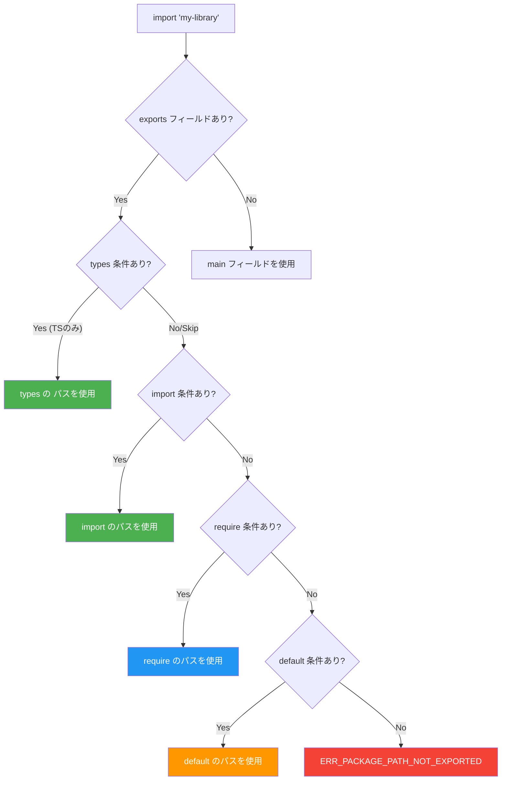
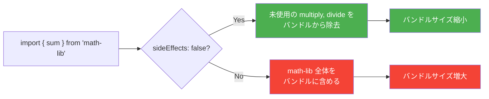

## package.jsonは「なんとなく」で書いてはいけない

`npm init -y` で生成されるpackage.json。プロジェクトを始めるたびに作るファイルだが、多くの開発者がフィールドの意味を正確に理解しないまま使っている。

「`main` と `module` と `exports` の違いは？」「`type: "module"` にしたらrequireが動かなくなったけど何で？」「`engines` って書いても意味あるの？」

package.jsonはnpmエコシステムの**設計図**だ。パッケージのインストール、ビルド、公開のすべてがこのファイルの記述に依存している。フィールドを正しく書かないと、ライブラリ利用者の環境でモジュール解決が失敗したり、本番デプロイで不要な依存が含まれたり、Tree-shakingが効かずバンドルサイズが膨れ上がったりする。

この記事では、package.jsonの**全フィールドの正しい書き方**を、実際のJSON例とともに解説する。

:::message
この記事は「どう書くか（HOW）」にフォーカスしています。「パッケージ解決アルゴリズムはなぜこう設計されているのか」「exportsの条件マッチングの内部実装はどうなっているか」といった「なぜ（WHY）」の部分は扱いません。WHYに興味がある方は記事末尾の書籍リンクを参照してください。
:::

## 基本フィールド：パッケージの身分証明

### name

パッケージの一意な識別子。npmレジストリに公開する場合、この名前が `npm install <name>` で指定される。

```json
{
  "name": "my-library"
}
```

**命名ルール:**

- 214文字以下
- 先頭がドットまたはアンダースコアで始まらない
- 大文字を含まない
- URLセーフな文字のみ

スコープ付きパッケージを使うと、名前の衝突を回避できる。

```json
{
  "name": "@my-org/my-library"
}
```

npmレジストリでスコープなしの短い名前はほぼ枯渇している。新規パッケージを公開するなら、スコープ付きにするのが現実的だ。

### version

SemVer（セマンティックバージョニング）に従ったバージョン文字列。`name` と `version` の組み合わせがパッケージの一意な識別子になる。

```json
{
  "version": "2.1.0"
}
```

`major.minor.patch` の形式で、プレリリースタグも付けられる。

```json
{
  "version": "3.0.0-beta.1"
}
```

### description

パッケージの簡潔な説明文。`npm search` の検索結果やnpmjs.comのパッケージページに表示される。

```json
{
  "description": "A lightweight HTTP client with automatic retries"
}
```

### keywords

npmレジストリでの検索に使われる文字列の配列。

```json
{
  "keywords": ["http", "client", "fetch", "retry", "request"]
}
```

### license

パッケージのライセンスを[SPDX識別子](https://spdx.org/licenses/)で指定する。

```json
{
  "license": "MIT"
}
```

デュアルライセンスの場合はSPDX式を使う。

```json
{
  "license": "(MIT OR Apache-2.0)"
}
```

### author

パッケージ作者の情報。オブジェクト形式と文字列形式がある。

```json
{
  "author": {
    "name": "Your Name",
    "email": "you@example.com",
    "url": "https://example.com"
  }
}
```

```json
{
  "author": "Your Name <you@example.com> (https://example.com)"
}
```

### repository, homepage, bugs

パッケージのリポジトリ、ホームページ、バグ報告先。npmjs.comのパッケージページにリンクとして表示される。

```json
{
  "repository": {
    "type": "git",
    "url": "https://github.com/user/repo.git"
  },
  "homepage": "https://my-library.dev",
  "bugs": {
    "url": "https://github.com/user/repo/issues"
  }
}
```

`repository` は省略形も使える。

```json
{
  "repository": "github:user/repo"
}
```

## エントリポイント：パッケージの「入口」を定義する

パッケージを `import` または `require` したとき、どのファイルが読み込まれるかを決めるフィールド群。ここの設定を間違えると、ライブラリの利用者がインポートに失敗する。

### main（CommonJS向け）

Node.jsが `require('my-library')` を解決するときに参照するエントリポイント。

```json
{
  "main": "./dist/index.cjs"
}
```

`main` を省略すると、パッケージルートの `index.js` がデフォルトで使われる。CommonJSモジュール（`.cjs` またはtype未指定時の `.js`）を指定する。

### module（ESM向け・非標準）

bundler（webpack、Rollup）がESMのエントリポイントとして参照するフィールド。**Node.jsの公式仕様ではない**。

```json
{
  "module": "./dist/index.mjs"
}
```

bundlerはこのフィールドを見つけると、`main` より優先してESM版を読み込む。Tree-shakingの対象にするためにESMで提供する目的で使われてきた。ただし、現在は後述の `exports` フィールドに統合されつつある。

### type（モジュールシステムの宣言）

パッケージ内の `.js` ファイルがESMとCJSのどちらとして解釈されるかを決める。

```json
{
  "type": "module"
}
```

| `type`の値 | `.js` の解釈 | ESMファイル | CJSファイル |
|---|---|---|---|
| `"module"` | ESM | `.js`, `.mjs` | `.cjs` |
| `"commonjs"` (デフォルト) | CJS | `.mjs` | `.js`, `.cjs` |

**`type: "module"` にした場合の注意点:**

1. **`require()` は `.js` ファイルを読み込めなくなる** --- CJSとして読ませたいファイルは拡張子を `.cjs` に変更する必要がある
2. **`__dirname`、`__filename` が使えない** --- 代わりに `import.meta.url` と `fileURLToPath` を使う
3. **拡張子の省略ができない** --- `import './utils'` は失敗する。`import './utils.js'` と書く必要がある
4. **`require()` でJSON読み込みができない** --- `import` にはExperimental Import Assertions（`assert { type: 'json' }`、Node.js 22+では `with { type: 'json' }`）が必要

```javascript
// type: "module" のとき、CJS的な書き方の代替手段
import { fileURLToPath } from 'node:url';
import { dirname } from 'node:path';
import { createRequire } from 'node:module';

const __filename = fileURLToPath(import.meta.url);
const __dirname = dirname(__filename);
const require = createRequire(import.meta.url);
const pkg = require('./package.json'); // JSONの読み込み
```

### exports（条件付きエクスポート）

Node.js 12.7.0で導入された、パッケージのエントリポイントを精密に制御するフィールド。**`main` と `module` を置き換える現在の推奨方法**。

```json
{
  "exports": {
    ".": {
      "import": "./dist/index.mjs",
      "require": "./dist/index.cjs",
      "default": "./dist/index.mjs"
    }
  }
}
```

`exports` が定義されている場合、`main` や `module` より**優先**される。次のセクションで詳しく解説する。

## exportsフィールド詳解

`exports` はpackage.jsonのなかで最も強力かつ複雑なフィールドだ。正しく設定すれば、CJS/ESM両対応、TypeScript型定義の自動解決、サブパスの公開制御をすべて1箇所で管理できる。

### 条件付きエクスポート

`exports` のキーには**条件**を指定できる。Node.jsとbundlerは、条件を上から順にマッチさせ、最初に合致したパスを使う。

```json
{
  "name": "my-library",
  "type": "module",
  "exports": {
    ".": {
      "types": "./dist/index.d.ts",
      "import": "./dist/index.mjs",
      "require": "./dist/index.cjs",
      "default": "./dist/index.mjs"
    }
  }
}
```

各条件の意味:

| 条件 | いつ使われるか |
|---|---|
| `types` | TypeScriptコンパイラが型定義を解決するとき |
| `import` | `import` 文または `import()` で読み込まれるとき |
| `require` | `require()` で読み込まれるとき |
| `node` | Node.js環境で実行されるとき |
| `browser` | bundlerがブラウザ向けビルドをするとき |
| `development` | `NODE_ENV=development` 相当のとき（bundler依存） |
| `production` | `NODE_ENV=production` 相当のとき（bundler依存） |
| `default` | 上記のどれにも合致しなかったときのフォールバック |

### 条件の評価順序

条件は**オブジェクトのキーの記述順**で評価される。最初にマッチした条件が採用され、残りは無視される。そのため、記述順序が重要だ。



**推奨される記述順:**

```json
{
  "exports": {
    ".": {
      "types": "...",
      "import": "...",
      "require": "...",
      "default": "..."
    }
  }
}
```

`types` を最初に書くのが重要だ。TypeScriptの型解決は他の条件より先にマッチする必要がある。`default` は必ず最後に置く。

### サブパスエクスポート

パッケージのサブモジュールを公開することもできる。

```json
{
  "exports": {
    ".": {
      "types": "./dist/index.d.ts",
      "import": "./dist/index.mjs",
      "require": "./dist/index.cjs"
    },
    "./utils": {
      "types": "./dist/utils.d.ts",
      "import": "./dist/utils.mjs",
      "require": "./dist/utils.cjs"
    },
    "./package.json": "./package.json"
  }
}
```

この設定により、利用者は以下のようにインポートできる。

```javascript
import { something } from 'my-library';        // "." にマッチ
import { helper } from 'my-library/utils';      // "./utils" にマッチ
```

### サブパスパターン

ワイルドカードを使って、複数のサブパスをまとめて定義できる。

```json
{
  "exports": {
    ".": "./dist/index.mjs",
    "./components/*": "./dist/components/*/index.mjs",
    "./hooks/*": "./dist/hooks/*.mjs"
  }
}
```

### exportsによるカプセル化

`exports` が定義されている場合、**明示的にエクスポートされていないパスへのアクセスはブロックされる**。

```javascript
// exports に定義されていないパスへのアクセス
import { internal } from 'my-library/dist/internal.mjs';
// → ERR_PACKAGE_PATH_NOT_EXPORTED
```

これはパッケージの内部実装を隠蔽し、公開APIを明確にするための仕組みだ。ただし、開発者がデバッグ目的で内部ファイルにアクセスしたい場合にも制限がかかるため、注意が必要だ。

### Dual Package Hazard（CJS/ESM両対応の落とし穴）

`exports` でCJSとESMの両方を提供する場合、同じパッケージがCJSとESMの両方で読み込まれると、シングルトンパターンが壊れる（状態が二重に存在する）問題がある。これを **Dual Package Hazard** と呼ぶ。

対策としては以下のいずれかを採る。

1. **ESMをメインにし、CJS版はESMのラッパーにする**（推奨）
2. **ステートレスなAPIだけを公開する**
3. **CJSかESMのどちらか一方のみを提供する**

```javascript
// CJS版をESMのラッパーにする例（dist/index.cjs）
// ※ Node.js 22+の --experimental-require-module フラグが必要
// ※ Node.js 23以降ではフラグなしで利用可能
module.exports = require('./index.mjs');
```

:::message
exportsフィールドは、Node.jsのモジュール解決アルゴリズムに直接影響する重要な設定です。なぜexportsがmainより優先されるのか、条件付きエクスポートの解決順序は、書籍 [パッケージマネージャ from scratch](https://zenn.dev/yuichi_ai/books/package-manager-from-scratch) の第2章と第7章で図解付きで解説しています。
:::

## 依存関係：5つのフィールドを正しく使い分ける

package.jsonには依存パッケージを記録するフィールドが5つある。

### dependencies

本番環境で必要な依存パッケージ。`npm install` でこのパッケージをインストールした利用者にも、ここに書かれたパッケージがインストールされる。

```json
{
  "dependencies": {
    "express": "^4.21.0",
    "lodash": "^4.17.21"
  }
}
```

### devDependencies

開発時にのみ必要な依存パッケージ。テストフレームワーク、ビルドツール、リンターなどが該当する。

```json
{
  "devDependencies": {
    "typescript": "^5.7.0",
    "vitest": "^3.0.0",
    "eslint": "^9.17.0"
  }
}
```

`npm install --omit=dev` や `npm ci --omit=dev` で除外される。本番デプロイ時やDockerイメージのビルド時に不要なパッケージを削減するために使う。

### peerDependencies

「このパッケージを使うなら、ホストプロジェクトにもこのパッケージがインストールされていなければならない」という宣言。Reactプラグインやbabelプリセットでよく使われる。

```json
{
  "peerDependencies": {
    "react": "^18.0.0 || ^19.0.0"
  }
}
```

npm 7以降では、peerDependenciesは自動的にインストールされる。バージョン範囲が矛盾すると `ERESOLVE` エラーが発生する。

`peerDependenciesMeta` でオプショナルに設定できる。

```json
{
  "peerDependencies": {
    "react": "^18.0.0 || ^19.0.0",
    "react-dom": "^18.0.0 || ^19.0.0"
  },
  "peerDependenciesMeta": {
    "react-dom": {
      "optional": true
    }
  }
}
```

### optionalDependencies

インストールに失敗しても処理を継続するパッケージ。プラットフォーム固有のネイティブモジュール（`fsevents` など）で使われる。

```json
{
  "optionalDependencies": {
    "fsevents": "^2.3.3"
  }
}
```

`optionalDependencies` に書かれたパッケージは、`dependencies` に同名のパッケージがあると上書きする。両方に同じパッケージを書かないこと。

### bundledDependencies（bundleDependencies）

`npm pack` 時にtarballに同梱するパッケージ名の配列。npmレジストリに公開されていないプライベートパッケージを配布する場合や、特定バージョンを確実に同梱したい場合に使う。

```json
{
  "bundledDependencies": [
    "internal-logger",
    "custom-parser"
  ]
}
```

実際の現場で使う機会は少ない。大部分のケースでは `dependencies` で十分だ。

:::message
依存関係の各フィールドの**書き方**はここで紹介したとおりだ。「dependencies と devDependencies のどちらに入れるか」の判断基準は別記事 [devDependenciesとdependenciesの違いを完全理解](https://zenn.dev/yuichi_ai/articles/dev-dependencies-complete-guide) で、peerDependenciesのトラブルシューティングは [peer dependencyとは？ ERESOLVEエラーの原因と完全解決法](https://zenn.dev/yuichi_ai/articles/peer-dependency-eresolve-complete-guide) で詳しく扱っている。
:::

## ビルド・環境：実行環境の要件を宣言する

### engines

パッケージが動作するNode.jsやnpmのバージョンを宣言する。

```json
{
  "engines": {
    "node": ">=18.0.0",
    "npm": ">=9.0.0"
  }
}
```

**重要:** デフォルトではenginesはアドバイザリ（警告のみ）だ。厳密に強制するには、利用者側の `.npmrc` で `engine-strict=true` を設定する必要がある。

```ini
# .npmrc
engine-strict=true
```

この設定があると、enginesの条件を満たさない環境で `npm install` を実行したときにエラーで中断される。

```bash
# engine-strict=true 設定時の動作
$ node --version
v16.20.2
$ npm install
npm ERR! code EBADENGINE
npm ERR! engine Unsupported engine
npm ERR! engine Not compatible with your version of node/npm.
npm ERR! notsup Required: {"node":">=18.0.0"}
npm ERR! notsup Actual:   {"node":"v16.20.2","npm":"8.19.4"}
```

パッケージ作者としてenginesを書く場合、自分のコードが実際に動作するNode.jsの最低バージョンを確認してから設定すること。ESM構文、`fetch` API、`node:` プレフィックスなど、バージョンによってサポート状況が異なる機能を使っている場合は特に注意が必要だ。

```json
{
  "engines": {
    "node": ">=18.0.0"
  }
}
```

よくあるNode.jsバージョンと機能の対応:

| 機能 | 最低バージョン |
|---|---|
| ESM (`import`/`export`) 安定版 | 12.22.0 |
| `node:` プレフィックス | 14.18.0 |
| `fetch` API (experimental) | 18.0.0 |
| `fetch` API (stable) | 21.0.0 |
| `require(esm)` 安定版 | 22.0.0 |

### os

パッケージが動作するOSを指定する。

```json
{
  "os": ["linux", "darwin"]
}
```

否定形で除外もできる。

```json
{
  "os": ["!win32"]
}
```

### cpu

パッケージが動作するCPUアーキテクチャを指定する。

```json
{
  "cpu": ["x64", "arm64"]
}
```

### packageManager

Corepackが参照するフィールド。プロジェクトで使用するパッケージマネージャとそのバージョンを宣言する。

```json
{
  "packageManager": "pnpm@9.15.0"
}
```

Corepackが有効な環境では、ここで指定されたパッケージマネージャ以外のコマンドを実行しようとするとエラーになる。

```bash
# packageManager が pnpm に設定されている場合
$ npm install
Usage Error: This project is configured to use pnpm
```

Corepackを有効にするには:

```bash
corepack enable
```

## 公開制御：何を公開し、何を隠すか

### files

`npm publish` 時にパッケージに含めるファイルやディレクトリのパターン。ホワイトリスト方式で指定する。

```json
{
  "files": [
    "dist",
    "README.md",
    "LICENSE"
  ]
}
```

`files` を指定しないと、`.gitignore` や `.npmignore` に書かれていないすべてのファイルが含まれる。テストファイルやソースコード、設定ファイルなどが含まれてパッケージサイズが不必要に大きくなるため、**明示的に指定することを強く推奨する**。

確認方法:

```bash
# パッケージに含まれるファイルを確認
npm pack --dry-run
```

なお、以下のファイルは `files` の設定に関係なく**常に含まれる**。

- `package.json`
- `README`（拡張子不問）
- `LICENSE` / `LICENCE`（拡張子不問）
- `main` フィールドで指定されたファイル

### private

`true` に設定すると、`npm publish` を実行してもエラーで中断され、公開されない。

```json
{
  "private": true
}
```

アプリケーションのリポジトリやモノレポのルートpackage.jsonに設定して、誤公開を防ぐ。

### publishConfig

パッケージ公開時の設定を上書きする。スコープ付きパッケージをpublicで公開する場合や、プライベートレジストリに公開する場合に使う。

```json
{
  "publishConfig": {
    "access": "public",
    "registry": "https://npm.pkg.github.com"
  }
}
```

スコープ付きパッケージはデフォルトでprivate（有料プラン必要）になるため、OSSとして公開する場合は `"access": "public"` を明示的に指定する。

### workspaces

モノレポ内のパッケージディレクトリを指定する。npm 7以降で使える。

```json
{
  "workspaces": [
    "packages/*",
    "apps/*"
  ]
}
```

`npm install` を実行すると、workspacesで指定されたディレクトリ内のpackage.jsonも読み取られ、依存関係がまとめて解決される。ワークスペース間の相互参照はシンボリックリンクで処理される。

## TypeScript対応：型定義の提供方法

### types / typings

パッケージの型定義ファイル（`.d.ts`）のパスを指定する。`types` と `typings` は同義だが、`types` が推奨される。

```json
{
  "types": "./dist/index.d.ts"
}
```

TypeScriptコンパイラは、パッケージをインポートしたとき、この型定義ファイルを参照して型チェックを行う。

### typesVersions

TypeScriptのバージョンに応じて、異なる型定義を提供するためのフィールド。

```json
{
  "typesVersions": {
    ">=5.0": {
      "*": ["./dist/ts5/*"]
    },
    ">=4.7": {
      "*": ["./dist/ts4.7/*"]
    }
  }
}
```

TypeScript 4.7で導入された `exports` の `types` 条件が使えない環境（古いTypeScriptバージョン）をサポートする必要がある場合に使う。新規プロジェクトでは `exports` 内の `types` 条件を使うほうがシンプルだ。

### exports内のtypes条件（推奨）

現在の推奨方法は、`exports` 内に `types` 条件を書くこと。TypeScript 4.7以降の `moduleResolution: "node16"` または `"bundler"` で動作する。

```json
{
  "exports": {
    ".": {
      "types": "./dist/index.d.ts",
      "import": "./dist/index.mjs",
      "require": "./dist/index.cjs"
    },
    "./utils": {
      "types": "./dist/utils.d.ts",
      "import": "./dist/utils.mjs",
      "require": "./dist/utils.cjs"
    }
  }
}
```

**CJS向けとESM向けで型定義を分ける場合:**

```json
{
  "exports": {
    ".": {
      "import": {
        "types": "./dist/index.d.mts",
        "default": "./dist/index.mjs"
      },
      "require": {
        "types": "./dist/index.d.cts",
        "default": "./dist/index.cjs"
      }
    }
  }
}
```

ネストした条件の場合も、`types` は常に各ブロック内の**先頭**に記述する。

## あまり知られていないフィールド

### overrides（npm）

依存ツリー内の特定パッケージのバージョンを強制的に差し替える。npm 8.3以降で使える。

```json
{
  "overrides": {
    "glob": "^10.4.0"
  }
}
```

特定のパッケージの依存だけを上書きすることもできる。

```json
{
  "overrides": {
    "express": {
      "qs": "^6.13.0"
    }
  }
}
```

セキュリティ脆弱性の修正版が直接の依存にはまだ反映されていない場合や、互換性のない推移的依存を強制的に解決する場合に使う。

### resolutions（Yarn）

Yarnにおける `overrides` に相当するフィールド。

```json
{
  "resolutions": {
    "glob": "^10.4.0",
    "**/lodash": "^4.17.21"
  }
}
```

### pnpm.overrides

pnpmにおける `overrides` に相当するフィールド。`pnpm` キーの中に記述する。

```json
{
  "pnpm": {
    "overrides": {
      "glob": "^10.4.0"
    }
  }
}
```

| パッケージマネージャ | フィールド名 | 対応バージョン |
|---|---|---|
| npm | `overrides` | 8.3+ |
| Yarn Classic | `resolutions` | 1.x |
| Yarn Berry | `resolutions` | 2.x+ |
| pnpm | `pnpm.overrides` | 全バージョン |

### sideEffects（webpack / Rollup）

パッケージにグローバルな副作用（side effects）があるかどうかをbundlerに伝えるフィールド。**Tree-shakingの効率に直接影響する**。

```json
{
  "sideEffects": false
}
```

`sideEffects: false` は、「このパッケージ内のどのモジュールも、インポートしただけでグローバル状態を変更しない」ことを宣言する。bundlerはこの情報をもとに、使われていないエクスポートを安全に除去できる。

**副作用のあるファイルがある場合:**

```json
{
  "sideEffects": [
    "*.css",
    "./src/polyfills.js",
    "./src/register-globals.js"
  ]
}
```

副作用の例:

- CSSファイルの `import`（スタイルの注入）
- ポリフィル（グローバルオブジェクトの拡張）
- `window` や `globalThis` への代入

`sideEffects: false` を誤って設定すると、CSSのインポートが消えたり、ポリフィルが適用されなかったりする。パッケージ内のファイルが本当に副作用フリーかを確認してから設定すること。



### browserslist

ターゲットブラウザの範囲を指定する。Autoprefixer、Babel（`@babel/preset-env`）、PostCSSなどのツールがこの設定を参照する。

```json
{
  "browserslist": [
    "> 0.5%",
    "last 2 versions",
    "not dead",
    "not ie 11"
  ]
}
```

`package.json` に書く方法と、`.browserslistrc` ファイルに書く方法がある。どちらでも動作するが、設定ファイルの数を減らしたいなら `package.json` にまとめるとよい。

## 実践：ライブラリ公開用package.jsonの完全例

ここまでのフィールドを組み合わせた、ライブラリ公開用package.jsonの実践例を示す。

```json
{
  "name": "@my-org/awesome-lib",
  "version": "1.0.0",
  "description": "A utility library with full ESM/CJS support",
  "keywords": ["utility", "typescript", "esm"],
  "license": "MIT",
  "author": "Your Name <you@example.com>",
  "repository": "github:my-org/awesome-lib",
  "homepage": "https://awesome-lib.dev",
  "bugs": "https://github.com/my-org/awesome-lib/issues",
  "type": "module",
  "exports": {
    ".": {
      "types": "./dist/index.d.ts",
      "import": "./dist/index.mjs",
      "require": "./dist/index.cjs",
      "default": "./dist/index.mjs"
    },
    "./utils": {
      "types": "./dist/utils.d.ts",
      "import": "./dist/utils.mjs",
      "require": "./dist/utils.cjs"
    },
    "./package.json": "./package.json"
  },
  "main": "./dist/index.cjs",
  "types": "./dist/index.d.ts",
  "files": [
    "dist",
    "README.md",
    "LICENSE"
  ],
  "engines": {
    "node": ">=18.0.0"
  },
  "sideEffects": false,
  "scripts": {
    "build": "tsup src/index.ts --format cjs,esm --dts",
    "test": "vitest run",
    "prepublishOnly": "npm run build && npm run test"
  },
  "dependencies": {},
  "devDependencies": {
    "tsup": "^8.3.0",
    "typescript": "^5.7.0",
    "vitest": "^3.0.0"
  },
  "publishConfig": {
    "access": "public"
  }
}
```

ポイント:

- **`exports` と `main` の併記** --- `exports` を理解しない古いNode.js（12.7.0未満）へのフォールバックとして `main` を残す
- **`types` をトップレベルと `exports` 内の両方に記述** --- TypeScriptの `moduleResolution` 設定によって参照先が異なるため
- **`files` で公開ファイルを限定** --- ソースコード、テスト、設定ファイルを除外してパッケージサイズを最小化
- **`sideEffects: false`** --- Tree-shakingを有効にする
- **`prepublishOnly`** --- 公開前にビルドとテストを自動実行

## まとめ

package.jsonのフィールドは大きく分けて以下のカテゴリに整理できる。

| カテゴリ | 主なフィールド |
|---|---|
| 識別情報 | `name`, `version`, `description`, `keywords`, `license`, `author` |
| リンク | `repository`, `homepage`, `bugs` |
| エントリポイント | `main`, `module`, `exports`, `type` |
| 依存関係 | `dependencies`, `devDependencies`, `peerDependencies`, `optionalDependencies`, `bundledDependencies` |
| 環境要件 | `engines`, `os`, `cpu`, `packageManager` |
| 公開制御 | `files`, `private`, `publishConfig`, `workspaces` |
| TypeScript | `types`, `typesVersions`, exports内の `types` 条件 |
| ツール設定 | `overrides`, `resolutions`, `pnpm.overrides`, `sideEffects`, `browserslist` |

最も重要なポイントを3つだけ挙げるなら:

1. **`exports` を使え** --- `main` と `module` だけの時代は終わった。CJS/ESM両対応、型定義、サブパスの公開制御を `exports` に集約する
2. **`type: "module"` の影響を理解せよ** --- `.js` ファイルの解釈が変わる。CJS互換が必要なら `.cjs` 拡張子を使う
3. **`files` を必ず書け** --- パッケージに含まれるファイルを明示的に制御し、不要なファイルの混入を防ぐ

---

package.jsonの各フィールドの使い方は以上だ。この記事では「どう書くか」を扱ったが、「なぜパッケージ解決はこう設計されているのか」を原理から理解したい方は、書籍 **[パッケージマネージャ from scratch](https://zenn.dev/yuichi_ai/books/package-manager-from-scratch)** を参照してほしい。第1章から第3章は無料で読める。exportsの解決優先順位、依存グラフの構築アルゴリズム、node_modulesの配置戦略など、設計思想を図解付きで解説している。

---

この記事の執筆にはAIツール（Claude）による支援を受けています。技術的な正確性は公式ドキュメントおよび実機検証に基づいて確認しています。
