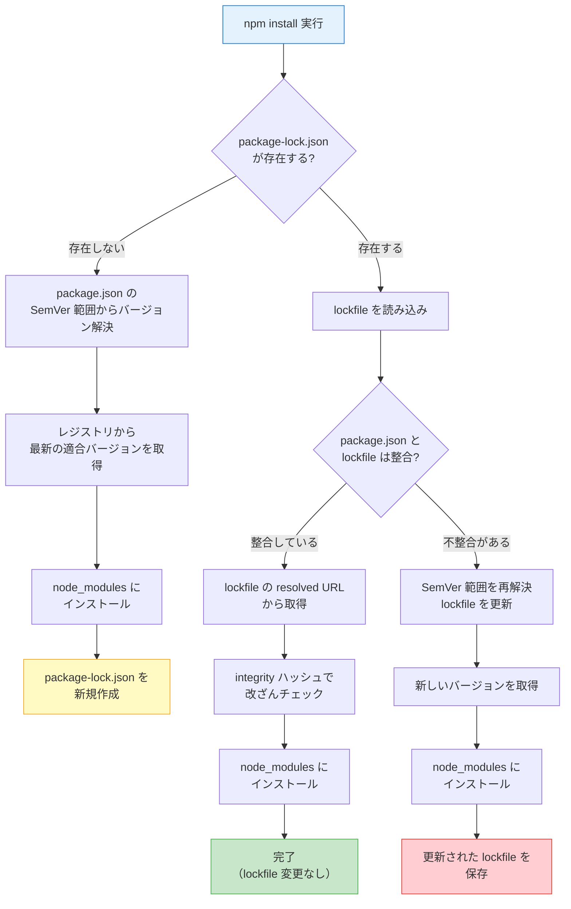

## 「package-lock.json、コミットすべき？」問題に決着をつける

チーム開発でこんな会話をしたことはありませんか。

- 「package-lock.json、`.gitignore` に入れていい？差分がでかいんだけど」
- 「マージしたら package-lock.json がコンフリクトした。手で直す？」
- 「ローカルでは動くのにCIで落ちる。package-lock.json のせい？」

package-lock.json は「なんとなく存在するファイル」ではありません。このファイルの役割を正しく理解しているかどうかで、依存関係トラブルへの対処速度が大きく変わります。

この記事では package-lock.json の**読み方**、**コンフリクト解消手順**、**チーム運用のベストプラクティス**を、実行可能なコマンド付きで解説します。

## package-lock.json とは何か ── 30秒で理解する

### SemVer範囲指定だけでは同じ環境を再現できない

`package.json` の依存関係は通常こう書かれています。

```json
{
  "dependencies": {
    "express": "^4.18.2"
  }
}
```

`^4.18.2` は「4.18.2 以上 5.0.0 未満」を意味します。この範囲指定だけでは、**いつ `npm install` を実行するかによって、実際にインストールされるバージョンが変わります**。

```
# 2024年1月に npm install → express@4.18.2 がインストールされる
# 2024年6月に npm install → express@4.19.0 がインストールされる
# 2025年3月に npm install → express@4.21.1 がインストールされる
```

直接依存の express だけでなく、express が内部で使っている body-parser や cookie なども同じ問題を抱えています。1つのプロジェクトで数百の間接依存があれば、再現不可能な組み合わせは膨大です。

### lockfile = 依存ツリー全体のスナップショット

package-lock.json は、ある時点で解決された**依存ツリー全体のスナップショット**です。

- 直接依存だけでなく、間接依存のすべてのパッケージを記録する
- 各パッケージの**確定バージョン**（範囲ではなく固定値）を記録する
- ダウンロード元URLとハッシュ値を記録し、改ざんも検知する

lockfile があれば、いつ・どのマシンで `npm install`（正確には `npm ci`）を実行しても、同一の `node_modules` が再現されます。

## package-lock.json の読み方

### lockfileVersion 3（npm v9+）の構造

現在の npm（v9以降）が生成する package-lock.json は lockfileVersion 3 です。npm v7-v8は lockfileVersion 2 をデフォルトで生成していました。実際のファイルを見てみましょう。

```json
{
  "name": "my-app",
  "version": "1.0.0",
  "lockfileVersion": 3,
  "requires": true,
  "packages": {
    "": {
      "name": "my-app",
      "version": "1.0.0",
      "dependencies": {
        "express": "^4.18.2"
      }
    },
    "node_modules/express": {
      "version": "4.21.1",
      "resolved": "https://registry.npmjs.org/express/-/express-4.21.1.tgz",
      "integrity": "sha512-YSFlK1Ee0/GC8QaO91tHcDxJiE/X4FbpAy...",
      "license": "MIT",
      "dependencies": {
        "accepts": "~1.3.8",
        "body-parser": "1.20.3",
        "content-type": "~1.0.4"
      },
      "engines": {
        "node": ">= 0.10"
      }
    },
    "node_modules/body-parser": {
      "version": "1.20.3",
      "resolved": "https://registry.npmjs.org/body-parser/-/body-parser-1.20.3.tgz",
      "integrity": "sha512-7rAxByjUMqQ3/bHJy7D6OGXvx/MMc4IqB...",
      "license": "MIT",
      "dependencies": {
        "bytes": "3.1.2",
        "content-type": "~1.0.5",
        "debug": "2.6.9"
      }
    }
  }
}
```

### 各フィールドの意味

| フィールド | 意味 | 例 |
|:--|:--|:--|
| `""` (空文字キー) | プロジェクトのルート自身 | package.json の内容が反映される |
| `version` | 実際にインストールされた確定バージョン | `"4.21.1"` (範囲ではなく固定値) |
| `resolved` | パッケージの取得元URL | `"https://registry.npmjs.org/..."` |
| `integrity` | tarball の SRI ハッシュ | `"sha512-YSFlK1..."` |
| `dependencies` | そのパッケージが依存する他パッケージ | `{ "body-parser": "1.20.3" }` |
| `license` | ライセンス (npm 9+ で追加) | `"MIT"` |
| `engines` | 動作要件の Node.js バージョン | `{ "node": ">= 0.10" }` |

特に重要なのは以下の3つです。

**`resolved` (取得元URL)**: パッケージをどこからダウンロードしたかを記録します。通常は npm レジストリですが、Git リポジトリやローカルパスの場合もここに記録されます。チーム内で private registry を使っている場合、このフィールドでどのレジストリから取得されたか確認できます。

**`integrity` (ハッシュ)**: ダウンロードした tarball の SHA-512 ハッシュを Subresource Integrity (SRI) 形式で記録します。`npm ci` 実行時にダウンロードしたファイルのハッシュとこの値を照合し、**一致しなければインストールを中断**します。サプライチェーン攻撃への防御線の一つです。

**`dependencies` (依存ツリー)**: そのパッケージが必要とする他のパッケージとバージョンが記録されます。lockfile 全体としてこれらが連鎖し、完全な依存ツリーを形成します。

### 実際に読んでみよう

自分のプロジェクトの lockfile を確認するには、以下のコマンドが便利です。

```bash
# lockfileVersion を確認
node -e "console.log(JSON.parse(require('fs').readFileSync('package-lock.json','utf8')).lockfileVersion)"

# 特定パッケージの情報を確認
node -e "
const lock = JSON.parse(require('fs').readFileSync('package-lock.json','utf8'));
const pkg = lock.packages['node_modules/express'];
if (pkg) {
  console.log('version:', pkg.version);
  console.log('resolved:', pkg.resolved);
  console.log('integrity:', pkg.integrity?.substring(0, 30) + '...');
} else {
  console.log('express is not installed');
}
"

# パッケージ総数をカウント
node -e "
const lock = JSON.parse(require('fs').readFileSync('package-lock.json','utf8'));
const count = Object.keys(lock.packages).filter(k => k !== '').length;
console.log('パッケージ総数:', count);
"
```

## npm ci vs npm install ── 使い分け早見表

lockfile の理解と切り離せないのが、`npm ci` と `npm install` の違いです。

### 動作の違い

**`npm install`**:
1. `package.json` を読む
2. lockfile があれば参考にする（ただし絶対ではない）
3. SemVer 範囲を満たす最新バージョンを解決する
4. lockfile の記録と矛盾がなければ採用し、矛盾すれば **lockfile を更新する**
5. 既存の `node_modules` に差分インストールする

**`npm ci`**:
1. lockfile を読む（**存在しなければエラーで停止**）
2. `package.json` との整合性を検証する（不整合ならエラーで停止）
3. `node_modules` を **完全に削除** する
4. lockfile に記録されたバージョンを **そのままインストール** する
5. lockfile は **一切変更しない**

### 比較表

| 観点 | `npm install` | `npm ci` |
|:--|:--|:--|
| lockfile の扱い | 参考にする（更新もする） | 厳密に従う（変更しない） |
| `node_modules` | 差分インストール | 全削除して再構築 |
| lockfile がない場合 | 新規作成する | エラーで終了 |
| lockfile と package.json の不整合 | lockfile を更新 | エラーで終了 |
| 主な用途 | ローカル開発、パッケージ追加 | CI/CD、環境の厳密な再現 |
| 速度 | 差分が少なければ速い | 削除+再構築のオーバーヘッドあり |

### 使い分けの原則

```bash
# ローカル開発: 新しいパッケージの追加・更新
npm install express        # package.json と lockfile の両方を更新

# CI環境: lockfile を厳密に再現
npm ci                     # lockfile どおりにインストール、lockfile は変更しない

# 「なんか壊れた」と思ったとき: クリーンな状態から再構築
rm -rf node_modules
npm ci
```

**CIでは必ず `npm ci` を使ってください**。`npm install` を使うと、CI 実行のタイミングによって間接依存のバージョンが変わり、「昨日は通ったのに今日は落ちる」という再現困難なバグの原因になります。

### GitHub Actions での設定例

```yaml
# .github/workflows/ci.yml
jobs:
  build:
    runs-on: ubuntu-latest
    steps:
      - uses: actions/checkout@v4

      - uses: actions/setup-node@v4
        with:
          node-version: 22
          cache: 'npm'   # ~/.npm キャッシュを自動復元

      - run: npm ci      # lockfile に従って厳密にインストール

      - run: npm test
      - run: npm run build
```

`cache: 'npm'` は `~/.npm` のキャッシュを保存・復元します。`npm ci` は `node_modules` を削除しますが、キャッシュからパッケージを取得するためネットワークアクセスが大幅に減り、インストール時間が短縮されます。

## npm install のフロー ── lockfile あり/なしの違い

`npm install` 実行時に lockfile の有無で何が変わるのか、フローチャートで確認しましょう。



ここで注目すべきは赤色の「更新された lockfile を保存」です。`npm install` は lockfile を **書き換えることがある** ため、CI で使うと意図しない変更が混入するリスクがあります。これが「CI では `npm ci` を使うべき」と言われる根拠です。

## コンフリクト解消法 ── ステップバイステップ

チーム開発で最も頻繁に遭遇する lockfile トラブルが、Git マージ時のコンフリクトです。

### なぜ lockfile はコンフリクトしやすいのか

package-lock.json は数千行の JSON ファイルです。2人の開発者がそれぞれ異なるパッケージを追加すると、lockfile の広い範囲が変更されるため、Git が自動マージできずコンフリクトになります。

### 解消手順（推奨）

lockfile のコンフリクトを手動で修正しようとしないでください。JSON の構文を壊すリスクが高く、仮に構文が正しくても依存ツリーの整合性が保証されません。

以下の手順で解消します。

```bash
# Step 1: コンフリクトが起きた状態を確認
git status
# both modified: package-lock.json

# Step 2: package.json のコンフリクトを先に解消する
# （両方のブランチで追加したパッケージを両方残す）
git diff package.json  # 差分を確認
# package.json は手動でマージする（通常は両方の追加を残すだけ）

# Step 3: lockfile はマージターゲット側を一旦採用
git checkout --theirs package-lock.json

# Step 4: npm install で lockfile を再生成
npm install

# Step 5: 再生成された lockfile をステージ
git add package.json package-lock.json

# Step 6: マージコミットを完了
git commit
```

**ポイント**: Step 3 の `--theirs` は「マージ元（取り込む側）の lockfile を採用する」という意味です。Step 4 の `npm install` が `package.json` の内容に基づいて lockfile を正しく再生成するため、Step 3 で `--ours` を使っても最終結果は同じです。

### 動作確認

```bash
# lockfile と package.json の整合性を確認
npm ci
# エラーなく完了すれば OK

# テストを実行して動作確認
npm test
```

`npm ci` がエラーなく通れば、lockfile と package.json は整合しています。必ずテストも実行して、依存関係の変更がアプリケーションの動作に影響していないか確認してください。

:::message
lockfile を再生成すると、間接依存のバージョンが変わる可能性があります。`npm install` はSemVer 範囲内の最新バージョンを解決するため、コンフリクト前とは異なるバージョンが入ることがあります。テストの実行は省略しないでください。
:::

## package-lock.json をコミットすべきか

### 結論: アプリケーションなら必ず Yes

package-lock.json は **必ずコミットしてください**。`.gitignore` に入れてはいけません。

理由は3つあります。

1. **再現性の確保**: lockfile がなければ、開発者ごと・CI実行ごとに異なるバージョンがインストールされます。「自分の環境では動く」問題の最大の原因です
2. **`npm ci` が使えなくなる**: lockfile がないと `npm ci` はエラーで停止します。CI パイプラインで再現可能なビルドができなくなります
3. **セキュリティ**: lockfile の `integrity` ハッシュにより、パッケージの改ざんを検知できます。lockfile がなければこの防御線が機能しません

### ライブラリの場合

npm パッケージとして公開するライブラリの場合は状況が異なります。npm は **公開時に lockfile を無視** するため、ライブラリの lockfile はエンドユーザーのインストールに影響しません。

ただし、ライブラリの開発・テスト環境の再現性のためにコミットすることは有益です。npm 公式ドキュメントでも lockfile のコミットが推奨されています。

```bash
# 確認: .gitignore に package-lock.json が含まれていないか
grep "package-lock" .gitignore
# 何も表示されなければ OK
# 表示されたら、その行を削除してください
```

### 判断早見表

| プロジェクトの種類 | コミットすべきか | 理由 |
|:--|:--|:--|
| Web アプリケーション | 必須 | 全環境で同一の依存を保証 |
| API サーバー | 必須 | 本番環境の再現性確保 |
| CLI ツール | 必須 | ユーザー環境での動作保証 |
| npm ライブラリ | 推奨 | 開発・テスト環境の再現性 |

:::message
lockfile の設計思想やフォーマットが npm / yarn / pnpm で異なる理由について詳しく知りたい方は、拙著 **[「なぜnode_modulesは壊れるのか？」](https://zenn.dev/yuichi_ai/books/package-manager-from-scratch)** の第4章で解説しています。「なぜこうなっているのか」を理解すると、トラブルに遭遇したときの判断力が上がります。
:::

## よくあるトラブルと解決法

### トラブル1: lockfile と package.json の不整合

**症状**: `npm ci` を実行すると以下のエラーが出る。

```
npm ERR! `npm ci` can only install packages when your package-lock.json
npm ERR! is in sync with your package.json.
```

**原因**: `package.json` を手動で編集した後、`npm install` を実行せずに lockfile を更新しなかった。

**解決方法**:

```bash
# lockfile を package.json に合わせて再生成
npm install

# 再生成された lockfile をコミット
git add package-lock.json
git commit -m "fix: sync package-lock.json with package.json"
```

**予防策**: `package.json` を手動で編集したら、必ず `npm install` を実行して lockfile を更新してからコミットしてください。パッケージの追加・削除は `npm install <package>` / `npm uninstall <package>` コマンドを使えば、package.json と lockfile が同時に更新されます。

### トラブル2: CI 環境での再現性問題

**症状**: ローカルでは `npm ci` が通るのに、CI では失敗する。または、CI で突然テストが落ちるようになった。

**原因パターンと対処法**:

```bash
# 原因1: lockfile のコミット漏れ
git status
# → package-lock.json が Untracked になっていないか確認

# 原因2: lockfile と package.json の不整合
# → ローカルで npm ci を実行してエラーが出ないか確認
npm ci

# 原因3: npm のバージョン差異
# ローカルとCIの npm バージョンを揃える
node -v   # Node.js バージョン
npm -v    # npm バージョン
```

**CI の設定で Node.js バージョンを固定する例**:

```yaml
# GitHub Actions
- uses: actions/setup-node@v4
  with:
    node-version-file: '.node-version'  # プロジェクトのファイルから読む
    cache: 'npm'
```

```bash
# .node-version ファイルを作成（チーム全員が同じバージョンを使う）
echo "22.14.0" > .node-version
```

### トラブル3: チームメンバー間の Node.js バージョン不統一

**症状**: メンバー A がコミットした lockfile をメンバー B が `npm ci` すると失敗する。または、`npm install` するたびに lockfile の差分が大量に出る。

**原因**: Node.js（および同梱される npm）のバージョンが異なると、lockfile の生成結果が変わることがあります。特に npm のメジャーバージョンが異なると lockfileVersion 自体が変わります。

**解決方法**: チーム全員の Node.js バージョンを揃えます。

```bash
# 方法1: .node-version ファイル（nvm、fnm、volta 共通）
echo "22.14.0" > .node-version

# 方法2: volta でプロジェクトに固定
volta pin node@22.14.0
volta pin npm@11
# → package.json の "volta" フィールドに記録される

# 方法3: package.json の engines フィールド
# package.json に以下を追加
```

```json
{
  "engines": {
    "node": ">=22.0.0",
    "npm": ">=10.0.0"
  }
}
```

```bash
# engines を厳密に適用する設定（.npmrc に追加）
echo "engine-strict=true" >> .npmrc
```

`engine-strict=true` を設定すると、`engines` フィールドの条件を満たさない Node.js/npm バージョンでの `npm install` がエラーで停止します。

### トラブル4: lockfile の差分が大きすぎてレビューできない

**症状**: パッケージを1つ追加しただけなのに、lockfile の差分が数百行になる。

**原因**: 間接依存の追加・バージョン変更が連鎖するため、これは正常な動作です。

**対処法**: lockfile の差分は**レビューしなくて OK** です。重要なのは `package.json` の差分です。

```bash
# レビューのコツ: package.json の変更だけ確認する
git diff main -- package.json

# lockfile の整合性は npm ci で検証
npm ci && npm test
```

GitHub のプルリクエストでは、lockfile を自動的に折りたたんで表示する設定ができます。

```
# .gitattributes に追加
package-lock.json linguist-generated=true
```

この設定により、GitHub 上で lockfile の差分がデフォルトで折りたたまれ、レビュアーの負担が軽減されます。

### トラブル5: lockfile を間違えて削除してしまった

**症状**: `package-lock.json` を削除して `npm install` したら、間接依存のバージョンが変わった。

**解決方法**:

```bash
# Git から復元（コミット済みの場合）
git checkout HEAD -- package-lock.json
npm ci

# すでにコミットしてしまった場合
git log --oneline -- package-lock.json  # 最後に正しかったコミットを確認
git checkout <commit-hash> -- package-lock.json
npm ci
npm test  # 動作確認
```

## 運用チェックリスト

チームで package-lock.json を正しく運用するためのチェックリストです。

### プロジェクト初期設定

```bash
# 1. package-lock.json が .gitignore に含まれていないことを確認
grep "package-lock" .gitignore && echo "WARNING: 削除してください" || echo "OK"

# 2. .node-version でチームの Node.js バージョンを固定
echo "22.14.0" > .node-version

# 3. lockfile の差分を GitHub で自動折りたたみ
echo "package-lock.json linguist-generated=true" >> .gitattributes

# 4. engines フィールドで最低バージョンを指定
# package.json に手動で追加:
# "engines": { "node": ">=22.0.0", "npm": ">=10.0.0" }

# 5. engine-strict を有効化
echo "engine-strict=true" >> .npmrc
```

### 日常の開発フロー

| 操作 | コマンド | lockfile への影響 |
|:--|:--|:--|
| パッケージ追加 | `npm install <pkg>` | 更新される（コミット必要） |
| パッケージ削除 | `npm uninstall <pkg>` | 更新される（コミット必要） |
| パッケージ更新 | `npm update <pkg>` | 更新される（コミット必要） |
| ブランチ切り替え後 | `npm ci` | 変更されない |
| 「壊れた」と思ったとき | `rm -rf node_modules && npm ci` | 変更されない |
| CI/CD | `npm ci` | 変更されない |

### やってはいけないこと

| NG 操作 | 理由 | 代わりにやること |
|:--|:--|:--|
| lockfile を `.gitignore` に入れる | 再現性が失われる | 必ずコミットする |
| lockfile のコンフリクトを手動で直す | 整合性が壊れるリスク | `npm install` で再生成する |
| CI で `npm install` を使う | lockfile が更新される可能性 | `npm ci` を使う |
| `package.json` 手動編集後に `npm install` を忘れる | lockfile と不整合になる | 編集後に必ず `npm install` |

## まとめ

この記事で解説した内容を整理します。

| テーマ | ポイント |
|:--|:--|
| lockfile の役割 | 依存ツリー全体のスナップショットで再現性を保証 |
| 読み方 | `resolved`(取得元)、`integrity`(ハッシュ)、`dependencies`(依存ツリー) |
| `npm ci` vs `npm install` | CI では `npm ci`、ローカル開発では `npm install` |
| コンフリクト解消 | 手動マージは NG。`npm install` で再生成が正解 |
| コミットすべきか | アプリケーションなら必ず Yes |
| バージョン統一 | `.node-version` + `engine-strict=true` で固定 |

---

この記事では package-lock.json の「使い方」にフォーカスしました。しかし、lockfile がなぜこの構造なのか、npm / yarn / pnpm で設計が異なる理由、そして lockfile の限界を理解すると、トラブルに遭遇したときの対処速度が格段に上がります。lockfile の設計思想から学びたい方は、拙著 **[「なぜnode_modulesは壊れるのか？」](https://zenn.dev/yuichi_ai/books/package-manager-from-scratch)** の第4章をご覧ください。

---
