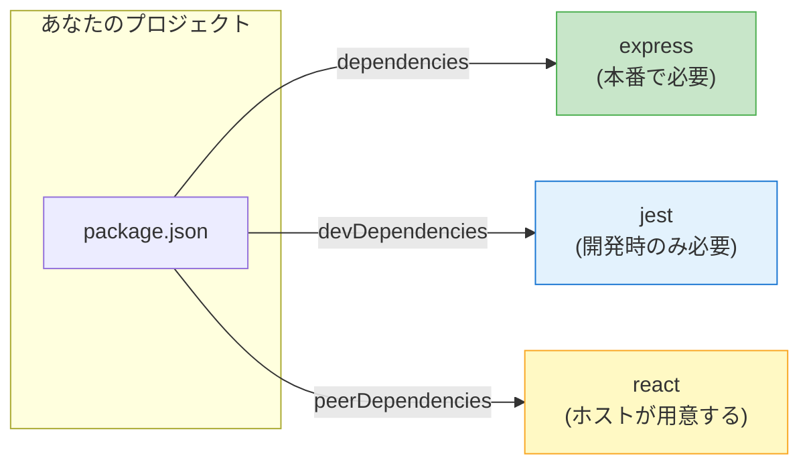
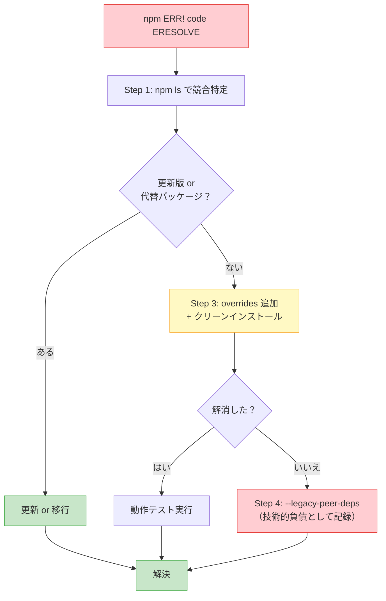

## Reactを更新したら全部壊れた

金曜日の午後、あなたはReactを17から18にメジャーアップデートした。`package.json` の `"react"` を `"^18.3.1"` に書き換えて `npm install` を実行する。数秒後、ターミナルが真っ赤に染まった。

```
npm ERR! code ERESOLVE
npm ERR! ERESOLVE unable to resolve dependency tree
npm ERR!
npm ERR! While resolving: my-app@1.0.0
npm ERR! Found: react@18.3.1
npm ERR! node_modules/react
npm ERR!   react@"^18.3.1" from the root project
npm ERR!
npm ERR! Could not resolve dependency:
npm ERR! peer react@"^16.8.0 || ^17.0.0" from react-beautiful-dnd@13.1.1
npm ERR! node_modules/react-beautiful-dnd
npm ERR!   react-beautiful-dnd@"^13.1.1" from the root project
npm ERR!
npm ERR! Fix the upstream dependency conflict, or retry
npm ERR! this command with --force, or --legacy-peer-deps
npm ERR! to accept an incorrect (and potentially broken) dependency resolution.
```

「`ERESOLVE`？ peer dependency？ 何が衝突しているのか全然わからない...」

この記事では、peer dependencyの仕組みからERESOLVEエラーの解決方法まで、コマンド付きで解説します。

## peer dependencyとは何か

### 「一緒に使ってね」という宣言

peer dependencyは、ライブラリが「このパッケージは、ホストプロジェクトに特定のパッケージが入っていることを前提に動きます」と宣言する仕組みです。

```json
// react-beautiful-dnd の package.json
{
  "peerDependencies": {
    "react": "^16.8.0 || ^17.0.0",
    "react-dom": "^16.8.0 || ^17.0.0"
  }
}
```

この宣言は「`react-beautiful-dnd` を使うなら、あなたのプロジェクトにReact 16.8以上またはReact 17が入っている必要があります」という意味です。React 18はこの範囲に含まれないため、冒頭のエラーが発生したのです。

### dependencies / devDependencies / peerDependencies の違い



| 種類 | 目的 | `npm install` での扱い | 具体例 |
|------|------|----------------------|--------|
| `dependencies` | 本番コードの実行に必要 | 自動インストールされる | `express`, `lodash` |
| `devDependencies` | 開発・テスト・ビルドに必要 | `npm install` でインストール、`npm install --omit=dev` でスキップ | `jest`, `typescript`, `eslint` |
| `peerDependencies` | ホストプロジェクトに特定パッケージがあることを要求 | npm v7以降は自動インストール（衝突時はエラー） | Reactプラグイン、ESLintプラグイン |

`dependencies` は「自分で持ってくる」、`peerDependencies` は「ホストが持っているものを使わせてね」という違いがポイントです。

### なぜ peer dependency が必要なのか

もし `react-beautiful-dnd` が `dependencies` にReactを書くと、プロジェクトにReact 18、ライブラリ内部にReact 17と**2つのReactインスタンス**が共存してしまいます。Reactは状態管理をシングルトンで行うため、複数インスタンスの混在は実行時エラーの原因になります。peer dependencyは「全員が同じインスタンスを共有する」ための仕組みです。

## なぜERESOLVEエラーが起きるのか

### npm v6とv7で変わったpeer dependencyの扱い

ERESOLVEエラーが頻発するようになった背景には、npm v7（2020年10月リリース、Node.js 15にバンドル）での仕様変更があります。

| バージョン | peer dependencyの扱い | 衝突時の挙動 |
|-----------|---------------------|------------|
| npm v3〜v6 | 自動インストール**しない** | 警告（`WARN`）を出すだけ。インストールは完了する |
| npm v7以降 | 自動インストール**する** | 衝突を検知したら**エラー**（`ERESOLVE`）で停止する |

つまりERESOLVEエラーは「以前からあった問題が可視化された」ものです。npm v6時代も衝突は起きていましたが、警告を無視して先に進めていただけです。

### 衝突が起きるパターン

最もよくあるパターンを図で示します。

```mermaid
graph TD
    P["あなたのプロジェクト<br/>my-app@1.0.0"] --> R18["react@18.3.1"]
    P --> LIB_A["react-beautiful-dnd@13.1.1"]
    P --> LIB_B["@emotion/react@11.13.0"]

    LIB_A -.->|"peer: react@^16.8.0 &#124;&#124; ^17.0.0"| R18
    LIB_B -.->|"peer: react@>=16.8.0"| R18

    R18 -.-x|"18.3.1 は ^16.8.0 &#124;&#124; ^17.0.0 の範囲外"| LIB_A
    R18 -.->|"18.3.1 は >=16.8.0 を満たす"| LIB_B

    style R18 fill:#e3f2fd,stroke:#1976d2
    style LIB_A fill:#ffcdd2,stroke:#e53935
    style LIB_B fill:#c8e6c9,stroke:#4caf50
```



`@emotion/react` は `react@>=16.8.0` と宣言しているためReact 18で問題ありません。しかし `react-beautiful-dnd` は `react@^16.8.0 || ^17.0.0` としており、React 18がこの範囲に含まれないためERESOLVEが発生します。

## ERESOLVEエラーの解決手順

ここからが本題です。ERESOLVEエラーを見たら、以下の4ステップで対処してください。

### Step 1: `npm ls` で競合を特定する

まず、何が衝突しているのかを正確に把握します。

```bash
# エラーメッセージに出ているパッケージ名で依存ツリーを表示
npm ls react
```

出力例:

```
my-app@1.0.0
├── react@18.3.1
├─┬ react-beautiful-dnd@13.1.1
│ └── UNMET PEER DEPENDENCY react@"^16.8.0 || ^17.0.0"
├─┬ @emotion/react@11.13.0
│ └── react@18.3.1 deduped
└─┬ react-dom@18.3.1
  └── react@18.3.1 deduped
```

`UNMET PEER DEPENDENCY` と表示されている行が問題の箇所です。この例では `react-beautiful-dnd@13.1.1` がReact 18に対応していないことがわかります。

複数パッケージが衝突している場合は、`npm ls` の出力を注意深く読み、すべての `UNMET PEER DEPENDENCY` を洗い出してください。

### Step 2: 原因パッケージの更新版を確認する

衝突を起こしているパッケージに、新しいバージョンが出ていないか確認します。

```bash
# 利用可能なバージョンを確認
npm view react-beautiful-dnd versions --json

# 最新版のpeer dependencyを確認
npm view react-beautiful-dnd peerDependencies
```

もし最新版がReact 18に対応していれば、パッケージを更新するだけで解決です。

```bash
npm install react-beautiful-dnd@latest
```

この例の `react-beautiful-dnd` はメンテナンスが停止しており、React 18対応版はありません。代替として `@hello-pangea/dnd`（フォーク版）が存在します。更新版がない場合は代替パッケージへの移行も検討してください。

### Step 3: overrides で解決する

更新版も代替パッケージもない場合、`overrides` を使ってpeer dependencyの要求を上書きします。

`package.json` に以下を追加してください。

```json
{
  "dependencies": {
    "react": "^18.3.1",
    "react-dom": "^18.3.1",
    "react-beautiful-dnd": "^13.1.1"
  },
  "overrides": {
    "react-beautiful-dnd": {
      "react": "$react",
      "react-dom": "$react-dom"
    }
  }
}
```

`overrides` を追加したら、`node_modules` と `package-lock.json` を削除してからインストールし直します。

```bash
rm -rf node_modules package-lock.json
npm install
```

**`$パッケージ名` 記法について**

`$react` は npm 独自の記法で、ルートの `package.json` の同名パッケージのバージョンを参照します。つまり `"$react"` は「ルートに定義されている react のバージョンをここでも使う」という意味です。Reactのバージョンを変更しても `overrides` を手動で書き換える必要がありません。

:::message alert
`overrides` は「このパッケージが本当にReact 18で動くか」を npm が保証するものではありません。動作検証は自己責任です。テストを実行し、実際に動作することを確認してから本番に反映してください。
:::

### Step 4: 最終手段 --legacy-peer-deps

Step 1〜3で解決できない場合、`--legacy-peer-deps` フラグで一時的にエラーを回避できます。

```bash
npm install --legacy-peer-deps
```

このフラグはnpm v6時代の挙動に戻し、peer dependencyの自動インストールと衝突チェックを無効化します。

**リスク:**

- 実行時エラーを引き起こす可能性がある
- lockfileに不正確な依存ツリーが記録される
- チームメンバーがフラグを付け忘れるとインストールが失敗する

`.npmrc` に `legacy-peer-deps=true` を恒久設定することもできますが、なぜ必要なのかを必ずコメントで記録してください。

:::message
この記事ではERESOLVEエラーの「解決手順」にフォーカスしています。peer dependencyが内部でどのように解決されるのか、npm v7でなぜ自動インストールに変わったのかを設計レベルで理解すると、エラーメッセージを読むだけで原因の見当がつくようになります。依存解決の内部動作を学びたい方は、拙著 **[「なぜnode_modulesは壊れるのか？」](https://zenn.dev/yuichi_ai/books/package-manager-from-scratch)** の第7章をご覧ください。
:::

## --legacy-peer-deps vs --force: 違いと使い分け

エラーメッセージに `--force` と `--legacy-peer-deps` の両方が提案されますが、この2つは動作が異なります。

| 項目 | `--legacy-peer-deps` | `--force` |
|------|---------------------|-----------|
| 何をするか | peer dep の自動インストールを無効化し、npm v6 の挙動に戻す | 全ての依存衝突を無視して強制インストール |
| peer dependency | チェックをスキップ | チェックをスキップ |
| 通常の依存衝突 | **通常通りチェック** | **これもスキップ** |
| lockfile への影響 | peer dep 情報が不完全になる | 依存ツリー全体が不正確になるリスク |
| リスクの大きさ | 中（peer dep の不整合のみ） | 高（依存ツリー全体が壊れうる） |
| 用途 | peer dep 衝突の一時回避 | 通常は使わない |

```bash
# より安全な方（peer depの衝突だけを回避）
npm install --legacy-peer-deps

# より危険な方（すべての衝突を無視）
npm install --force
```

**どちらも一時凌ぎです。** 本番環境で長期間使い続けるべきではありません。必ずStep 2（パッケージ更新）またはStep 3（overrides）で根本解決してください。

## overrides の書き方詳解: npm / pnpm / yarn

peer dependency の衝突をoverridesで解決する方法は、パッケージマネージャごとに構文が異なります。

### npm overrides（npm v8.3以降）

```json
{
  "overrides": {
    "react-beautiful-dnd": {
      "react": "$react",
      "react-dom": "$react-dom"
    }
  }
}
```

npmのoverridesは `package.json` に直接記述します。`$パッケージ名` 記法でルートの依存バージョンを参照できます。ネストした依存にも対応しており、JSON構造でパスを表現します。

### pnpm overrides

```json
{
  "pnpm": {
    "overrides": {
      "react-beautiful-dnd>react": "^18.3.1",
      "react-beautiful-dnd>react-dom": "^18.3.1"
    }
  }
}
```

pnpmは `package.json` の `"pnpm"` フィールド内に記述します。`>` でパッケージの依存先を指定する構文です。pnpmには `$パッケージ名` 記法はないため、バージョンを直接書きます。

### yarn resolutions（Yarn Classic v1）

```json
{
  "resolutions": {
    "react-beautiful-dnd/react": "^18.3.1",
    "react-beautiful-dnd/react-dom": "^18.3.1"
  }
}
```

Yarn Classic は `resolutions` フィールドを使います。`/` でパッケージのパスを区切ります。

### yarn resolutions（Yarn Berry v2以降）

Yarn Berry でも `resolutions` フィールドの基本構文は Classic と同じです。パッチ機能と組み合わせてより高度な制御も可能です。

### 3ツール比較表

| 項目 | npm | pnpm | Yarn |
|------|-----|------|------|
| フィールド名 | `overrides` | `pnpm.overrides` | `resolutions` |
| パス区切り | ネスト（JSON構造） | `>` | `/` |
| ルート参照 | `$パッケージ名` | なし（直接記述） | なし（直接記述） |
| 対応バージョン | v8.3+ | 全バージョン | v1+ |

```bash
# overrides を追加した後は必ずクリーンインストール
rm -rf node_modules package-lock.json  # npm
rm -rf node_modules pnpm-lock.yaml     # pnpm
rm -rf node_modules yarn.lock          # yarn

# 再インストール
npm install    # or pnpm install / yarn install
```

## peer dependency を正しく宣言する方法（ライブラリ作者向け）

ここまでは「使う側」の話でした。ここからは「作る側」の話です。ライブラリやプラグインを公開する際に、peer dependencyを正しく宣言する方法を解説します。

### 基本の書き方

```json
{
  "name": "my-react-component",
  "version": "1.0.0",
  "peerDependencies": {
    "react": "^17.0.0 || ^18.0.0 || ^19.0.0",
    "react-dom": "^17.0.0 || ^18.0.0 || ^19.0.0"
  }
}
```

**ポイント:**

1. **範囲は広めに取る**: 特定のバージョンでしか動かない理由がない限り、`||` で複数メジャーバージョンを許容する
2. **実際にテストしたバージョンだけ書く**: React 16で動作確認していないなら `^16.0.0` は含めない
3. **マイナーバージョンの下限を意識する**: React Hooksを使っているなら `^16.8.0` が下限（Hooks導入バージョン）

### peerDependenciesMeta: optional 宣言

「あれば使うが、なくても動く」という依存は `peerDependenciesMeta` で `optional` を宣言できます。

```json
{
  "name": "my-testing-library",
  "peerDependencies": {
    "react": "^18.0.0 || ^19.0.0",
    "typescript": ">=4.7.0"
  },
  "peerDependenciesMeta": {
    "typescript": {
      "optional": true
    }
  }
}
```

この宣言により、TypeScriptがインストールされていなくてもERESOLVEエラーは発生しません。TypeScriptが入っていれば型定義を提供し、入っていなければJavaScriptだけで動作します。

ESLint、Jest、Storybook などのツールが、TypeScript対応をoptionalにする際によく使われるパターンです。

### やってはいけないこと

```json
// NG: dependencies と peerDependencies の両方に書く
{
  "dependencies": {
    "react": "^18.3.1"     // ← NG: 2つのReactがインストールされる
  },
  "peerDependencies": {
    "react": "^18.0.0"
  }
}
```

`dependencies` と `peerDependencies` の両方に同じパッケージを書くと、ライブラリ内部にReactがインストールされ、ホストのReactと二重になり、実行時エラーの原因になります。

また、`"react": "18.3.1"` のような完全一致ではなく、`"react": "^18.0.0"` のような範囲指定を使ってください。完全一致にすると、パッチアップデート（`18.3.2`）を適用しただけでERESOLVEが発生します。

## ERESOLVEエラー解決フローチャート

ここまでの内容を1枚のフローチャートにまとめます。ERESOLVEエラーが出たら、このフローに沿って対処してください。



## トラブルシューティング FAQ

### Q: `overrides` を追加したのに効かない

`overrides` は `package-lock.json` に反映される必要があります。必ず以下の手順で実行してください。

```bash
rm -rf node_modules package-lock.json
npm install
```

`node_modules` だけ削除して `package-lock.json` を残した場合、古いlockfileの情報が優先されてoverridesが反映されないことがあります。

### Q: CI で `--legacy-peer-deps` を使いたい

プロジェクトルートに `.npmrc` を配置してリポジトリにコミットすれば、CIでも同じ設定が適用されます。ただしチーム全員に影響するため、なぜ必要なのかをコメントに記録してください。

### Q: pnpm で peer dependency エラーが出る

`.npmrc` に `strict-peer-dependencies=false` を追加するとエラーが警告に緩和されます。ただし根本解決は `pnpm.overrides` です。

### Q: monorepo で overrides が効かない

npm workspacesのmonorepoでは、`overrides` はルートの `package.json` にのみ記述します。個別ワークスペースの `package.json` に書いても無視されます。

## まとめ

| 状況 | 推奨アクション |
|------|-------------|
| ERESOLVEが出た | `npm ls` で競合を特定する |
| 原因パッケージに更新版がある | `npm install pkg@latest` で更新する |
| 更新版がない | `overrides` で peer dependency を上書きする |
| overrides でも解決しない | `--legacy-peer-deps` で一時回避し、技術的負債として記録する |
| ライブラリを作る側 | `peerDependencies` の範囲を広めに、`optional` を適切に宣言する |

焦って `--force` を使う前に、まず `npm ls` で原因を特定し、`overrides` での解決を試みてください。

---

この記事ではERESOLVEエラーの「解決方法」にフォーカスしました。しかし、peer dependencyがnpmの依存解決アルゴリズム内部でどのように処理されるのか、なぜv7で仕様が変わったのかを設計レベルで理解すると、エラーメッセージを見ただけで原因の見当がつくようになります。依存解決の内部動作を学びたい方は、拙著 **[「なぜnode_modulesは壊れるのか？」](https://zenn.dev/yuichi_ai/books/package-manager-from-scratch)** の第7章をご覧ください。

---

*この記事はAIの支援を受けて執筆されています。*
