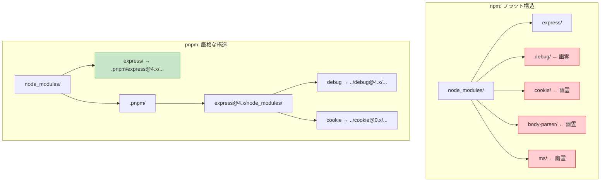

## ローカルでは動くのに、CIで落ちる

金曜日の夕方、あなたはプルリクエストを出した。ローカルでは完璧に動いている。テストも全部通った。安心してマージボタンを押そうとしたその時、CIが真っ赤になる。

```
Error: Cannot find module 'debug'
    at Module._resolveFilename (node:internal/modules/cjs/loader:1145:15)
    at Module._load (node:internal/modules/cjs/loader:986:27)
```

「`debug`なんてパッケージ、自分で使った覚えがない...」

同僚のマシンでも再現する。でも自分のマシンでは動く。`node_modules`を削除して`npm install`し直すと、今度は自分のマシンでも動かなくなった。

この現象の正体がPhantom Dependency（幽霊依存）だ。そしてこれは、あなたのコードのバグではなく、`node_modules`の構造的な欠陥が引き起こしている。

## Phantom Dependencyとは

Phantom Dependencyとは、**`package.json`に宣言していないのに`require`や`import`で使えてしまうパッケージ**のことだ。

たとえるなら、隣の家のWiFiが暗号化されていなくて接続できてしまう状態だ。今は使えている。しかし隣人がパスワードを設定した瞬間、あなたのインターネットは突然途切れる。契約していないのだから当然だ。

Phantom Dependencyも同じだ。`npm install express`を実行すると、expressが内部で使う`debug`や`cookie`も一緒にインストールされる。npmの仕組み上、これらが`node_modules`のトップレベルに配置されるため、`require('debug')`と書いても動いてしまう。

```javascript
// app.js
const express = require('express');  // package.jsonに書いてある -- OK
const debug = require('debug');      // package.jsonに書いていない -- 動くが危険
```

`debug`はあなたが明示的にインストールしたものではない。expressの内部依存が「たまたま」見える位置にあるだけだ。これが幽霊依存の正体である。

## 実際に体験してみよう

言葉で説明するより、実際に手を動かして体験するのが一番早い。以下のコマンドをそのまま実行できる。

### ステップ1: 幽霊依存が「動いてしまう」ことを確認する

```bash
mkdir phantom-demo && cd phantom-demo
npm init -y
npm install express

# expressしかインストールしていないのに...
ls node_modules/ | wc -l
# 65 前後（expressの間接依存がすべてフラットに配置されている）

# package.jsonに宣言していないdebugをrequireしてみる
node -e "const debug = require('debug'); console.log(typeof debug);"
# function ← 動いてしまう！
```

`package.json`に`debug`は書いていないのに、`require`が成功する。これがPhantom Dependencyだ。

### ステップ2: 幽霊依存が「壊れる」瞬間を再現する

幽霊依存の本当の怖さは、ある日突然壊れることにある。以下のファイルを作成する。

```javascript
// phantom-app.js
const debug = require('debug');
const log = debug('app');
log('アプリケーション起動');
console.log('正常に動作しています');
```

```bash
node phantom-app.js
# 正常に動作しています
```

動いた。ではexpressが将来`debug`への依存をやめたら何が起きるか、シミュレーションする。

```bash
# debugをnode_modulesから手動で削除（expressが依存をやめた状況を再現）
rm -rf node_modules/debug

# もう一度実行
node phantom-app.js
# Error: Cannot find module 'debug'
```

壊れた。`package.json`に書いていないパッケージに依存していたため、そのパッケージが消えた瞬間にアプリケーションが動かなくなる。

### ステップ3: 正しい修正方法

修正は単純だ。使っているパッケージを`package.json`に明示的に宣言する。

```bash
npm install debug
# → package.jsonにdebugが追加される
# → expressがdebugをやめても、あなたのpackage.jsonが保持し続ける

# 後片付け
cd .. && rm -rf phantom-demo
```

## なぜ危険なのか

Phantom Dependencyは「動いているうちは気づかない」という性質を持つ。そして、以下の4つのタイミングで牙を剥く。

### 1. CI/CDでの突然の失敗

ローカルの`node_modules`にはキャッシュされた古いパッケージが残っている場合がある。CIは毎回クリーンな状態から`npm install`を実行するため、依存構造が異なり、幽霊依存が見えなくなることがある。冒頭のシナリオがまさにこれだ。

### 2. バージョンの不一致

幽霊依存で使えるパッケージのバージョンは、親パッケージ（例: express）が要求したバージョンで決まる。あなたのコードが特定バージョンのAPIを前提にしていても、親パッケージの更新で全く別のバージョンがインストールされる可能性がある。

```
# 今日の状態
express@4.18.0 → debug@2.6.9 がホイストされる
あなたのコード: debug@2.x のAPIで書いている → 動く

# expressを更新した後
express@5.0.0 → debug@4.3.4 がホイストされる
あなたのコード: debug@2.x のAPIで書いている → 壊れる
```

### 3. セキュリティ監査の盲点

`npm audit`は`package.json`と`package-lock.json`に記録された依存を検査する。幽霊依存として使っているパッケージに脆弱性があっても、`package.json`に書かれていなければ**あなたのプロジェクトの脆弱性として報告されない**。

### 4. チームメンバーの環境差異

npmのホイスティング結果はインストール順序によって変わりうる。同じ`package.json`でも、あるメンバーの環境では幽霊依存が見え、別のメンバーの環境では見えないという状況が発生する。

---

ここまでで、Phantom Dependencyが「何であるか」と「なぜ危険か」を理解できた。では、なぜこの問題がそもそも発生するのか。それは**npmのホイスティングアルゴリズムの設計判断**に起因している。npmがなぜフラットな`node_modules`構造を選んだのか、その歴史的背景と技術的トレードオフについては、以下の書籍で詳しく解説している。

https://zenn.dev/yuichi_ai/books/package-manager-from-scratch

ここからは、今すぐできる検出方法と対策に焦点を当てる。

## 検出方法と対策

### 1. knipで未宣言の依存を検出する

[knip](https://github.com/webpro-nl/knip)は、プロジェクト内で使われているパッケージと`package.json`の宣言を比較し、不一致を報告するツールだ。未使用の依存・export・ファイルも検出できる。

:::message
以前は`depcheck`が定番だったが、2025年にアーカイブされた。後継として`knip`への移行が推奨されている。
:::

```bash
# 実行（インストール不要）
npx knip

# 出力例
Unused dependencies (2)
some-unused-lib  package.json

Unlisted dependencies (2)
debug            src/app.js
cookie           src/middleware.js
```

`Unlisted dependencies`に表示されたパッケージが、幽霊依存の可能性が高い。コード内で`require`または`import`しているのに、`package.json`に宣言されていないパッケージだ。

```bash
# 修正: 検出されたパッケージを明示的にインストール
npm install debug cookie
```

### 2. ESLintで事前に防ぐ

`eslint-plugin-import`の`import/no-extraneous-dependencies`ルールを使うと、`package.json`に宣言されていないパッケージのimportをエラーにできる。

```bash
npm install --save-dev eslint-plugin-import
```

```javascript
// eslint.config.js（Flat Config形式 / ESLint 9+）
import importPlugin from 'eslint-plugin-import';

export default [
  {
    plugins: { import: importPlugin },
    rules: {
      'import/no-extraneous-dependencies': ['error', {
        devDependencies: ['**/*.test.js', '**/*.spec.js'],
        optionalDependencies: false,
      }],
    },
  },
];
```

この設定により、テストファイル以外で`devDependencies`や未宣言パッケージをimportするとESLintエラーになる。CIにESLintチェックを組み込んでおけば、幽霊依存がコードベースに入り込むのを防げる。

### 3. pnpmを使う

最も確実な対策は、パッケージマネージャ自体を変えることだ。pnpmは**デフォルトで幽霊依存を防ぐ構造**を持っている。

```bash
# pnpmに移行
npm install -g pnpm

# 既存プロジェクトで試す
rm -rf node_modules package-lock.json
pnpm install

# 幽霊依存のテスト（expressだけがpackage.jsonにある場合）
node -e "require('debug')"
# Error: Cannot find module 'debug'
# → pnpmではpackage.jsonに宣言していないパッケージは見えない
```

pnpmの`node_modules`では、**トップレベルに配置されるのは`package.json`に直接宣言した依存だけ**だからだ。



npmではexpressの間接依存がすべてトップレベルに露出している（赤色）。pnpmではexpressだけがトップレベルに見え（緑色）、間接依存は`.pnpm`ディレクトリの中に隔離されている。

## pnpmが解決する理由（概要）

pnpmが幽霊依存を防げるのは、**シンボリックリンクを使って、直接依存だけをトップレベルに公開**しているからだ。間接依存は`.pnpm`ディレクトリ内に配置され、そのパッケージを実際に必要としている親パッケージからのみアクセスできる。

Node.jsのモジュール解決は`node_modules`ディレクトリを親方向に遡って探索するため、トップレベルに存在しないパッケージは`require`できない。シンプルだが効果的な設計だ。

pnpmがこの構造を実現するために使っているContent-Addressable Store、ハードリンクとシンボリックリンクの使い分け、そしてnpmが最初からこの方式を採用しなかった歴史的経緯については、書籍で図解とともに詳しく解説している。

https://zenn.dev/yuichi_ai/books/package-manager-from-scratch

## まとめ: 今日からできるチェックリスト

Phantom Dependencyへの対策を、すぐ実行できるものから順に並べた。

| 対策 | 導入コスト | 効果 |
|---|---|---|
| `knip`を1回実行して既存の幽霊依存を洗い出す | 5分 | 既存問題の発見 |
| ESLint `import/no-extraneous-dependencies`をCIに追加 | 30分 | 新規混入の防止 |
| pnpmへの移行 | 1-2時間 | 構造的な根絶 |

最も手軽なのは`knip`の実行だ。今すぐターミナルで`npx knip`を実行してみてほしい。`Unlisted dependencies`に何か表示されたら、あなたのプロジェクトには幽霊がいる。

---
