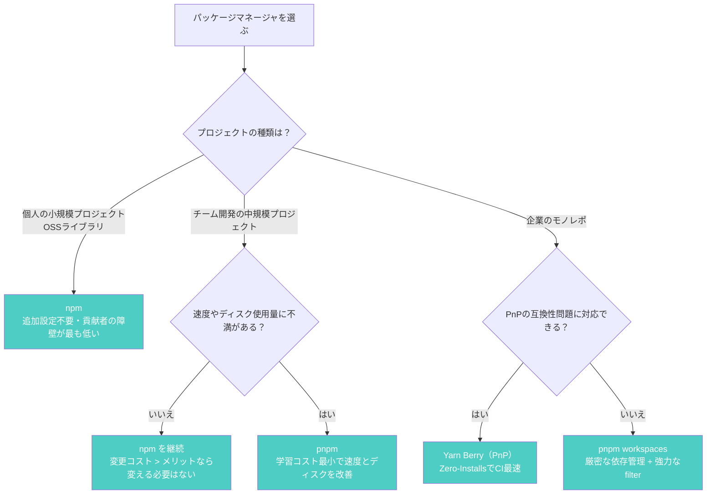

## はじめに ── 「結局どれを使えばいいの？」

「npm、yarn、pnpm、結局どれを使えばいいの？」

Node.js開発者なら一度は考えたことがあるこの問いに、2026年3月時点の最新情報をもとに答えます。

この記事では **各ツールの現状・速度・機能・向き不向き** を比較し、プロジェクトの状況に応じた選定ガイドを提示します。ベンチマークは [pnpm公式ベンチマーク](https://pnpm.io/benchmarks) を参照しつつ、読者が自分の環境で再現できる手順も示します。

:::message
この記事は「何が違うのか」「どれを選ぶべきか」という **WHAT / WHICH** にフォーカスしています。「なぜpnpmは速いのか」「Yarn PnPの内部でどうモジュール解決しているのか」といった **WHY** の部分は、筆者の書籍 [パッケージマネージャ from scratch](https://zenn.dev/yuichi_ai/books/package-manager-from-scratch) で設計思想とアーキテクチャのレベルから解説しています。
:::

## 2026年の各ツールの現状

### npm 11.x ── 着実な進化

npm 11は2025年にNode.js 24と同時にリリースされ、2026年3月時点の最新は **11.11.0** です。

主な改善点は以下の通りです。

- **依存解決エンジン（Arborist）の最適化**: メタデータ取得の並列化、lockfile存在時のスキップ最適化により、インストール速度が向上
- **セキュリティ強化**: `npm audit signatures` によるパッケージ署名検証
- **overridesの安定化**: 間接依存のバージョン強制指定がより使いやすく

npm最大の強みは「Node.jsに同梱されている」ことです。追加インストール不要で、あらゆる環境で使えます。

### yarn 4.x（Berry）── PnPの成熟

Yarn Berry（v2以降の総称）は2026年3月時点で **4.x系** が安定版として広く使われています。

- **Hardened Mode**: lockfileの整合性とレジストリメタデータの一致を自動検証するセキュリティ機能
- **JavaScript製Constraintsエンジン**: v3のProlog製からJavaScript製に移行し、モノレポのルール定義が容易に
- **プラグイン標準同梱**: TypeScript対応（`@types/*` 自動追加）などの公式プラグインがデフォルトで利用可能
- **PnP互換性の向上**: `node_modules` を廃止するPlug'n'Play（PnP）モードの互換性が改善

さらに **Yarn 6 Preview**（2026年1月発表）では、コアをRustで書き直す取り組みが進行中です。依存解決やファイルI/Oのパフォーマンスが数倍向上すると見込まれていますが、プロダクション利用にはまだ早い段階です。

### pnpm 10.x ── Content-Addressable Storeの完成形

pnpmは2026年3月時点で **10.32.1** が最新です。

- **Global Virtual Store（実験的）**: プロジェクトごとの `.pnpm/` ディレクトリすら共有し、ディスク使用量とインストール速度をさらに改善する試み（デフォルト無効、`node-modules-dir=virtual` で有効化）
- **`allowBuilds`**: `postinstall` スクリプトがデフォルト無効に。信頼するパッケージだけをホワイトリスト指定する「opt-in」モデル
- **`minimumReleaseAge`**: 公開から一定期間が経過していないパッケージのインストールを拒否し、サプライチェーン攻撃リスクを軽減
- **catalogs**: モノレポ全体のパッケージバージョンを一元管理

pnpmの根幹にあるContent-Addressable Store（ファイル内容のハッシュで管理するストレージ）の仕組みが、ディスク節約と高速化の両方を実現するカギです。

### Bun ── 新世代の挑戦者

Bunはパッケージマネージャだけでなく、ランタイム・バンドラー・テストランナーを統合したオールインワンツールです。Zig言語で実装されており、公式サイトではnpmと比較して大幅な速度向上を謳っています。

2026年時点（v1.3系）の注意点は以下の通りです。

- 複雑な `postinstall` やネイティブモジュールで互換性問題が残る
- workspacesの高度なフィルタリング機能（pnpmの `--filter` 相当）は限定的
- CIサービスやデプロイプラットフォームのサポートが不完全な場合がある

「ランタイムとして部分的にBunを使い、パッケージ管理はnpm/pnpmに任せる」という使い分けが、現時点では現実的な選択肢です。

## ベンチマーク比較

### 計測方法と前提条件

パッケージマネージャのベンチマークは、プロジェクトの規模・依存パッケージの数・ネットワーク環境などで大きく結果が変わります。ここでは [pnpm公式ベンチマーク](https://pnpm.io/benchmarks)（2026年3月8日更新）のデータを参照します。

公式ベンチマークは [GitHub上で公開されているフィクスチャ](https://github.com/pnpm/benchmarks-of-javascript-package-managers) を使い、以下のシナリオで計測されています。

| シナリオ | 想定場面 |
|---------|---------|
| clean install（lockfile・キャッシュ・node_modulesなし） | 初回セットアップ |
| キャッシュ+lockfile+node_modulesあり | 通常の再インストール |
| lockfileのみ | CIサーバーでの `npm ci` 相当 |
| update | 依存バージョン変更後の更新 |

### 速度比較の傾向

公式ベンチマーク（多数の依存を持つプロジェクト）から読み取れる傾向は以下の通りです。

| シナリオ | npm | pnpm | Yarn Classic | Yarn PnP |
|---------|-----|------|-------------|----------|
| clean install | 最も遅い（30秒台） | npmの約1/4（8秒台） | pnpmと同等 | **最速（4秒未満）** |
| キャッシュあり再インストール | 数秒 | **1秒未満** | 数秒 | - |
| update | 最も遅い（7秒前後） | npmの約1/2 | npmより速い | pnpmと同等 |

**ポイント**:

- **clean installではYarn PnPが最速**。zipアーカイブから直接読み込むためファイル展開が不要
- **キャッシュがある状態ではpnpmが圧倒的**。ハードリンクによる配置が高速
- **npmは全シナリオで最も遅い**。ただしv11での改善は顕著

### 自分の環境で計測する方法

公式ベンチマークの数値をそのまま信じるのではなく、実際のプロジェクトで計測することを推奨します。

```bash
# 1. 計測対象のプロジェクトディレクトリで実施

# npm clean install
rm -rf node_modules package-lock.json
time npm install

# pnpm clean install
rm -rf node_modules pnpm-lock.yaml
time pnpm install

# yarn berry clean install
rm -rf node_modules .pnp.cjs .yarn/cache yarn.lock
time yarn install
```

キャッシュの有無で結果が大きく変わるため、以下のコマンドでキャッシュをクリアしてから計測すると公平です。

```bash
npm cache clean --force
pnpm store prune
yarn cache clean
```

### ディスク使用量の比較

ディスク使用量は、パッケージマネージャの設計思想が最も顕著に現れるポイントです。

| | npm | pnpm | Yarn PnP |
|---|---|---|---|
| ストレージ戦略 | プロジェクトごとにコピー | Content-Addressable Store（ハードリンク共有） | zipアーカイブ |
| 10プロジェクトで同じパッケージを使う場合 | 10コピー分の容量 | **1コピー分の容量** | プロジェクトごとにzip |
| 典型的なReactプロジェクト（node_modules） | 200MB〜500MB | 100MB〜250MB | node_modulesなし |

pnpmのContent-Addressable Storeは、同じバージョンの同じファイルをディスク上に1つしか持ちません。10個のプロジェクトが `lodash@4.17.21` を使っていても、実体は1コピーだけです。ハードリンクとシンボリックリンクを巧みに使い分けることで、この効率的な構造を実現しています。

## 機能比較表

| 機能 | npm 11 | Yarn Berry 4.x | pnpm 10.x |
|------|--------|----------------|-----------|
| **Workspace** | v7+ 対応 | 初期から対応 | `pnpm-workspace.yaml` で対応 |
| **Lockfileフォーマット** | `package-lock.json`（JSON） | `yarn.lock`（独自形式） | `pnpm-lock.yaml`（YAML） |
| **Plug'n'Play（PnP）** | 非対応 | デフォルト有効 | 非対応 |
| **依存の厳密さ** | 緩い（Phantom Dependency発生） | 厳密（PnP時） | 厳密（シンボリックリンク構造） |
| **モノレポ向けフィルタ** | `--workspace` フラグ | `yarn workspaces foreach` | `--filter`（依存チェーン指定可能） |
| **セキュリティ（postinstall制御）** | `ignore-scripts` で手動設定 | `enableScripts` 設定 | **デフォルト無効**（`allowBuilds` でopt-in） |
| **minimumReleaseAge** | 対応（`min-release-age`、日数指定） | 対応（`npmMinimalAgeGate`） | 対応（`minimumReleaseAge`、分単位。先行実装） |
| **Corepack対応** | Corepack不要（Node.js同梱） | `yarn set version` で自己管理可能 | Corepackまたは `npm i -g pnpm` |
| **overrides / resolutions** | `overrides` | `resolutions` | `pnpm.overrides` |
| **catalogs（バージョン一元管理）** | 非対応 | 非対応 | v9.5+ 対応 |

### Corepackの現状（2026年）

Node.js TSC（Technical Steering Committee）は、Node.js 25以降でCorepackをバンドルしないことを決定しました。これはCorepackの廃止ではなく「Node.jsのスコープ外」という判断です。

pnpmやyarnを使う場合の対処法は以下の通りです。

```bash
# 方法1: npmでCorepackをグローバルインストール
npm install -g corepack && corepack enable

# 方法2: 各ツールを直接インストール
npm install -g pnpm        # pnpmの場合
yarn set version 4.12.0    # yarnの場合（プロジェクトにバージョンを固定）

# 方法3: CI環境ではセットアップアクションで明示指定（推奨）
# GitHub Actions例:
# - uses: pnpm/action-setup@v4
#   with:
#     version: 10
```

## プロジェクト別おすすめ選定ガイド

以下のフローチャートで、プロジェクトに合ったパッケージマネージャを判断できます。



### 選定理由の詳細

**個人開発・OSSライブラリ → npm**

npmはNode.jsに同梱されているため、コントリビューターが追加のセットアップなしで開発に参加できます。OSSでは「貢献の障壁を下げる」ことが重要なため、npm一択です。速度が気になるなら `.npmrc` に `prefer-offline=true` を追加するだけでも改善します。

**中規模チーム開発 → pnpm**

「npmとほぼ同じコマンド体系」で移行でき、速度とディスク使用量が改善されます。加えて、pnpmの厳密な依存管理は「package.jsonに書いていないパッケージを誤って使っていた」という事故（Phantom Dependency）を防ぎます。

**大規模モノレポ → pnpm workspaces または Yarn Berry**

pnpmの `--filter` によるパッケージ単位のコマンド実行、`catalogs` によるバージョン一元管理は大規模モノレポに最適です。Yarn Berryはzero-installsによるCI高速化が魅力ですが、PnPの互換性問題と向き合う覚悟が必要です。

## 移行クイックガイド

### npm → pnpm（3ステップ）

```bash
# Step 1: pnpmをインストール
npm install -g pnpm

# Step 2: lockfileを変換して依存を再インストール
pnpm import              # package-lock.json → pnpm-lock.yaml
rm -rf node_modules
pnpm install

# Step 3: 動作確認 & 不要ファイル削除
pnpm run build && pnpm run test
rm package-lock.json
```

**移行時によくある問題**: pnpmの厳密な依存管理により、npmでは動いていたPhantom Dependency（幽霊依存）がエラーになることがあります。`pnpm add <パッケージ名>` で明示的に追加してください。

### npm → Yarn Berry（3ステップ）

```bash
# Step 1: Yarnを有効化してバージョンを固定
corepack enable
yarn set version berry

# Step 2: nodeLinkerを設定（段階的移行にはnode-modulesを推奨）
echo 'nodeLinker: node-modules' >> .yarnrc.yml
yarn install

# Step 3: 動作確認
yarn build && yarn test
```

PnPモードへの移行は、`nodeLinker: node-modules` で問題なく動作することを確認してから、`.yarnrc.yml` で `nodeLinker: pnp` に変更してください。

## まとめ ── 2026年の結論

| 重視するポイント | おすすめ |
|----------------|---------|
| 手軽さ・互換性 | npm |
| 速度・ディスク効率・厳密さ | pnpm |
| Zero-Installs・CI最速化 | Yarn Berry |
| とにかく速いインストール | Bun（ただし成熟度に注意） |

2026年現在、**新規プロジェクトで迷ったらpnpm**がバランスの良い選択です。ただし、パッケージマネージャの違いで得られる時間短縮は1日あたり数分〜数十分です。チーム全員が慣れるまでの生産性低下と天秤にかけて判断してください。「npmで困っていないなら、無理に変える必要はない」も正しい答えです。

---

この記事では「何が違うのか」「どう選ぶか」を比較しました。しかし、実際にパッケージマネージャを使いこなすには「なぜこう設計されているのか」を理解することが重要です。

- なぜpnpmはnpmの4倍速いのか？（Content-Addressable Storeとハードリンクの仕組み）
- なぜYarn PnPはnode_modulesを廃止できたのか？（`.pnp.cjs` によるモジュール解決フック）
- なぜnpmのホイスティングはPhantom Dependencyを生むのか？（フラット化の構造的問題）
- lockfileの中身を読んで、コンフリクトを手動解消するには？

各パッケージマネージャがなぜこのような設計になったのか、依存解決アルゴリズムの原理から理解したい方は、書籍 **[パッケージマネージャ from scratch](https://zenn.dev/yuichi_ai/books/package-manager-from-scratch)** をご覧ください。1〜3章は無料公開しています。

---

*この記事はAIの支援を受けて執筆されています。*
