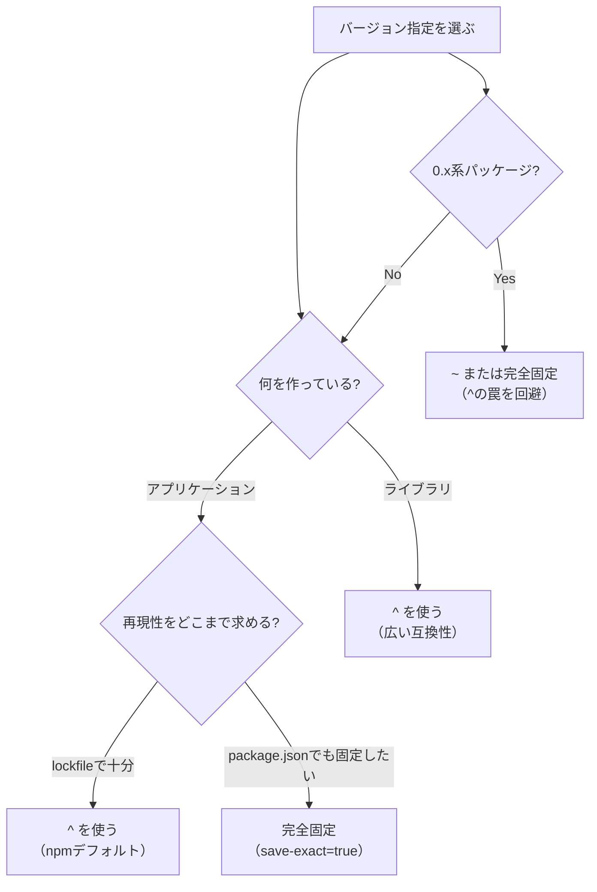
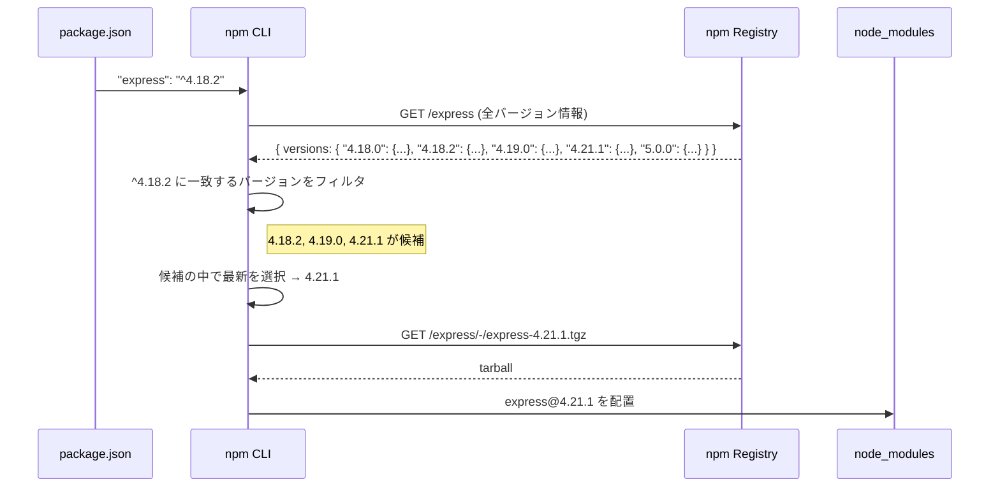

## はじめに

`package.json` を開くと、こんな記述が並んでいます。

```json
{
  "dependencies": {
    "express": "^4.18.2",
    "lodash": "~4.17.21",
    "typescript": "5.3.3"
  }
}
```

`^4.18.2` の `^` って何でしょうか。`~4.17.21` の `~` とどう違うのでしょうか。`5.3.3` には何も記号がついていませんが、これはどういう意味でしょうか。

正確に答えられなくても大丈夫です。この記事を読み終えるころには、SemVerのバージョン指定を完全に理解し、プロジェクトに最適な指定方法を自信を持って選べるようになります。

:::message
この記事は「どのバージョン指定を使うべきか」という**HOW**にフォーカスしています。lockfileの内部フォーマットや依存解決アルゴリズムの詳細といった**WHY**は扱いません。
:::

## SemVer（セマンティックバージョニング）とは

SemVer（Semantic Versioning）は、バージョン番号に意味を持たせる規約です。`MAJOR.MINOR.PATCH` の3つの数値で構成されます。

```
4.18.2
│  │  └── PATCH: バグ修正（後方互換あり）
│  └───── MINOR: 機能追加（後方互換あり）
└──────── MAJOR: 破壊的変更（後方互換なし）
```

それぞれの数値が上がるタイミングは明確に決められています。

| 変更の種類 | 上がる桁 | 具体例 |
|:--|:--|:--|
| 既存APIの削除・変更（breaking change） | MAJOR | 4.18.2 → **5**.0.0 |
| 新しい機能の追加（feature） | MINOR | 4.18.2 → 4.**19**.0 |
| バグ修正（fix） | PATCH | 4.18.2 → 4.18.**3** |

MAJORが上がるときは、MINORとPATCHが0にリセットされます。MINORが上がるときは、PATCHが0にリセットされます。

```bash
# 実際のパッケージでSemVerを確認してみる
npm view express versions --json | tail -20
```

このルールに基づいて、npmは「どの範囲のバージョンをインストールしてよいか」を判断しています。

## ^ (キャレット) の挙動

`^` はnpmのデフォルトのバージョン指定記号です。`npm install express` を実行すると、`package.json` には自動的に `^` 付きで記録されます。

```bash
npm install express
# package.json に "express": "^4.18.2" と書き込まれる
```

### 基本ルール: 左端の非ゼロ桁を固定する

`^` の正確なルールは「**左端の非ゼロの桁を固定し、それより右の桁は最新版まで許容する**」です。

#### MAJOR >= 1 の場合（通常のパッケージ）

```
^4.18.2  →  >=4.18.2  <5.0.0
```

MAJORを固定し、MINORとPATCHは上がってよい。つまり `4.18.3`、`4.19.0`、`4.99.99` はすべて許容されますが、`5.0.0` は入りません。

```bash
# 実際に許容範囲を確認する
npx semver -r "^4.18.2" 4.18.2 4.18.3 4.19.0 4.21.1 5.0.0
# 出力:
# 4.18.2
# 4.18.3
# 4.19.0
# 4.21.1
# （5.0.0は出力されない = 範囲外）
```

#### 0.x系の特殊ルール（ここが罠）

MAJORが0のパッケージでは、`^` の挙動が変わります。

```
^0.2.3  →  >=0.2.3  <0.3.0
```

MAJORが0なので、左端の非ゼロ桁は**MINOR**になります。MINORが固定され、PATCHのみ上がってよい。`0.2.4` は許容されますが、`0.3.0` は入りません。

さらに、MINORも0の場合はどうなるでしょうか。

```
^0.0.3  →  >=0.0.3  <0.0.4  （実質的に 0.0.3 のみ）
```

左端の非ゼロ桁がPATCHなので、PATCHが固定されます。つまり完全固定と同じです。

**なぜ0.x系は特殊なのか?** SemVerの仕様では、`0.x.x` はAPIが安定していない開発初期フェーズを意味します。この期間はMINORの変更でも破壊的変更が含まれる慣習があるため、npmはMAJORが0のパッケージをより慎重に扱います。

```bash
# 0.x系パッケージの例
npm view @sinclair/typebox versions --json | tail -10
```

### ^の挙動まとめ

| 指定 | 許容範囲 | 理由 |
|:--|:--|:--|
| `^4.18.2` | `>=4.18.2 <5.0.0` | MAJOR(4)を固定 |
| `^0.2.3` | `>=0.2.3 <0.3.0` | MINOR(2)を固定 |
| `^0.0.3` | `>=0.0.3 <0.0.4` | PATCH(3)を固定 |
| `^1.0.0` | `>=1.0.0 <2.0.0` | MAJOR(1)を固定 |

## ~ (チルダ) の挙動

`~` は `^` よりも保守的なバージョン指定です。

### 基本ルール: PATCHのみ許容する

```
~4.18.2  →  >=4.18.2  <4.19.0
```

MAJOR **と** MINORを固定し、PATCHのみ上がってよい。`4.18.3`、`4.18.10` は許容されますが、`4.19.0` は入りません。

```bash
# チルダの許容範囲を確認する
npx semver -r "~4.18.2" 4.18.2 4.18.3 4.19.0 5.0.0
# 出力:
# 4.18.2
# 4.18.3
# （4.19.0と5.0.0は出力されない = 範囲外）
```

#### 0.x系の場合

```
~0.2.3  →  >=0.2.3  <0.3.0
```

`^0.2.3` と同じ結果になります。0.x系ではキャレットとチルダの差が小さくなります。

### ~の挙動まとめ

| 指定 | 許容範囲 | 理由 |
|:--|:--|:--|
| `~4.18.2` | `>=4.18.2 <4.19.0` | MAJOR.MINOR(4.18)を固定 |
| `~0.2.3` | `>=0.2.3 <0.3.0` | MAJOR.MINOR(0.2)を固定 |
| `~1.0.0` | `>=1.0.0 <1.1.0` | MAJOR.MINOR(1.0)を固定 |

## その他のバージョン指定方法

`^` と `~` 以外にも、いくつかの指定方法があります。

### 完全固定（exact バージョン）

```json
"typescript": "5.3.3"
```

記号なし。`5.3.3` 以外は一切インストールされません。最も安全ですが、セキュリティパッチも自動では適用されないため、手動でのバージョン更新が必要です。

### 範囲指定

```json
"some-lib": ">=4.0.0 <5.0.0"
```

明示的に上限と下限を指定します。`^4.0.0` と同じ意味ですが、意図が明確になるメリットがあります。

### ワイルドカード（`*`）

```json
"some-lib": "*"
```

任意のバージョンにマッチします。**本番環境では絶対に使わないでください。** MAJORバージョンが上がっても許容してしまうため、破壊的変更を無制限に受け入れることになります。

### ハイフン範囲

```json
"some-lib": "2.0.0 - 3.0.0"
```

`>=2.0.0 <=3.0.0` と同じ意味です。上限が**含まれる**点に注意してください。

### `latest` タグ

```json
"some-lib": "latest"
```

npmレジストリの `latest` タグが指す最新バージョンをインストールします。`*` と同様に本番では避けるべきです。

```bash
# latestタグが指すバージョンを確認
npm view express dist-tags
# { latest: '4.21.1', next: '5.0.1' }
```

### `||` によるOR指定

```json
"some-lib": "^2.0.0 || ^3.0.0"
```

2系または3系のどちらでもよい、という指定です。主にライブラリが幅広いバージョンをサポートするために使います。

## 比較表: バージョン指定の一覧

各指定方法の許容範囲を一覧でまとめます。基準バージョンを `4.18.2` とします。

| 指定方法 | 記述例 | 許容範囲 | MINOR更新 | MAJOR更新 |
|:--|:--|:--|:--|:--|
| `^`（キャレット） | `^4.18.2` | `>=4.18.2 <5.0.0` | 許容 | 拒否 |
| `~`（チルダ） | `~4.18.2` | `>=4.18.2 <4.19.0` | 拒否 | 拒否 |
| 完全固定 | `4.18.2` | `4.18.2` のみ | 拒否 | 拒否 |
| `*` | `*` | すべて | 許容 | 許容 |
| 範囲指定 | `>=4.0.0 <5.0.0` | `>=4.0.0 <5.0.0` | 許容 | 拒否 |
| ハイフン | `4.18.0 - 4.19.0` | `>=4.18.0 <=4.19.0` | 一部許容 | 拒否 |

0.x系の場合は `^` の挙動が異なるため、別途確認が必要です。

| 指定方法 | 記述例 | 許容範囲 |
|:--|:--|:--|
| `^`（キャレット） | `^0.2.3` | `>=0.2.3 <0.3.0`（PATCHのみ） |
| `~`（チルダ） | `~0.2.3` | `>=0.2.3 <0.3.0`（PATCHのみ） |
| 完全固定 | `0.2.3` | `0.2.3` のみ |

## どれを使うべきか？ 判断基準

バージョン指定の選び方は、**あなたが作っているものがアプリケーションかライブラリか**で変わります。

### アプリケーション（Webアプリ、APIサーバーなど）の場合

**推奨: `^`（npmデフォルト）または完全固定**

アプリケーションはデプロイ先の環境が1つに決まっています。再現性が最も重要です。

```bash
# 方針1: npmデフォルト（^ + lockfile）
npm install express
# → "express": "^4.18.2" がpackage.jsonに追記される
# → package-lock.json が正確なバージョンを記録する

# 方針2: 完全固定（save-exact + lockfile）
npm install --save-exact express
# → "express": "4.18.2" がpackage.jsonに追記される
```

方針1は `^` でバージョン範囲を許容しつつ、lockfileで実際にインストールされるバージョンを固定します。`npm update` で意図的に更新しない限り、同じバージョンがインストールされ続けます。

方針2は `package.json` レベルで完全固定します。lockfileとの二重の安全策になります。詳細は後述の「`save-exact=true` のすすめ」を参照してください。

### ライブラリ（npmパッケージとして公開するもの）の場合

**推奨: `^`**

ライブラリは、利用者のプロジェクトに組み込まれます。バージョン指定が狭すぎると、利用者の他の依存パッケージとの間で**バージョン競合**が起きやすくなります。

```json
// ライブラリの package.json
{
  "dependencies": {
    "lodash": "^4.17.0"
  }
}
```

`^4.17.0` とすることで、利用者のプロジェクトが `lodash@4.17.21` を使っていても問題なく共存できます。もしここを `4.17.0` と完全固定してしまうと、利用者のプロジェクトに `lodash` が2つインストールされる可能性があります。

### 0.x系パッケージの場合

**推奨: `~` または完全固定**

0.x系パッケージで `^` を使うと、意図せず保守的な挙動になります。これ自体は安全な方向ですが、「`^` なのに MINOR が上がらない」という混乱の元になります。

```json
// 紛らわしい（^なのにMINORが上がらない）
"@experimental/lib": "^0.2.3"

// 意図が明確（チルダでPATCHのみ許容と明示）
"@experimental/lib": "~0.2.3"

// 最も安全（完全固定）
"@experimental/lib": "0.2.3"
```

結果は同じでも、コードを読む人への意図の伝わり方が違います。0.x系では `~` か完全固定を使うことで、「このパッケージは慎重に扱っている」という意図を明示できます。

### 判断フローチャート



## `save-exact=true` のすすめ

アプリケーション開発で最も安全なバージョン管理を実現するなら、`.npmrc` に `save-exact=true` を設定することをおすすめします。

### 設定方法

```bash
# プロジェクトルートに .npmrc を作成
echo "save-exact=true" >> .npmrc
```

```ini
# .npmrc の内容
save-exact=true
```

この設定以降、`npm install` で追加するパッケージはすべて `^` なしの完全固定で記録されます。

```bash
# save-exact=true の状態で
npm install express
# → "express": "4.21.1"  （^がつかない）

npm install lodash
# → "lodash": "4.17.21"  （^がつかない）
```

### lockfileとの組み合わせ

「lockfileがあれば `^` でも実質固定されるのに、完全固定にする意味はあるの?」という疑問は当然です。lockfileは`npm install`の結果を固定しますが、以下のケースではlockfileの保護が外れます。

1. **lockfileを削除して再インストールした場合**: `^4.18.2` なら最新の `4.21.1` がインストールされるが、`4.18.2` なら常に `4.18.2` がインストールされる
2. **新しいパッケージを追加した場合**: 既存パッケージの間接依存が更新される可能性がある
3. **lockfileのコンフリクトを解消するためにlockfileを再生成した場合**: 同上

完全固定 + lockfileの二重防御で、これらのケースでも意図しないバージョン変更を防げます。

### バージョン更新のワークフロー

完全固定にすると、セキュリティパッチの自動適用もされなくなります。そのため、定期的なバージョン更新のワークフローを組み合わせることが重要です。

```bash
# 更新可能なパッケージを確認
npm outdated

# 特定パッケージを最新に更新（package.jsonとlockfileの両方が更新される）
npm install express@latest --save-exact

# または npm-check-updates を使って一括更新
npx npm-check-updates -u
npm install
```

```bash
# npm outdated の出力例
Package   Current  Wanted  Latest  Location
express    4.18.2  4.18.2  4.21.1  my-app
lodash    4.17.20 4.17.20 4.17.21  my-app
```

`Current` と `Wanted` が同じ値になっている点に注目してください。完全固定なので、`npm update` を実行しても `Current` のバージョンから変わりません。更新するには `npm install パッケージ名@latest --save-exact` で明示的に指定します。

## 実際にバージョンが解決される仕組み

`npm install` を実行したとき、SemVerの範囲指定から実際のバージョンがどう決まるのか、簡易的なフローを見てみましょう。



ポイントは「**範囲内の最新版**」が選ばれることです。`^4.18.2` と指定して `4.18.2` がインストールされるとは限りません。レジストリに `4.21.1` があれば、そちらが選ばれます。

ただし、lockfileが存在する場合はこのフローの前に lockfileが参照されます。lockfileに `express@4.18.2` と記録されていれば、レジストリへの問い合わせをスキップして `4.18.2` がそのままインストールされます。

```bash
# lockfileに記録されたバージョンを確認
npm ls express
# my-app@1.0.0
# └── express@4.18.2  ← lockfileが固定している
```

## よくあるトラブルと解決策

### トラブル1: 「^で指定したのにバージョンが上がって壊れた」

**状況**: ローカルでは動くのに、CIやチームメンバーの環境で壊れる。

```
// ローカル（先週 npm install した）
express@4.18.2 が入っている

// CI（今日 npm install した）
express@4.21.1 が入った → 破壊的ではないはずの変更でも挙動が変わった
```

**原因**: lockfileがGitにコミットされていない、またはCIで `npm install` を使っている。

**解決策**:

```bash
# 1. lockfile を必ず Git にコミットする
git add package-lock.json
git commit -m "add package-lock.json"

# 2. CI では npm ci を使う（lockfile通りにインストールする）
# CI設定ファイルでの記述例:
npm ci  # npm install ではなく npm ci
```

`npm ci` はlockfileの内容を厳密に再現します。lockfileに書かれていないバージョンは絶対にインストールしません。`npm install` は lockfileがあっても特定の条件で更新してしまう場合があるため、CIでは必ず `npm ci` を使ってください。

### トラブル2: 「0.x系で^を使ったら想定外のバージョンが入った」

**状況**: `^0.14.0` と指定しているのに、`0.15.0` がインストールされない。または、`^0.14.0` で `0.14.5` がインストールされたら壊れた。

```json
// package.json
{ "some-experimental-lib": "^0.14.0" }
```

```bash
npm ls some-experimental-lib
# └── some-experimental-lib@0.14.5
# → 0.14.5 のパッチで破壊的変更が入っていた
```

**原因**: 0.x系では `^` は MINOR を固定します（`^0.14.0` = `>=0.14.0 <0.15.0`）。PATCH しか上がりませんが、0.x系のパッケージはPATCHに破壊的変更を入れることがあります。

**解決策**:

```json
// 方法1: 完全固定する
{ "some-experimental-lib": "0.14.0" }

// 方法2: チルダで意図を明示する（結果は^と同じだが読み手に意図が伝わる）
{ "some-experimental-lib": "~0.14.0" }
```

0.x系パッケージは「APIが不安定」という宣言です。完全固定にしてlockfileと合わせて管理し、更新するときは `CHANGELOG` を必ず確認してからにしましょう。

### トラブル3: 「npm install したらlockfileが大量に変更された」

**状況**: パッケージを1つ追加しただけなのに、`package-lock.json` のdiffが数百行ある。

**原因**: 既存パッケージの間接依存がSemVer範囲内で更新された。`^` 指定の直接依存が最新版に引き上げられ、その依存ツリー全体が変わった。

**解決策**:

```bash
# npm ci でlockfile通りにインストールしてから、
# 個別にパッケージを追加する
npm ci
npm install new-package

# diffを確認して意図しない変更がないか確認
git diff package-lock.json | head -50
```

大量のlockfile変更が入ったコミットは、問題が起きたときの原因特定を困難にします。パッケージの追加・更新は1つずつコミットすることをおすすめします。

## 実践: プロジェクトの `.npmrc` テンプレート

ここまでの知識を踏まえて、安全なバージョン管理のための `.npmrc` 設定をまとめます。

### アプリケーション向け（推奨設定）

```ini
# .npmrc

# npm install 時にバージョンを完全固定する
save-exact=true

# npm install 時に package-lock.json を必ず更新する（デフォルト動作を明示）
package-lock=true

# 既知の脆弱性があるパッケージのインストールを警告する
audit=true
```

### ライブラリ向け

```ini
# .npmrc

# ライブラリでは ^ を使いたいので save-exact は設定しない
# save-exact=true  ← コメントアウト

# lockfileはGitにコミットしない（利用者側のlockfileが優先されるため）
# ただし開発時の再現性のために生成はする
package-lock=true
```

ライブラリの場合、`package-lock.json` を `.gitignore` に含めるかどうかはチームの方針次第です。npm公式は「ライブラリでもlockfileをコミットしてよい」としていますが、利用者側では無視されます。

## まとめ

この記事で解説した内容を振り返ります。

1. **SemVer** は `MAJOR.MINOR.PATCH` の3桁で、変更の種類を表す規約
2. **`^`（キャレット）** は左端の非ゼロ桁を固定する。npmのデフォルト
3. **`~`（チルダ）** はPATCHのみ許容する。`^` より保守的
4. **0.x系では `^` の挙動が変わる**。MINORが固定される特殊ルール
5. **アプリケーション** には `^` + lockfile、または `save-exact=true` + lockfile
6. **ライブラリ** には `^` で広い互換性を確保
7. **CIでは `npm ci`** を使い、lockfile通りにインストールする

バージョン指定は地味なテーマですが、正しく理解していないと「なぜか動かない」「CIだけ壊れる」といった再現性の問題に何度も悩まされます。この記事の内容をチームで共有し、プロジェクトの `.npmrc` を見直すことから始めてみてください。

---

この記事ではSemVerの「使い方」にフォーカスしました。しかし、SemVer範囲指定だけではなぜ再現性のある環境を保証できないのか、lockfileがその問題をどう解決しているのか、そしてnpm/yarn/pnpmのバージョン解決戦略がどう異なるのかを設計レベルで理解すると、依存関係のトラブルに対する根本的な対応力が身につきます。詳しくは拙著 **[「なぜnode_modulesは壊れるのか？」](https://zenn.dev/yuichi_ai/books/package-manager-from-scratch)** をご覧ください。

---

*この記事はAIの支援を受けて執筆されています。*
