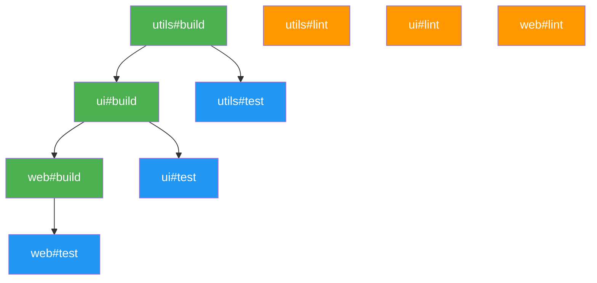

## モノレポのビルドが遅い、という現実

モノレポを導入すると、コード共有や依存管理の一元化で開発効率は向上する。しかし、パッケージ数が増えるにつれて避けられない問題が1つある。**ビルドが遅い**。

典型的なモノレポには10〜30のパッケージがある。`npm run build -ws`で全パッケージをビルドすると、依存関係を無視して順番に実行される。あるいは、変更していないパッケージも毎回フルビルドされる。CIでは20分、ローカルでは5分。変更したのは1ファイルだけなのに。

Turborepoは、この問題を3つのアプローチで解決するビルドシステムだ。

1. **タスクの依存関係を分析して、正しい順序で並列実行する**
2. **前回のビルド結果をキャッシュし、変更がなければ再実行しない**
3. **チーム全体でキャッシュを共有し、同じビルドを二度と繰り返さない**

本記事では、2026年3月時点の最新安定版であるTurborepo 2.x系（2.8.x）を前提に、セットアップからturbo.jsonの書き方、リモートキャッシュの設定、GitHub ActionsでのCI/CD連携、タスク実行の最適化、トラブルシューティングまでを、実行可能なコマンド付きで解説する。

**対象読者**: モノレポでビルド時間に課題を感じている開発者。npm workspacesまたはpnpm workspacesの基本を理解していることを前提とする。

**この記事のスコープ**: Turborepoの「設定方法と運用手順（HOW）」にフォーカスする。モノレポの設計思想やパッケージマネージャの選定判断（WHY）については扱わない。

## Turborepoとは --- なぜモノレポにビルドツールが必要か

### Turborepoの位置づけ

Turborepoは、Vercel社が開発・メンテナンスするJavaScript/TypeScript向けのビルドシステムだ。Rustで書かれており、MITライセンスで公開されている。パッケージマネージャ（npm/pnpm/yarn/Bun）のワークスペース機能と組み合わせて使う。

重要な点として、Turborepoは**パッケージマネージャではない**。依存関係のインストールやnode_modulesの管理はパッケージマネージャが行い、Turborepoはその上で**タスクの実行順序とキャッシュを最適化する**レイヤーとして動作する。

```
パッケージマネージャ（npm/pnpm/yarn/Bun）
  └── 依存のインストール、ワークスペースのリンク

Turborepo
  └── タスクの依存分析、並列実行、キャッシュ
```

### npm workspacesだけでは足りない理由

npm workspacesの`-ws`フラグで全ワークスペースのスクリプトを一括実行できる。しかし、以下の制約がある。

1. **実行順序を制御できない**: `npm run build -ws`はワークスペースをアルファベット順に実行する。`packages/ui`が`packages/utils`に依存している場合、`utils`のビルドが先に完了する保証がない
2. **キャッシュ機構がない**: 変更のないパッケージも毎回フルビルドされる
3. **並列実行の粒度が粗い**: 全ワークスペースを直列に実行するか、`&`で雑に並列化するかの二択

Turborepoは、パッケージの依存グラフを解析し、正しい順序を保ちながら最大限の並列実行を実現する。さらに、ファイルの変更を追跡してキャッシュを適用するため、変更のないパッケージのビルドをスキップする。

## セットアップ

### 新規プロジェクトの場合

Turborepoの公式CLIで、テンプレートからモノレポを作成できる。

```bash
npx create-turbo@latest my-turborepo
```

対話式のプロンプトでパッケージマネージャ（npm/pnpm/yarn/Bun）を選択する。作成されるディレクトリ構成は以下のとおりだ。

```
my-turborepo/
├── apps/
│   ├── web/              # Next.jsアプリ
│   │   └── package.json
│   └── docs/             # Next.jsドキュメントアプリ
│       └── package.json
├── packages/
│   ├── ui/               # 共有UIコンポーネント
│   │   └── package.json
│   ├── eslint-config/    # 共有ESLint設定
│   │   └── package.json
│   └── typescript-config/ # 共有TypeScript設定
│       └── package.json
├── turbo.json            # Turborepo設定
├── package.json          # ルートpackage.json
└── pnpm-workspace.yaml   # pnpmの場合
```

### 既存プロジェクトに追加する場合

すでにnpm workspacesやpnpm workspacesで構築されたモノレポがあれば、Turborepoの導入は3ステップで完了する。

**ステップ1: インストール**

```bash
# npm の場合
npm install turbo --save-dev

# pnpm の場合
pnpm add turbo --save-dev --workspace-root

# yarn の場合
yarn add turbo --dev
```

**ステップ2: turbo.jsonの作成**

リポジトリのルートに`turbo.json`を作成する。

```jsonc
// turbo.json
{
  "$schema": "https://turborepo.com/schema.json",
  "tasks": {
    "build": {
      "dependsOn": ["^build"],
      "outputs": ["dist/**"]
    },
    "test": {
      "dependsOn": ["build"]
    },
    "lint": {}
  }
}
```

**ステップ3: .gitignoreに追加**

Turborepoのキャッシュディレクトリをバージョン管理から除外する。

```bash
# .gitignore に追記
echo '.turbo/' >> .gitignore
```

これだけで`turbo run build`が使えるようになる。パッケージマネージャ側の設定は変更不要だ。

### ルートpackage.jsonの設定

Turborepo 2.xでは`packageManager`フィールドの宣言が推奨される。ルートの`package.json`にTurborepo経由のスクリプトを追加しておくと運用が楽になる。

```json
{
  "name": "my-monorepo",
  "private": true,
  "packageManager": "pnpm@10.5.0",
  "devDependencies": {
    "turbo": "^2.8.0"
  },
  "scripts": {
    "build": "turbo run build",
    "test": "turbo run test",
    "lint": "turbo run lint",
    "dev": "turbo run dev"
  }
}
```

## turbo.jsonのパイプライン定義

turbo.jsonはTurborepoの中核となる設定ファイルだ。Turborepo 2.0以降、設定はv2形式を使用する。v1で使われていた`pipeline`キーは`tasks`キーに変更されている。v1からの移行は`npx @turbo/codemod migrate`で自動変換できる。

なお、Turborepo 2.5以降では`turbo.jsonc`（JSONCフォーマット）がサポートされており、コメントを記述できる。

### タスク定義の全オプション

`tasks`オブジェクトの各キーが、`turbo run`で実行できるタスク名になる。Turborepoは各パッケージの`package.json`から同名のスクリプトを探して実行する。

```jsonc
// turbo.json
{
  "$schema": "https://turborepo.com/schema.json",

  // 入力ハッシュに含めるグローバルファイル
  "globalDependencies": [".env", "tsconfig.base.json"],

  // 全タスクのハッシュに影響する環境変数
  "globalEnv": ["NODE_ENV", "CI"],

  // ターミナルUI（"tui" で対話型UI、"stream" で従来のストリーム出力）
  "ui": "tui",

  // 並列実行数（デフォルト: 10、CPUコア数の割合も指定可能）
  "concurrency": "50%",

  "tasks": {
    "build": {
      // 依存タスク: ^は「依存パッケージの同名タスクを先に実行」
      "dependsOn": ["^build"],

      // キャッシュ対象の出力ファイル（globs、パッケージルートからの相対パス）
      "outputs": ["dist/**", ".next/**", "!.next/cache/**"],

      // ハッシュ計算に含める入力ファイル（デフォルト: ソース管理下の全ファイル）
      "inputs": ["src/**", "tsconfig.json"],

      // ハッシュに影響する環境変数
      "env": ["API_URL", "DATABASE_URL"],

      // キャッシュの有効/無効（デフォルト: true）
      "cache": true,

      // ログ出力モード: "full" | "hash-only" | "new-only" | "errors-only" | "none"
      "outputLogs": "new-only"
    },
    "test": {
      "dependsOn": ["build"],
      "outputs": ["coverage/**"],
      "outputLogs": "new-only"
    },
    "lint": {
      "outputs": [],
      "outputLogs": "errors-only"
    },
    "dev": {
      "cache": false,
      "persistent": true
    }
  }
}
```

### dependsOnの3つのパターン

`dependsOn`はTurborepoの最も重要な設定項目だ。3つの記法がある。

| 記法 | 意味 | 例 |
|------|------|------|
| `"^build"` | 依存パッケージの`build`を先に実行 | `packages/ui`のbuildを待ってから`apps/web`のbuild |
| `"test"` | 同じパッケージ内の`test`を先に実行 | 自分のtestを待ってからdeploy |
| `"@my-monorepo/utils#build"` | 特定パッケージのタスクを先に実行 | `utils`のbuildを待ってから実行 |

`^`（キャレット）プレフィックスは「`package.json`のdependenciesに宣言された依存パッケージ」を意味する。Turborepoはワークスペースの依存グラフを自動的に解析してこれを判定する。

具体例で考えてみよう。以下のようなモノレポがあるとする。

```
apps/web       → packages/ui に依存
packages/ui    → packages/utils に依存
packages/utils → 内部依存なし
```

```jsonc
{
  "tasks": {
    "build": {
      "dependsOn": ["^build"]
    }
  }
}
```

`turbo run build`を実行すると、以下の順序でビルドが走る。

```
1. packages/utils#build   （依存なし → 最初に実行）
2. packages/ui#build      （utils#build の完了を待つ）
3. apps/web#build         （ui#build の完了を待つ）
```

### outputsの設定

`outputs`はキャッシュの対象となるファイルを指定する。キャッシュヒット時にこのファイル群が復元される。

```jsonc
{
  "tasks": {
    "build": {
      "outputs": [
        "dist/**",           // TypeScriptのコンパイル出力
        ".next/**",          // Next.jsのビルド出力
        "!.next/cache/**"    // Next.jsの内部キャッシュは除外
      ]
    },
    "test": {
      "outputs": ["coverage/**"]  // テストカバレッジ
    },
    "lint": {
      "outputs": []               // 出力ファイルなし
    }
  }
}
```

**`outputs`を空配列にする場合**: lint のように出力ファイルが存在しないタスクでも、ログ出力はキャッシュされる。`outputs: []`と設定すれば、再実行をスキップしてキャッシュ済みのログだけ表示する。

**`outputs`を省略する場合**: デフォルトではキャッシュ対象のファイルがないため、タスクのログ出力のみがキャッシュされる。

### パッケージ固有の設定

特定のパッケージだけ設定を上書きしたい場合、そのパッケージのディレクトリに`turbo.json`を作成する。

```jsonc
// apps/web/turbo.json
{
  "extends": ["//"],  // ルートのturbo.jsonを継承
  "tasks": {
    "build": {
      "outputs": [".next/**", "!.next/cache/**"],
      "env": ["NEXT_PUBLIC_API_URL"]
    }
  }
}
```

`"extends": ["//"]`でルート設定を継承し、必要な部分だけオーバーライドする。Turborepo 2.7以降では、ルート以外のパッケージの`turbo.json`も参照できるようになった。

## 実践例: パイプラインの依存グラフ

具体的なモノレポ構成を使って、タスクパイプラインの動作を詳しく見ていく。

### モノレポ構成

```
my-app/
├── apps/
│   └── web/          # Next.jsアプリ（packages/uiに依存）
├── packages/
│   ├── ui/           # 共有UIコンポーネント（packages/utilsに依存）
│   └── utils/        # ユーティリティ関数
├── turbo.json
└── package.json
```

### turbo.json

```jsonc
{
  "$schema": "https://turborepo.com/schema.json",
  "globalDependencies": ["tsconfig.base.json"],
  "globalEnv": ["NODE_ENV"],
  "tasks": {
    "build": {
      "dependsOn": ["^build"],
      "outputs": ["dist/**"],
      "outputLogs": "new-only"
    },
    "test": {
      "dependsOn": ["build"],
      "outputs": ["coverage/**"],
      "outputLogs": "new-only"
    },
    "lint": {
      "outputs": [],
      "outputLogs": "errors-only"
    },
    "dev": {
      "cache": false,
      "persistent": true
    }
  }
}
```

### 依存関係の可視化

`turbo run build test lint`を実行すると、Turborepoは以下の依存グラフを構築する。



ポイントは以下の3つだ。

1. **buildは依存順に直列実行される**: `utils#build` → `ui#build` → `web#build`の順。`^build`により依存パッケージのビルドが先に完了する
2. **testはbuild完了後に実行される**: `dependsOn: ["build"]`により、各パッケージのbuildが終わってからtestが走る
3. **lintはdependsOnがないため即座に並列実行される**: buildやtestの完了を待たずに全パッケージのlintが同時に走る

`utils#lint`、`ui#lint`、`web#lint`は互いに依存関係がないため、`utils#build`と同時に実行が始まる。これがTurborepoの並列実行の恩恵だ。

## リモートキャッシュの設定

ローカルキャッシュだけでは、他のメンバーやCIサーバーと共有できない。リモートキャッシュを使えば、一度ビルドした結果をチーム全体で再利用できる。

### ローカルキャッシュの仕組み

リモートキャッシュの前に、ローカルキャッシュの動作を理解しておく。

Turborepoは以下の入力からハッシュ値を計算する。

1. **ソースファイル**: `inputs`で指定されたファイルの内容（デフォルトはソース管理下の全ファイル）
2. **依存パッケージのハッシュ**: `dependsOn`で指定された依存タスクのハッシュ
3. **環境変数**: `env`および`globalEnv`で指定された変数の値
4. **グローバル依存**: `globalDependencies`で指定されたファイルの内容
5. **package.jsonのdependencies**: 外部パッケージのバージョン

これらの入力が前回の実行時と同一であれば、タスクは再実行されずキャッシュから結果が復元される。キャッシュはデフォルトで`.turbo/cache/`ディレクトリに保存される。

キャッシュヒットすると、ログに以下の表示が出る。

```
 Tasks:    3 successful, 3 total
Cached:    3 cached, 3 total
  Time:    185ms >>> FULL TURBO
```

**FULL TURBO**の表示は、全タスクがキャッシュから復元され、実際のビルドが一切実行されなかったことを意味する。

### Vercel Remote Cache（推奨）

最も簡単な方法は、Vercel Remote Cacheを使うことだ。全Vercelプランで無料で利用でき、Vercelにアプリケーションをホストしていなくても使える。

```bash
# ステップ1: Vercelアカウントでログイン
npx turbo login

# ステップ2: リポジトリをVercelプロジェクトにリンク
npx turbo link
```

`turbo login`でブラウザが開き、Vercelアカウントで認証する。`turbo link`で対話的にプロジェクトを選択すると設定完了だ。以降の`turbo run`は自動的にリモートキャッシュを参照する。

SSO認証が必要なチームの場合:

```bash
npx turbo login --sso-team=your-team-name
```

#### 動作確認

リモートキャッシュが有効になっているかを確認する手順:

```bash
# 1. ローカルキャッシュを削除
rm -rf .turbo/cache

# 2. ビルド実行（リモートキャッシュからダウンロードされる）
turbo run build
```

リモートキャッシュからの復元が成功すると、ログに`Remote cache hit`と表示される。

### Self-hosted Remote Cache

Vercelを使えない環境では、セルフホスト型のリモートキャッシュサーバーを立てる選択肢がある。TurborepoのRemote Cache APIはOpenAPI仕様として公開されており、以下のOSS実装が利用可能だ。

| 実装 | 言語 | 対応ストレージ |
|------|------|----------------|
| [ducktors/turborepo-remote-cache](https://github.com/ducktors/turborepo-remote-cache) | Node.js | AWS S3, GCS, Azure Blob, ローカルFS |
| [turbofan](https://github.com/ascorbic/turbofan) | TypeScript | Cloudflare R2 |

#### ducktors/turborepo-remote-cacheの設定例

```bash
# サーバーの起動
npx turborepo-remote-cache
```

環境変数でストレージとチーム情報を設定する。

```bash
# .env（キャッシュサーバー側）
STORAGE_PROVIDER=s3
S3_ACCESS_KEY=your-access-key
S3_SECRET_KEY=your-secret-key
S3_REGION=ap-northeast-1
S3_ENDPOINT=https://s3.ap-northeast-1.amazonaws.com
S3_BUCKET=my-turbo-cache
TURBO_TOKEN=my-secret-token
```

#### クライアント側の設定

TurborepoからセルフホストサーバーへAPI URLを向ける方法は2つある。

**方法A: 環境変数で設定する（推奨）**

```bash
# .env（リポジトリルート）
TURBO_API=https://your-cache-server.example.com
TURBO_TEAM=my-team
TURBO_TOKEN=my-secret-token
```

**方法B: --manual フラグでログイン**

```bash
npx turbo login --manual
# 対話的にAPI URL、Team、Tokenを入力する
```

### アーティファクト署名

リモートキャッシュのセキュリティを強化するため、アーティファクトに署名を付けることができる。

```bash
# 環境変数で署名キーを設定
export TURBO_REMOTE_CACHE_SIGNATURE_KEY=your-signing-secret
```

この設定を有効にすると、アップロード時にアーティファクトが署名され、ダウンロード時に署名の検証が行われる。署名が一致しないアーティファクトは拒否される。

:::message
📘 **パッケージマネージャーの内部構造やモノレポの設計思想を体系的に学ぶなら**
→ [ゼロから理解するnpmパッケージマネージャー](https://zenn.dev/yuichi_ai/books/package-manager-from-scratch)
:::

## CI/CD連携 --- GitHub Actionsでの活用例

Turborepoの真価はCIで発揮される。リモートキャッシュと組み合わせることで、2回目以降のCIランを劇的に高速化できる。

### 基本的なワークフロー

```yaml
# .github/workflows/ci.yml
name: CI

on:
  push:
    branches: [main]
  pull_request:
    branches: [main]

jobs:
  build:
    name: Build and Test
    runs-on: ubuntu-latest

    steps:
      - name: Checkout
        uses: actions/checkout@v4

      - name: Setup Node.js
        uses: actions/setup-node@v4
        with:
          node-version: 22

      - name: Setup pnpm
        uses: pnpm/action-setup@v4
        with:
          run_install: false

      - name: Get pnpm store directory
        shell: bash
        run: |
          echo "STORE_PATH=$(pnpm store path --silent)" >> $GITHUB_ENV

      - name: Setup pnpm cache
        uses: actions/cache@v4
        with:
          path: ${{ env.STORE_PATH }}
          key: ${{ runner.os }}-pnpm-store-${{ hashFiles('**/pnpm-lock.yaml') }}
          restore-keys: |
            ${{ runner.os }}-pnpm-store-

      - name: Install dependencies
        run: pnpm install

      - name: Build, Test, Lint
        run: turbo run build test lint
        env:
          TURBO_TOKEN: ${{ secrets.TURBO_TOKEN }}
          TURBO_TEAM: ${{ vars.TURBO_TEAM }}
```

ポイントを解説する。

1. **pnpmストアのキャッシュ**: `actions/cache`でpnpmのストアディレクトリをキャッシュし、`pnpm install`を高速化する
2. **Turborepoリモートキャッシュ**: `TURBO_TOKEN`と`TURBO_TEAM`の環境変数でVercel Remote Cacheに接続する。`TURBO_TOKEN`はSecretsに、`TURBO_TEAM`はRepository Variablesに設定する
3. **turbo run build test lint**: 1コマンドで全タスクを依存グラフに従って実行する。キャッシュが効いていれば大半のタスクがスキップされる

### Vercel Remote CacheのためのSecret設定

GitHub Actionsからリモートキャッシュに接続するためのセットアップ手順を示す。

```bash
# 1. VercelでTokenを発行する
# https://vercel.com/account/tokens で新規トークンを作成

# 2. GitHubリポジトリにSecretを設定
gh secret set TURBO_TOKEN --body "your-vercel-token"

# 3. GitHubリポジトリにVariableを設定
gh variable set TURBO_TEAM --body "your-team-slug"
```

### npm workspacesを使う場合のワークフロー

pnpmではなくnpm workspacesを使っている場合は、以下のように変更する。

```yaml
# .github/workflows/ci.yml（npm版の差分部分）
    steps:
      - name: Checkout
        uses: actions/checkout@v4

      - name: Setup Node.js
        uses: actions/setup-node@v4
        with:
          node-version: 22
          cache: 'npm'

      - name: Install dependencies
        run: npm ci

      - name: Build, Test, Lint
        run: npx turbo run build test lint
        env:
          TURBO_TOKEN: ${{ secrets.TURBO_TOKEN }}
          TURBO_TEAM: ${{ vars.TURBO_TEAM }}
```

npm の場合は`actions/setup-node`の`cache: 'npm'`オプションだけでnode_modulesのキャッシュが設定される。`npm ci`を使うことでlockfileに基づいた決定論的なインストールが行われる。

### PRごとに変更パッケージだけをテストする

PRのCIでは、変更がないパッケージのビルド・テストをスキップしたい。`--affected`フラグで実現できる。

```yaml
# .github/workflows/ci-pr.yml
name: CI (Pull Request)

on:
  pull_request:
    branches: [main]

jobs:
  check:
    name: Check affected packages
    runs-on: ubuntu-latest
    steps:
      - name: Checkout
        uses: actions/checkout@v4
        with:
          fetch-depth: 0  # --affected に必要

      - name: Setup Node.js
        uses: actions/setup-node@v4
        with:
          node-version: 22

      - name: Setup pnpm
        uses: pnpm/action-setup@v4

      - name: Install dependencies
        run: pnpm install

      - name: Build and Test (affected only)
        run: turbo run build test lint --affected
        env:
          TURBO_TOKEN: ${{ secrets.TURBO_TOKEN }}
          TURBO_TEAM: ${{ vars.TURBO_TEAM }}
```

`--affected`を使う場合、`fetch-depth: 0`（全履歴の取得）が必要だ。TurborepoはGitの差分を使って変更されたパッケージを検出するため、浅いクローンでは正しく動作しない。

## タスク実行の最適化

### --filter: パッケージを絞り込む

`--filter`フラグは、タスクの実行対象を絞り込むための汎用的なフィルタリング機能だ。

```bash
# パッケージ名で指定
turbo run build --filter=@my-monorepo/web

# ディレクトリパスで指定
turbo run build --filter=./apps/web

# 依存パッケージも含めて実行（... プレフィックス）
turbo run build --filter=...@my-monorepo/web

# 複数パッケージを指定
turbo run build --filter=@my-monorepo/web --filter=@my-monorepo/api

# Gitの差分で指定（直前のコミットからの変更）
turbo run build --filter="[HEAD^1]"

# 特定ブランチからの変更
turbo run build --filter="[main...HEAD]"

# 特定パッケージ配下の変更のみ
turbo run build --filter=@my-monorepo/web..."[main...HEAD]"
```

`...`（3つのドット）プレフィックスは「指定パッケージとその依存パッケージすべて」を意味する。`turbo run build --filter=...@my-monorepo/web`は、`web`だけでなく`web`が依存している`ui`や`utils`のビルドも含めて実行する。

### --affected: 変更パッケージを自動検出する

`--affected`は`--filter`のGit差分指定を自動化したフラグだ。現在のブランチとデフォルトブランチ（通常は`main`）の差分を自動で検出し、変更されたパッケージとその依存パッケージに対してのみタスクを実行する。

```bash
# 変更パッケージだけをビルド
turbo run build --affected

# 変更パッケージだけをテスト
turbo run test --affected
```

内部的には、`--affected`は以下の環境変数で比較対象を決定する。

| 環境変数 | デフォルト値 | 説明 |
|----------|-------------|------|
| `TURBO_SCM_BASE` | デフォルトブランチ | 比較元のブランチ/コミット |
| `TURBO_SCM_HEAD` | `HEAD` | 比較先のコミット |

GitHub ActionsではTurborepoが`GITHUB_BASE_REF`を自動検出するため、追加設定なしで`--affected`が正しく動作する。

### --filter と --affected の使い分け

| 場面 | 推奨 | 理由 |
|------|------|------|
| ローカル開発で特定パッケージだけビルド | `--filter` | 対象パッケージが明確 |
| PRのCIで変更箇所だけテスト | `--affected` | 変更検出を自動化 |
| mainブランチのCIで全パッケージビルド | フラグなし | リモートキャッシュが効くため全実行でも高速 |
| 特定パッケージの依存ツリーを再ビルド | `--filter=...pkg` | 依存パッケージを含めて指定 |

### --dry と --summarize: 実行前の確認

タスクを実際に実行せずに、何が起きるかを確認するための2つのフラグがある。

```bash
# 実行予定のタスクを確認（実際には実行しない）
turbo run build --dry

# JSON形式で詳細な実行計画を出力
turbo run build --dry=json

# 実行サマリーを保存（.turbo/runs/ にJSONファイルが生成される）
turbo run build --summarize
```

`--dry`はCIのデバッグやturbo.jsonの設定確認に便利だ。`--summarize`で出力されるJSONには、各タスクの入力ハッシュ、依存関係、環境変数の一覧が含まれる。キャッシュミスの原因調査に使える。

## トラブルシューティング

### 1. キャッシュが効かない

キャッシュミスの原因を特定するために、以下の手順で調査する。

```bash
# ステップ1: 実行サマリーを取得
turbo run build --summarize

# ステップ2: .turbo/runs/ に生成されたJSONを確認
# globalHash、taskHash、inputs、env などを比較する
```

**よくある原因と対策:**

| 原因 | 症状 | 対策 |
|------|------|------|
| 環境変数の未宣言 | 毎回ハッシュが変わる | `env`または`globalEnv`に追加 |
| `outputs`の設定漏れ | キャッシュヒットしてもファイルが復元されない | ビルド出力先を確認して追加 |
| `.gitignore`に`.turbo`がない | `.turbo/`内のログが入力に含まれてしまう | `.gitignore`に`.turbo/`を追加 |
| タイムスタンプに依存するビルド | ビルドのたびに出力が変わる | ビルドツール側でタイムスタンプを固定 |
| lockfileの変更 | 依存更新後に全キャッシュが無効になる | 想定どおりの動作。`globalDependencies`を確認 |

特に多いのが**環境変数の未宣言**だ。Turborepo 2.xのStrict Modeでは、`env`に宣言していない環境変数はハッシュ計算に含まれないが、タスクの実行結果には影響する。結果として「同じハッシュなのに異なる出力」という不整合が起きる。

```jsonc
// 環境変数を明示的に宣言する
{
  "tasks": {
    "build": {
      "dependsOn": ["^build"],
      "outputs": ["dist/**"],
      "env": [
        "API_URL",          // アプリのAPIエンドポイント
        "NEXT_PUBLIC_*"     // Next.jsのパブリック環境変数（ワイルドカード）
      ]
    }
  }
}
```

`NEXT_PUBLIC_*`のようなワイルドカードパターンも使用できる。Next.jsプロジェクトでは`NEXT_PUBLIC_`プレフィックスの環境変数をまとめて指定するのが一般的だ。

### 2. ビルド順序が期待と異なる

パッケージAがパッケージBに依存しているのに、Bのビルドが先に実行されない場合。

```bash
# 依存関係の確認
turbo run build --dry
```

**よくある原因:**

- **package.jsonにdependenciesが宣言されていない**: Turborepoはpackage.jsonの`dependencies`フィールドから依存グラフを構築する。コード上で`import`していても、package.jsonに書いていなければTurborepoは依存関係を認識しない

```json
{
  "name": "@my-monorepo/web",
  "dependencies": {
    "@my-monorepo/ui": "workspace:*"
  }
}
```

- **`dependsOn`に`^`プレフィックスがない**: `"dependsOn": ["build"]`は「同じパッケージ内のbuild」を意味する。依存パッケージのbuildを待つには`"^build"`と書く必要がある

### 3. turbo runがパッケージを認識しない

```
ERROR: could not find package "@my-monorepo/shared"
```

**原因と対策:**

- **package.jsonに`name`フィールドがない**: Turborepo 2.xでは全パッケージの`name`が必須
- **workspacesの設定がパッケージのディレクトリをカバーしていない**: ルートの`package.json`（npmの場合）または`pnpm-workspace.yaml`（pnpmの場合）を確認する

```bash
# ワークスペース一覧を確認
npm ls --all --depth=0  # npm
pnpm ls -r --depth=0    # pnpm
```

### 4. CIでリモートキャッシュが効かない

ローカルでは`FULL TURBO`が出るのに、CIでは毎回フルビルドされる場合。

**チェックリスト:**

```bash
# 1. 環境変数が設定されているか確認
echo $TURBO_TOKEN  # 空でないこと
echo $TURBO_TEAM   # 空でないこと

# 2. Turborepoの詳細ログを有効にする
TURBO_LOG_VERBOSITY=debug turbo run build

# 3. キャッシュの状態を確認
turbo run build --dry=json | jq '.tasks[].cache'
```

- **`fetch-depth`が浅い**: `--affected`を使う場合、`actions/checkout`の`fetch-depth: 0`が必要
- **環境変数がCI環境で異なる**: ローカルとCIで`NODE_ENV`や`CI`の値が異なるとハッシュが変わる。`globalEnv`に明示的に宣言して管理する
- **Secret/Variableの設定ミス**: `TURBO_TOKEN`がGitHub SecretsではなくRepository Variablesに設定されているとマスクされない。セキュリティ上、必ずSecretsに設定する

### 5. v1からv2への移行でエラーが出る

Turborepo 2.0で`pipeline`キーが`tasks`に変更された。自動移行ツールで一括変換できる。

```bash
npx @turbo/codemod migrate
```

このコマンドは以下を自動で行う。

- `turbo.json`の`pipeline` → `tasks`キーの変更
- 非推奨の設定項目の更新
- `package.json`のTurborepoバージョンの更新

## Turborepo 2.x の注目機能

2024年のTurborepo 2.0リリース以降、継続的に機能追加が行われている。2026年3月時点（v2.8.x）で特に有用な機能を紹介する。

### Watch Mode

```bash
turbo watch build test
```

ファイルの変更を監視し、影響を受けるタスクだけを自動的に再実行する。依存グラフを認識しているため、`packages/utils`のファイルを変更すると、`utils#build` → `ui#build` → `web#build`の順で再ビルドが走る。

### Terminal UI（TUI）

```jsonc
{
  "ui": "tui"
}
```

対話型のターミナルUIが有効になる。矢印キーで個別のタスクを選択し、そのタスクのログだけを確認できる。複数のタスクが並列実行されている際に、ログが混在して読みにくくなる問題を解消する。CIでは`"stream"`モードを使い、ローカル開発では`"tui"`を使うのが推奨される。

### Sidecar Tasks（2.5以降）

```jsonc
{
  "tasks": {
    "dev": {
      "cache": false,
      "persistent": true,
      "with": ["@my-monorepo/api#start"]
    }
  }
}
```

`with`キーを使うことで、あるタスクの起動時に別のタスクも同時に起動できる。`web`の`dev`タスクを起動すると`api`の`start`タスクも一緒に起動するような構成を宣言的に記述できる。

### Devtools（2.7以降）

```bash
turbo devtools
```

パッケージグラフとタスクグラフをブラウザ上でビジュアルに確認できる。パッケージ間の依存関係やタスクの実行順序を視覚的に把握したいときに有用だ。

### turbo.jsonc（2.5以降）

ファイル名を`turbo.json`から`turbo.jsonc`に変更すると、JSON with Comments形式が使える。IDEのサポートも有効になる。

```jsonc
// turbo.jsonc
{
  "$schema": "https://turborepo.com/schema.json",
  "tasks": {
    // Next.jsアプリのビルド
    "build": {
      "dependsOn": ["^build"],
      "outputs": ["dist/**", ".next/**", "!.next/cache/**"]
    }
  }
}
```

## まとめ

Turborepoは、モノレポのビルド速度を劇的に改善するビルドシステムだ。本記事で解説した内容を振り返る。

1. **セットアップ**: `npm install turbo --save-dev` + `turbo.json`を1つ作成するだけで始められる
2. **パイプライン定義**: `dependsOn`で依存関係を宣言し、正しい順序での実行と最大限の並列化を両立する。`^build`が依存パッケージの待機、`build`が同パッケージ内の待機
3. **キャッシュ**: 入力が同じならタスクを再実行せず、`FULL TURBO`でビルド時間をゼロに近づける。`outputs`の正確な設定が鍵
4. **リモートキャッシュ**: `turbo login` + `turbo link`でVercel Remote Cacheに接続し、チーム全体のビルド時間を削減する。Self-hosted版も利用可能
5. **CI/CD連携**: GitHub Actionsの環境変数に`TURBO_TOKEN`と`TURBO_TEAM`を設定するだけでCIのリモートキャッシュが有効になる
6. **タスク最適化**: `--filter`で対象パッケージを絞り込み、`--affected`でPRの変更パッケージだけを自動検出する
7. **トラブルシューティング**: `--summarize`でハッシュの内訳を確認し、キャッシュミスの原因を特定する

Turborepoの導入コストは低い。turbo.jsonの設定を書き、`turbo run build`を実行するだけで効果を体感できる。まずは既存のモノレポに追加して`FULL TURBO`を体験してほしい。

:::message
📘 **パッケージマネージャーの「なぜ」を体系的に学ぶなら**
→ [ゼロから理解するnpmパッケージマネージャー](https://zenn.dev/yuichi_ai/books/package-manager-from-scratch)
:::