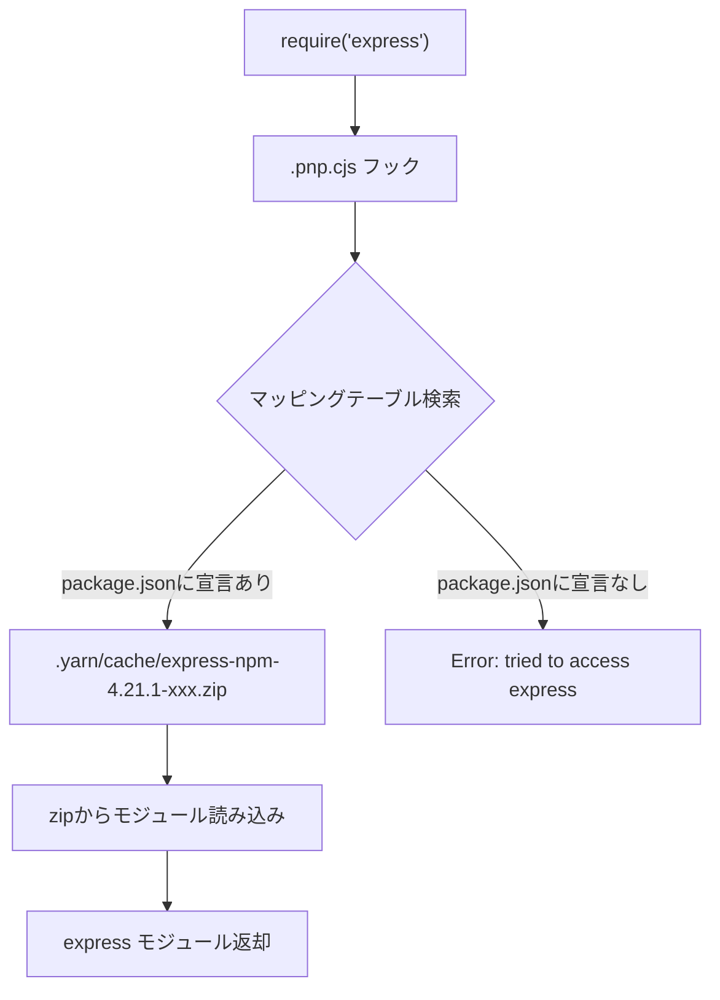
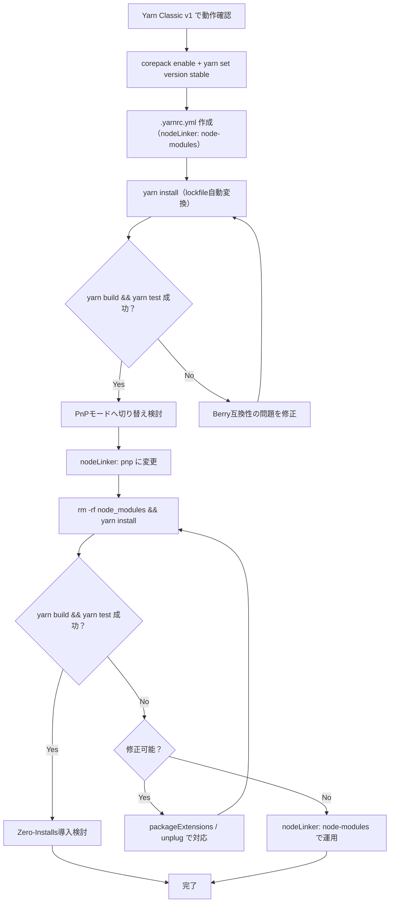

## 導入 ── Yarn BerryはYarn Classicとは別物である

Yarn Berry（v2以降）は、Yarn Classic（v1）と名前こそ同じ「yarn」ですが、**コードベースがフルスクラッチで書き直された別のソフトウェア**です。

Yarn Berryの最大の特徴は、**PnP（Plug'n'Play）モード**でデフォルトから`node_modules`を廃止したことにあります。PnPモードでは、依存パッケージをzipアーカイブのまま保持し、`.pnp.cjs`というマッピングファイルでモジュール解決を行います。これにより、インストール速度の向上、ディスク使用量の削減、そしてPhantom Dependency（幽霊依存）の完全な防止を実現しています。

さらにPnPモードの仕組みを活かした**Zero-Installs**という運用手法を使えば、`git clone`直後に`yarn install`を実行せずにアプリケーションを起動できます。CIパイプラインから`install`ステップを丸ごと削除できるため、ビルド時間の短縮に大きく貢献します。

この記事では、2026年3月時点の最新安定版である**Yarn 4.x**を前提に、セットアップからPnPモードの運用、互換性問題の対処、Yarn Classic（v1）からの移行手順までを、実行可能なコマンド付きで解説します。

**対象読者**: Yarn Classic（v1）からBerryへの移行を検討している開発者、PnPモードに興味がある中級以上のNode.js開発者。

**この記事のスコープ**: PnPモードの「使い方」（HOW）にフォーカスします。「なぜnode_modulesを廃止できるのか」という設計原理（WHY）については、記事末尾で紹介する書籍をご参照ください。

## Yarn Classic vs Berry ── 歴史的経緯と根本的な違い

### Yarn Classicの登場と功績

2016年、FacebookがYarn（現Yarn Classic）を公開しました。当時のnpmが抱えていた3つの問題を解決したことで急速に普及しました。

- **並列ダウンロード**: npmが1パッケージずつ順番にダウンロードしていたのに対し、複数パッケージの並列取得を実装
- **オフラインキャッシュ**: ダウンロード済みパッケージのローカルキャッシュにより、2回目以降のインストールを高速化
- **yarn.lockの導入**: npmが`package-lock.json`を導入する1年前から、再現可能なインストールをlockfileで保証

しかしYarn Classicは、依存管理の仕組み自体はnpmと同じ`node_modules`ベースでした。Phantom Dependency、ディスク浪費、数万ファイルのI/O負荷といった`node_modules`の構造的問題は解決されていませんでした。

### Berry（v2以降）への刷新

2020年にリリースされたYarn Berry（v2）は、Yarn Classicとはまったく異なるアプローチを取りました。**node_modules自体が問題の根源である**という発想に立ち、PnPモードをデフォルトのインストール方式として導入しました。

Yarn Berryはその後もバージョンを重ね、2026年現在は**v4.xが安定版**として広く利用されています。

| 項目 | Yarn Classic（v1） | Yarn Berry（v2〜v4） |
|------|-------------------|---------------------|
| コードベース | JavaScript（独自） | TypeScript（フルスクラッチ書き直し） |
| インストール方式 | `node_modules`生成 | PnP（デフォルト）/ node-modules / pnpm互換 |
| lockfileフォーマット | 独自テキスト形式 | YAML形式 |
| プラグインシステム | なし | あり |
| 設定ファイル | `.yarnrc` | `.yarnrc.yml` |
| メンテナンス状況 | セキュリティ修正のみ | 活発に開発中 |

:::message alert
Yarn Classicは2020年以降、セキュリティ修正以外の新機能開発が停止しています。`yarn --version`で`1.x.x`が表示される場合、それはClassicです。2026年現在、yarnを新規採用するならBerry（v4）一択です。
:::

### Yarn 6 Previewについて

2026年時点で、Yarn 6のPreviewが公開されています。Yarn 6はコアをRustで書き直す大規模な刷新が進行中ですが、**プロダクション環境での利用は非推奨**です。安定した運用にはYarn 4.xを使ってください。

## Yarn Berryのインストールとセットアップ

### Corepack経由のインストール（推奨）

Yarn BerryのインストールにはNode.js同梱の**Corepack**を使うのが推奨されます。`npm install -g yarn`でのグローバルインストールは、Yarn Classic（v1）がインストールされるため非推奨です。

```bash
# 1. Corepackを有効化（Node.js 16.10+に同梱）
corepack enable

# 2. プロジェクトディレクトリに移動（または新規作成）
mkdir my-project && cd my-project
npm init -y

# 3. Yarn Berryの最新安定版をプロジェクトにセット
yarn set version stable
# → .yarn/releases/yarn-4.x.x.cjs が配置される
# → .yarnrc.yml が生成される
# → package.json に "packageManager": "yarn@4.x.x" が追加される
```

`yarn set version stable`を実行すると、3つの変更が行われます。

1. `.yarn/releases/`にYarnのバイナリ本体が配置される
2. `.yarnrc.yml`（設定ファイル）が生成される
3. `package.json`に`packageManager`フィールドが追加される

### packageManagerフィールド

```json
{
  "name": "my-project",
  "packageManager": "yarn@4.6.0"
}
```

`packageManager`フィールドは、チーム全員が同じバージョンのYarnを使うための仕組みです。Corepackが有効な環境では、異なるバージョンのYarnでコマンドを実行しようとすると警告が出ます。

### .yarnrc.ymlの基本設定

```yaml
# .yarnrc.yml

# インストールモード（後述）
nodeLinker: pnp

# パッケージをプロジェクトローカルに保持する
# Zero-Installsを使う場合はfalse推奨
enableGlobalCache: false

# npmレジストリURL（プライベートレジストリを使う場合に変更）
npmRegistryServer: "https://registry.npmjs.org"
```

### バージョンの確認

```bash
# Berryがインストールされたことを確認
yarn --version
# → 4.6.0（4.x.x が表示されればBerry）
```

## PnPモード解説 ── node_modulesを生成しない依存管理

### PnPモードの基本

PnP（Plug'n'Play）モードは、Yarn Berryのデフォルトのインストール方式です。`.yarnrc.yml`で`nodeLinker: pnp`を指定する（または何も指定しない）と有効になります。

PnPモードで`yarn install`を実行すると、`node_modules`は**一切生成されません**。代わりに以下の2つが生成されます。

1. **`.pnp.cjs`**（+ `.pnp.data.json`）── モジュール解決マップ。「どのパッケージがどのバージョンのどの依存を使えるか」を1ファイルに集約した対応表
2. **`.yarn/cache/`** ── 各パッケージのzipアーカイブ（例: `express-npm-4.21.1-abc123def.zip`）

```bash
# PnPモードでのプロジェクト構造
my-project/
├── .pnp.cjs           # モジュール解決マップ（全依存のマッピングを含む）
├── .pnp.data.json     # PnPデータ（v4以降で分離）
├── .pnp.loader.mjs    # ESM用ローダー
├── .yarn/
│   ├── cache/          # パッケージのzipアーカイブ
│   │   ├── express-npm-4.21.1-abc123def.zip
│   │   ├── lodash-npm-4.17.21-xyz789ghi.zip
│   │   └── ...
│   └── releases/       # Yarnバイナリ本体
│       └── yarn-4.6.0.cjs
├── .yarnrc.yml
├── package.json
└── yarn.lock           # YAML形式のlockfile
```

### 依存解決フックの仕組み

アプリケーションを`yarn node`経由で起動すると、`.pnp.cjs`がNode.jsの`Module._resolveFilename`をフック（上書き）します。`require('express')`が呼ばれると、`.pnp.cjs`内のマッピングテーブルを参照し、`.yarn/cache/`内の該当zipアーカイブから直接モジュールを読み込みます。



この仕組みにより、`package.json`に宣言されていないパッケージへのアクセスは即座にエラーになります。npmの`node_modules`では「たまたまhoistingで見える位置にあった」だけで使えていたPhantom Dependencyが、PnPでは完全に防止されます。

### PnPの3つのメリット

**1. インストール速度の向上**

zipアーカイブを`.yarn/cache/`に配置するだけで済むため、数万ファイルを`node_modules`に展開するI/O処理が不要です。特にクリーンインストール時に差が顕著になります。

**2. ディスク使用量の削減**

パッケージをzipのまま保持するため、展開後と比べてディスク使用量が大幅に減ります。

**3. Phantom Dependencyの完全防止**

```bash
# expressだけインストールした状態で、expressの間接依存であるdebugをrequireすると...
$ yarn node -e "require('debug')"
Error: Your application tried to access debug, but it isn't declared in your dependencies
```

### PnPモードでのコマンド実行

PnPモードでは、Node.jsの起動時に`.pnp.cjs`のローダーを経由する必要があります。`yarn`コマンド経由で実行すれば自動的に処理されます。

```bash
# OK: yarn経由で実行すれば.pnp.cjsが自動ロードされる
yarn node app.js
yarn tsc
yarn eslint .
yarn vitest

# NG: 直接nodeを実行すると.pnp.cjsがロードされない
node app.js          # モジュール解決が失敗する
npx eslint .         # YarnのPnPを認識しない
```

`package.json`の`scripts`に書いたコマンドは`yarn run`経由で実行されるため、特別な対応は不要です。

```json
{
  "scripts": {
    "dev": "next dev",
    "build": "next build",
    "test": "vitest"
  }
}
```

```bash
yarn dev    # OK: yarn経由なのでPnPが有効
yarn build  # OK
yarn test   # OK
```

## Zero-Installs ── yarn installが不要になる運用手法

### Zero-Installsの概念

Zero-Installsは、PnPモードの仕組みを活かした運用手法です。`.pnp.cjs`と`.yarn/cache/`をGitリポジトリにコミットすることで、`git clone`直後に`yarn install`を実行せずにアプリケーションを起動できます。

### なぜ可能なのか

PnPモードでは、パッケージの実体は`.yarn/cache/`内のzipアーカイブです。モジュール解決マップ（`.pnp.cjs`）もファイルとして存在します。この2つをGitにコミットしておけば、クローンした時点ですべてのパッケージとその解決情報が揃っているため、レジストリからのダウンロードが不要になります。

### .gitignoreの設定

Zero-Installsを有効にするための`.gitignore`設定です。

```gitignore
# === Zero-Installs用 .gitignore ===

# 以下はGit管理対象にする（.gitignoreに書かない）
# .pnp.cjs
# .pnp.data.json
# .pnp.loader.mjs
# .yarn/cache/
# .yarn/releases/

# 以下はGit管理対象にしない
.yarn/install-state.gz
.yarn/unplugged/
```

ポイントは、`.yarn/cache/`と`.pnp.cjs`を`.gitignore`に**追加しないこと**で、Gitの管理対象にする点です。

### .gitattributesの設定

zipアーカイブのバイナリ差分がGitのdiffに表示されるのを防ぐため、`.gitattributes`を設定します。

```gitattributes
# .gitattributes
.yarn/cache/** binary
.pnp.cjs binary
.pnp.data.json binary
.pnp.loader.mjs binary
```

`binary`属性を付けることで、`git diff`でzipファイルの意味のないバイナリ差分が表示されなくなります。また、改行コードの自動変換も防止できます。

### CIパイプラインの高速化

Zero-Installsの最大のメリットはCI/CDパイプラインの高速化です。

```yaml
# 従来のCI設定（npm）
steps:
  - uses: actions/checkout@v4
  - uses: actions/setup-node@v4
    with:
      node-version: 22
  - run: npm ci              # 30秒〜2分かかる
  - run: npm test
  - run: npm run build
```

```yaml
# Zero-InstallsのCI設定（Yarn Berry + PnP）
steps:
  - uses: actions/checkout@v4
  - uses: actions/setup-node@v4
    with:
      node-version: 22
  - run: yarn test           # installなしで即実行
  - run: yarn build
```

`npm ci`（または`yarn install`）のステップが丸ごと不要になります。レジストリへのネットワーク通信もキャッシュ復元も不要なため、CIが安定して高速になります。

### Zero-Installsのトレードオフ

メリットだけではありません。以下のトレードオフを理解した上で採用を判断してください。

| メリット | トレードオフ |
|---------|------------|
| CIの`install`ステップ不要 | リポジトリサイズが数十MB〜数百MB増加 |
| `git clone`直後に動く | パッケージ更新時にzipのバイナリ差分がコミットに含まれる |
| レジストリ障害の影響を受けない | ネイティブモジュール（node-gyp系）は完全にはZero-Installsにできない |
| 新メンバーのオンボーディングが速い | `git clone`自体が遅くなる（shallow cloneで軽減可能） |

**判断基準**: CIの実行頻度が高い環境（1日に数十回以上）、チームメンバーの入れ替わりが多い環境ではメリットが大きいです。個人開発や小規模チームでは、リポジトリサイズ増加のデメリットが上回る場合もあります。

:::message
PnPモードは「なぜnode_modulesを廃止できるのか」という設計レベルの理解があると、トラブルシューティングが格段に楽になります。PnPの内部アーキテクチャとモジュール解決フックの仕組みは、書籍 [パッケージマネージャ from scratch](https://zenn.dev/yuichi_ai/books/package-manager-from-scratch) の第5章で図解付きで詳しく解説しています。
:::

## PnP互換性問題と対策

PnPモードは`node_modules`を廃止するため、`node_modules`の存在を前提としたツールやパッケージで互換性問題が発生することがあります。Yarn Berryはこれに対処するための複数の仕組みを用意しています。

### nodeLinker設定 ── 3つのインストールモード

`.yarnrc.yml`の`nodeLinker`で、インストールモードを切り替えられます。

**1. `pnp`（デフォルト）**

```yaml
nodeLinker: pnp
```

`node_modules`を生成しません。最も厳格な依存管理を提供しますが、互換性の問題が発生しやすいモードです。

**2. `node-modules`（互換モード）**

```yaml
nodeLinker: node-modules
```

従来通りの`node_modules`ディレクトリを生成します。npmやYarn Classicと同じ構造のため、ほぼすべてのツールがそのまま動きます。Berryのワークスペース、プラグイン、Constraintsなどの機能は引き続き利用可能です。

**3. `pnpm`（pnpmスタイル）**

```yaml
nodeLinker: pnpm
```

pnpmに似たシンボリックリンク構造の`node_modules`を生成します。PnPほど厳格ではありませんが、Phantom Dependencyをある程度防止できます。

**選択の指針:**

```
既存プロジェクトの移行 → まず node-modules で安定稼働を確認
                      → 問題なければ pnp に切り替え検討

新規プロジェクト → pnp で開始
               → 互換性問題が多ければ node-modules にフォールバック
```

### packageExtensions ── PnP非対応パッケージへの対応

一部のnpmパッケージは、`package.json`で依存を正しく宣言していません。npmの`node_modules`ではhoistingにより「たまたま動いていた」ため問題が顕在化しませんでしたが、PnPの厳格なチェックでエラーになります。

`packageExtensions`を使うと、外部パッケージの依存宣言を補完できます。

```yaml
# .yarnrc.yml
packageExtensions:
  # styled-componentsがreact-isを宣言していない問題
  "styled-components@*":
    dependencies:
      "react-is": "*"

  # 一部のESLintプラグインが依存を宣言していない問題
  "eslint-plugin-import@*":
    dependencies:
      "tsconfig-paths": "*"

  # Storybookの依存宣言不足
  "@storybook/react@*":
    dependencies:
      "react-dom": "*"
```

`packageExtensions`の設定を追加したら`yarn install`を再実行してください。

### unplugged packages ── ネイティブバイナリの対応

esbuild、SWC、Sharpなどのネイティブバイナリを含むパッケージは、zipアーカイブからの読み込みと相性が悪い場合があります。`yarn unplug`でzipから展開することで解決できます。

```bash
# 特定のパッケージをzipから展開して.yarn/unplugged/に配置
yarn unplug esbuild
yarn unplug @swc/core
yarn unplug sharp

# unplugged状態の確認
ls .yarn/unplugged/
```

`yarn unplug`を実行すると、対象パッケージが`.yarn/unplugged/`ディレクトリに展開されます。モジュール解決は引き続き`.pnp.cjs`が行いますが、実体はzipではなく通常のファイルになります。

:::message
esbuild v0.15.0以降はPnPをネイティブサポートしています。最新版では`unplug`が不要な場合もあるため、まず`unplug`なしで試してみてください。
:::

## Hardened Mode ── lockfileの整合性検証

Yarn Berryの**Hardened Mode**は、`yarn install`時にlockfileの整合性を厳格に検証する機能です。サプライチェーン攻撃への対策として有効です。

### 有効化

```yaml
# .yarnrc.yml
enableHardenedMode: true
```

### Hardened Modeが検証すること

1. **lockfileとpackage.jsonの整合性**: `package.json`に記載された依存がlockfileに正しく反映されているかを確認
2. **レジストリメタデータとの一致**: lockfileに記録されたチェックサムが、レジストリから取得したメタデータと一致するかを確認
3. **未解決の依存の検出**: lockfileに存在しない依存がないかを確認

Hardened Modeが有効な状態で整合性の問題が検出されると、`yarn install`はエラーで中断します。これにより、lockfileの改ざんや不正な依存の混入を早期に発見できます。

### CI環境での活用

CIパイプラインでは`--immutable`フラグとの組み合わせが効果的です。

```yaml
# GitHub Actions での例
steps:
  - uses: actions/checkout@v4
  - uses: actions/setup-node@v4
    with:
      node-version: 22
  - run: yarn install --immutable
    # --immutable: lockfileの変更を禁止し、
    # 変更が必要な場合はエラーで中断する
```

`--immutable`フラグはCI環境で特に重要です。開発者がlockfileの更新を忘れてプッシュした場合や、lockfileに不正な変更が混入した場合に、CIが早期にエラーを出してくれます。

## 実用的な移行手順 ── Yarn Classic → Berry ステップバイステップ

Yarn Classic（v1）からBerry（v4）への移行手順を、段階的に説明します。

### 事前準備

```bash
# 現在のYarnバージョンを確認
yarn --version
# → 1.22.x（Classicであることを確認）

# 現在のプロジェクトが正常に動作することを確認
yarn install
yarn build
yarn test
```

### ステップ1: Yarn Berryをインストール

```bash
# Corepackを有効化
corepack enable

# Yarn Berryの最新安定版をセット
yarn set version stable
# → .yarn/releases/yarn-4.x.x.cjs が配置される
# → package.json に "packageManager" が追加される
```

### ステップ2: .yarnrc.ymlを作成

まず`node-modules`モードで始めます。いきなりPnPに切り替えると、互換性問題で全体が壊れるリスクがあります。

```yaml
# .yarnrc.yml
nodeLinker: node-modules
enableGlobalCache: false
```

### ステップ3: lockfileの変換と依存の再インストール

```bash
# 既存のnode_modulesを削除
rm -rf node_modules

# yarn.lockの変換と依存の再インストール
# Berry は Classic形式の yarn.lock を自動的にYAML形式に変換する
yarn install
```

Classicの`yarn.lock`（独自テキスト形式）は、`yarn install`実行時にBerryのYAML形式に自動変換されます。npmの`package-lock.json`からの変換にも対応しています。

### ステップ4: 動作確認

```bash
yarn build
yarn test
yarn dev   # 開発サーバーが起動することを確認
```

この時点でエラーが出る場合は、Berry自体の問題（プラグイン設定、スクリプト互換性など）を先に解決します。

### ステップ5: .gitignoreの更新

```gitignore
# .gitignore（Berry用に更新）

# Yarn Berry
.yarn/*
!.yarn/cache
!.yarn/patches
!.yarn/plugins
!.yarn/releases
!.yarn/sdks
!.yarn/versions
.pnp.*

# 従来のnode_modules
node_modules/
```

Zero-Installsを導入する場合は、`.pnp.*`の行を削除し、`.pnp.cjs`等をGit管理対象にします。

### ステップ6: PnPモードへの切り替え（任意）

`node-modules`モードで安定稼働が確認できたら、PnPモードへの切り替えを検討します。

```bash
# .yarnrc.ymlを編集
# nodeLinker: node-modules → nodeLinker: pnp

# node_modulesを削除して再インストール
rm -rf node_modules
yarn install

# 動作確認
yarn build && yarn test
```

エラーが出た場合は、次の「トラブルシューティング」セクションを参照してください。解決が難しい場合は`nodeLinker: node-modules`に戻すのも正しい判断です。

### ステップ7: 不要ファイルの削除

```bash
# Classic時代のファイルを削除
rm -f .yarnrc         # Classic用設定ファイル（Berryでは.yarnrc.ymlを使用）
rm -rf .yarn/cache-v6 # Classic用キャッシュ（存在する場合）
```

### 移行フローの全体像



## よくあるトラブルシューティング

PnPモードで頻繁に遭遇する問題と、その解決方法を整理します。

### IDE（VSCode）でのPnP対応

PnPモードではパッケージがzipアーカイブ内にあるため、VSCodeのTypeScript Language Serverがデフォルトでは型定義を見つけられません。

```bash
# エディタ連携用のSDKをインストール
yarn dlx @yarnpkg/sdks vscode
```

このコマンドにより以下が生成されます。

- `.yarn/sdks/typescript/bin/tsc` ── PnP対応のTypeScriptラッパー
- `.yarn/sdks/typescript/bin/tsserver` ── PnP対応のtsserverラッパー
- `.vscode/settings.json` ── TypeScript設定

実行後、VSCodeで以下の操作を行います。

1. `Cmd+Shift+P`（macOS）または`Ctrl+Shift+P`（Windows/Linux）を開く
2. 「TypeScript: Select TypeScript Version」を選択
3. 「Use Workspace Version」を指定

```json
// .vscode/settings.json（自動生成される）
{
  "typescript.tsdk": ".yarn/sdks/typescript/lib",
  "typescript.enablePromptUseWorkspaceTsdk": true
}
```

### TypeScript設定

PnPモードでTypeScriptを使う場合、`@yarnpkg/sdks`のインストールに加えて、必要なパッケージが`package.json`に宣言されていることを確認してください。

```bash
# TypeScriptと型定義をインストール
yarn add -D typescript @types/node

# SDKを設定（再実行で最新化）
yarn dlx @yarnpkg/sdks vscode
```

`baseUrl`や`paths`を使ったパスマッピングはPnPモードでも動作しますが、TypeScriptのバージョンによっては`.pnp.cjs`のローダーとの相互作用で問題が出ることがあります。問題が発生した場合は、TypeScriptを最新版に更新してください。

### ESLint対応

ESLintもSDK経由で設定します。

```bash
# ESLintのSDKを設定
yarn dlx @yarnpkg/sdks vscode
# → .yarn/sdks/eslint/ が生成される
```

ESLintプラグインが依存を正しく宣言していない場合は、`packageExtensions`で補完します。

```yaml
# .yarnrc.yml
packageExtensions:
  "eslint-plugin-import@*":
    dependencies:
      "tsconfig-paths": "*"
  "@typescript-eslint/eslint-plugin@*":
    peerDependencies:
      "typescript": "*"
```

### Storybook対応

Storybook v7以降はPnPとの互換性が改善されていますが、依存宣言の不足によりエラーが出る場合があります。

```yaml
# .yarnrc.yml
packageExtensions:
  "@storybook/react@*":
    dependencies:
      "react-dom": "*"
  "@storybook/builder-webpack5@*":
    dependencies:
      "webpack": "*"
```

それでも解決しない場合は、Storybook関連のパッケージを`unplug`します。

```bash
yarn unplug @storybook/react
yarn unplug @storybook/builder-webpack5
```

### トラブルシューティングの判断フロー

```
エラーメッセージを確認
├── "tried to access X, but it isn't declared"
│   → yarn add X で依存を明示的に追加
│
├── "ENOENT" / ネイティブバイナリ系のエラー
│   → yarn unplug <package-name>
│
├── "Cannot find module" （特定のツール/ライブラリ）
│   → packageExtensions で不足依存を補完
│
├── VSCodeの補完・型チェックが動かない
│   → yarn dlx @yarnpkg/sdks vscode を実行
│
└── 上記すべてで解決しない
    → nodeLinker: node-modules にフォールバック
```

### よくあるエラーメッセージと対処

| エラーメッセージ | 原因 | 対処 |
|---------------|------|------|
| `Your application tried to access X` | Phantom Dependency | `yarn add X` |
| `A package is trying to access ... without it being listed` | 依存宣言不足 | `packageExtensions`で補完 |
| `ENOENT: no such file or directory` | ネイティブバイナリがzip内で動作しない | `yarn unplug <pkg>` |
| `Cannot find module 'typescript/lib/tsserverlibrary'` | VSCode SDK未設定 | `yarn dlx @yarnpkg/sdks vscode` |
| `The lockfile would have been modified` | CI環境でlockfile未更新 | ローカルで`yarn install`しlockfileをコミット |

## まとめ ── 段階的に導入し、困ったら「なぜ」に立ち返る

Yarn Berry（v4）の導入で最も重要なのは、**段階的に進める**ことです。

1. `corepack enable` + `yarn set version stable` でBerryをインストール
2. `nodeLinker: node-modules` で既存プロジェクトの動作を確認
3. 問題なければ `nodeLinker: pnp` に切り替え
4. 互換性問題を `packageExtensions` / `unplug` / SDK設定で解決
5. Zero-Installsの導入を検討（`.yarn/cache`をGitにコミット + `.gitattributes`で`binary`設定）

いきなりPnP + Zero-Installsを目指すのではなく、各ステップで動作確認を行いながら進めてください。`nodeLinker: node-modules`のままBerryを使い続けるのも、十分に実用的な選択です。

---

この記事ではYarn BerryのPnPモードとZero-Installsの「使い方」にフォーカスしました。

実際に運用していると、`packageExtensions`で何を設定すべきか判断に迷ったり、`Cannot find module`の原因が分からなかったりする場面に遭遇します。そうしたとき、「なぜPnPはnode_modulesなしでモジュール解決ができるのか」「`.pnp.cjs`は内部でどのようにNode.jsの`require`をフックしているのか」という設計レベルの理解があると、問題の切り分けが格段に速くなります。

node_modulesの構造的問題（Phantom Dependency、hoistingの不確定性）、PnPのモジュール解決フックの詳細、npm/Yarn/pnpmの各パッケージマネージャのアーキテクチャ比較を体系的に学びたい方は、拙著 **[パッケージマネージャ from scratch](https://zenn.dev/yuichi_ai/books/package-manager-from-scratch)** をご覧ください。**第1章から第3章は無料公開**しています。

---
