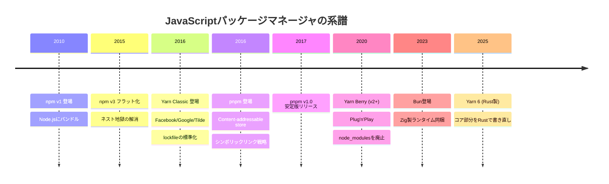

:::message
**この章を読むとできるようになること**
- パッケージマネージャが解決している3つの本質的な問題を説明できる
- npm以前の時代にフロントエンド開発者がどう依存関係を管理していたか理解できる
- npm、yarn、pnpmの歴史的な登場背景とそれぞれの設計動機を把握できる
- 本書全体の構成を理解し、自分に必要な章から読み始められる
:::

## 1.1 パッケージマネージャが解決する3つの問題

あなたが `npm install` と打つとき、裏側では3つの根深い問題が同時に解決されています。

**問題1: 依存管理**

Expressをインストールすると、Express自身が依存する30以上のパッケージも一緒にインストールされます。それらのパッケージもまた別のパッケージに依存しています。この「依存の依存の依存...」という連鎖を、人間が手で管理するのは現実的ではありません。

```
express@4.18.2
├── accepts@1.3.8
│   ├── mime-types@2.1.35
│   │   └── mime-db@1.52.0
│   └── negotiator@0.6.3
├── body-parser@1.20.1
│   ├── bytes@3.1.2
│   ├── content-type@1.0.5
│   ...
└── (30以上のパッケージが続く)
```

パッケージマネージャは、この依存ツリー全体を自動的に解決します。

**問題2: バージョンの一貫性**

あなたのマシンでは動くのに、同僚のマシンでは動かない。CIでビルドすると別のエラーが出る。──この問題の原因の多くは、インストールされたパッケージのバージョンが環境ごとに微妙に異なることです。

`package.json` には `"lodash": "^4.17.0"` と書かれていますが、これは「4.17.0以上 5.0.0未満のどれか」を意味します。あなたが先週インストールしたときは4.17.21が最新でしたが、同僚が今日インストールすると4.17.22が入るかもしれません。

パッケージマネージャはlockfile（`package-lock.json` や `yarn.lock`）を使って、すべての環境で完全に同じバージョンの組み合わせを再現します。

**問題3: 配布の自動化**

コードを書いた人が、それを使いたい人に届ける。この単純な行為には、パッケージング、バージョニング、公開、ダウンロード、展開、配置という一連の工程が必要です。パッケージマネージャは、公開側には `npm publish` の一手で、利用側には `npm install` の一手で、この工程全体を自動化します。


この3つの問題は相互に関連しています。依存管理が不完全ならバージョンの一貫性も担保できないし、配布の仕組みがなければそもそも依存を自動取得できません。パッケージマネージャとは、この3つを一体的に解決するシステムです。

## 1.2 パッケージマネージャがない世界を想像する

2010年以前のフロントエンド開発を振り返ってみましょう。jQueryを使いたければ、選択肢は主に2つでした。

**方法1: ファイルを手動でダウンロードしてコピーする**

```
project/
├── index.html
├── js/
│   ├── jquery-1.6.2.min.js      ← 手動でダウンロード
│   ├── jquery-ui-1.8.16.min.js  ← 手動でダウンロード
│   └── app.js
```

新しいバージョンが出たら、公式サイトからダウンロードし直して、ファイルを差し替えます。jQuery UIがどのバージョンのjQueryに対応しているかは、リリースノートを自分で読んで確認する必要がありました。

**方法2: CDNからscriptタグで読み込む**

```html
<script src="https://ajax.googleapis.com/ajax/libs/jquery/1.6.2/jquery.min.js"></script>
<script src="https://ajax.googleapis.com/ajax/libs/jqueryui/1.8.16/jquery-ui.min.js"></script>
<script src="js/app.js"></script>
```

CDNは便利でしたが、読み込み順を間違えると動かない、オフラインでは開発できない、CDNが落ちたらプロダクションも落ちるという問題がありました。

どちらの方法でも、依存が5個、10個と増えていくと管理は破綻します。バージョンの組み合わせ検証は人力で、ある日jQueryをアップデートしたらjQuery UIが壊れるという事態が日常的に起きていました。

Node.jsの登場（2009年）とnpmの登場（2010年）は、この世界を根本から変えました。

## 1.3 npm/yarn/pnpmの歴史と系譜

パッケージマネージャの歴史は、先行するツールの限界を後発が克服する繰り返しです。それぞれが「何を問題と捉えたか」を知ることで、設計の違いが腑に落ちます。



**npm（2010年〜）** ── 最初の標準

Isaac Z. Schlueterが開発し、Node.jsにバンドルされたことで事実上の標準になりました。初期のnpm（v2まで）は依存パッケージを素直にネストしていたため、`node_modules` の中に `node_modules` が入り、その中にまた `node_modules` が入る...という深いディレクトリ構造を作りました。Windowsでは260文字のパス長制限（MAX_PATH）に引っかかって削除すらできないという問題が有名でした。

npm v3（2015年）ではディレクトリ構造をフラットにする「ホイスティング」を導入してネスト問題を解決しましたが、今度はPhantom Dependency（幽霊依存）という新しい問題を生みました。この話は第3章で詳しく扱います。

**Yarn Classic（2016年）** ── 速度と信頼性の追求

Facebookのエンジニアがnpmのパフォーマンスとセキュリティの問題に直面し、Google、Tildeと共同でYarnを開発しました。`yarn.lock` による決定的インストール、並列ダウンロード、オフラインキャッシュが主な改善点でした。npmもこれに触発されて `package-lock.json` を導入するなど、互いに影響を与え合いました。

**pnpm（2016年〜）** ── ディスクとリンクの革命

Rico Sta. Cruzが2016年に初期コミットを行い、その後Zoltan Kochanが主要開発者として引き継いだpnpmは、問題の捉え方が根本的に異なりました。「`node_modules` のフラット化そのものが間違いだ」と考え、Content-addressable Store（内容によるアドレス指定の保存領域）とシンボリックリンクを組み合わせた独自の戦略を取りました。同じバージョンのパッケージはディスク上に1コピーだけ保持され、各プロジェクトからはリンクで参照されます。仕組みの詳細は第6章で解説します。

**Yarn Berry（2020年〜）** ── node_modulesからの脱却

Yarn v2以降（通称Berry）は、Plug'n'Play（PnP）モードを導入し、`node_modules` ディレクトリそのものを廃止する道を選びました。依存パッケージをzipファイルに圧縮してリポジトリにコミットするという、大胆なアプローチです。第5章で詳しく見ていきます。

**Bun（2023年〜）** ── ランタイムごと置き換える

Jarred Sumnerが開発したBunは、パッケージマネージャだけでなく、ランタイム、バンドラー、テストランナーをすべて1つのバイナリに統合しました。Zig言語で書かれた高速なファイルI/Oにより、インストール速度が既存ツールの数倍になるケースもあります。

## 1.4 本書の読み方

本書のタイトルにある「from scratch」は、「パッケージマネージャをゼロから作ろう」という意味ではありません。パッケージマネージャの内部で起きていることを、仕組みのレベルから理解するという意味です。

各章は以下のように構成されています。

| 章 | テーマ | 前提知識 |
|---|---|---|
| 1-3章 | 基礎概念（本章〜node_modules構造） | なし |
| 4章 | lockfileの深層構造 | 3章まで |
| 5章 | Yarn Classic → Berry の変遷 | 3-4章 |
| 6章 | pnpmのアーキテクチャ | 3-4章 |
| 7章 | 依存解決アルゴリズム | 4章 |
| 8章 | モノレポとWorkspaces | 5-6章 |
| 9章 | セキュリティとサプライチェーン | 2章 |
| 10章 | 未来と実践 | 全章 |

1〜3章は無料公開しています。ここまで読むだけでも、`npm install` のたびに裏で何が起きているかを説明できるようになります。

4章以降は、特定のツールに興味がある場合はそこだけ読んでも大丈夫です。ただし4章（lockfile）はすべての章の土台になるので、先に読むことをお勧めします。

本書を読み終えたとき、あなたは以下のことができるようになっているはずです。

- lockfileのコンフリクトを、中身を読んで手動で解消できる
- 「npm、yarn、pnpmのどれを使うべきか」という問いに、技術的根拠をもって答えられる
- Phantom DependencyやDoppelgangerといった構造的な問題を事前に回避できる
- `node_modules` が壊れたとき、原因を推測して適切に対処できる

次の章では、パッケージマネージャの出発点であるnpmレジストリの仕組みを、実際にHTTPリクエストを送りながら確認していきます。
