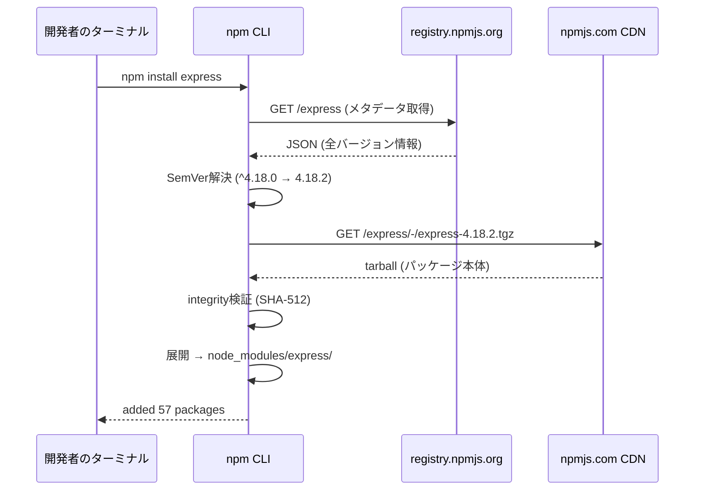
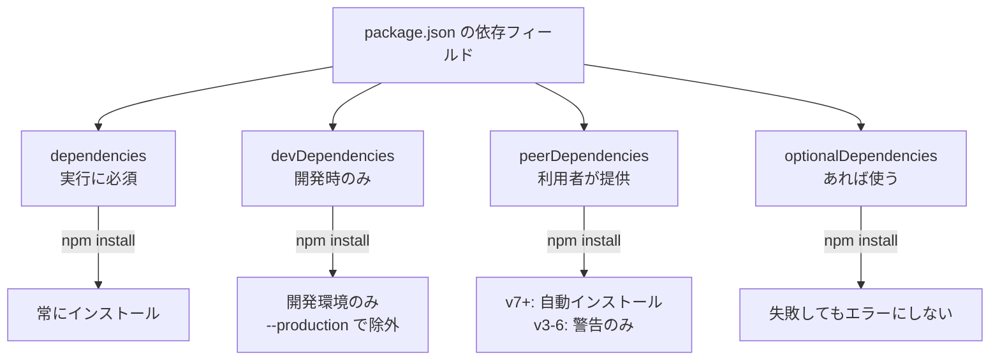
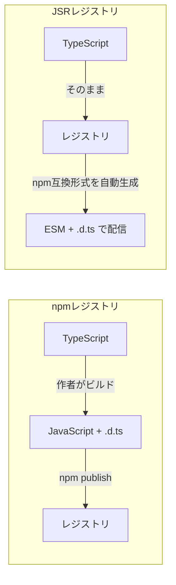

:::message
**この章を読むとできるようになること**
- npmレジストリのHTTP APIを直接叩いて、パッケージのメタデータを取得できる
- tarballのダウンロードからintegrityチェックまでの流れを手動で再現できる
- SemVerの `^` と `~` の挙動を正確に説明できる
- JSRレジストリの位置づけと、既存パッケージマネージャとの関係を理解できる
:::

## 2.1 npmレジストリはただのHTTP APIである

`npm install express` と打つと、npmはどこにパッケージを取りに行くのでしょうか。答えは `https://registry.npmjs.org/` というHTTPサーバーです。

特別なプロトコルは使っていません。ブラウザでも、curlでも、どんなHTTPクライアントでもアクセスできます。試してみましょう。

```bash
# expressパッケージのメタデータを取得する
curl -s https://registry.npmjs.org/express | head -c 500
```

大量のJSONが返ってきます。これがnpmレジストリの正体です。CouchDBをベースにしたRESTful APIで、すべてのパッケージ情報をJSONドキュメントとして保持しています。



パッケージマネージャがやっていることは、突き詰めると「HTTPでJSONを取得し、条件に合うバージョンを選び、tarballをダウンロードして展開する」というシンプルな処理です。この流れを理解していると、ネットワークエラーやインストール失敗時の原因切り分けが格段に楽になります。

## 2.2 パッケージメタデータの構造

特定のバージョンのメタデータを取得してみましょう。

:::message
以下のコマンドでは `jq` を使います。`jq` はJSONを整形・抽出するコマンドラインツールです。未インストールの場合は `brew install jq`（macOS）や `apt install jq`（Linux）で導入できます。`jq` がない場合は `| python3 -m json.tool` で代替可能です。
:::

```bash
curl -s https://registry.npmjs.org/express/4.18.2 | jq '{
  name: .name,
  version: .version,
  dependencies: .dependencies,
  dist: .dist
}'
```

返ってくるJSONの中で、パッケージマネージャが特に注目するフィールドを見ていきます。

```json
{
  "name": "express",
  "version": "4.18.2",
  "dependencies": {
    "accepts": "~1.3.8",
    "body-parser": "1.20.1",
    "content-disposition": "0.5.4",
    "cookie": "0.5.0",
    "debug": "2.6.9",
    "...": "（以下30パッケージ省略）"
  },
  "dist": {
    "integrity": "sha512-...（Base64エンコードされたハッシュ）",
    "shasum": "3ac42e49ef1df2e85e7825ab9e32f5b2a5a3022b",
    "tarball": "https://registry.npmjs.org/express/-/express-4.18.2.tgz",
    "fileCount": 58,
    "unpackedSize": 210891
  }
}
```

**`dependencies`** は、このパッケージが動作に必要とする他のパッケージの一覧です。パッケージマネージャは、このフィールドを再帰的にたどって依存ツリー全体を構築します。expressが30のパッケージに依存し、そのそれぞれがさらに別のパッケージに依存するため、最終的にインストールされるパッケージ数は57にもなります。

**`dist.tarball`** は、パッケージ本体のダウンロードURLです。tarball（.tgz）はtar + gzipの圧縮ファイルで、パッケージのソースコードが入っています。

**`dist.integrity`** は、ダウンロードしたファイルが改ざんされていないことを確認するためのハッシュ値です。次のセクションで詳しく見ます。

なお、`dependencies` の他に `devDependencies`（開発時のみ必要）、`peerDependencies`（利用者が自分でインストールすべき）、`optionalDependencies`（なくても動作する）といったフィールドもあります。パッケージマネージャはこれらを区別して、必要なものだけをインストールします。



## 2.3 tarballのダウンロードと展開

パッケージマネージャが裏でやっていることを、手動で再現してみましょう。

```bash
# 1. tarballをダウンロード
curl -o express-4.18.2.tgz \
  https://registry.npmjs.org/express/-/express-4.18.2.tgz

# 2. integrityを検証する（概念的な確認）
# レジストリのintegrityフィールドはSRI形式（Base64エンコード）です。
# shasumは16進数で出力するため、値の形式は異なりますが、
# 同じSHA-512アルゴリズムで検証しています。
# 完全な再現にはBase64変換が必要です:
# openssl dgst -sha512 -binary express-4.18.2.tgz | openssl base64 -A
shasum -a 512 express-4.18.2.tgz | awk '{print $1}'

# 3. 展開する
tar xzf express-4.18.2.tgz
ls package/
# → LICENSE  History.md  Readme.md  index.js  lib/  package.json
```

tarballの中身は `package/` というディレクトリに格納されています。npmは展開後にこのディレクトリを `node_modules/express/` にリネームして配置します。

**integrityチェック**は、サプライチェーン攻撃への重要な防御線です。2018年に起きた `event-stream` 事件では、人気パッケージのメンテナ権限を悪意ある第三者が取得し、暗号通貨を盗むコードを含むバージョンを公開しました。integrityチェックはこうした改ざんを検出するための仕組みですが、正規の公開手順で悪意あるコードが含まれた場合は防げません。この問題は第9章で掘り下げます。

lockfileにはパッケージごとのintegrityハッシュが記録されており、2回目以降のインストール時はこのハッシュと照合します。

```json
// package-lock.json の一部
"node_modules/express": {
  "version": "4.18.2",
  "resolved": "https://registry.npmjs.org/express/-/express-4.18.2.tgz",
  "integrity": "sha512-3FpRxiM4a+v7i...（SHA-512ハッシュ）"
}
```

`resolved` がダウンロードURL、`integrity` がハッシュ値です。この2つが揃うことで、「どこから取得した、どの内容のファイルか」を完全に特定できます。

## 2.4 SemVerの約束と現実

npmの依存バージョン指定は、SemVer（Semantic Versioning）に基づいています。`MAJOR.MINOR.PATCH` の3つの数値で、それぞれの意味が決められています。

- **MAJOR**: 後方互換性のない変更
- **MINOR**: 後方互換性のある機能追加
- **PATCH**: バグ修正

`package.json` でよく見る `^` と `~` の挙動を正確に把握しましょう。

```bash
# ^（キャレット）: 左端の非ゼロ桁を固定する
"^4.17.0"  → >=4.17.0 <5.0.0    # MAJOR固定
"^0.14.0"  → >=0.14.0 <0.15.0   # 0.MINOR固定（ここが罠）
"^0.0.3"   → >=0.0.3 <0.0.4     # 0.0.PATCH固定

# ~（チルダ）: MINOR以上を固定する
"~4.17.0"  → >=4.17.0 <4.18.0   # MAJOR.MINOR固定
"~0.14.0"  → >=0.14.0 <0.15.0   # キャレットと同じ結果
```

**メジャー0系の罠**は多くの開発者がハマるポイントです。`^0.14.0` は「0.14.x の最新」を意味し、0.15.0にはアップグレードされません。メジャーバージョンが0のパッケージでは、MINORが破壊的変更に使われる慣習があるためです。しかしこれはあくまで慣習であり、0.14.1に破壊的変更が入ることも珍しくありません。

**SemVerの理想と現実のギャップ**

SemVerは「パッチバージョンには破壊的変更を入れない」という約束ですが、実際にはこの約束が守られないケースが頻繁にあります。

```
# 実際に起きた事例
colors@1.4.0 → 1.4.1  # 作者が意図的に無限ループを仕込んだ
faker@5.5.3 → 6.6.6   # 作者が全コードを削除した
left-pad@1.1.1         # 作者がnpmから全パッケージを取り下げた
```

こうした事例があるからこそ、lockfileが重要になります。lockfileは「この組み合わせで動いた」という事実を記録するファイルであり、SemVerの約束に頼らない堅牢性を提供します。lockfileの詳しい仕組みは第4章で解説します。

## 2.5 JSRレジストリの登場

2024年、Deno社がJSR（JavaScript Registry）を公開しました。npmレジストリが15年近く使われてきた中で蓄積された課題に対する、新しいアプローチです。

```bash
# JSRのパッケージもHTTP APIでアクセスできる
curl -s https://jsr.io/@std/path/meta.json | jq '{
  scope: .scope,
  name: .name,
  latest: .latest
}'
```

JSRの特徴は、TypeScriptをネイティブにサポートしている点です。npmレジストリではTypeScriptで書かれたパッケージも、公開時にJavaScriptへトランスパイルする必要がありました。JSRではTypeScriptのソースコードをそのまま公開でき、レジストリ側がnpm互換形式（ESM + `.d.ts`）を自動生成して配信します。



pnpmはv10.9から、Yarnはv4.9.0から `jsr:` プロトコルをネイティブサポートしています。それ以前のバージョンでは、手動でレジストリ設定を行えばJSRパッケージを利用可能です。

```json
// package.json でJSRパッケージを指定する
{
  "dependencies": {
    "@jsr/std__path": "jsr:@std/path@^1.0.0"
  }
}
```

JSRがnpmレジストリを置き換えるかどうかは、まだ分かりません。しかし、パッケージレジストリの基本的な役割──メタデータの提供、パッケージ本体の配布、バージョン管理──はnpmでもJSRでも同じです。プロトコルを理解していれば、新しいレジストリが登場しても怖くありません。

## 章末: 確認クイズ

理解度を確認するために、3問のクイズに挑戦してみてください。

**Q1.** `npm install express` を実行したとき、npm CLIが最初にアクセスするURLは何ですか？

:::details 答え
`https://registry.npmjs.org/express` です。まずパッケージのメタデータ（全バージョン情報を含むJSON）を取得し、SemVerの条件に合うバージョンを選択してから、tarballのURLにアクセスします。
:::

**Q2.** `package.json` に `"react": "^0.14.0"` と書かれている場合、`npm install` でインストールされるバージョンの範囲はどこからどこまでですか？

:::details 答え
`>=0.14.0 <0.15.0` です。キャレット `^` は「左端の非ゼロ桁を固定する」ルールなので、メジャーが0の場合はMINOR（14）が固定されます。0.14.9はインストールされますが、0.15.0はインストールされません。
:::

**Q3.** lockfileに記録されている `integrity` フィールドの役割は何ですか？

:::details 答え
ダウンロードしたtarballが改ざんされていないことを検証するためのハッシュ値です。SHA-512などのハッシュアルゴリズムで計算されており、ファイルの内容が1バイトでも異なれば値が変わります。lockfileのintegrityと実際のダウンロードファイルのハッシュが一致しなければ、インストールは失敗します。
:::

次の章では、ダウンロードしたパッケージが配置される `node_modules` ディレクトリの構造に踏み込みます。なぜフラット化が導入されたのか、そしてフラット化が生んだ新たな問題とは何か──パッケージマネージャの設計思想を分ける分岐点です。
