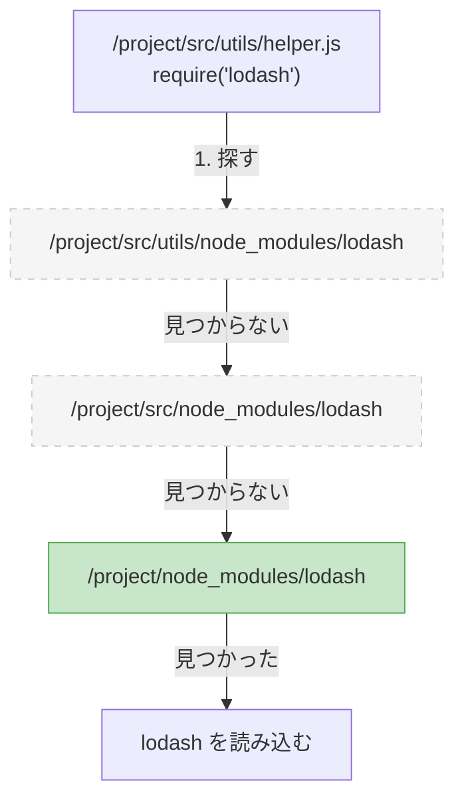
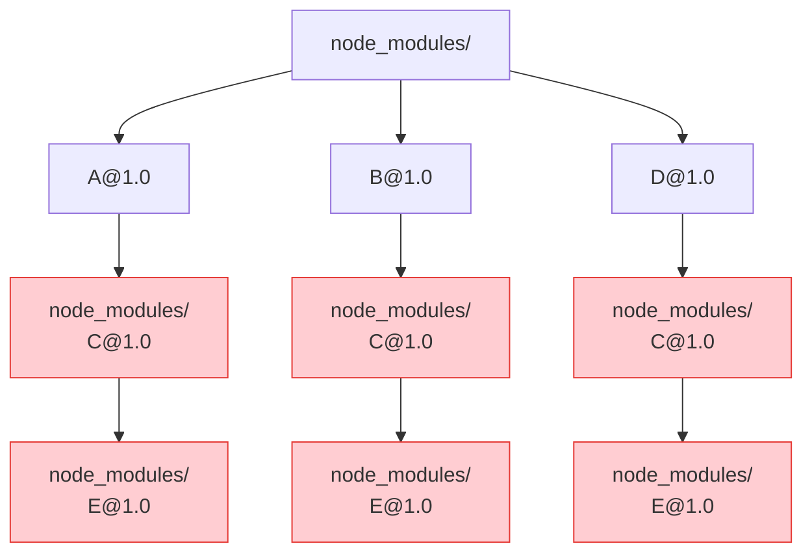
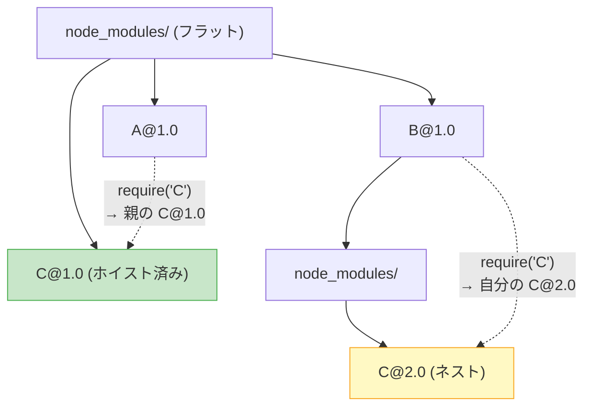

:::message
**この章を読むとできるようになること**
- Node.jsの `require()` がモジュールを探索するアルゴリズムを正確に説明できる
- npm v2時代のネスト構造とnpm v3以降のフラット構造の違いを図で描ける
- Phantom DependencyとDoppelgangerという2つの構造的問題を理解し、実際に再現できる
- inode、シンボリックリンク、ハードリンクの違いを説明できる（次章以降の前提知識）
:::

## 3.1 Node.jsのモジュール解決アルゴリズム

`require('express')` と書いたとき、Node.jsはどうやって `express` のファイルを見つけるのでしょうか。このアルゴリズムを知ることが、`node_modules` の構造を理解する出発点です。

Node.jsのモジュール解決は、次の手順で動きます。

```
require('express') を /project/src/app.js から呼んだ場合:

1. /project/src/node_modules/express を探す → なければ上へ
2. /project/node_modules/express を探す    → なければ上へ
3. /node_modules/express を探す             → なければエラー
```

ポイントは**親ディレクトリに向かって遡る**という挙動です。`node_modules` がファイルの隣になくても、プロジェクトルートにあれば見つかります。この仕組みがあるおかげで、深いディレクトリからでもトップレベルの `node_modules` を参照できます。



ディレクトリ内で `express` を見つけたとき、Node.jsはさらに以下の順序で読み込むファイルを決定します。

```
1. express/package.json の "main" フィールドが指すファイル
2. express/index.js
3. express/index.json
4. express/index.node
```

ES Modules（`import` 文）の場合は `"exports"` フィールドが優先されますが、基本的な探索の仕組みは同じです。この「上方向に遡る」という動作が、次に説明するネスト構造とフラット構造の両方を可能にしています。

## 3.2 npm v2時代: 素朴なネスト構造

npm v2（2014年以前）は、依存関係をそのまま素直にディレクトリ構造に反映していました。

たとえば、あなたのプロジェクトが `A@1.0` と `B@1.0` に依存し、`A` と `B` がそれぞれ `C` の異なるバージョンに依存している場合を考えます。

```
project/
└── node_modules/
    ├── A@1.0/
    │   └── node_modules/
    │       └── C@1.0/
    └── B@1.0/
        └── node_modules/
            └── C@2.0/
```

直感的で分かりやすい構造です。`A` が `require('C')` すると、`A/node_modules/C@1.0` が見つかります。`B` が `require('C')` すると、`B/node_modules/C@2.0` が見つかります。それぞれが正しいバージョンを参照でき、衝突も起きません。

しかし、この方式には深刻な問題がありました。



`A`、`B`、`D` がすべて `C@1.0` に依存しているにもかかわらず、`C@1.0` が3コピーインストールされています。さらに `C` が `E` に依存していれば、`E` も3コピーです。実際のプロジェクトでは依存パッケージが数百に及ぶため、同一パッケージが何十個も重複してインストールされました。

**ディスク容量の膨張**と**インストール時間の増大**に加え、Windowsでは致命的な問題が発生しました。ネストが深くなるとパスが260文字の制限（MAX_PATH）を超え、ファイルの削除すら不可能になるのです。

```
node_modules/A/node_modules/C/node_modules/E/node_modules/F/node_modules/...
→ 合計パス長が260文字を超えるとWindowsでは操作不能
```

この問題を解決するために、npm v3ではディレクトリ構造を根本的に変更しました。

## 3.3 npm v3以降: ホイスティングによるフラット化

npm v3（2015年〜）は「ホイスティング（hoisting）」という手法を導入しました。依存パッケージを可能な限りトップレベルの `node_modules` に引き上げる戦略です。

先ほどと同じ依存関係を、npm v3で解決するとこうなります。

```
project/
└── node_modules/
    ├── A@1.0/
    ├── B@1.0/
    ├── C@1.0/     ← トップレベルに引き上げ（AとBの共通依存）
    └── C@2.0/     ← 待った。これはどうなる？
```

ここで問題が生じます。トップレベルには `C` を1つしか置けません。`A` は `C@1.0` を必要とし、`B` は `C@2.0` を必要とする場合、どちらかをトップレベルに置き、もう片方はネストしたままにする必要があります。

```
# npm v3のフラット化結果
project/
└── node_modules/
    ├── A@1.0/
    ├── B@1.0/
    │   └── node_modules/
    │       └── C@2.0/    ← トップに置けなかった方がここに残る
    └── C@1.0/             ← トップレベルに「ホイスト」された
```



`A` が `require('C')` すると、`A/node_modules/` にCはないので親に遡り、トップレベルの `C@1.0` が見つかります。`B` が `require('C')` すると、`B/node_modules/C@2.0` がまず見つかるので、こちらが使われます。Node.jsの「下から上へ遡る」探索アルゴリズムがあるからこそ、この配置が機能するのです。

しかし、**どのバージョンをトップレベルに引き上げるかは、インストール順に依存します**。`npm install A` を先に実行すれば `C@1.0` がトップに置かれ、`npm install B` を先に実行すれば `C@2.0` がトップに置かれます。つまり、最終的なディレクトリ構造は非決定的です。同じ `package.json` でも、インストールの順序やタイミングによって異なる `node_modules` が生成される可能性があります。

これがlockfileの必要性をさらに高めた理由の一つです。

## 3.4 ホイスティングが生んだ2つの問題

フラット化はネスト問題を解決しましたが、代わりに2つの新しい問題を生みました。

### Phantom Dependency（幽霊依存）

あなたの `package.json` には `express` だけが書かれているとします。

```json
{
  "dependencies": {
    "express": "^4.18.0"
  }
}
```

npm v3のホイスティングにより、expressの依存パッケージもトップレベルに配置されます。

```
node_modules/
├── express/
├── accepts/          ← expressの依存だがトップレベルにある
├── body-parser/      ← expressの依存だがトップレベルにある
├── debug/            ← expressの依存だがトップレベルにある
├── cookie/           ← expressの依存だがトップレベルにある
└── ...
```

すると、あなたのコードで次のように書いても動いてしまいます。

```javascript
// app.js
const express = require('express');    // 正規の依存 ← OK
const debug = require('debug');        // package.jsonに書いていない ← 動くが危険
const cookie = require('cookie');      // package.jsonに書いていない ← 動くが危険
```

`debug` と `cookie` はあなたが明示的にインストールしたパッケージではなく、expressの内部依存がたまたまトップレベルに露出しているだけです。これがPhantom Dependency（幽霊依存）です。

**なぜ危険か？** expressが将来のバージョンで `debug` への依存を `pino` に切り替えたらどうなるでしょう。トップレベルから `debug` が消え、あなたのコードは `MODULE_NOT_FOUND` エラーで突然動かなくなります。

実際に再現してみましょう。

```bash
# 1. 新しいプロジェクトを作る
mkdir phantom-demo && cd phantom-demo
npm init -y

# 2. expressだけをインストール
npm install express

# 3. expressの内部依存であるdebugを直接使ってみる
node -e "console.log(require('debug'))"
# → [Function: createDebug]  ← 動いてしまう

# 4. package.jsonを確認
cat package.json | grep debug
# → 何も出力されない（package.jsonにdebugは書かれていない）
```

### Doppelganger（ドッペルゲンガー）

フラット化のもう一つの問題は、同じバージョンのパッケージが複数箇所にインストールされるケースです。

```
package.json:
  A → C@1.0
  B → C@2.0
  D → C@1.0
  E → C@2.0
```

npm v3でインストールすると、たとえばこうなります。

```
node_modules/
├── A/
├── B/
│   └── node_modules/
│       └── C@2.0/     ← 1つ目のC@2.0
├── C@1.0/              ← トップレベル
├── D/
└── E/
    └── node_modules/
        └── C@2.0/     ← 2つ目のC@2.0（同一バージョンの重複）
```

`C@2.0` が `B/node_modules/` と `E/node_modules/` の2箇所に存在しています。まったく同じバージョンなのにディスク上には2コピーあり、それぞれが別のオブジェクトとしてメモリにロードされます。

`C` がシングルトンパターンで状態を管理するライブラリだった場合、`B` 経由で取得するインスタンスと `E` 経由で取得するインスタンスが別物になり、予期しないバグを引き起こします。`instanceof` チェックも失敗します。

```javascript
const c_from_B = require('B/node_modules/C');
const c_from_E = require('E/node_modules/C');

// 同じバージョンなのに別インスタンス
c_from_B === c_from_E  // → false
new c_from_B() instanceof c_from_E  // → false
```

## 3.5 この問題をどう解決するか？

ホイスティングは「ネスト地獄」を解消しましたが、「幽霊依存」と「ドッペルゲンガー」という新たな問題を生みました。これは `node_modules` のフラット化という手法に本質的に付きまとう問題であり、npmのバグではありません。

JavaScript エコシステムは、この問題に対して2つの異なるアプローチを生み出しました。

**Yarn Berry（Plug'n'Play）** は、`node_modules` というディレクトリ構造そのものを捨てる道を選びました。`.pnp.cjs` というファイルに全パッケージの場所をマッピングし、Node.jsのモジュール解決をフックすることで、ホイスティングの問題を根本から回避します。

**pnpm** は、`node_modules` を残しつつ、その内部構造を変えました。Content-addressable Storeにパッケージを一元管理し、シンボリックリンクとハードリンクを駆使して、正しい依存関係だけが見える構造を作り出します。

次章からは、それぞれの解決策の内部構造に踏み込んでいきます。lockfileの中身を1行ずつ読み解き、yarnとpnpmが `node_modules` の問題をどう克服したのか、その設計思想の違いを具体的なコードとともに見ていきましょう。

---

:::message
**ミニ実験: フラット構造を自分の目で確かめる**

お手元のNode.jsプロジェクトで、以下のコマンドを試してみてください。

```bash
# トップレベルのnode_modulesに何パッケージあるか数える
ls node_modules/ | wc -l

# package.jsonのdependenciesに書かれているパッケージ数
cat package.json | jq '.dependencies | length'

# → トップレベルの方がはるかに多い = ホイスティングされた幽霊たち

# 特定のパッケージが何箇所にインストールされているか確認
find node_modules -name 'debug' -type d -maxdepth 3
# → 複数の場所に同じパッケージがあればDoppelganger
```
:::

---

:::details コラム: ファイルシステムの基礎 ── inode、シンボリックリンク、ハードリンク

第5章（Yarn Berry）と第6章（pnpm）を理解するために、ファイルシステムの基礎知識を押さえておきましょう。

**inode（アイノード）**

Unix系のファイルシステムでは、ファイルの実体（データ）と名前（パス）は別々に管理されています。ファイルの実体に付けられた番号がinodeです。

```bash
# inodeを確認する
ls -i node_modules/express/index.js
# → 12345678 node_modules/express/index.js
#    ^^^^^^^^ これがinode番号
```

**ハードリンク**

1つのinodeに対して、複数の名前（パス）を付けることができます。これがハードリンクです。

```bash
echo "hello" > original.txt
ln original.txt hardlink.txt    # ハードリンクを作成

ls -i original.txt hardlink.txt
# → 12345678 original.txt
#    12345678 hardlink.txt     ← 同じinode = 同じファイル実体

# ディスク上には1コピーしかない
# どちらの名前で編集しても、もう片方にも反映される
```

pnpmはこの仕組みを活用します。100個のプロジェクトが `lodash@4.17.21` を使っていても、ディスク上にはファイルの実体が1コピーだけ存在し、各プロジェクトからはハードリンクで参照します。

**シンボリックリンク（symlink）**

ハードリンクがinode（ファイルの実体）を直接指すのに対し、シンボリックリンクはパス（ファイルの名前）を指します。Windowsのショートカットに近い概念です。

```bash
ln -s /path/to/original.txt symlink.txt

ls -la symlink.txt
# → symlink.txt -> /path/to/original.txt

# リンク先が削除されると壊れる（ダングリングシンボリックリンク）
rm /path/to/original.txt
cat symlink.txt
# → エラー: No such file or directory
```

pnpmは `node_modules` の中でシンボリックリンクを使い、パッケージ間の依存関係を表現します。この仕組みの詳細は第6章で扱います。

| 特徴 | ハードリンク | シンボリックリンク |
|---|---|---|
| 指す先 | inode（実体） | パス（名前） |
| リンク先削除 | 実体は残る | リンクが壊れる |
| ディレクトリに使える | 不可 | 可能 |
| ファイルシステムをまたぐ | 不可 | 可能 |

:::
