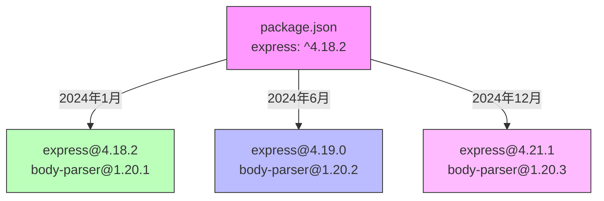
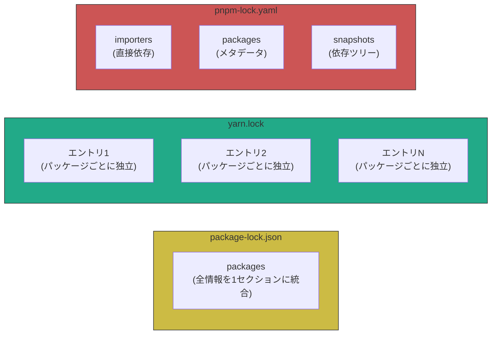
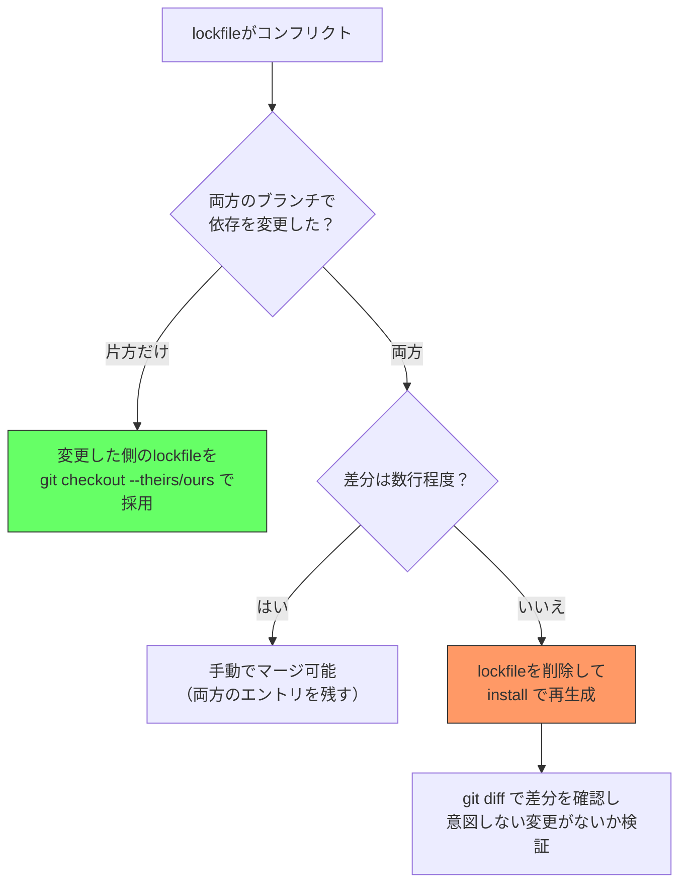

:::message
**この章を読むとできるようになること**
- lockfileが存在する理由を、SemVerの限界から論理的に説明できる
- package-lock.json、yarn.lock、pnpm-lock.yamlの構造を読めるようになる
- lockfileのコンフリクトに遭遇したとき、適切な解消方法を選べる
- `npm ci`と`npm install`の内部動作の違いを理解し、CIで正しく使い分けられる
:::

## 4.1 lockfileが解決する問題

「`npm install`したら動かなくなった」という経験はありませんか？ この問題の根本原因は、**SemVer範囲指定だけでは同じ依存ツリーを再現できない**ことにあります。

`package.json`に書かれている依存関係は、多くの場合こう書かれています。

```json
{
  "dependencies": {
    "express": "^4.18.2"
  }
}
```

`^4.18.2`は「4.18.2以上、5.0.0未満」を意味します。今日`npm install`すると`4.18.2`がインストールされても、来月にはexpressが`4.19.0`をリリースしているかもしれません。同じ`package.json`から、**時期によって異なるバージョン**がインストールされるのです。

さらに厄介なのは、expressが依存しているパッケージ（間接依存）も同じ問題を抱えていることです。expressが`body-parser: ^1.20.0`に依存していれば、body-parserのバージョンも時期によって変わります。



lockfileは、**ある時点で解決された依存ツリー全体のスナップショット**です。直接依存だけでなく、間接依存のすべてのパッケージについて「どのバージョンを、どのURLからダウンロードし、そのファイルのハッシュ値は何か」を記録します。

lockfileがあれば、いつ、どのマシンで`install`しても、バイト単位で同一の`node_modules`が再現されます。

## 4.2 package-lock.json（npm）の構造を読む

npmが生成する`package-lock.json`は、バージョンによって内部構造が進化してきました。

### lockfileVersion の違い

| lockfileVersion | npm バージョン | 特徴 |
|:-:|:-:|:--|
| 1 | npm 5〜6 | `dependencies`フィールドにネスト構造で記録 |
| 2 | npm 7〜8 | `packages`フィールドを追加（v1との後方互換あり） |
| 3 | npm 9〜11 | `packages`のみ（`dependencies`を廃止、ファイルサイズ削減） |

npm 10、11でもlockfileVersion 3が継続使用されています。

現在主流のlockfileVersion 3の構造を見てみましょう。

```json
{
  "name": "my-app",
  "version": "1.0.0",
  "lockfileVersion": 3,
  "requires": true,
  "packages": {
    "": {
      "name": "my-app",
      "version": "1.0.0",
      "dependencies": {
        "express": "^4.18.2"
      }
    },
    "node_modules/express": {
      "version": "4.21.1",
      "resolved": "https://registry.npmjs.org/express/-/express-4.21.1.tgz",
      "integrity": "sha512-YSFlK1Ee0/GC8QaO91tHcDxJiE/X4FbpAyQW...",
      "license": "MIT",
      "dependencies": {
        "accepts": "~1.3.8",
        "body-parser": "1.20.3",
        "content-type": "~1.0.4"
      },
      "engines": {
        "node": ">= 0.10"
      }
    },
    "node_modules/body-parser": {
      "version": "1.20.3",
      "resolved": "https://registry.npmjs.org/body-parser/-/body-parser-1.20.3.tgz",
      "integrity": "sha512-7rAxByjUMqQ3/bHJy7D6OGXvx/MMc4IqB...",
      "license": "MIT"
    }
  }
}
```

各フィールドの役割を理解しておきましょう。

- **`""`（空文字キー）**: プロジェクトのルート自身を表します。`package.json`の内容がここに反映されます
- **`resolved`**: パッケージのダウンロード元URL。npmレジストリ以外のソース（Git、ローカルパスなど）もここに記録されます
- **`integrity`**: ダウンロードしたtarballのSubresource Integrity（SRI）ハッシュ。`sha512-...`形式で、**改ざん検知**に使われます。このハッシュが一致しなければインストールは失敗します
- **`version`**: 実際にインストールされた確定バージョン（SemVer範囲ではなく固定値）
- **`license`**: npm 9以降で追加されたフィールド。ライセンス監査が容易になります

### lockfileVersion 2 との違い

lockfileVersion 2では、`packages`に加えて旧形式の`dependencies`も併記されていました。これはnpm 6以前との互換性のためです。lockfileVersion 3ではこの冗長な`dependencies`が削除され、ファイルサイズが大幅に削減されています。

## 4.3 yarn.lock（Yarn Classic/Berry）の構造を読む

Yarn（ClassicもBerryも）が生成する`yarn.lock`は、**マージフレンドリーな設計**が最大の特徴です。

```yaml
# yarn.lock (Yarn Classic形式)

express@^4.18.2:
  version "4.21.1"
  resolved "https://registry.yarnpkg.com/express/-/express-4.21.1.tgz#9a5f..."
  integrity sha512-YSFlK1Ee0/GC8QaO91tHcDxJiE/X4FbpAy...
  dependencies:
    accepts "~1.3.8"
    body-parser "1.20.3"
    content-type "~1.0.4"

body-parser@1.20.3:
  version "1.20.3"
  resolved "https://registry.yarnpkg.com/body-parser/-/body-parser-1.20.3.tgz#1d83..."
  integrity sha512-7rAxByjUMqQ3/bHJy7D6OGXvx/MMc4IqB...
```

npmの`package-lock.json`と比べると、構造的に重要な違いがあります。

**各エントリが独立している**: `package-lock.json`はJSON形式でネスト構造を持つため、1つのパッケージの変更がインデント全体に波及することがあります。一方、`yarn.lock`は各パッケージエントリが独立したブロックとして記録されるため、Git上で変更差分が局所的になります。これが「マージフレンドリー」と呼ばれる理由です。

**キーにSemVer範囲を含む**: `express@^4.18.2:`のように、要求されたバージョン範囲がキーの一部になっています。同じパッケージでも異なるバージョン範囲から要求されると、複数のエントリが生成されることがあります。

### Yarn Berry（v2+）の変更点

Yarn Berryでは`yarn.lock`のフォーマットが更新されています。

```yaml
# yarn.lock (Yarn Berry形式)

"express@npm:^4.18.2":
  version: 4.21.1
  resolution: "express@npm:4.21.1"
  checksum: 10/abc123def456...
  dependencies:
    accepts: "~1.3.8"
    body-parser: "1.20.3"
  languageName: node
  linkType: hard
```

`resolution`フィールドで解決先を明示し、`checksum`でキャッシュのハッシュを記録する形式に変わっています。

## 4.4 pnpm-lock.yaml（pnpm）の構造を読む

pnpmのlockfileは**YAML形式**で、3つの明確なセクションに分かれています。

```yaml
# pnpm-lock.yaml

lockfileVersion: '9.0'

settings:
  autoInstallPeers: true
  excludeLinksFromLockfile: false

importers:
  .:
    dependencies:
      express:
        specifier: ^4.18.2
        version: 4.21.1

packages:
  express@4.21.1:
    resolution: {integrity: sha512-YSFlK1Ee0/GC8QaO91tHcDxJiE/...}
    engines: {node: '>= 0.10'}

  body-parser@1.20.3:
    resolution: {integrity: sha512-7rAxByjUMqQ3/bHJy7D6OGXvx/...}
    engines: {node: '>= 0.10'}

snapshots:
  express@4.21.1:
    dependencies:
      accepts: 1.3.8
      body-parser: 1.20.3
      content-type: 1.0.5
```

3つのセクションの役割は以下の通りです。

- **`importers`**: プロジェクト（モノレポの場合は各ワークスペース）が直接依存しているパッケージの一覧。`specifier`がpackage.jsonに書かれた範囲指定、`version`が実際に解決されたバージョンです
- **`packages`**: すべてのパッケージのメタデータ（integrityハッシュ、engines制約など）。依存関係の情報は含みません
- **`snapshots`**: 各パッケージの**実際の依存ツリー**。どのバージョンのパッケージがどのバージョンの依存を使うかがここで確定します

この3セクション分離はpnpm独自の設計です。`packages`セクションはパッケージの「身分証明書」で、`snapshots`セクションは「誰と一緒にインストールされるか」を記録しています。分離することで、同じパッケージが異なるコンテキストで異なる依存を持つ場合にも対応できます。

### 3つのlockfile構造の比較



## 4.5 lockfileのコンフリクト解消テクニック

チーム開発でlockfileのコンフリクトは日常的に発生します。2つの対処法があり、状況に応じて使い分けます。

### 方法1: 削除して再生成（推奨される場面が多い）

```bash
# Gitのコンフリクトマーカーを含むlockfileを削除して再生成
git checkout --theirs package-lock.json  # まず片方を採用
npm install                               # package.jsonから再解決

# yarnの場合
git checkout --theirs yarn.lock
yarn install

# pnpmの場合
git checkout --theirs pnpm-lock.yaml
pnpm install
```

**この方法が有効な場面**: 両方のブランチで依存を追加・更新しており、lockfileの差分が大きい場合。手動マージは非現実的です。

### 方法2: 手動マージ

**この方法が有効な場面**: 一方のブランチではlockfileの変更がなく、もう一方だけが依存を追加した場合。この場合は依存を追加した側のlockfileをそのまま採用（`--theirs`または`--ours`）すれば解決します。

### 判断基準のフローチャート



:::message
**注意**: lockfileを再生成すると、間接依存のバージョンが変わる可能性があります。再生成後は必ずテストを実行して、動作に影響がないか確認してください。
:::

## 4.6 npm ci vs npm install の内部動作の違い

CIパイプラインで`npm install`と`npm ci`のどちらを使うべきか。この問いに正確に答えるには、両者の内部動作の違いを理解する必要があります。

### npm install の動作

1. `package.json`を読む
2. `package-lock.json`が存在すれば**参考にする**（ただし絶対ではない）
3. `package.json`のSemVer範囲を満たす最新バージョンを解決する
4. lockfileの記録と矛盾しなければlockfileのバージョンを採用し、矛盾すれば**lockfileを更新する**
5. `node_modules`に差分インストールする（既存のパッケージは残す）

### npm ci の動作

1. `package-lock.json`を読む（**存在しなければエラーで終了**）
2. `package.json`との整合性を検証する（不整合ならエラーで終了）
3. `node_modules`を**完全に削除**する
4. lockfileに記録されたバージョンを**そのままインストール**する（再解決しない）
5. lockfileは**一切変更しない**

```bash
# ローカル開発: 新しいパッケージの追加・更新
npm install express        # package.jsonとlockfileの両方を更新

# CI環境: 再現可能なインストール
npm ci                     # lockfileを厳密に再現、lockfileは変更しない
```

両者の違いをまとめると、こうなります。

| 観点 | npm install | npm ci |
|:--|:--|:--|
| lockfileの扱い | 参考にする（更新もする） | 厳密に従う（変更しない） |
| node_modules | 差分インストール | 全削除して再構築 |
| lockfileがない場合 | 新規作成する | エラーで終了 |
| 用途 | ローカル開発 | CI/CD、チームの環境統一 |
| 速度 | 差分が少なければ速い | node_modules削除分のオーバーヘッドあり |

:::message
Yarnでは`yarn install --frozen-lockfile`（Classic）または`yarn install --immutable`（Berry）が`npm ci`に相当します。pnpmでは`pnpm install --frozen-lockfile`です。
:::

## ミニ実験: lockfileを削除して再インストールし、差分を確認する

実際にlockfileの役割を体感してみましょう。

```bash
# 1. 適当なプロジェクトを作成
mkdir lockfile-experiment && cd lockfile-experiment
npm init -y
npm install express@4.18.2

# 2. lockfileの中身を確認（expressの解決バージョンを見る）
cat package-lock.json | grep -A2 '"express"'

# 3. lockfileのバックアップを取る
cp package-lock.json package-lock.backup.json

# 4. lockfileを削除して再インストール
rm package-lock.json
npm install

# 5. 差分を比較する
diff package-lock.backup.json package-lock.json
```

`express@4.18.2`を固定バージョンで入れた場合でも、expressが依存している間接パッケージ（body-parser、qs、cookie等）のバージョンが変わっている可能性があります。特に実験時点で間接依存の新バージョンがリリースされていれば、差分が発生するのを確認できるはずです。

これが「lockfileがなければ再現可能なインストールは保証されない」という意味です。

## 章末クイズ

**Q1**: `package-lock.json`の`integrity`フィールドは何のために存在しますか？

:::details 答え
ダウンロードしたパッケージのtarballが改ざんされていないかを検証するためです。`sha512`ハッシュをSubresource Integrity（SRI）形式で記録し、実際にダウンロードしたファイルのハッシュと照合します。一致しない場合、インストールはエラーで停止します。
:::

**Q2**: CIパイプラインで`npm install`ではなく`npm ci`を使うべき理由を2つ挙げてください。

:::details 答え
1. `npm ci`はlockfileを厳密に再現するため、開発者のローカル環境とCIで同一の依存ツリーが保証されます。`npm install`はlockfileを更新する可能性があり、意図しないバージョン変更が混入するリスクがあります。
2. `npm ci`はlockfileと`package.json`の不整合をエラーとして検知するため、lockfileの更新忘れを早期に発見できます。
:::

**Q3**: pnpm-lock.yamlが`packages`と`snapshots`を分離している設計上の利点は何ですか？

:::details 答え
同じパッケージが異なるコンテキスト（異なるpeer dependencyの組み合わせなど）で異なる依存を持つ場合に対応できます。`packages`セクションにはパッケージのメタデータ（integrityハッシュ等）を1回だけ記録し、`snapshots`セクションでコンテキストごとの依存ツリーを記録することで、情報の重複を避けつつ正確な依存解決を表現できます。
:::
