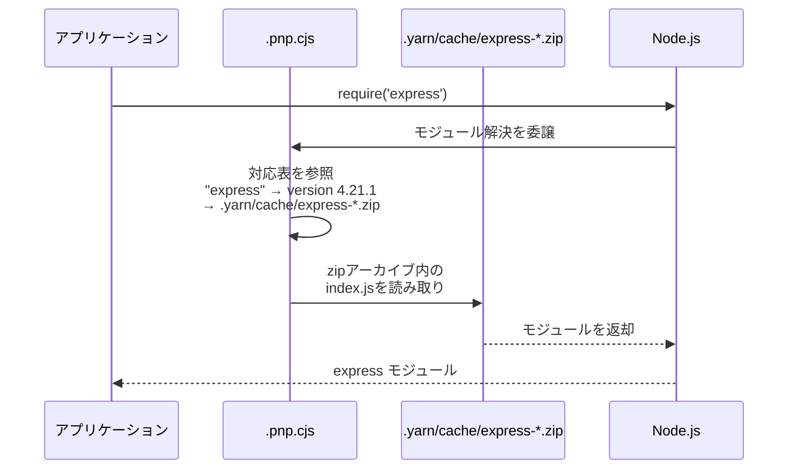
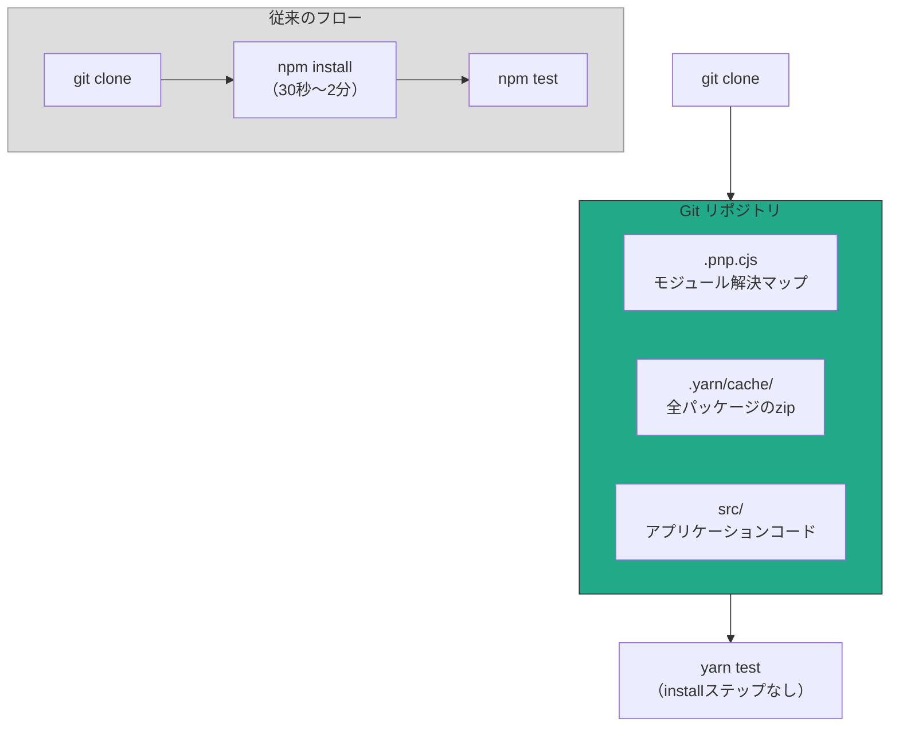

:::message
**この章を読むとできるようになること**
- Yarn Classicがnpmに対してどのような改善をもたらしたかを説明できる
- Yarn Berry（v2+）のPlug'n'Play（PnP）が`node_modules`を不要にする仕組みを理解できる
- Zero-Installsの概念とその実現方法を把握し、導入の判断ができる
- PnPの互換性問題に直面したときの対処法を知っている
- Yarn 6の方向性を理解し、今後の技術選定に活かせる
:::

## 5.1 Yarn Classicが改善したこと

2016年にFacebookが公開したYarn（現在のYarn Classic、v1系）は、当時のnpmが抱えていた3つの大きな問題を解決しました。

**1. 並列ダウンロード**

npm v3以前はパッケージを1つずつ順番にダウンロードしていました。Yarn Classicは複数パッケージの**並列ダウンロード**を実装し、インストール速度を劇的に改善しました。

**2. オフラインキャッシュ**

Yarn Classicはダウンロードしたパッケージをローカルキャッシュに保存し、2回目以降はネットワークアクセスなしでインストールできるようにしました。

```bash
# キャッシュの場所を確認
yarn cache dir
# 例: /Users/username/Library/Caches/Yarn/v6

# キャッシュをクリア
yarn cache clean
```

**3. yarn.lockの導入**

3章で触れた通り、npmがlockfile（`package-lock.json`）を導入したのはnpm 5（2017年）からです。Yarn Classicは初期リリースから`yarn.lock`を生成し、再現可能なインストールを保証していました。

これらの改善は非常に強力で、npmもYarnの設計を取り入れて急速に進化しました。並列ダウンロード、lockfile、キャッシュ──現在のnpmが備えている機能の多くは、Yarnの刺激を受けて実装されたものです。

## 5.2 Yarn Berry（v2+）の設計思想

2020年にリリースされたYarn Berry（v2）は、Yarn Classicとは完全に別のコードベースで書き直されたプロジェクトです。その根底にあるのは、**node_modules自体が問題の根源である**という発想の転換でした。

3章で見た通り、`node_modules`には構造的な問題があります。

- **Phantom Dependency**: 宣言していないパッケージが使えてしまう
- **ディスク浪費**: 同じパッケージが複数コピーされる
- **I/O性能**: 数万ファイルの読み書きが遅い
- **不確定性**: hoistingの結果がインストール順序に依存する

Yarn Classicも含め、npmやpnpmはこれらの問題を`node_modules`の構造を**工夫する**ことで緩和しようとしています。Yarn Berryは別のアプローチを取りました。`node_modules`を作るのをやめよう、と。

## 5.3 Plug'n'Play（PnP）の仕組み

Yarn BerryのデフォルトのインストールモードであるPlug'n'Play（PnP）は、`node_modules`ディレクトリを完全に廃止します。代わりに、`.pnp.cjs`という1つのJavaScriptファイルがモジュール解決を担います。

### .pnp.cjs がやっていること

PnPモードで`yarn install`を実行すると、以下が生成されます。

- **`.pnp.cjs`**: モジュール解決マップ。どのパッケージがどのバージョンのどの依存を使えるかの完全な対応表
- **`.yarn/cache/`**: 各パッケージのzipアーカイブ（例: `express-npm-4.21.1-abc123.zip`）

`.pnp.cjs`はNode.jsの起動時に読み込まれ、**`fs`モジュールをmonkey-patchします**。monkey-patchとは、既存のモジュールの関数を実行時に別の実装で上書きする手法です。PnPの場合、`fs.readFileSync`などのファイル読み取り関数が上書きされ、zipアーカイブ内のファイルを透過的に読み取れるようになります。

通常のNode.jsでは`require('express')`が呼ばれると、`node_modules`ディレクトリを階層的に探索します。PnPではこの探索が`.pnp.cjs`の対応表によるルックアップに置き換わります。



重要なのは、**パッケージがzipファイルから直接読み込まれる**点です。展開して`node_modules`に配置するステップが不要なため、インストールが高速になります。

### PnPの厳格性

PnPモードでは、`package.json`に宣言されていないパッケージを`require`しようとすると即座にエラーになります。

```bash
# expressを依存宣言していないのにrequireすると...
$ node -e "require('express')"
Error: express tried to access a package it doesn't declare in its dependencies
```

これは3章で説明したPhantom Dependencyの問題を根本から解決します。npmのフラットな`node_modules`では偶然動いてしまうコードが、PnPでは正しくエラーになります。

### .pnp.cjs の中身（抜粋）

`.pnp.cjs`の内部は巨大ですが、本質的には「パッケージ名 + バージョン → zipファイルのパス + 許可された依存リスト」のマッピングです。

```javascript
// .pnp.cjs の概念的な構造（実際はバイナリ最適化されています）
["express", [
  ["npm:4.21.1", {
    packageLocation: "./.yarn/cache/express-npm-4.21.1-abc123.zip/node_modules/express/",
    packageDependencies: [
      ["accepts", "npm:1.3.8"],
      ["body-parser", "npm:1.20.3"],
      // ...
    ],
  }],
]],
```

## 5.4 Zero-Installs: npm installが不要になる世界

PnPの仕組みを活かした運用が**Zero-Installs**です。考え方はシンプルで、`.pnp.cjs`と`.yarn/cache/`をGitリポジトリにコミットしてしまいます。

```bash
# .gitignoreに追加しない（= コミット対象にする）
.pnp.cjs
.yarn/cache/

# .gitignoreに追加する
.yarn/install-state.gz
```

Zero-Installsのメリットは明確です。

**1. CIからinstallステップを排除できる**

```yaml
# 従来のCI設定
steps:
  - checkout
  - run: npm ci          # ← この30秒〜2分が不要になる
  - run: npm test

# Zero-InstallsのCI設定
steps:
  - checkout
  - run: yarn test       # ← すぐにテスト実行
```

**2. クローン直後に動く**

新しいチームメンバーがリポジトリをクローンした瞬間、`yarn install`を実行せずにすぐ開発を始められます。

**3. ネットワーク障害に強い**

すべてのパッケージがリポジトリに含まれているため、npmレジストリがダウンしていても影響を受けません。

### Zero-Installsのトレードオフ

当然ながらデメリットもあります。

- **リポジトリサイズの増加**: zipアーカイブがリポジトリに含まれるため、`git clone`のサイズが数十MB〜数百MB増加します
- **Git差分の見づらさ**: パッケージを更新すると、zipファイルのバイナリ差分がコミットに含まれます
- **ネイティブモジュール**: C++拡張を含むパッケージ（node-gypで ビルドが必要なもの）はzipに含められないため、完全なZero-Installsにはなりません



## 5.5 PnPの代償と互換性問題

PnPの理想は美しいのですが、現実には**node_modulesの存在を前提とするツール**が数多く存在します。

### よくある非互換パターン

- **`__dirname`でnode_modules内のファイルパスを構築するツール**: PnPではzipアーカイブ内にファイルがあるため、ファイルパスの前提が崩れます
- **`fs.readFileSync`でnode_modules配下を直接読むツール**: PnPの`fs`パッチを通さないアクセスは失敗します
- **postinstallスクリプトでバイナリをビルドするパッケージ**: esbuild、swcなどのネイティブバイナリは、PnPのzip展開と相性が悪い場合があります

### nodeLinkerによるフォールバック

互換性問題が解決できない場合、Yarn Berryでは`.yarnrc.yml`で`nodeLinker`設定を変更できます。

```yaml
# .yarnrc.yml

# PnP（デフォルト）
nodeLinker: pnp

# node_modulesを生成するモード（pnpmと似た構造）
nodeLinker: node-modules

# pnpmスタイルのシンボリックリンク構造
nodeLinker: pnpm
```

`nodeLinker: node-modules`に設定すると、従来通りの`node_modules`ディレクトリが生成されます。PnPの恩恵は受けられなくなりますが、ほぼすべてのツールと互換性があります。

実際のところ、多くのプロジェクトでは`nodeLinker: node-modules`を指定してYarn Berryを使っているのが現状です。PnPの思想に共感しつつも、互換性問題の解決コストが高いためです。

## 5.6 Yarn 6プレビュー: Rustへの書き換え

2026年1月、Yarn 6のプレビュー版が公開されました。最大の変更点は**コアのRustへの書き換え**です。

### なぜRustなのか

Yarn Berryはすべてが自分自身（JavaScript/TypeScript）で書かれていることが特徴でしたが、パフォーマンスの天井に達していました。特に以下の処理でJavaScriptの限界が顕在化していました。

- **依存解決アルゴリズム**: 数千パッケージの制約を同時に解くSAT問題的な処理
- **ファイルI/O**: 大量のzipアーカイブの読み書き
- **ハッシュ計算**: integrityチェックのためのSHA-512計算

Rustへの書き換えにより、これらの処理が数倍〜数十倍高速化されることが期待されています。

### Corepack廃止への対応: Yarn Switch

Node.js本体にバンドルされていたCorepackは、Node.js 25以降でバンドルされないことが決定しています。Yarnは既存の `yarn set version` コマンドでCorepackに依存せずバージョン管理ができるため、影響は限定的です。

```bash
# yarn set version でバージョンを管理
yarn set version 6.0.0    # プロジェクトに特定のYarnバージョンを固定
```

### アーキテクチャの進化

```mermaid
graph LR
    subgraph classic["Yarn Classic (v1)"]
        C1["JavaScript"]
        C2["node_modules生成"]
        C3["yarn.lock"]
    end

    subgraph berry["Yarn Berry (v2-v4)"]
        B1["TypeScript<br/>(自己ホスティング)"]
        B2["PnP / zip アーカイブ"]
        B3["プラグインシステム"]
        B4["Zero-Installs"]
    end

    subgraph six["Yarn 6 (preview)"]
        S1["Rust コア"]
        S2["PnP 継続"]
        S3["yarn set version"]
        S4["パフォーマンス大幅向上"]
    end

    classic -->|"2020年<br/>完全書き直し"| berry
    berry -->|"2026年<br/>Rust移行"| six

    style classic fill:#ccc,stroke:#333
    style berry fill:#2a8,stroke:#333
    style six fill:#c55,stroke:#333
```



Yarn 6はまだプレビュー段階であり、プロダクション利用には時期尚早ですが、パッケージマネージャの進化の方向性を示しています。JavaScript/TypeScriptで書かれていたツールがRustで書き直される流れは、Biome（元Rome）、Turbopack、Oxcなど、フロントエンドツールチェーン全体で加速しています。

## 章末クイズ

**Q1**: Yarn BerryのPnPモードで、`require('express')`を実行したとき、モジュール解決はどのように行われますか？

:::details 答え
Node.jsの`fs`モジュールが`.pnp.cjs`によってmonkey-patchされているため、通常の`node_modules`ディレクトリ探索の代わりに、`.pnp.cjs`内のモジュール解決マップが参照されます。マップにはパッケージ名とバージョンから`.yarn/cache/`内のzipアーカイブへの対応が記録されており、zipファイルから直接モジュールが読み込まれます。`node_modules`ディレクトリは使われません。
:::

**Q2**: Zero-Installsを採用するメリットとデメリットをそれぞれ1つ挙げてください。

:::details 答え
**メリット**: CIパイプラインからinstallステップを排除でき、ビルド時間が短縮されます（30秒〜2分の削減）。`git clone`直後にアプリケーションを実行できます。

**デメリット**: リポジトリサイズが大幅に増加します。すべてのパッケージのzipアーカイブがGitリポジトリに含まれるため、`git clone`が遅くなり、リポジトリの総容量が数十MB〜数百MB増えます。
:::

**Q3**: Yarn BerryでPnPの互換性問題に遭遇したとき、最も手軽な回避策は何ですか？

:::details 答え
`.yarnrc.yml`に`nodeLinker: node-modules`を設定することです。これにより、Yarn Berryの機能（ワークスペース管理、プラグインシステム等）を使いつつ、従来通りの`node_modules`ディレクトリが生成されるようになります。PnPの性能メリットは失われますが、ほぼすべてのNode.jsツールとの互換性が確保されます。
:::
