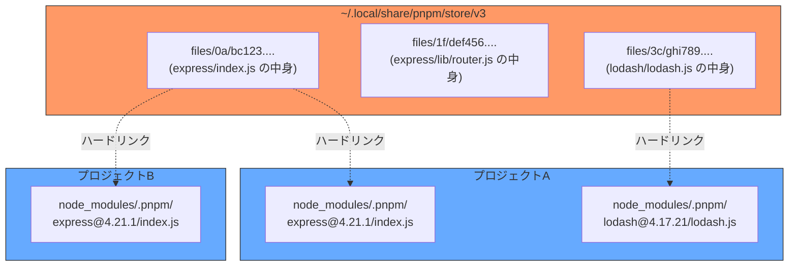
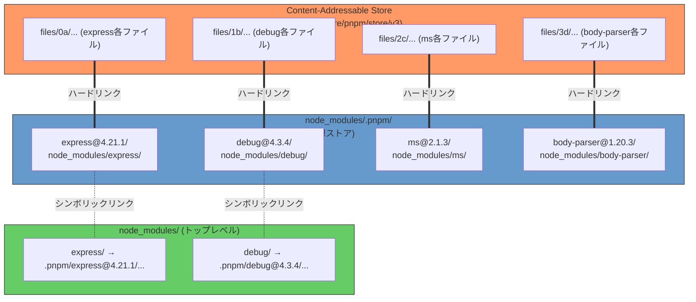

:::message
**この章を読むとできるようになること**
- pnpmが`node_modules`を残しつつ、その問題を解決するアプローチを説明できる
- Content-Addressable Store（CAS）の仕組みを理解し、他の技術（Git、Docker）との共通点を語れる
- ハードリンクとシンボリックリンクの違いを理解し、pnpmがそれぞれをどう使い分けているか説明できる
- Phantom Dependencyがpnpmで防がれる仕組みを具体的に理解できる
- pnpm v10の主要な変更点を把握している

この章ではハードリンクとシンボリックリンクを多用します。これらの概念に不安がある方は、第3章末のコラム「ファイルシステムの基礎」を先にお読みください。
:::

## 6.1 pnpmの設計思想

前章で見たYarn Berryは「`node_modules`を廃止する」という大胆なアプローチを取りました。pnpmは対照的に、**`node_modules`は残すが、その中身の作り方を根本から変える**というアプローチを取ります。

この設計判断には明確な理由があります。`node_modules`を廃止すると、Node.jsの標準的なモジュール解決アルゴリズムとの互換性が失われ、既存ツールとの非互換が頻発します（Yarn BerryのPnPが直面した問題です）。pnpmは互換性を維持しつつ、`node_modules`の構造的な問題を解決する道を選びました。

pnpmが解決する問題は3つです。

1. **ディスクの浪費**: 同じパッケージが複数プロジェクトにコピーされる
2. **Phantom Dependency**: 宣言していない間接依存が使えてしまう
3. **インストール速度**: 大量ファイルのコピーが遅い

これらを**Content-Addressable Store**、**ハードリンク**、**シンボリックリンク**の3つの技術で解決します。

## 6.2 Content-Addressable Store（CAS）とは何か

pnpmの中核にあるのが**Content-Addressable Store（CAS、コンテンツアドレス可能ストア）**です。

通常のファイル保存は「名前でアクセス」します。`/Users/me/project/node_modules/express/index.js`のように、ファイルパス（名前）でファイルを特定します。CASは逆で、**ファイルの中身（コンテンツ）のハッシュ値でアクセス**します。

```bash
# pnpmのストアの場所を確認
pnpm store path
# 例: /Users/username/.local/share/pnpm/store/v3

# ストアの中身を見てみる
ls ~/.local/share/pnpm/store/v3/files/
# 00/ 01/ 02/ ... fe/ ff/
# → ハッシュ値の先頭2文字でディレクトリが分かれている
```

ストア内のファイルは、ファイル内容のSHA-512ハッシュの先頭2文字をディレクトリ名とし、残りをファイル名として保存されます。同じ内容のファイルは必ず同じハッシュになるため、**重複保存が原理的に発生しません**。



### 他の技術との共通設計パターン

CASはpnpm独自の発明ではなく、ソフトウェアの世界で広く使われている設計パターンです。

- **Git**: オブジェクトストア。すべてのファイル（blob）、ディレクトリ（tree）、コミットがSHA-1ハッシュで管理されます。`git cat-file -p abc123`のように、ハッシュでコンテンツにアクセスします
- **Docker**: イメージレイヤー。各レイヤーはコンテンツのハッシュで識別され、異なるイメージ間で同一レイヤーが共有されます
- **IPFS**: コンテンツIDでファイルを特定する分散ファイルシステム

いずれも「同じ内容は1回だけ保存し、参照で共有する」という原則に基づいています。

## 6.3 ハードリンクとシンボリックリンクの使い分け

pnpmの`node_modules`構造を理解するには、ハードリンクとシンボリックリンクの違いを正確に把握する必要があります。

### ハードリンクとは

ハードリンクは、**同一のinode（ファイルの実体）に対する別名**です。ファイルをコピーすると中身が複製されてディスクを消費しますが、ハードリンクは同じ実体を指す「入口」が増えるだけです。

```bash
# ハードリンクの作成
ln original.txt hardlink.txt

# 同じinodeを共有していることを確認
ls -li original.txt hardlink.txt
# 12345678 -rw-r--r-- 2 user staff 100  original.txt
# 12345678 -rw-r--r-- 2 user staff 100  hardlink.txt
# ↑ inode番号が同じ    ↑ リンク数が2
```

### シンボリックリンクとは

シンボリックリンクは、**別のファイルパスを指すポインタ**です。ハードリンクと異なり、リンク先が削除されると「壊れたリンク」になります。

```bash
# シンボリックリンクの作成
ln -s /path/to/original.txt symlink.txt

# リンク先を確認
ls -la symlink.txt
# lrwxr-xr-x  1 user staff  25  symlink.txt -> /path/to/original.txt
```

### pnpmでの使い分け

pnpmは、ストアとプロジェクトの`node_modules`を接続するために、この2種類のリンクを**意図的に使い分けて**います。

- **ストア → `.pnpm/`**: **ハードリンク**（inode共有でディスク節約）
- **`.pnpm/` → `node_modules/`トップレベル**: **シンボリックリンク**（互換性確保）

なぜストアとの接続にシンボリックリンクではなくハードリンクを使うのでしょうか？ Node.jsには`--preserve-symlinks`フラグに関連する問題があります。シンボリックリンクの場合、Node.jsがモジュールの「本当の場所」を`realpath()`で解決しようとし、パッケージが自分の場所を正しく認識できなくなるケースがあります。ハードリンクなら各ファイルが「そこにある」のと同じ扱いになるため、この問題が発生しません。

### 2段構造の全体図

具体例で見てみましょう。`express`と`debug`を直接依存として持つプロジェクトの場合です。



**太線（ハードリンク）**: ストアから`.pnpm/`内の各パッケージディレクトリへ。ファイルの実体はストアに1つだけ存在し、ディスクを節約します。

**点線（シンボリックリンク）**: `.pnpm/`からトップレベルの`node_modules/`へ。`require('express')`がNode.jsの標準的な解決アルゴリズムで動作するようにします。

注目すべきは、`ms`（debugの依存）や`body-parser`（expressの依存）がトップレベルに**存在しない**ことです。これが次のセクションで説明するPhantom Dependencyの根絶につながります。

## 6.4 厳格なnode_modules構造: Phantom Dependencyの根絶

npmのフラットな`node_modules`では、すべてのパッケージがトップレベルに配置されます。そのため、`package.json`に宣言していない間接依存も`require`できてしまいます。

pnpmでは、**トップレベルに配置されるのは直接依存だけ**です。

```bash
# npmの場合のnode_modules（フラット構造）
node_modules/
├── express/           # 直接依存
├── body-parser/       # expressの依存 → requireできてしまう！
├── debug/             # expressの依存 → requireできてしまう！
├── ms/                # debugの依存 → requireできてしまう！
└── qs/                # expressの依存 → requireできてしまう！

# pnpmの場合のnode_modules（厳格な構造）
node_modules/
├── express -> .pnpm/express@4.21.1/node_modules/express   # 直接依存のみ
└── .pnpm/
    ├── express@4.21.1/
    │   └── node_modules/
    │       ├── express/          # パッケージ本体
    │       ├── body-parser -> ../../body-parser@1.20.3/node_modules/body-parser
    │       ├── debug -> ../../debug@4.3.4/node_modules/debug
    │       └── qs -> ../../qs@6.13.0/node_modules/qs
    ├── body-parser@1.20.3/
    │   └── node_modules/
    │       └── body-parser/      # パッケージ本体
    ├── debug@4.3.4/
    │   └── node_modules/
    │       ├── debug/            # パッケージ本体
    │       └── ms -> ../../ms@2.1.3/node_modules/ms
    └── ms@2.1.3/
        └── node_modules/
            └── ms/               # パッケージ本体
```

この構造では、アプリケーションのコードから`require('body-parser')`を実行すると、Node.jsは`node_modules/body-parser`を探しますが見つかりません。`body-parser`は`.pnpm/express@4.21.1/node_modules/body-parser`にしか存在しないためです。

一方、express自身が`require('body-parser')`を実行する場合は、`.pnpm/express@4.21.1/node_modules/`の中にシンボリックリンクが張られているため正常に解決されます。Node.jsのモジュール解決は「そのファイルがある`node_modules`を起点に探す」ため、expressのコードからは`body-parser`が見え、アプリケーションのコードからは見えない──という厳格な分離が実現します。

## 6.5 ディスク使用量の劇的な削減

CASとハードリンクの組み合わせにより、pnpmは**プロジェクト数に関係なく、同じパッケージを1回だけ保存**します。

具体的な数字で見てみましょう。10個のプロジェクトがすべて`lodash@4.17.21`を使っている場合を考えます。

```
# npmの場合
project-1/node_modules/lodash/  → 1.4MB
project-2/node_modules/lodash/  → 1.4MB
...
project-10/node_modules/lodash/ → 1.4MB
合計: 14MB

# pnpmの場合
~/.local/share/pnpm/store/v3/   → 1.4MB（実体は1つ）
project-1/node_modules/.pnpm/lodash@4.17.21/  → ハードリンク（追加容量ほぼゼロ）
project-2/node_modules/.pnpm/lodash@4.17.21/  → ハードリンク（追加容量ほぼゼロ）
...
project-10/node_modules/.pnpm/lodash@4.17.21/ → ハードリンク（追加容量ほぼゼロ）
合計: 約1.4MB
```

プロジェクト数が増えるほど節約効果は大きくなります。フロントエンドの開発環境では、1プロジェクトあたりの`node_modules`が200MB〜1GBになることも珍しくありません。10プロジェクトを並行で持てば、npmでは2GB〜10GBのディスクを消費しますが、pnpmなら数百MBで済みます。

```bash
# ストアの使用量を確認
du -sh $(pnpm store path)

# 不要なパッケージをストアから削除
pnpm store prune
```

## 6.6 pnpm v10の新機能

2025年1月にリリースされたpnpm v10では、セキュリティと安全性に関する重要な変更が入りました。

### postinstallスクリプトのデフォルト無効化

pnpm v10では、パッケージの`postinstall`スクリプトが**デフォルトで実行されなくなりました**。

`postinstall`スクリプトはパッケージのインストール完了後に自動実行されるシェルコマンドで、ネイティブモジュールのビルドなどに使われます。しかし、サプライチェーン攻撃の格好の標的でもありました。悪意あるコードを`postinstall`に仕込むことで、`npm install`を実行しただけで任意のコマンドが実行されてしまう攻撃が実際に発生しています。

```json
// package.json の pnpm フィールドで明示的に許可するパッケージを指定
{
  "pnpm": {
    "onlyBuiltDependencies": ["esbuild", "sharp", "bcrypt"]
  }
}
```

信頼できるパッケージだけを明示的にホワイトリストに追加する「opt-in」モデルに移行しました。

:::message
pnpm v10.26以降では `onlyBuiltDependencies` は `allowBuilds` に置き換えられています。新規プロジェクトでは `allowBuilds` を使用してください。
```json
{
  "pnpm": {
    "allowBuilds": ["esbuild", "sharp", "bcrypt"]
  }
}
```
:::

### minimumReleaseAge

`minimumReleaseAge`は、**公開から一定期間経過していないパッケージのインストールを拒否する**機能です。

```ini
# .npmrc
minimum-release-age=3d
```

この設定により、公開から3日以内のパッケージバージョンはインストールされません。サプライチェーン攻撃の多くは公開直後に発見・削除されるため、時間的なバッファを設けることでリスクを大幅に軽減できます。

### Global Virtual Store

v10ではGlobal Virtual Store機能も導入されました。従来は各プロジェクトの`node_modules/.pnpm/`ディレクトリにハードリンクを張る構造でしたが、Global Virtual Storeではこの中間ディレクトリすら共有し、さらなるディスク節約とインストール高速化を実現します。

## ミニ実験: シンボリックリンクの実体を確認する

pnpmの2段構造を実際に確認してみましょう。

```bash
# 1. 実験用プロジェクトを作成
mkdir pnpm-experiment && cd pnpm-experiment
pnpm init
pnpm add express

# 2. トップレベルのnode_modulesを確認（シンボリックリンク）
ls -la node_modules/
# express -> .pnpm/express@4.21.1/node_modules/express
# ↑ シンボリックリンクであることを確認

# 3. .pnpm配下の構造を確認
ls node_modules/.pnpm/express@4.21.1/node_modules/
# express/           ← パッケージ本体（ハードリンク）
# accepts -> ../../accepts@1.3.8/node_modules/accepts
# body-parser -> ../../body-parser@1.20.3/node_modules/body-parser
# ...               ← expressの依存はここにシンボリックリンクで配置

# 4. ハードリンクであることを確認（inode番号が一致）
ls -i node_modules/.pnpm/express@4.21.1/node_modules/express/index.js
ls -i $(pnpm store path)/files/??/*  # ストア内のファイルと比較

# 5. Phantom Dependencyが防がれていることを確認
node -e "require('body-parser')"
# Error: Cannot find module 'body-parser'
# → トップレベルにないため、requireできない

node -e "require('express')"
# → 正常に読み込める（トップレベルにシンボリックリンクがある）
```

ステップ5が最も重要です。npmでは`express`をインストールすれば`body-parser`も`require`できてしまいますが、pnpmでは直接依存として宣言していないパッケージは読み込めません。これがPhantom Dependencyの根絶です。

## 章末クイズ

**Q1**: pnpmのContent-Addressable Storeで、ファイルの保存先はどのように決まりますか？

:::details 答え
ファイルの内容のSHA-512ハッシュ値によって決まります。ハッシュ値の先頭2文字がディレクトリ名、残りがファイル名として使われます。同じ内容のファイルは必ず同じハッシュになるため、重複保存が原理的に発生しません。この設計はGitのオブジェクトストアやDockerのイメージレイヤーと同じ「Content-Addressable」パターンです。
:::

**Q2**: pnpmがストアから`.pnpm/`へハードリンクを使い、`.pnpm/`からトップレベル`node_modules/`へシンボリックリンクを使う理由は何ですか？

:::details 答え
ストアとの接続にハードリンクを使う理由は、ディスク使用量をゼロに近づけつつ、Node.jsの`--preserve-symlinks`に関連する問題（`realpath()`でモジュールの場所が変わってしまう問題）を回避するためです。トップレベルへの配置にシンボリックリンクを使う理由は、Node.jsの標準的なモジュール解決アルゴリズム（`node_modules`を親ディレクトリに向かって探索する）と互換性を保つためです。
:::

**Q3**: pnpm v10で`postinstall`スクリプトがデフォルト無効化された理由と、必要なパッケージで有効化する方法を説明してください。

:::details 答え
`postinstall`スクリプトは`npm install`時に自動実行されるため、サプライチェーン攻撃の標的になりやすい機能です。悪意あるパッケージが`postinstall`に攻撃コードを仕込むことで、インストールしただけで任意のコマンドが実行される事例が実際に発生しています。pnpm v10ではこれをデフォルトで無効化し、必要なパッケージだけを`onlyBuiltDependencies`（v10.26以降は`allowBuilds`）設定でホワイトリスト指定する「opt-in」モデルに変更しました。
:::
