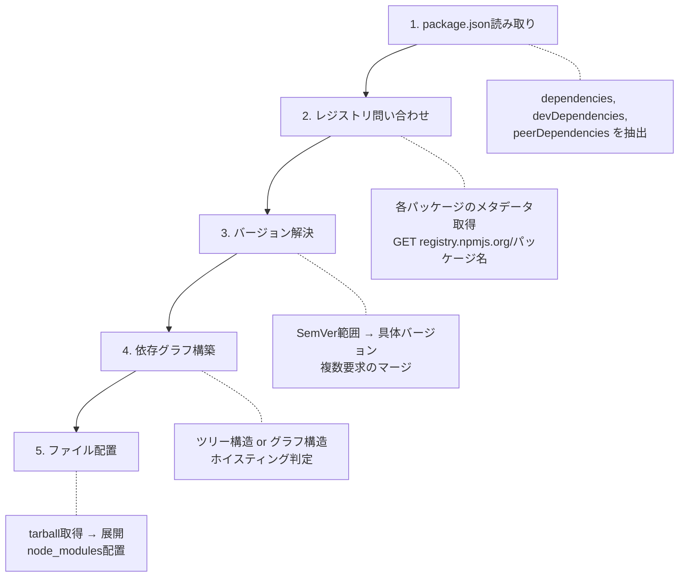
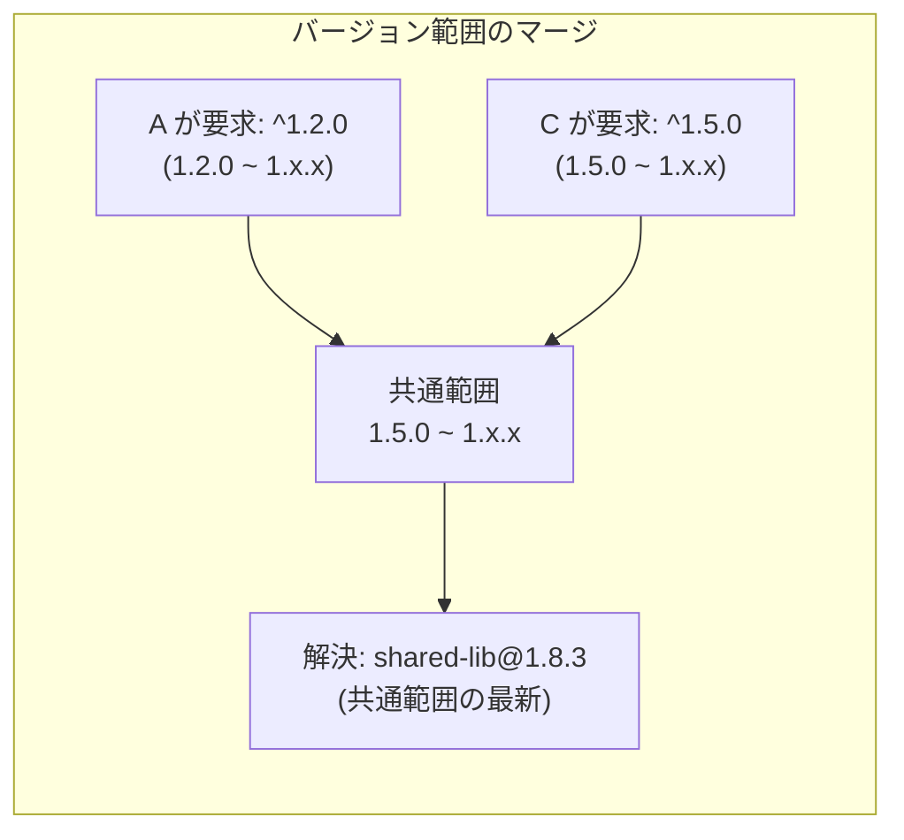
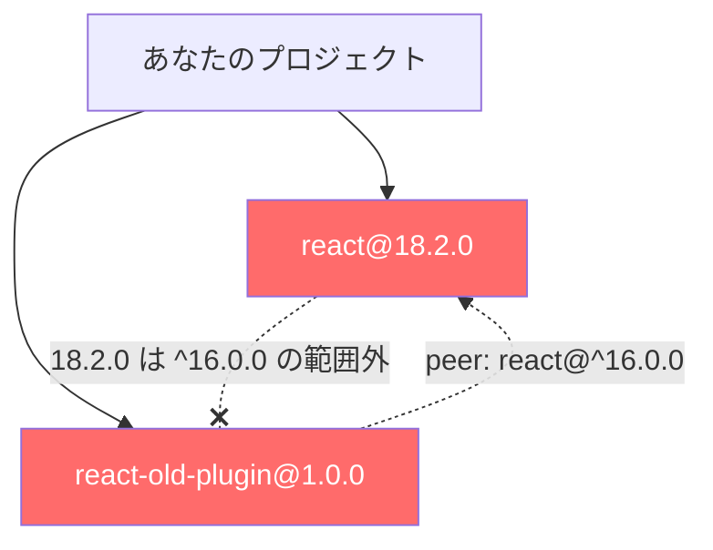
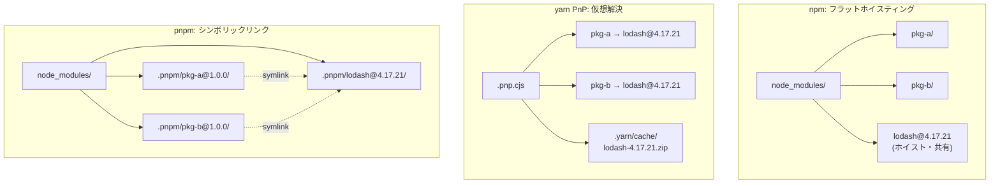

:::message
**この章を読むとできるようになること**
- `npm install` が裏側で実行している5つのステップを正確に説明できる
- SemVerの範囲指定から具体バージョンが決まる仕組みを理解できる
- peer dependencyのエラーに自信を持って対処できる
- ERESOLVE、peer dep conflictなどの代表的エラーの原因を特定して解決できる
- npm / yarn / pnpm の依存解決戦略の違いを設計思想から説明できる
:::

## 7.1 依存解決の全体フロー

`npm install` を実行した瞬間、ターミナルにはプログレスバーが表示されるだけです。しかし裏側では、5つの明確なステップが順番に処理されています。



まず **package.json** から依存パッケージの一覧とバージョン範囲を読み取ります。次にnpmレジストリへHTTPリクエストを送り、各パッケージの全バージョン情報（メタデータ）を取得します。メタデータにはバージョンごとの依存関係も含まれているため、これを再帰的に処理して**バージョン解決**を行います。

解決結果をもとに**依存グラフ**を構築し、どのパッケージをどの階層に配置するかを決定します。最後にtarballをダウンロードして展開し、`node_modules`にファイルを配置します。

```bash
# レジストリへの問い合わせを実際に見る
$ npm install --loglevel http express
# → npm http fetch GET https://registry.npmjs.org/express
# → npm http fetch GET https://registry.npmjs.org/body-parser
# → npm http fetch GET https://registry.npmjs.org/accepts
# ... 数十のリクエストが飛ぶ
```

このフロー全体の中で最も複雑なのが、ステップ3の**バージョン解決**です。

## 7.2 バージョン解決: SemVer範囲から具体バージョンを決める

package.jsonに書かれているのは `"express": "^4.18.0"` のような**バージョン範囲**です。パッケージマネージャはこの範囲を満たす具体バージョンを1つ選ばなければなりません。

単一パッケージなら話は単純です。範囲を満たす最新バージョンを選べばよいだけです。問題は、**複数のパッケージが同じ依存を異なる範囲で要求した場合**です。

### マージ戦略の具体例

あなたのプロジェクトが `package-A` と `package-C` に依存しているとします。

```json
// package-A の package.json
{ "dependencies": { "shared-lib": "^1.2.0" } }

// package-C の package.json
{ "dependencies": { "shared-lib": "^1.5.0" } }
```

この場合、`^1.2.0` は `>=1.2.0 <2.0.0` を意味し、`^1.5.0` は `>=1.5.0 <2.0.0` を意味します。両方の範囲を満たすバージョンは `>=1.5.0 <2.0.0` です。パッケージマネージャはこの共通範囲の中で最新のバージョン（例えば `1.8.3`）を選びます。



しかし、もし範囲に重なりがなかったらどうなるでしょうか？

```json
// package-A: { "dependencies": { "shared-lib": "^1.2.0" } }
// package-C: { "dependencies": { "shared-lib": "^2.0.0" } }
```

`^1.2.0` と `^2.0.0` には共通範囲がありません。この場合、パッケージマネージャは**2つの異なるバージョンをインストール**します。npmとyarnはnode_modulesのネスト構造で、pnpmはcontent-addressable storeからの個別リンクで解決します（3章、6章で詳しく扱いました）。

```
node_modules/
├── shared-lib/          # @2.1.0 (ホイスティングされた版)
├── package-A/
│   └── node_modules/
│       └── shared-lib/  # @1.8.3 (A専用)
└── package-C/           # @2.1.0 をそのまま使う
```

## 7.3 peer dependencyの扱い

peer dependencyは「このパッケージを使うなら、ホストプロジェクトにこれも入れてね」という宣言です。典型例はReactプラグインです。

```json
// react-modal の package.json
{
  "peerDependencies": {
    "react": "^16.0.0 || ^17.0.0 || ^18.0.0",
    "react-dom": "^16.0.0 || ^17.0.0 || ^18.0.0"
  }
}
```

### npm v7以降の自動インストール

npm v6まではpeer dependencyは**警告だけ**でした。npm v7以降は**自動インストール**されるように変わりました。これにより互換性は向上しましたが、新たな問題も生まれました。

```bash
# npm v7+で起きるpeer dep conflict
$ npm install
npm ERR! ERESOLVE could not resolve
npm ERR! While resolving: react-old-plugin@1.0.0
npm ERR! Found: react@18.2.0
npm ERR! peer react@"^16.0.0" from react-old-plugin@1.0.0
```

このエラーは、`react-old-plugin` がReact 16のみを要求しているのに、プロジェクトにはReact 18が入っているために発生します。



### --legacy-peer-deps の正しい使い方

`--legacy-peer-deps` はnpm v6時代の挙動に戻すフラグです。peer dependencyの自動インストールを無効化し、競合を無視します。

```bash
# peer dep conflictを一時的に回避
$ npm install --legacy-peer-deps
```

ただし、これは**問題を先送りにしているだけ**です。本来やるべきことは以下のいずれかです。

1. **プラグインを更新する**: React 18対応版がないか確認する
2. **overridesで強制する**: 動作検証の上、互換性を自己責任で宣言する
3. **代替パッケージを探す**: メンテナンスが止まっているなら乗り換える

```json
// package.json で overrides を使う（npm v8.3+）
{
  "overrides": {
    "react-old-plugin": {
      "react": "$react"
    }
  }
}
```

:::message
`$react` はnpm overrides専用の特別な記法です。`$パッケージ名` は、プロジェクトのルートの `package.json` に指定された同名パッケージのバージョンを参照します。つまり `"$react"` は「ルートに定義されているreactのバージョンをここでも強制的に使う」という意味です。
:::

### peerDependenciesMetaのoptionalフラグ

パッケージ作者は、peer dependencyを「あれば使うが、なくても動く」と宣言できます。

```json
{
  "peerDependencies": {
    "typescript": ">=4.0.0"
  },
  "peerDependenciesMeta": {
    "typescript": { "optional": true }
  }
}
```

この場合、TypeScriptがインストールされていなくてもエラーにはなりません。ESLintやJestのようなツールがTypeScript対応をオプショナルにする際によく使われるパターンです。

### pnpmのpeer dependency解決

pnpmは他のツールとは異なるアプローチを取ります。peer dependencyの**組み合わせごとに別のインスタンス**を作成します。

例えば、`plugin-x` がReact 17とReact 18の両方で使われているプロジェクトがあった場合、pnpmは `plugin-x` を2つの異なる仮想ディレクトリに配置します。これにより、peer dependencyの解決が厳密になり、意図しないバージョンが使われる事故を防ぎます。

## 7.4 optional dependencyとplatform条件

`optionalDependencies` は「インストールに失敗しても全体を止めない」依存です。ネイティブバイナリを含むパッケージでよく使われます。

```json
{
  "optionalDependencies": {
    "fsevents": "^2.3.0"
  }
}
```

`fsevents` はmacOS専用のファイル監視ライブラリです。Linux/Windowsではインストールに失敗しますが、optionalなのでエラーにはなりません。

### platform条件（os / cpu / libc）

package.jsonにはプラットフォーム条件を指定できます。

```json
{
  "os": ["darwin", "linux"],
  "cpu": ["x64", "arm64"],
  "libc": ["glibc"]
}
```

この仕組みを巧みに使っているのが **esbuild** です。esbuildはGoで書かれたビルドツールで、プラットフォームごとにコンパイル済みバイナリを別パッケージとして配布しています。

```json
// esbuild の package.json（簡略化）
{
  "optionalDependencies": {
    "@esbuild/linux-x64": "0.24.0",
    "@esbuild/darwin-arm64": "0.24.0",
    "@esbuild/win32-x64": "0.24.0"
    // ... 他のプラットフォームも
  }
}
```

`npm install esbuild` を実行すると、**現在のプラットフォームに合うパッケージだけ**がインストールされます。macOS (Apple Silicon) なら `@esbuild/darwin-arm64` だけがダウンロードされ、他は無視されます。

## 7.5 npm / yarn / pnpm の解決戦略の比較

3つのツールは同じpackage.jsonを処理しても、内部の解決戦略が異なります。

### npm v11の新アルゴリズム

npm v11（2025年リリース、Node.js 24にバンドル）では依存解決アルゴリズムが改善され、インストール速度が大幅に向上しました。主な改善点は以下です。

- **Arborist（依存グラフ構築エンジン）の最適化**: 依存ツリーの構築処理がリファクタリングされました
- **並列メタデータ取得**: レジストリへのリクエストを並列化
- **不要な再計算の排除**: lockfile存在時のスキップ最適化

### 同一依存グラフでの3ツール比較

以下のシンプルな依存関係で、各ツールの解決結果がどう変わるかを見てみましょう。

```json
{
  "dependencies": {
    "pkg-a": "^1.0.0",
    "pkg-b": "^1.0.0"
  }
}
// pkg-a は lodash@^4.17.0 に依存
// pkg-b は lodash@^4.17.21 に依存
```



3つのツールとも `lodash@4.17.21` を選ぶ点は同じです。違いは**ファイルシステム上の配置方法**です。npmはフラットにホイスティングし、yarnはzipキャッシュからPnPマップで解決し、pnpmはcontent-addressable storeからシンボリックリンクで接続します。

## 7.6 代表的エラーの原因と対処法

### ERESOLVE unable to resolve dependency tree

最も多い依存解決エラーです。peer dependencyの衝突が原因です。

```bash
# エラーの詳細を見る
$ npm install 2>&1 | head -30

# 対処法1: 原因パッケージの更新
$ npm ls react  # reactの依存ツリーを表示
$ npm update react-old-plugin  # 更新があれば適用

# 対処法2: overridesで強制（動作検証必須）
# package.json に overrides を追加

# 対処法3: 一時回避（非推奨）
$ npm install --legacy-peer-deps
```

### Could not resolve dependency (yarn)

yarnで発生する同等のエラーです。

```bash
# yarn berry での対処
$ yarn set resolution react-old-plugin@npm:^1.0.0 react@^18.0.0
```

### ERR_PNPM_PEER_DEP_ISSUES (pnpm)

pnpmはデフォルトでpeer dependencyの問題をエラーとして扱います。

```bash
# .npmrc で警告に緩和（プロジェクト単位で設定）
strict-peer-dependencies=false
```

### ETARGET: No matching version found

指定した範囲に合うバージョンがレジストリに存在しない場合です。

```bash
# 利用可能なバージョンを確認
$ npm view パッケージ名 versions --json

# lockfileとキャッシュのクリア
$ rm -rf node_modules package-lock.json
$ npm cache clean --force
$ npm install
```

## 章末クイズ

**Q1**: `package-A` が `shared@^2.1.0` を要求し、`package-B` が `shared@^2.5.0` を要求しています。パッケージマネージャが選ぶ `shared` のバージョンはどの範囲ですか？

:::details 答え
`>=2.5.0 <3.0.0` の範囲で最新のバージョン。両方の範囲の共通部分（intersection）が解決範囲になります。
:::

**Q2**: `--legacy-peer-deps` フラグは何をするフラグですか？ なぜ多用すべきではないのですか？

:::details 答え
npm v6時代の挙動に戻し、peer dependencyの自動インストールと衝突チェックを無効化します。多用すべきでない理由は、互換性の問題を検知できなくなり、実行時エラーの原因になるためです。根本原因（パッケージの更新やoverridesの設定）に対処するのが正しいアプローチです。
:::

**Q3**: esbuildが `optionalDependencies` にプラットフォーム別パッケージを並べている理由は何ですか？

:::details 答え
esbuildはGo製のネイティブバイナリであり、プラットフォームごとにコンパイル結果が異なります。optionalDependenciesとos/cpu条件を組み合わせることで、ユーザーの環境に合ったバイナリだけをダウンロードし、不要なプラットフォームのバイナリはスキップする仕組みを実現しています。
:::
