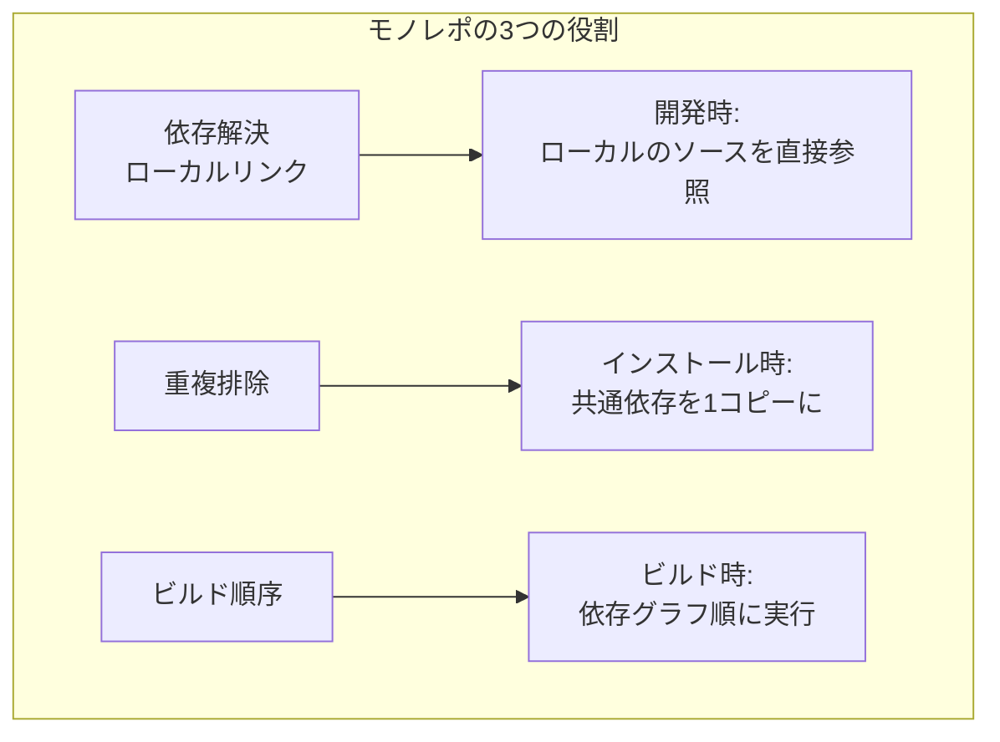
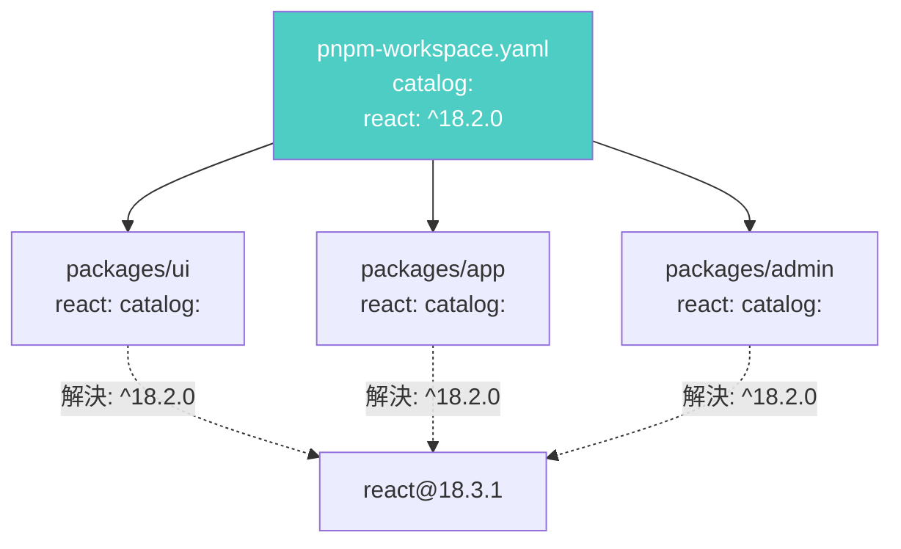
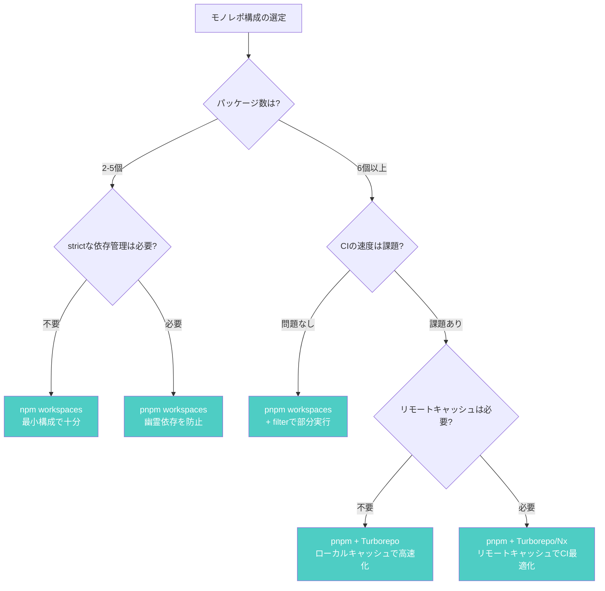

:::message
**この章を読むとできるようになること**
- モノレポにおけるパッケージマネージャの役割を3つの機能軸で説明できる
- npm / yarn / pnpm の workspaces 機能を正しく設定して使いこなせる
- `workspace:*` プロトコルの意味と publish 時の挙動を理解できる
- pnpm の catalogs 機能でバージョンを一元管理できる
- Turborepo / Nx との組み合わせ方を判断できる
- プロジェクトに適した構成を選べる
:::

## 8.1 モノレポにおけるパッケージマネージャの役割

モノレポとは、複数の関連パッケージを1つのリポジトリで管理する手法です。Babel、Next.js、Viteなど多くのOSSプロジェクトが採用しています。

モノレポでパッケージマネージャが果たす役割は、主に3つです。

**1. パッケージ間の依存解決とローカルリンク**

`packages/ui` が `packages/utils` に依存しているとき、npmレジストリではなくローカルのソースコードを直接参照する必要があります。パッケージマネージャはこれを**シンボリックリンク**で実現します。

**2. 依存の重複排除**

10個のパッケージが全て `react@18.2.0` に依存しているとき、10回ダウンロードするのは無駄です。パッケージマネージャはホイスティングやcontent-addressable storeで重複を排除します。

**3. ビルド順序の決定**

`packages/app` が `packages/ui` に依存し、`packages/ui` が `packages/utils` に依存しているなら、ビルド順序は `utils → ui → app` です。パッケージマネージャは依存グラフからこの順序を導出します。



## 8.2 npm workspaces

npm v7で追加されたworkspaces機能は、最もシンプルな実装です。

### セットアップ

```json
// ルートの package.json
{
  "name": "my-monorepo",
  "private": true,
  "workspaces": [
    "packages/*"
  ]
}
```

ディレクトリ構成は以下のようになります。

```
my-monorepo/
├── package.json
├── package-lock.json
├── node_modules/
├── packages/
│   ├── ui/
│   │   └── package.json  // name: "@myorg/ui"
│   ├── utils/
│   │   └── package.json  // name: "@myorg/utils"
│   └── app/
│       └── package.json  // name: "@myorg/app"
```

`npm install` を実行すると、ルートの `node_modules` に全パッケージの依存がホイスティングされ、各ワークスペースパッケージはシンボリックリンクで接続されます。

### 基本操作

```bash
# 特定ワークスペースでコマンド実行
$ npm run build -w packages/ui

# 全ワークスペースでコマンド実行
$ npm run test --workspaces

# 特定ワークスペースに依存追加
$ npm install lodash -w packages/utils

# ワークスペース間の依存
# packages/app の package.json に追加:
# "dependencies": { "@myorg/ui": "^1.0.0" }
$ npm install
# → node_modules/@myorg/ui がsymlinkで作成される
```

### ホイスティングの挙動

npm workspacesは**ルートにホイスティング**する戦略です。これは3章で学んだフラット構造の延長です。利点は互換性の高さですが、3章で見た「幽霊依存」の問題はモノレポでも発生します。

## 8.3 yarn workspaces

Yarnは最初期からworkspacesをサポートしており、最も成熟した実装を持っています。

### workspace:* プロトコル

Yarn Berryでは、ワークスペース内パッケージへの依存を明示するための専用プロトコルがあります。

```json
// packages/app の package.json
{
  "dependencies": {
    "@myorg/ui": "workspace:*",
    "@myorg/utils": "workspace:^"
  }
}
```

`workspace:*` は「このモノレポ内のパッケージを使う」という宣言です。`npm publish` 時には、`workspace:*` は実際のバージョン番号（例: `1.2.3`）に自動変換されます。これにより、開発中はローカル参照、公開時は通常の依存として動作します。

### constraints（制約ルール）

Yarn Berryには、モノレポ全体に制約を設定する `constraints` 機能があります。

Yarn v3以降ではProlog（論理型プログラミング言語）で制約を宣言的に記述します。以下の例は「TypeScriptをdevDependenciesに含むすべてのワークスペースで、バージョンを `^5.3.0` に統一する」というルールです。

```prolog
% constraints.pro（Prolog形式、yarn v3）
% 全パッケージのTypeScriptバージョンを統一
gen_enforced_dependency(WorkspaceCident, 'typescript', '^5.3.0', 'devDependencies') :-
  workspace_has_dependency(WorkspaceCident, 'typescript', _, 'devDependencies').
```

```bash
# 制約違反をチェック
$ yarn constraints

# 自動修正
$ yarn constraints --fix
```

### プラグインアーキテクチャ

Yarn Berryはプラグインで機能を拡張できます。TypeScript対応プラグインを入れると、`@types/*` パッケージの自動追加が有効になります。

```bash
# TypeScriptプラグイン追加
$ yarn plugin import typescript

# これ以降、パッケージ追加時に @types/* が自動追加される
$ yarn add express
# → @types/express も同時にインストールされる
```

## 8.4 pnpm workspaces

pnpmのworkspacesは、専用の設定ファイルと強力なフィルタリング機能が特徴です。

### セットアップ

```yaml
# pnpm-workspace.yaml（ルートに配置）
packages:
  - "packages/*"
  - "apps/*"
  - "tools/*"
```

pnpmはpackage.jsonの `workspaces` フィールドではなく、専用ファイルで管理します。

### workspace:* プロトコル

pnpmもyarnと同じ `workspace:*` プロトコルをサポートしています。

```json
// apps/web の package.json
{
  "dependencies": {
    "@myorg/ui": "workspace:*",
    "@myorg/config": "workspace:^"
  }
}
```

### --filter による部分実行

大規模モノレポで威力を発揮するのが `--filter` フラグです。

```bash
# 特定パッケージのみビルド
$ pnpm --filter @myorg/ui build

# パッケージとその依存を全てビルド（...は依存チェーン）
$ pnpm --filter @myorg/app... build

# 変更があったパッケージのみテスト（git diffベース）
$ pnpm --filter "...[origin/main]" test

# ディレクトリ指定
$ pnpm --filter "./packages/**" install
```

`...` の向きに注目してください。`@myorg/app...` は「appとappが依存するパッケージ全て」、`...@myorg/utils` は「utilsとutilsに依存するパッケージ全て」を意味します。

### catalogs機能（pnpm v9.5+）

モノレポで頻出する問題が「各パッケージでReactのバージョンがバラバラ」という状況です。catalogs機能はこれを解決します。

```yaml
# pnpm-workspace.yaml
packages:
  - "packages/*"

catalog:
  react: ^18.2.0
  react-dom: ^18.2.0
  typescript: ^5.3.0

catalogs:
  testing:
    vitest: ^1.0.0
    "@testing-library/react": ^14.0.0
```

各パッケージのpackage.jsonでは、`catalog:` プロトコルで参照します。

```json
// packages/ui の package.json
{
  "dependencies": {
    "react": "catalog:",
    "react-dom": "catalog:"
  },
  "devDependencies": {
    "vitest": "catalog:testing"
  }
}
```

バージョンを変更するとき、`pnpm-workspace.yaml` の1箇所を変えるだけで全パッケージに反映されます。



## 8.5 Turborepo / Nx との組み合わせ

パッケージマネージャのworkspaces機能だけでは、大規模モノレポの運用には限界があります。ビルドの**キャッシュ**と**並列実行**を担うのが、TurborepoやNxといったビルドシステムです。

### パッケージマネージャとの役割分担

| 機能 | パッケージマネージャ | Turborepo / Nx |
|------|---------------------|----------------|
| 依存のインストール | 担当 | - |
| ローカルリンク | 担当 | - |
| タスク実行順序 | 基本的な順序のみ | 依存グラフに基づく最適化 |
| ビルドキャッシュ | - | **担当（ローカル+リモート）** |
| 並列実行 | 限定的 | **担当（CPUコア活用）** |
| 変更検知 | - | **担当（影響範囲の特定）** |

```json
// turbo.json（Turborepoの設定例）
{
  "tasks": {
    "build": {
      "dependsOn": ["^build"],   // 依存パッケージを先にビルド
      "outputs": ["dist/**"]     // キャッシュ対象
    },
    "test": {
      "dependsOn": ["build"]     // ビルド後にテスト
    },
    "lint": {}                    // 独立して並列実行可能
  }
}
```

```bash
# 全パッケージをビルド（依存順+並列+キャッシュ）
$ npx turbo build

# キャッシュヒット時の出力
# @myorg/utils:build: cache hit, replaying logs
# @myorg/ui:build: cache hit, replaying logs
# @myorg/app:build: cache miss, executing
```

## 8.6 実戦で効くモノレポ構成の選び方

「どのツールの組み合わせを選ぶべきか」は、プロジェクトの状況によって変わります。以下のフローチャートで判断の出発点を掴んでください。



**迷ったときの指針**: 2026年現在、新規モノレポを始めるなら **pnpm workspaces** がバランスの良い出発点です。厳密な依存管理、高速なインストール、強力なフィルタリングを備えており、必要に応じてTurborepoを後から追加できます。

ただし、チームがすでにnpmやyarnに慣れているなら、学習コストも判断材料に含めてください。ツールの技術的優位性よりも、チーム全員が迷わず使える環境の方が、長期的には生産性に寄与します。

## 章末クイズ

**Q1**: `workspace:*` プロトコルで宣言された依存は、`npm publish` 時にどう変換されますか？

:::details 答え
`workspace:*` は、公開時に対象パッケージの実際のバージョン番号（例: `1.2.3`）に自動変換されます。これにより、開発中はローカルソースを直接参照し、公開後はnpmレジストリの通常パッケージとして動作します。
:::

**Q2**: pnpmの `--filter @myorg/app...` と `--filter ...@myorg/utils` の違いは何ですか？

:::details 答え
`@myorg/app...`（末尾に`...`）は「appとappが**依存する**パッケージ全て」（下流方向）を対象にします。`...@myorg/utils`（先頭に`...`）は「utilsとutilsに**依存している**パッケージ全て」（上流方向）を対象にします。utilsを変更した場合、影響範囲を調べるには後者を使います。
:::

**Q3**: Turborepoのようなビルドシステムと、パッケージマネージャのworkspaces機能は、それぞれどの役割を担っていますか？

:::details 答え
パッケージマネージャは「依存のインストール」と「パッケージ間のローカルリンク」を担当します。Turborepoのようなビルドシステムは「ビルドキャッシュ」「依存グラフに基づく並列タスク実行」「変更検知による影響範囲の特定」を担当します。両者は競合ではなく補完関係にあります。
:::
