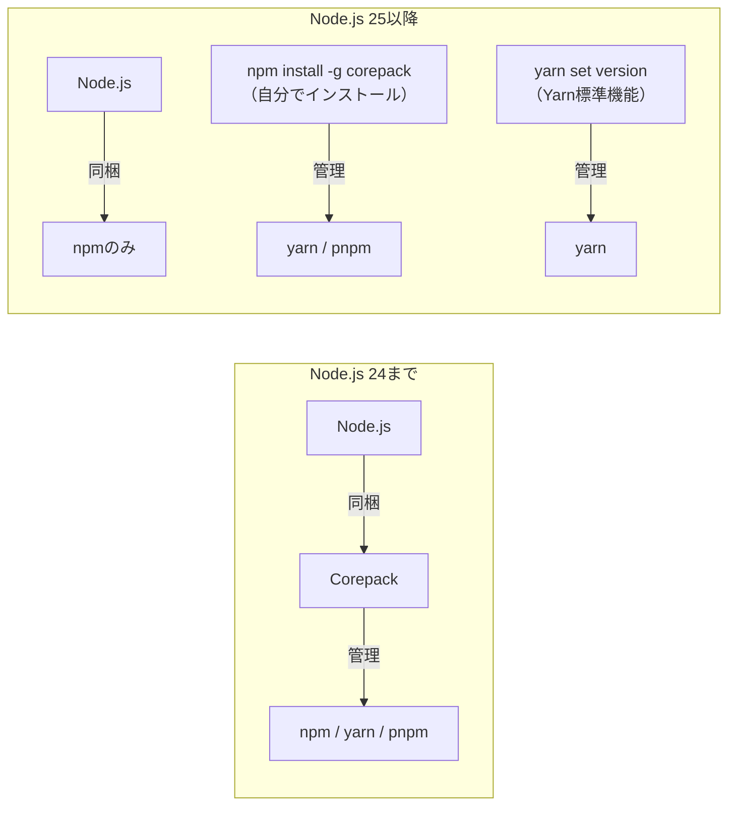
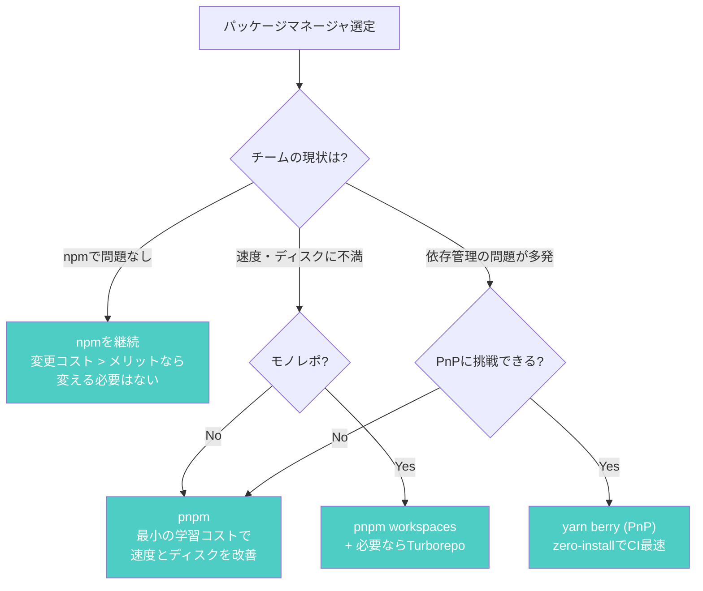
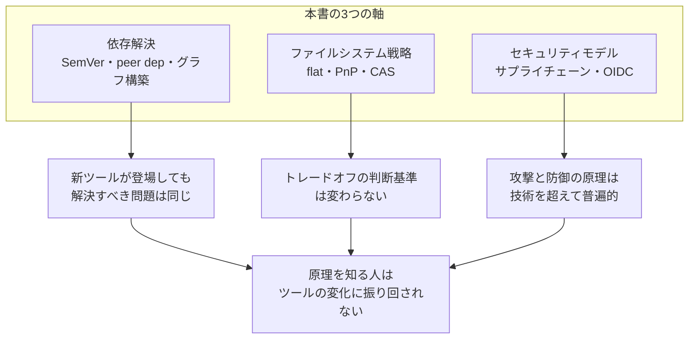

:::message
**この章を読むとできるようになること**
- Corepackの仕組みと廃止決定の背景を理解し、代替手段を選べる
- Bunのパッケージマネージャとしての特徴と現状の制約を判断できる
- npm から pnpm、yarn classic から berry への移行を実行できる
- プロジェクトに最適なパッケージマネージャを、技術的根拠に基づいて選定できる
- 本書で学んだ知識が次世代ツールにも通用する理由を説明できる
:::

## 10.1 Corepack: Node.js標準のパッケージマネージャ管理

### Corepackとは

Corepackは、Node.js 16.9で実験的に導入された「パッケージマネージャのマネージャ」です。プロジェクトの `package.json` に宣言されたパッケージマネージャのバージョンを自動的に取得・切り替える仕組みです。

```json
// package.json
{
  "packageManager": "pnpm@9.15.0"
}
```

この宣言があると、Corepackは自動的にpnpm 9.15.0をダウンロードして使用します。チーム全員が同じバージョンのパッケージマネージャを使うことが保証されます。

```bash
# Corepackを有効化（Node.js同梱だが有効化が必要）
$ corepack enable

# packageManagerフィールドに基づいてpnpmが自動実行される
$ pnpm install
# → pnpm@9.15.0が自動ダウンロードされ、installが実行される

# 違うパッケージマネージャを使おうとすると...
$ npm install
# → エラー: This project is configured to use pnpm
```

### Corepack廃止決定

しかし2025年、Node.jsコアチームは **Corepack をNode.js 25以降にバンドルしない** ことを決定しました。廃止の理由は主に以下の3つです。

1. **Node.jsのスコープ外**: パッケージマネージャの管理はNode.jsランタイムの責務ではない
2. **メンテナンスコスト**: npm/yarn/pnpmの仕様変更に追従し続ける負担
3. **実験的ステータスから脱却できなかった**: 3年以上experimentalのまま



### 代替手段

**方法1: npmでCorepackをグローバルインストール**

```bash
$ npm install -g corepack
$ corepack enable
# 以降はNode.jsバンドル版と同じ挙動
```

**方法2: yarn set version（Yarn標準機能）**

Yarnは `yarn set version` コマンドでプロジェクト固有のバージョンを管理できます。Corepackなしでも動作します。

```bash
# プロジェクトにYarnの特定バージョンを固定
$ yarn set version 4.6.0
# .yarn/releases/ にバイナリがダウンロードされ、.yarnrc.ymlに記録される
```

**方法3: CI環境ではセットアップアクションで明示指定**

```yaml
# GitHub Actions
- uses: pnpm/action-setup@v4
  with:
    version: 9.15.0  # 明示的にバージョン指定
```

実務では方法3が最も確実です。CI環境ではCorepackに依存せず、セットアップアクションでバージョンを固定するプロジェクトが多数派です。

## 10.2 Bun: 新世代ランタイム内蔵パッケージマネージャ

Bunはランタイム（JavaScriptエンジン）、バンドラー、テストランナー、そして**パッケージマネージャ**を統合したオールインワンツールです。

### 速度の秘密

BunのパッケージマネージャはZigとC++で実装されており、npmと比較して**4-6倍の高速インストール**を実現しています。

```bash
# 速度比較の例（React + Next.jsプロジェクト、キャッシュなし）
$ time npm install    # 約12秒
$ time pnpm install   # 約6秒
$ time bun install    # 約2秒
```

高速な理由は主に以下です。

- **ネイティブコード実装**: Node.js（JavaScript）ではなくZig/C++で書かれている
- **並列ネットワーク処理**: HTTPクライアントがカーネルレベルで最適化
- **シンボリックリンク戦略**: pnpmに近いリンクベースの配置

### bun.lock: 独自バイナリ形式

Bun v1.2以降、lockfileはバイナリ形式の **`bun.lockb`** からテキストベースの **`bun.lock`（JSONC形式）** に変更されました。ファイル名も `bun.lockb`（b付き）から `bun.lock`（bなし）に変わっています。ただし、npm/yarn/pnpmのlockfileとの互換性はありません。

```bash
# bun.lockの中身を確認（テキスト形式、v1.2+）
$ head -5 bun.lock
{
  "lockfileVersion": 1,
  "workspaces": {
    "": {
      "dependencies": {
```

### 現状の制約（2026年3月時点）

Bunのパッケージマネージャは急速に改善されていますが、まだ注意すべき点があります。

- **互換性**: 一部のプロジェクト（特に複雑なpostinstallやネイティブモジュールを多用するもの）でnpmとの完全な互換性に課題がある
- **postinstallスクリプト**: 一部のネイティブモジュールでビルドが失敗するケースがある
- **workspaces**: 基本機能はサポートされているが、pnpmの `--filter` のような高度な機能は限定的
- **エコシステム**: CIサービスやデプロイプラットフォームでのサポートが不完全な場合がある

Bunをパッケージマネージャとしてではなくランタイムやテストランナーとして部分的に採用し、パッケージ管理はnpm/pnpmに任せるという使い分けが、現時点では現実的な選択肢です。

## 10.3 既存プロジェクトの移行ガイド

### npm から pnpm への移行

pnpmには `pnpm import` コマンドがあり、既存のlockfileを変換できます。

```bash
# 手順1: pnpmをインストール
$ npm install -g pnpm

# 手順2: lockfileを変換（package-lock.json → pnpm-lock.yaml）
$ pnpm import
# → package-lock.json を読み取り、pnpm-lock.yaml を生成

# 手順3: node_modulesを再作成
$ rm -rf node_modules
$ pnpm install

# 手順4: 動作確認
$ pnpm run build
$ pnpm run test

# 手順5: 不要になったlockfileを削除
$ rm package-lock.json

# 手順6: packageManagerフィールドを追加
# package.json に "packageManager": "pnpm@9.15.0" を追記
```

**移行時のよくあるエラー**

```bash
# エラー1: 幽霊依存
# ERR_PNPM_MISSING_PEER_DEP
# → package.jsonに書かれていないが使われている依存がある
# → 対処: 直接依存として明示的に追加
$ pnpm add パッケージ名

# エラー2: postinstallの失敗
# → package.json の pnpm フィールドで許可するパッケージを設定
# { "pnpm": { "onlyBuiltDependencies": ["sharp", "bcrypt"] } }
# pnpm v10.26以降は allowBuilds を使用
```

pnpmはnpmより依存管理が厳密なため、移行時に「今まで動いていたのに動かなくなる」ケースがあります。これはpnpmのバグではなく、**npmのホイスティングに依存していた幽霊依存が露呈した**ということです。3章で学んだ内容そのものです。

### yarn classic から berry への移行

```bash
# 手順1: Yarnバージョンを更新
$ yarn set version berry

# 手順2: nodeLinkerを設定（段階的移行にはnode-modulesを推奨）
$ echo 'nodeLinker: node-modules' >> .yarnrc.yml

# 手順3: 依存を再インストール
$ yarn install

# 手順4: 動作確認
$ yarn build
$ yarn test

# 手順5: PnP への移行（オプション、互換性確認後）
# .yarnrc.yml の nodeLinker を pnp に変更
# nodeLinker: pnp
# → .pnp.cjs が生成される
```

**PnP互換性チェック**

```bash
# PnPモードで互換性問題があるパッケージを検出
$ yarn doctor
# → 問題のあるパッケージがリストアップされる
```

PnPは5章で学んだように、node_modulesディレクトリを完全に廃止する戦略です。互換性の問題が多い場合は、まず `nodeLinker: node-modules` で移行し、段階的にPnPを検討してください。

## 10.4 チームへの導入判断フレームワーク

パッケージマネージャの選定で最も難しいのは、「技術的な最適解」と「チームにとっての最適解」が一致しないケースです。

### 選定マトリクス

| 要件 | npm | yarn berry | pnpm |
|------|-----|-----------|------|
| 学習コスト | 最低（デフォルト） | 中（PnP概念の理解） | 低（npmと似た操作感） |
| インストール速度 | 普通（v11で改善） | 速い（PnPキャッシュ） | 速い |
| ディスク使用量 | 多い | 少ない（zipキャッシュ） | 最小（CAS） |
| CI時間 | 普通 | 速い | 速い |
| モノレポ | 基本機能 | 高機能 | 高機能 |
| 厳密な依存管理 | 緩い | 厳密（PnP） | 厳密 |
| エコシステム互換性 | 最高 | やや低い（PnP時） | 高い |

### 選定フローチャート



**最も大切な判断基準**: パッケージマネージャの違いで得られる時間短縮は、1日あたり数分から数十分です。チーム全員が新しいツールに慣れるまでの生産性低下が数週間に及ぶなら、無理に移行する必要はありません。

移行のベストタイミングは以下のいずれかです。

- 新規プロジェクトの開始時（既存の慣性がない）
- CI時間が明確なボトルネックになったとき（定量的な根拠がある）
- node_modulesの問題（幽霊依存、バージョン不整合）が繰り返し発生しているとき

## 10.5 おわりに: 原理を知ることの価値

本書では、パッケージマネージャの内部動作を「仕組みから」理解することを目標に、10章にわたって解説してきました。

### 3つの軸は次世代ツールでも通用する

本書で扱った知識は、以下の3つの軸に集約されます。

**1. 依存解決**: SemVerの範囲計算、peer dependencyの衝突処理、依存グラフの構築。新しいツールが登場しても、この問題自体は消えません。Bunでも、まだ見ぬ未来のツールでも、SemVerに基づく依存解決のロジックは共通です。

**2. ファイルシステム戦略**: フラットなnode_modules、PnPによるゼロインストール、content-addressable store。それぞれがどんなトレードオフで設計されているかを知っていれば、新しいアプローチが登場したときにも「何を解決しようとしているのか」が即座にわかります。

**3. セキュリティモデル**: サプライチェーン攻撃の手法、postinstallスクリプトのリスク、OIDC Trusted Publishing。ソフトウェアサプライチェーンのセキュリティは年々重要度が増しており、この知識は10年後にも陳腐化しません。



### 「体系的な理解」を持つことの意味

`npm install` が壊れたとき、AIに聞けば対処法を教えてもらえる時代です。しかし、AIが教えてくれるのは「この場合はこうする」という個別の対処法であり、「なぜそうなるのか」「次に似た問題が起きたらどう考えるか」という思考の枠組みではありません。

本書を読み終えたあなたは、エラーメッセージを見たときに「これは依存グラフのどの段階で起きた問題か」「ファイルシステム戦略のどの部分に起因するか」と構造的に考えられるはずです。その思考法は、パッケージマネージャに限らず、ソフトウェアエンジニアリングのあらゆる場面で役立ちます。

### from scratchシリーズについて

本書は「from scratch」シリーズの1冊です。「雰囲気で使っている」を「仕組みから理解している」に変えることを目指して、他のテーマでも順次執筆予定です。

- **正規表現 from scratch**（執筆予定）: `/^(?:https?:\/\/)/` が読めるようになる。正規表現エンジンの仕組みから、パフォーマンスの落とし穴まで
- **文字コード from scratch**（執筆予定）: UTF-8、Shift_JIS、文字化けの原理。「なぜ文字が壊れるのか」を仕組みから理解する

いずれも「そのツールが内部で何をしているのか」を知ることで、日常の開発がスムーズになることを目指しています。

---

最後まで読んでいただきありがとうございました。本書が「node_modulesが壊れた」という状況に出会ったとき、あなたの問題解決を少しでも速くする助けになれば幸いです。
